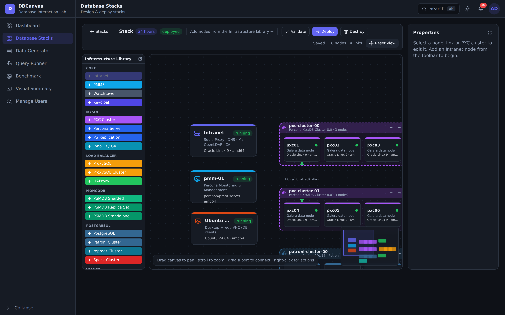
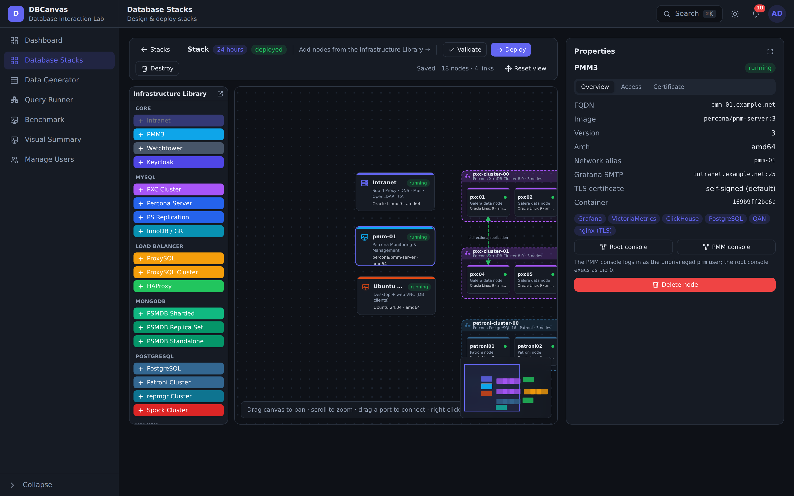
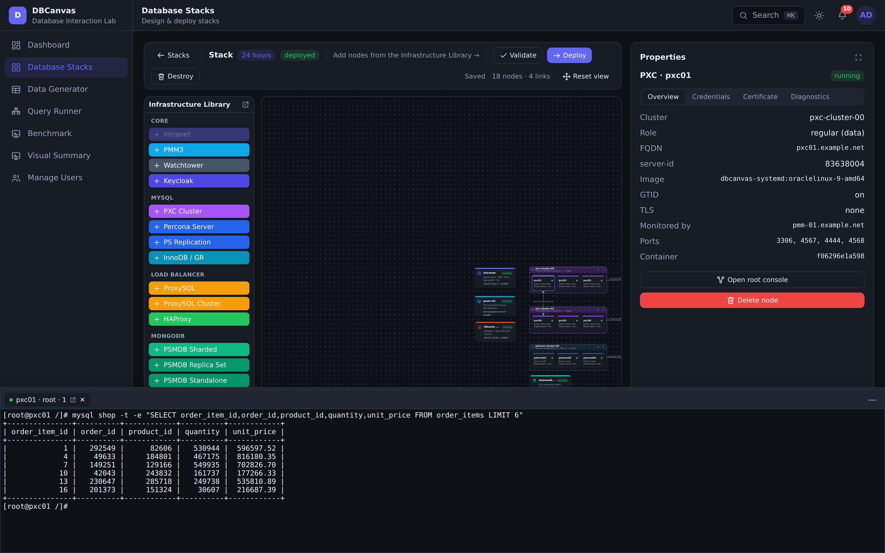
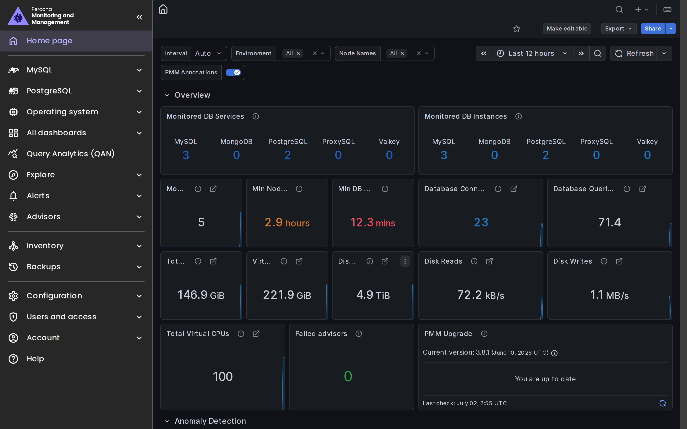
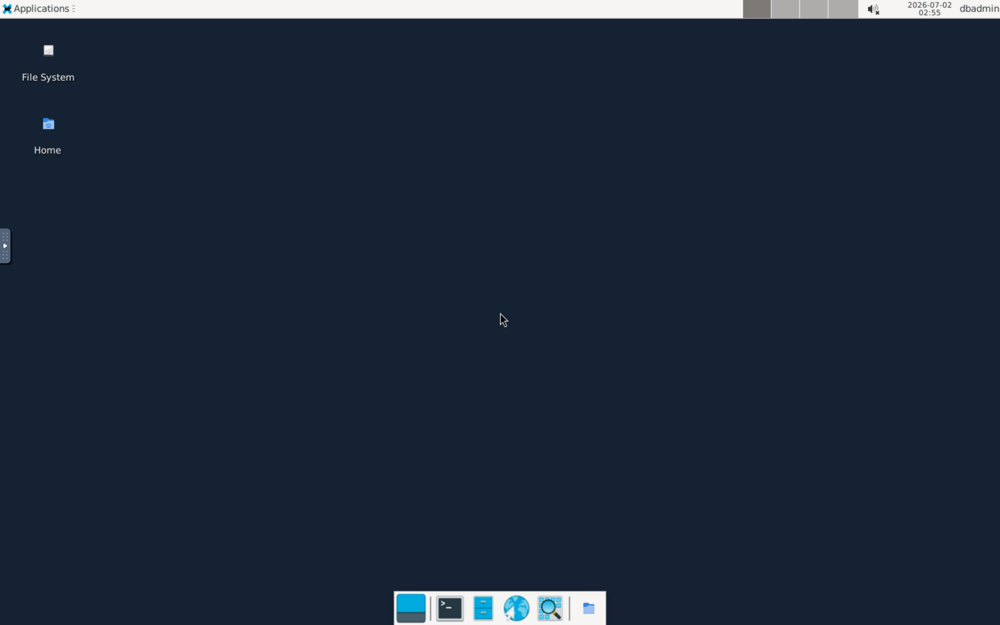
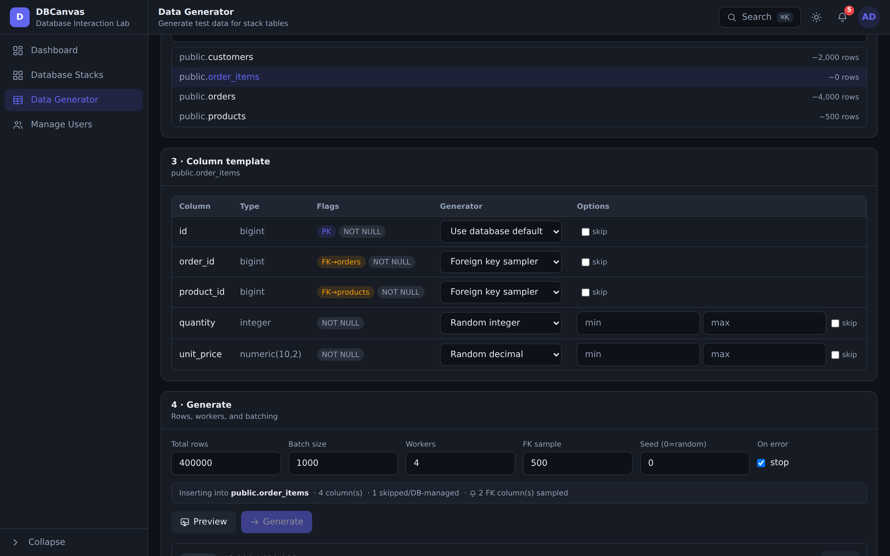
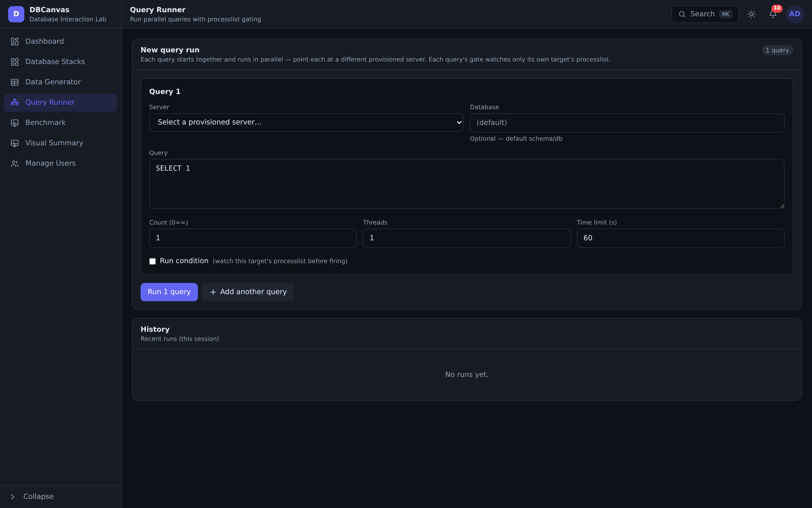
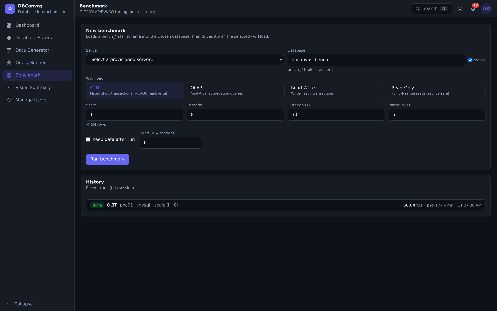
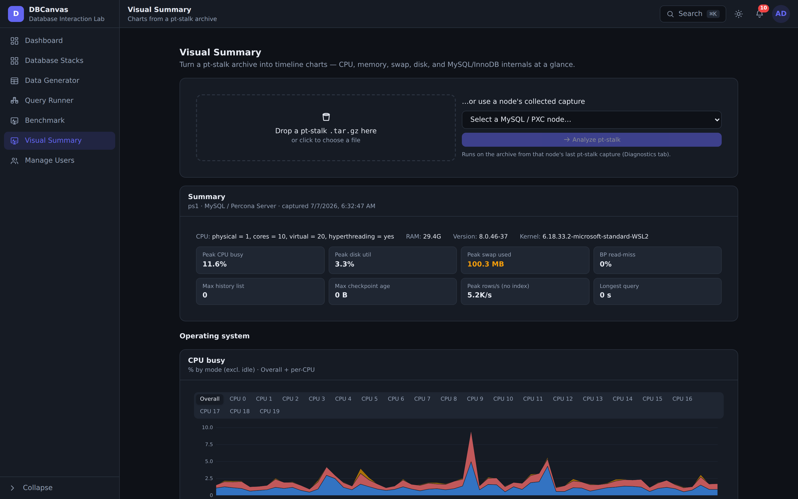
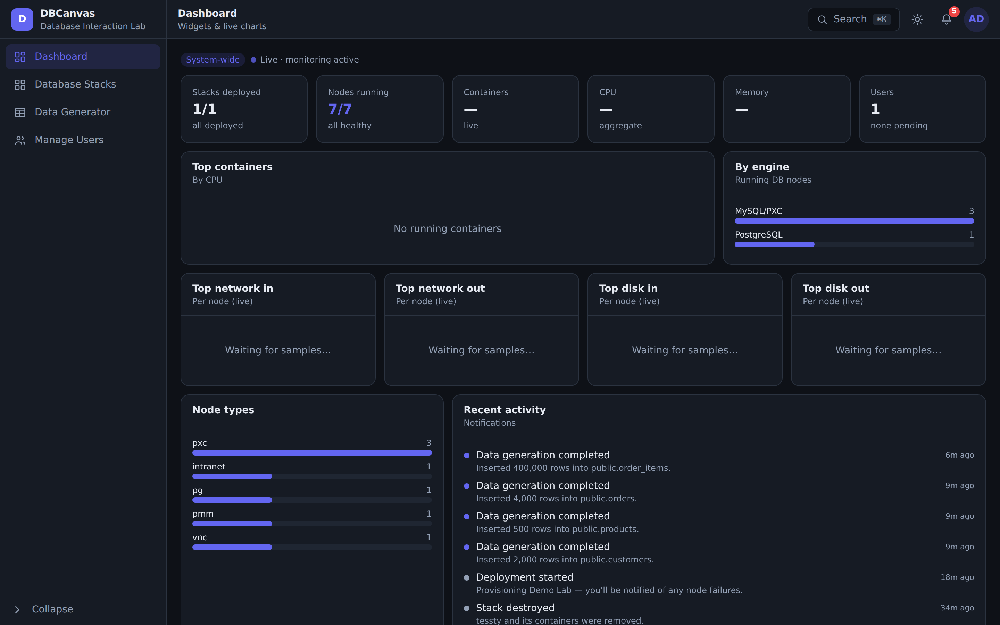

# DBCanvas — Database Interaction Lab

DBCanvas is a self-hosted lab for **designing, deploying, operating, and stress-testing
multi-node database stacks** on your own machine. You lay out a topology on a canvas —
PostgreSQL, MySQL/PXC, MongoDB, Valkey, plus supporting infrastructure — click **Deploy**,
and DBCanvas provisions real, running Docker containers wired together (DNS, TLS, LDAP,
replication, monitoring, backups). It then gives you tools to *use* and *understand* those
databases: a **Data Generator** for realistic test data, a **Query Runner** and **Benchmark**
for workloads, a **Visual Summary** that turns pt-stalk captures into charts, a live
**Dashboard**, and a **notification** center for what's happening across your stacks.

It's built for testing, demos, training, troubleshooting, benchmarking, and application
development — spin up a production-shaped cluster in minutes, exercise it, and tear it down.



> *Above: part of a deployed **Stack** — an Intranet (DNS/LDAP/CA), a PMM monitor, an Ubuntu
> VNC desktop, and two bidirectionally-replicated Percona XtraDB Clusters (a Patroni cluster,
> a ProxySQL cluster, two HAProxy load balancers, and SeaweedFS S3 sit just below). You add
> nodes from the **Infrastructure Library** on the left and drag ports to connect them.*

The control-plane is a single small (~22 MB) Go binary that serves the embedded React SPA
**and** the JSON API on one port, keeps its own metadata in SQLite, and talks to the Docker
daemon to provision the stack containers alongside itself.

```
                         ┌────────────────────────────── your Docker host ──┐
browser ──HTTP──> DBCanvas (Go binary, :APP_PORT)                           │
                  ├─ serves embedded React SPA (//go:embed)                  │
                  ├─ /api/*  ──> SQLite (/data, Docker volume)               │
                  └─ Docker Engine API (/var/run/docker.sock)               │
                         │  creates / execs / monitors                       │
                         ▼                                                    │
                  stack containers: pg · patroni · pxc · psmdb · valkey ·    │
                  intranet · pmm · proxysql · haproxy · seaweedfs · …        │
                         └────────────────────────────────────────────────────┘
```

## What's inside

### Database Stacks
A canvas designer that turns a topology into real running containers. Draw nodes and
cluster **frames**, connect them, set a **TTL**, and deploy. Each node type has a management
panel (web terminal, certificates, users, on-demand backups). Supported nodes:

- **PostgreSQL** — standalone, **Patroni** HA clusters, **repmgr** clusters, and **Spock**
  multi-master (active-active) clusters (pgBackRest / Barman cloud backups; pgvector &
  TimescaleDB supported).
- **MySQL / PXC** — **Percona XtraDB Cluster**, Percona Server, MySQL replication, and
  **InnoDB / Group Replication** clusters.
- **MongoDB** — Percona Server for MongoDB: standalone, replica set, and sharded
  (PBM backups; optional Keycloak OIDC auth).
- **Valkey** — standalone and cluster (LDAP integration, PMM monitoring).
- **Infrastructure** — an **Intranet** node (OpenLDAP, bind DNS, an internal CA, a Squid
  proxy, and Roundcube/Dovecot webmail), a **Samba AD DC** (Active Directory, LDAP,
  Kerberos), **PMM** monitoring, **ProxySQL**, **HAProxy**, **SeaweedFS** (S3 for backups),
  **Keycloak** (OIDC), **OpenBao** (secrets manager), an **Ubuntu VNC** desktop, and
  **Watchtower**.
- **Operations** — cross-cluster replication links, per-node web terminals, certificate
  management, on-demand backups, and TTL-based auto-teardown.

**Authentication.** Point a database at a directory and it is wired at deploy: **LDAP** against
the Intranet OpenLDAP or the Samba AD DC (Percona Server, PostgreSQL, PSMDB), **Kerberos/GSSAPI**
single sign-on against the Samba AD DC (PostgreSQL, PSMDB), and **Keycloak OIDC** (PMM, PostgreSQL
18 via `pg_oidc_validator`, PSMDB via `MONGODB-OIDC`). The designer greys out combinations an
engine cannot actually run — PostgreSQL cannot do LDAP and OIDC at once (they compete for the same
`pg_hba` line), and MongoDB cannot combine OIDC with LDAP/Kerberos (each needs its own `mongod.conf`
`setParameter` block) — and validation blocks the deploy rather than letting one silently win.

**Data-at-rest encryption (OpenBao).** Add an **OpenBao** node (a Vault-compatible secrets
manager, one per stack) and tick *Encrypt with OpenBao* on a Percona Server or PSMDB node. At
deploy the node is initialized and unsealed for you — its **5 unseal keys and root token** appear
in the node's properties, since OpenBao prints them exactly once — and the database is wired to it
as its keyring: `component_keyring_vault` on Percona Server 8.4, the `keyring_vault` **plugin** on
5.7/8.0 (the component does not exist before 8.4), and `security.vault` on PSMDB. Each database
gets its own KV mount and a token scoped to it, and verifies OpenBao with the Intranet CA every
node already trusts. OpenBao seals itself on every restart, so its panel shows the live seal state
and can replay the stored keys with one click.

**Deployed versions.** Once a node is running, its card shows the version it *actually* deployed
with — `PS 8.4.10-10`, `PSMDB 8.0.26-11`, `PMM 3.3.1` — not just the series that was requested
(`8.0`, or "latest"). The same value appears in the node's properties.

Every deployed node gets a **management panel** — runtime profile, endpoints, credentials,
certificates, backups, and one-click consoles:



**Web terminals.** Drop into a root (or service) shell on any node, right in the browser —
sessions survive navigation and can be docked or floated (**Settings** picks which they open as):



**Monitoring with PMM.** Add a PMM node and point databases at it; DB nodes register
themselves, so Percona Monitoring & Management comes up already watching the stack:



**Ubuntu VNC desktop.** An optional XFCE desktop jump-box (Firefox + Percona clients)
reachable over a browser-based VNC client — handy for GUI database tools inside the stack network:



**Diagnostics captures.** From a running node's panel, capture a diagnostic bundle and
download it: **pg_gather** (a single `GatherReport.html`) on PostgreSQL nodes, or
**pt-stalk** + `pt-summary` + `pt-mysql-summary` (a tarball) on MySQL/PXC nodes. Feed a
pt-stalk archive straight into **Visual Summary** (below) to chart it.

### Data Generator
Generate realistic test data for existing tables in your deployed **PostgreSQL** and
**MySQL/PXC** databases. Pick a running connection, browse to a table, and DBCanvas
introspects it and infers a sensible generator per column (names → names, `email` → emails,
`price` → money, FKs → sampled parent values, etc.). Features: smart inference with a
per-column override combobox, **foreign-key-aware** sampling, uniqueness for UNIQUE/PK
columns, **pgvector** embeddings and **TimescaleDB** time-series (PostgreSQL), configurable
rows / batch size / worker threads, a preview, and a live progress readout. See
[`docs/DATA_GENERATOR.md`](docs/DATA_GENERATOR.md).



> *Generating into `order_items`: the two foreign keys are auto-detected and populated with
> the **Foreign key sampler** (drawing real `orders`/`products` ids), while the other columns
> get inferred generators.*

### Query Runner
Run ad-hoc SQL across your deployed **PostgreSQL** and **MySQL/PXC** servers. Compose one or
more queries, point each at a different provisioned server, and fire them **in parallel** —
each query can repeat a set number of times across multiple threads with a time limit, and an
optional **run condition** watches that target's processlist before firing (e.g. hold until a
competing query appears). Per-query timings land in an in-session history.



### Benchmark
Load a `bench_*` star schema into a chosen database and drive it with a selected **workload** —
**OLTP** (mixed short transactions), **OLAP** (analytical aggregations), **Read-Write**, or
**Read-Only** — at a configurable scale, thread count, duration, and warmup, then read back
throughput + latency.



### Visual Summary
Turn a **pt-stalk** archive — collected from a MySQL/PXC node's **Diagnostics** tab or uploaded
as a `.tar.gz` — into professional **timeline charts**: CPU / memory / swap, disk
(utilization, throughput, IOPS, latency, overall + per-device), network throughput and
connection states, and MySQL/InnoDB internals (buffer pool, history list length, checkpoint
age, replication lag, deadlocks, rows-scanned-without-index, and more). It's ~90% charts,
~10% text — with a consolidated, **sortable** processlist and per-session InnoDB transactions —
and stays resilient when files are missing from the archive.



### Dashboard
Scope-aware overview: an **admin** sees everything, a regular user sees only their own
stacks. Counters (stacks, nodes, containers, by engine/type, users) plus **live OS stats**
(CPU, memory, and per-node network/disk rates as ranked bar charts). The live sampling is
**focus-gated** — it polls only while the dashboard tab is visible and focused, so there's
no background CPU/disk cost when you're not looking.



### Notifications
A live bell (Server-Sent Events) that surfaces what happens across your stacks: node
deployment failures, data-generation completed/failed, stacks destroyed or **expiring soon**
(TTL), backups completed, high resource usage, and (for admins) new accounts awaiting
approval.

### Settings
Per-user preferences, stored on the **account** rather than the browser, so they follow you to
another machine: whether a node console opens **docked** (a tab in the bottom terminal dock, the
default) or **undocked** (its own floating window), and your **theme**.

### Manage Users (admin)
Registration is approval-gated: admins approve, reject, disable, re-approve, and delete
accounts.

## Quick start (Docker)

DBCanvas provisions sibling containers, so it needs access to the Docker daemon and to
prebuilt **systemd base images** for the database nodes.

```sh
make images     # build the dbcanvas-systemd:* base images used by DB nodes (first time)
make versions   # probe those images to populate versions.yaml (Percona versions catalog)
make compose    # create .env if needed, build the app image, and start the container
```

Then open **http://localhost:8080**. The first visit asks you to create an administrator
account. Design a stack in **Database Stacks**, deploy it, and watch the bell + dashboard.

| Command | What it does |
| --- | --- |
| `make images` | Build the systemd base images the DB nodes run on |
| `make versions` | Probe the images for installable versions → `versions.yaml` |
| `make compose` | Create `.env` if needed, build the app image, and start the stack |
| `make build` | Build the app image only |
| `make up` / `make down` | Start / stop the app container (no rebuild on `up`) |
| `make restart` | Recreate the app container |
| `make logs` | Follow application logs |
| `make clean` | Stop the app and remove the built image |

## Requirements

- **Docker** with access to the daemon socket (`/var/run/docker.sock` is mounted into the
  app so it can create/manage stack containers). This is a privileged capability — run
  DBCanvas somewhere you trust.
- Enough resources for the stacks you deploy (a full HA cluster is several containers).
- Linux host recommended; also runs on macOS/Windows Docker (incl. Apple-Silicon/Rosetta).

## Configuration (`.env`)

`make compose` creates `.env` from [`.env.example`](.env.example) on first run. Everything has
a working default — but **change the passwords before exposing anything beyond localhost.**

**App & networking**

| Variable | Default | Meaning |
| --- | --- | --- |
| `APP_HOST` | `127.0.0.1` | Host interface the app's published port binds to. `127.0.0.1` = this machine only; `0.0.0.0` = all interfaces (e.g. your LAN). |
| `APP_PORT` | `8080` | Port the app listens on (host + container). |
| `CONTAINER_BIND_IP` | `127.0.0.1` | Host interface that **deployed stack nodes** publish their exposed ports on (PXC, ProxySQL, Percona Server, PostgreSQL, MongoDB, Valkey, HAProxy, SeaweedFS, PMM, …). `0.0.0.0` publishes on all interfaces. |
| `DOMAIN` | `example.net` | Domain used to configure deployed stacks (Intranet LDAP base DN, DNS, mail, CA). |
| `DEPLOYMENT_TIMEOUT` | `60` | Minutes a provisioner waits for a dependency (cluster / node / shared service) to become ready before failing the deploy. Raise it for large stacks. |
| `DOCKER_PLATFORM` | `linux/amd64` | The platform this installation targets — exactly one of `linux/amd64` or `linux/arm64`. Drives the app image build, and the systemd base images: `make images` builds only this platform and `make versions` only probes/records images on it. |

**Credentials** — passwords for deployed database & service nodes. These are the single
source of truth (they can't be set per-node on the canvas), and a redeploy re-reads them.
Engine-specific variables (`MYSQL_*`, `POSTGRES_*`, `MONGODB_*`, `VALKEY_*`, `PROXYSQL_*`)
apply to that engine only; the rest are shared where relevant.

| Variable | Default | Applies to |
| --- | --- | --- |
| `MYSQL_ROOT_PASSWORD` | `root_password` | `root@localhost` on every MySQL-family node (PXC, MySQL replication, InnoDB/GR, standalone Percona Server). |
| `MYSQL_ADMIN_PASSWORD` | `admin_password` | The network-reachable superuser `admin@'%'` on every MySQL-family node. |
| `POSTGRES_PASSWORD` | `postgres_password` | The `postgres` superuser on every PostgreSQL node (standalone, Patroni, repmgr, Spock). |
| `MONGODB_ADMIN_PASSWORD` | `admin_password` | The admin user on every PSMDB node (standalone / replica set / sharded). |
| `VALKEY_PASSWORD` | `valkey_password` | The default user (`requirepass` / `masterauth`) on every Valkey node. |
| `PROXYSQL_ADMIN_PASSWORD` | `admin_password` | The ProxySQL `admin` user (port 6032) on every ProxySQL node. |
| `APP_PASSWORD` | `app_password` | The application user created on PXC nodes. |
| `REPL_PASSWORD` | `repl_password` | The replication user (MySQL-family + PostgreSQL replication). |
| `MONITOR_PASSWORD` | `monitor_password` | The monitoring user used by ProxySQL's health checks. |
| `CLUSTER_PASSWORD` | `cluster_password` | The cluster-admin user used by ProxySQL's `proxysql-admin`. |
| `CLUSTERCHECK_PASSWORD` | `cluster_password` | `clustercheck@localhost`, backing the PXC `:9200` health endpoint an HAProxy polls. |
| `PMM_PASSWORD` | `pmm_password` | The least-privilege `pmm` monitoring user, created only on nodes associated with a PMM server. |
| `PMM_ADMIN_PASSWORD` | `admin_password` | The PMM server's Grafana `admin` user (the PMM web UI login). A per-node password set on the canvas overrides it. |
| `KEYCLOAK_PASSWORD` | `keycloak_password` | The Keycloak node's `admin` console user. |
| `KEYCLOAK_USER_PASSWORD` | `keycloak_user_password` | The sample Keycloak users (`alice`, `bob`) created when a node enables Keycloak SSO. Demo identities — don't reuse this password for anything real. |
| `SAMBA_PASSWORD` | `SambaPassword2026` | The Samba AD DC administrator, used to provision the domain and to bind for LDAP/Kerberos management. Must satisfy Active Directory complexity (at least three of: uppercase, lowercase, digit, symbol) or provisioning rejects it. |
| `VNC_PASSWORD` | `vnc_password` | The Ubuntu VNC desktop login and VNC access code. VncAuth uses only the first 8 characters, so this authenticates as `vnc_pass`. A per-node password set on the canvas overrides it. |

The container always listens on all interfaces internally; host-side exposure is controlled
by the compose publish binding, not by `APP_HOST` inside the container.

**Advanced (rarely changed)** — set by `docker-compose.yml` or handy for local dev:
`DB_PATH` (SQLite file, default `dbcanvas.db`; the container uses a `/data` volume),
`DOCKER_SOCK` (Docker socket, default `/var/run/docker.sock`), `VERSIONS_FILE` (path to the
`versions.yaml` catalog), and `SPOCK_REF` (the pgEdge/spock git ref built for Spock clusters,
default `v5.0.10`).

## Local development (no Docker for the app)

Two terminals (Docker still required for provisioning stacks):

```sh
# terminal 1 — Go API + SQLite (needs the Docker socket to provision stacks)
cd app && APP_PORT=8080 DB_PATH=./dbcanvas.db VERSIONS_FILE=../versions.yaml go run .

# terminal 2 — Vite dev server (proxies /api → :8080)
cd app/web && npm install && npm run dev
```

The Go server binds `APP_HOST` (default `127.0.0.1`), so a bare `go run` stays private to
your machine. Prefix `APP_HOST=0.0.0.0` to expose it on your network.

## Tech stack

- **Frontend:** React + Vite + Tailwind CSS v4 (CSS-first). No UI/icon/graph/state
  libraries — icons, the stack canvas, and charts are hand-built. Live updates via SSE.
- **Backend:** Go standard-library `net/http`, a hand-rolled Docker Engine API client (over
  the Unix socket, incl. streamed exec), `modernc.org/sqlite` (pure-Go, no CGO),
  `golang.org/x/crypto/bcrypt`. The SPA is embedded with `//go:embed`.
- **Stack runtime:** systemd-enabled base images per OS/version/arch; nodes are provisioned
  and managed by exec-ing into their containers over the Docker API.
- **App runtime:** a single static binary on `gcr.io/distroless/static-debian12`.

## Security model

- Passwords hashed with bcrypt; sessions are httpOnly cookies (no tokens in JS).
- Setup self-locks once any user exists; registration is admin-approval-gated.
- Every admin route is enforced server-side; the hidden admin menu is convenience only.
  Admins cannot disable or delete their own account.
- Stacks are owned by their creator; users only see and manage their own stacks (admins see
  all). Data generation runs against the stack's stored superuser credentials.
- **The app has Docker-daemon access**, which is effectively host-level privilege — deploy
  DBCanvas only on trusted machines/networks.
