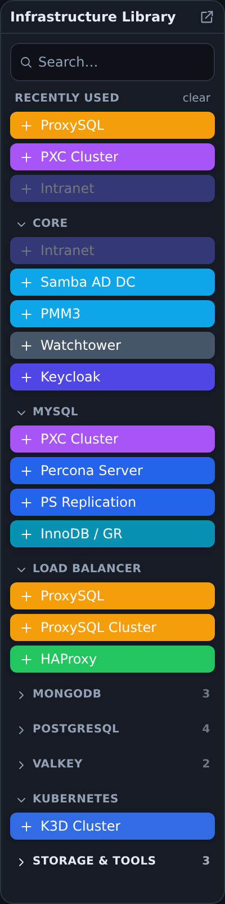
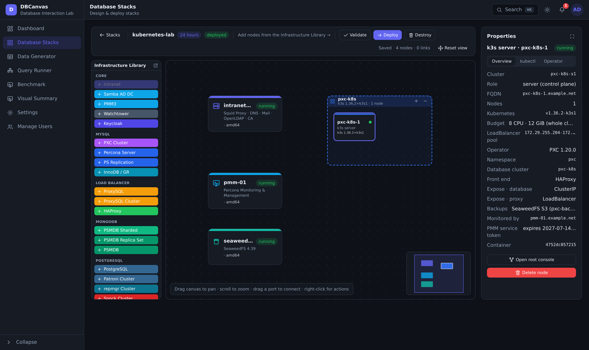
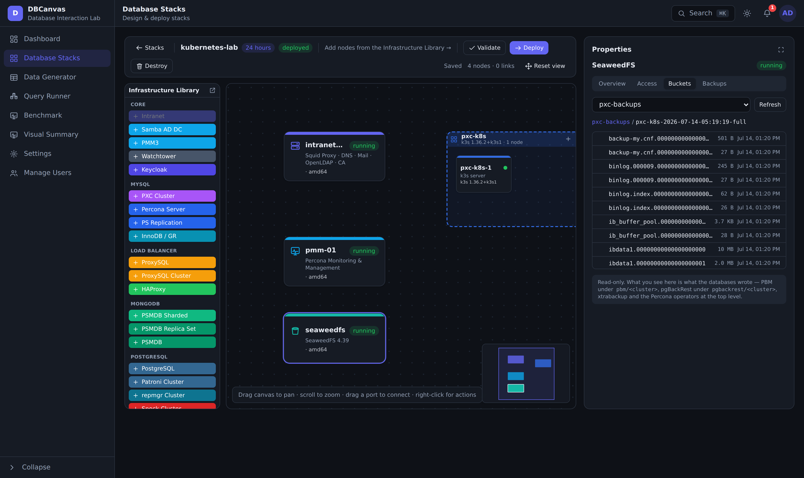

# DBCanvas — Database Interaction Lab

DBCanvas is a self-hosted lab for **designing, deploying, operating, and stress-testing
multi-node database stacks** on your own machine. You lay out a topology on a canvas —
PostgreSQL, MySQL/PXC, MongoDB, Valkey, plus supporting infrastructure — click **Deploy**,
and DBCanvas provisions real, running nodes wired together (DNS, TLS, LDAP, replication,
monitoring, backups). Nodes are **Docker containers** by default, or — in
[**hybrid** mode](#deployment-backends--docker-or-vagrant-hybrid) — real **VirtualBox VMs**
driven by Vagrant for the OS/database nodes. It then gives you tools to *use* and *understand*
those databases: a **Data Generator** for realistic test data, a **Query Runner** and
**Benchmark** for workloads, a **Visual Summary** that turns pt-stalk captures into charts, a
live **Dashboard**, and a **notification** center for what's happening across your stacks.

It's built for testing, demos, training, troubleshooting, benchmarking, and application
development — spin up a production-shaped cluster in minutes, exercise it, and tear it down.


> *Above: part of a deployed **Stack** — an Intranet (DNS/LDAP/CA), a PMM monitor, an Ubuntu
> VNC desktop, and two bidirectionally-replicated Percona XtraDB Clusters (a Patroni cluster,
> a ProxySQL cluster, two HAProxy load balancers, and SeaweedFS S3 sit just below). You add
> nodes from the **Infrastructure Library** on the left and drag ports to connect them.*

The control-plane is a single small (~22 MB) Go binary that serves the embedded React SPA
**and** the JSON API on one port, keeps its own metadata in SQLite, and talks to the Docker
daemon to provision the stack containers alongside itself.

```
                    ┌───────────────────────── your Docker host ──┐
browser ──HTTP──>  DBCanvas (Go binary, :APP_PORT)                │
                   ├─ serves embedded React SPA (//go:embed)      │
                   ├─ /api/*  ──> SQLite (/data, Docker volume)   │
                   └─ Docker Engine API (/var/run/docker.sock)    │
                          │  creates / execs / monitors           │
                          ▼                                       │
                   stack containers: pg · patroni · pxc · psmdb ·  │
                   valkey · intranet · pmm · proxysql · haproxy ·  │
                   seaweedfs · …                                   │
                   └──────────────────────────────────────────────┘
```

In **hybrid** mode the same binary runs *on the host* and drives two engines at once — Docker
for the infrastructure nodes, Vagrant/VirtualBox for the OS and database nodes — bridging the
two networks so every node still resolves and reaches every other:

```
                    ┌───────────────────────── your host ─────────┐
browser ──HTTP──>  DBCanvas (Go binary on the host, :APP_PORT)    │
                   ├─ Docker Engine API ──> intranet · pmm ·      │
                   │                        keycloak · k3d · …    │
                   │                        (bridge 172.x)        │
                   └─ vagrant / VBoxManage / ssh ──> pg · pxc ·   │
                                            psmdb · valkey · …    │
                                            (host-only 192.168.5x)│
                          host iptables + routes join the two ────┘
```

## What's inside

### Database Stacks
A canvas designer that turns a topology into real running nodes — containers, or VMs in
hybrid mode. Draw nodes and
cluster **frames**, connect them, set a **TTL**, and deploy. Each node type has a management
panel (web terminal, certificates, users, on-demand backups). Supported nodes:

- **PostgreSQL** — standalone, **Patroni** HA clusters, **repmgr** clusters, and **Spock**
  multi-master (active-active) clusters (pgBackRest / Barman cloud backups; pgvector &
  TimescaleDB supported).
- **MySQL / PXC** — **Percona XtraDB Cluster**, Percona Server, MySQL replication, and
  **InnoDB / Group Replication** clusters.
- **MongoDB** — Percona Server for MongoDB: standalone, replica set, and sharded
  (PBM backups; optional Keycloak OIDC auth).
- **Valkey** — standalone and cluster (LDAP integration, PMM monitoring).
- **Kubernetes** — a **K3D cluster** frame (1–3 k3s nodes, created by k3d on the stack network,
  with MetalLB for LoadBalancer services) that can install any of the four Percona operators —
  **MySQL (PXC)**, **MySQL (Percona Server)**, **MongoDB (PSMDB)** or **PostgreSQL** — into a
  namespace of your choosing.
- **Infrastructure** — an **Intranet** node (OpenLDAP, bind DNS, an internal CA, a Squid
  proxy, and Roundcube/Dovecot webmail), a **Samba AD DC** (Active Directory, LDAP,
  Kerberos), **PMM** monitoring, **ProxySQL**, **HAProxy**, **SeaweedFS** (S3 for backups, up to 10
  buckets, browsable from its panel), **Keycloak** (OIDC), **OpenBao** (secrets manager), an
  **Ubuntu VNC** desktop, and **Watchtower**.
- **Operations** — cross-cluster replication links, per-node web terminals, certificate
  management, on-demand backups, and TTL-based auto-teardown.

**Finding nodes.** The **Infrastructure Library** is searchable and collapsible: type to filter
across every category (aliases included — `redis` finds Valkey, `k8s` finds K3D, `mongo` finds
the PSMDB entries), fold away the categories a stack doesn't use, and reach for the entries you
add most from **Recently used**. Collapsed categories and recents are remembered per browser.



> *The palette after adding an Intranet, a PXC cluster and a ProxySQL: the three land in
> **Recently used**, unused categories are folded away with their item counts, and the search
> box filters the whole library.*

**Authentication.** Point a database at a directory and it is wired at deploy: **LDAP** against
the Intranet OpenLDAP or the Samba AD DC (Percona Server, PostgreSQL, PSMDB), **Kerberos/GSSAPI**
single sign-on against the Samba AD DC (PostgreSQL, PSMDB), and **Keycloak OIDC** (PMM, PostgreSQL
18 via `pg_oidc_validator`, PSMDB via `MONGODB-OIDC`). The designer greys out combinations an
engine cannot actually run — PostgreSQL cannot do LDAP and OIDC at once (they compete for the same
`pg_hba` line), and MongoDB cannot combine OIDC with LDAP/Kerberos (each needs its own `mongod.conf`
`setParameter` block) — and validation blocks the deploy rather than letting one silently win.

**Data-at-rest encryption (OpenBao).** Add an **OpenBao** node (a Vault-compatible secrets
manager, one per stack) and tick *Encrypt with OpenBao* on a Percona Server or PSMDB node. At
deploy the node is initialized and unsealed for you — its **5 unseal keys and root token** appear
in the node's properties, since OpenBao prints them exactly once — and the database is wired to it
as its keyring: `component_keyring_vault` on Percona Server 8.4, the `keyring_vault` **plugin** on
5.7/8.0 (the component does not exist before 8.4), and `security.vault` on PSMDB. Each database
gets its own KV mount and a token scoped to it, and verifies OpenBao with the Intranet CA every
node already trusts. OpenBao seals itself on every restart, so its panel shows the live seal state
and can replay the stored keys with one click.

**Kubernetes with the Percona operators.** Add a **K3D Cluster** frame and pick a Percona operator —
all four are supported: **PXC**, **MySQL (Percona Server)**, **MongoDB** and **PostgreSQL**. DBCanvas runs
k3d against the same Docker daemon it already uses, creating the k3s nodes **on the stack network**
— so pods resolve the Intranet DNS, reach PMM and SeaweedFS by name, and **MetalLB** hands out
LoadBalancer addresses from the stack subnet that every other container can reach. You choose the
cluster size, its **Kubernetes version** (any k3s release `make versions` discovered; the newest by
default — k3d's own default trails the releases far enough to break some operators' CRDs), its
CPU/memory budget (a total, split across the nodes — DBCanvas warns if it is too small to schedule the
cluster, or too large for your host), the namespace, the shape of the cluster
(PXC: **HAProxy or ProxySQL** in front; Percona Server: **group replication or async** replication
under Orchestrator, behind HAProxy or **MySQL Router**; MongoDB: a **replica set or a sharded
cluster** with mongos routers; PostgreSQL: a Patroni HA cluster behind **pgBouncer**), and how each tier is exposed
(ClusterIP / NodePort / LoadBalancer — the database can stay in-cluster while the proxy, router or
pooler takes a LoadBalancer address). The operator's source is unpacked into
`/root` on the first node, and its `cr.yaml` is rewritten before it is applied — anti-affinity set to
`none` and every section's CPU/memory requests commented out, because the shipped file assumes a real
multi-node cluster and would otherwise never schedule.

Link a **SeaweedFS** node and the cluster backs up to it over S3; link a **PMM** node and DBCanvas
mints a **service token** on the PMM server (you choose how long it lives — 365 days by default) and
patches it into the cluster's secret, so the pmm-client sidecars register themselves and the whole
cluster shows up in PMM. The cluster's users come from your `.env`, like every other database
DBCanvas deploys, so the root password is the one you already know. (PostgreSQL is the one exception
worth knowing: pgBackRest speaks S3 only over TLS, so its backups need a SeaweedFS node with **TLS
on** — the designer warns you when it isn't, because without it the cluster silently keeps the
operator's own PVC backup repo and the bucket stays empty.)



> *A one-node K3D cluster running the **PXC operator 1.20.0** on k3s v1.36.2: the database is exposed
> as ClusterIP while HAProxy takes a **MetalLB** address from the stack subnet, backups go to the
> `pxc-backups` bucket on SeaweedFS, and PMM watches it through a service token DBCanvas minted.*

**S3 backups (SeaweedFS).** One SeaweedFS node can create **up to 10 buckets**, and every database
that backs up to it — standalone PostgreSQL, Patroni, repmgr, the MongoDB clusters, and all four K3D
operators — **picks which bucket it uses**, so a stack's backups don't have to share one. Once the
node is running, its panel **browses the buckets**: pick one, list what actually landed in it, and
click into the folders backups nest under (`pbm/<cluster>/…`, `pgbackrest/<cluster>/repo1/…`). It is
read-only — a way to confirm a backup exists without exec-ing into anything.



> *Browsing `pxc-backups` inside the backup the PXC operator just wrote — the xtrabackup files with
> their sizes and times. The breadcrumb walks back out; the selector switches buckets.*

**Deployed versions.** Once a node is running, its card shows the version it *actually* deployed
with — `PS 8.4.10-10`, `PSMDB 8.0.26-11`, `PMM 3.3.1` — not just the series that was requested
(`8.0`, or "latest"). The same value appears in the node's properties.

Every deployed node gets a **management panel** — runtime profile, endpoints, credentials,
certificates, backups, and one-click consoles:


**Web terminals.** Drop into a root (or service) shell on any node, right in the browser —
sessions survive navigation and can be docked or floated (**Settings** picks which they open as):


**Monitoring with PMM.** Add a PMM node and point databases at it; DB nodes register
themselves, so Percona Monitoring & Management comes up already watching the stack:


**Ubuntu VNC desktop.** An optional XFCE desktop jump-box (Firefox + Percona clients)
reachable over a browser-based VNC client — handy for GUI database tools inside the stack network:


**Diagnostics captures.** From a running node's panel, capture a diagnostic bundle and
download it: **pg_gather** (a single `GatherReport.html`) on PostgreSQL nodes, or
**pt-stalk** + `pt-summary` + `pt-mysql-summary` (a tarball) on MySQL/PXC nodes. Feed a
pt-stalk archive straight into **Visual Summary** (below) to chart it.

### Data Generator
Generate realistic test data for existing tables in your deployed **PostgreSQL** and
**MySQL/PXC** databases. Pick a running connection, browse to a table, and DBCanvas
introspects it and infers a sensible generator per column (names → names, `email` → emails,
`price` → money, FKs → sampled parent values, etc.). Features: smart inference with a
per-column override combobox, **foreign-key-aware** sampling, uniqueness for UNIQUE/PK
columns, **pgvector** embeddings and **TimescaleDB** time-series (PostgreSQL), configurable
rows / batch size / worker threads, a preview, and a live progress readout. See
[`docs/DATA_GENERATOR.md`](docs/DATA_GENERATOR.md).


> *Generating into `order_items`: the two foreign keys are auto-detected and populated with
> the **Foreign key sampler** (drawing real `orders`/`products` ids), while the other columns
> get inferred generators.*

### Query Runner
Run ad-hoc SQL across your deployed **PostgreSQL** and **MySQL/PXC** servers. Compose one or
more queries, point each at a different provisioned server, and fire them **in parallel** —
each query can repeat a set number of times across multiple threads with a time limit, and an
optional **run condition** watches that target's processlist before firing (e.g. hold until a
competing query appears). Per-query timings land in an in-session history.


### Benchmark
Load a `bench_*` star schema into a chosen database and drive it with a selected **workload** —
**OLTP** (mixed short transactions), **OLAP** (analytical aggregations), **Read-Write**, or
**Read-Only** — at a configurable scale, thread count, duration, and warmup, then read back
throughput + latency.


### Visual Summary
Turn a **pt-stalk** archive — collected from a MySQL/PXC node's **Diagnostics** tab or uploaded
as a `.tar.gz` — into professional **timeline charts**: CPU / memory / swap, disk
(utilization, throughput, IOPS, latency, overall + per-device), network throughput and
connection states, and MySQL/InnoDB internals (buffer pool, history list length, checkpoint
age, replication lag, deadlocks, rows-scanned-without-index, and more). It's ~90% charts,
~10% text — with a consolidated, **sortable** processlist and per-session InnoDB transactions —
and stays resilient when files are missing from the archive.


### Dashboard
Scope-aware overview: an **admin** sees everything, a regular user sees only their own
stacks. Counters (stacks, nodes, containers, by engine/type, users) plus **live OS stats**
(CPU, memory, and per-node network/disk rates as ranked bar charts). The live sampling is
**focus-gated** — it polls only while the dashboard tab is visible and focused, so there's
no background CPU/disk cost when you're not looking.


### Notifications
A live bell (Server-Sent Events) that surfaces what happens across your stacks: node
deployment failures, data-generation completed/failed, stacks destroyed or **expiring soon**
(TTL), backups completed, high resource usage, and (for admins) new accounts awaiting
approval.

### Settings
Per-user preferences, stored on the **account** rather than the browser, so they follow you to
another machine: whether a node console opens **docked** (a tab in the bottom terminal dock, the
default) or **undocked** (its own floating window), your **deployment backend**
([Docker or Vagrant hybrid](#deployment-backends--docker-or-vagrant-hybrid)), and your **theme**
(light, dark, midnight, solarized, synthwave, forest).

### Manage Users (admin)
Registration is approval-gated: admins approve, reject, disable, re-approve, and delete
accounts.

## Deployment backends — Docker or Vagrant (hybrid)

Each user picks a **Deployment** backend in **Settings**; it applies to the *next* deploy of
each stack:

| Backend | What it provisions |
| --- | --- |
| **Docker** (default) | Every node is a Docker container on the local daemon. |
| **Vagrant (hybrid)** | OS/database nodes become real **VirtualBox VMs**; everything else stays a Docker container **in the same stack**. |

**Vagrant is hybrid-only by design — there is no all-VM mode.** Only the node types that are
really *a machine running a database* are worth the cost of a VM; the rest are upstream images
or depend on Docker itself:

| Runs as a **VirtualBox VM** | Stays a **Docker container** |
| --- | --- |
| Percona Server · PostgreSQL · PSMDB (standalone) | **Intranet** — its bind config forwards to Docker's embedded resolver (`127.0.0.11`), which only exists inside a container |
| PXC · MySQL replication · InnoDB/GR · PSMDB replica set & sharded · Patroni · repmgr · Spock · Valkey cluster · ProxySQL cluster | **K3D** — k3s-in-Docker by definition |
| Valkey · ProxySQL · HAProxy | Image-only infra: PMM, Keycloak, OpenBao, SeaweedFS, Samba AD, Ubuntu VNC, Watchtower |

Nothing is rejected: the deploy routes each node to the engine that supports it, and DBCanvas
joins the two networks on the host (iptables + routes) so a VM database still resolves the
Intranet's DNS, trusts its CA, gets scraped by PMM, and reaches SeaweedFS by name. In hybrid
mode each VM-capable node also gains **vCPUs** and **Memory (GiB)** fields in its properties.

Two things to know before you switch:

- **The backend is pinned per stack on its first deploy** and never changes for that stack's
  life — redeploys, management and teardown all stay on the engine the stack was built with.
  To try the other backend, create a **new stack**.
- **The app must run on the host for hybrid** (next section). If you select *Vagrant (hybrid)*
  while DBCanvas is running in its container — or on a host without `vagrant`/`VBoxManage` —
  the deploy silently falls back to Docker.

## Quick start

DBCanvas provisions sibling nodes, so it needs access to the Docker daemon and to prebuilt
**systemd base images** for the database nodes.

| Command | What it does |
| --- | --- |
| `make images` | Build the systemd base images the DB nodes run on |
| `make versions` | Probe the images for installable versions, and the registries for PMM + Percona operator versions → `versions.yaml` |
| `make compose` | Create `.env` if needed, build the app image, and start the stack |
| `make build` | Build the app image only |
| `make up` / `make down` | Start / stop the app container (no rebuild on `up`) |
| `make restart` | Recreate the app container |
| `make logs` | Follow application logs |
| `make clean` | Stop the app and remove the built image |

### Docker (default)

```sh
make images     # build the dbcanvas-systemd:* base images used by DB nodes (first time)
make versions   # probe those images to populate versions.yaml (Percona versions catalog)
make compose    # create .env if needed, build the app image, and start the container
```

Then open **http://localhost:8080**. The first visit asks you to create an administrator
account. Design a stack in **Database Stacks**, deploy it, and watch the bell + dashboard.

### Hybrid (Vagrant + VirtualBox)

Hybrid needs DBCanvas to reach **both** Docker and VirtualBox, and the distroless app image
has neither `vagrant` nor `VBoxManage` in it. So for hybrid you run the binary **on the host**
instead of `make compose` — everything else (images, versions, `.env`) is identical.

```sh
# 0. host prerequisites, once: Docker, Vagrant and VirtualBox on PATH
vagrant --version && VBoxManage --version && docker version

# 1. base images + version catalog, exactly as for Docker mode
make images
make versions

# 2. build the SPA, then the binary that embeds it
cd app/web && npm ci && npm run build && cd ..
go build -o dbcanvas .

# 3. run it on the host with your .env loaded
set -a; . ../.env; set +a          # passwords, DOMAIN, CONTAINER_BIND_IP, …
APP_PORT=8080 DB_PATH=./dbcanvas.db VERSIONS_FILE=../versions.yaml ./dbcanvas
```

Then open **http://localhost:8080**, go to **Settings → Deployment**, choose
**Vagrant (hybrid)**, and deploy a stack. The first deploy of each OS downloads a Vagrant box
(Oracle Linux 8/9/10 from Oracle's own boxes, Ubuntu 22.04/24.04 from the HashiCorp
`cloud-image/*` boxes), so give it a few minutes.

Note that `make compose` and a host-run binary are two separate installs: each has its own
SQLite database (the container's lives in the `app-data` volume), so accounts and stacks do
**not** carry over. Stop the container (`make down`) before running on the host, or they will
fight over `APP_PORT`.

Cross-engine networking needs `CAP_NET_ADMIN` to install its iptables rules: DBCanvas shells
out to `sudo -n` unless it is already root. Configure passwordless sudo for `iptables`/`ip`/
`sysctl`, run it as root, or set `DBCANVAS_NO_SUDO=1` if your host grants the capability
directly. Without it, VM nodes and container nodes deploy fine but cannot talk to each other.

## Requirements

- **Docker** with access to the daemon socket (`/var/run/docker.sock` is mounted into the
  app so it can create/manage stack containers). This is a privileged capability — run
  DBCanvas somewhere you trust.
- **k3d** — only if you use the K3D cluster frame. The app image ships it; for local development
  install it on the host, next to Docker (it talks to the same daemon). A stack that uses the frame
  refuses to deploy without it; every other stack is unaffected.
- **Vagrant + VirtualBox** — only for the hybrid backend (developed against **Vagrant 2.4.9** and
  **VirtualBox 7.2.6**). Both must be on the `PATH` of the DBCanvas *process*, along with `ssh`,
  which means running the binary on the host rather than in its container. Without them the
  hybrid option is simply never used.
- Enough resources for the stacks you deploy (a full HA cluster is several containers — and in
  hybrid mode each database node is a VM with its own kernel and RAM, so budget accordingly).
- Linux host recommended; also runs on macOS/Windows Docker (incl. Apple-Silicon/Rosetta).
  Hybrid is Linux-only in practice: the cross-engine routing installs **iptables** rules.

## Configuration (`.env`)

`make compose` creates `.env` from [`.env.example`](.env.example) on first run. Everything has
a working default — but **change the passwords before exposing anything beyond localhost.**

**App & networking**

| Variable | Default | Meaning |
| --- | --- | --- |
| `APP_HOST` | `127.0.0.1` | Host interface the app's published port binds to. `127.0.0.1` = this machine only; `0.0.0.0` = all interfaces (e.g. your LAN). |
| `APP_PORT` | `8080` | Port the app listens on (host + container). |
| `CONTAINER_BIND_IP` | `127.0.0.1` | Host interface that **deployed stack nodes** publish their exposed ports on (PXC, ProxySQL, Percona Server, PostgreSQL, MongoDB, Valkey, HAProxy, SeaweedFS, PMM, …). `0.0.0.0` publishes on all interfaces. |
| `DOMAIN` | `example.net` | Domain used to configure deployed stacks (Intranet LDAP base DN, DNS, mail, CA). |
| `DEPLOYMENT_TIMEOUT` | `60` | Minutes a provisioner waits for a dependency (cluster / node / shared service) to become ready before failing the deploy. Raise it for large stacks. |
| `DOCKER_PLATFORM` | `linux/amd64` | The platform this installation targets — exactly one of `linux/amd64` or `linux/arm64`. Drives the app image build, and the systemd base images: `make images` builds only this platform and `make versions` only probes/records images on it. |

**Credentials** — passwords for deployed database & service nodes. These are the single
source of truth (they can't be set per-node on the canvas), and a redeploy re-reads them.
Engine-specific variables (`MYSQL_*`, `POSTGRES_*`, `MONGODB_*`, `VALKEY_*`, `PROXYSQL_*`)
apply to that engine only; the rest are shared where relevant.

| Variable | Default | Applies to |
| --- | --- | --- |
| `MYSQL_ROOT_PASSWORD` | `root_password` | `root@localhost` on every MySQL-family node (PXC, MySQL replication, InnoDB/GR, standalone Percona Server). |
| `MYSQL_ADMIN_PASSWORD` | `admin_password` | The network-reachable superuser `admin@'%'` on every MySQL-family node. |
| `POSTGRES_PASSWORD` | `postgres_password` | The `postgres` superuser on every PostgreSQL node (standalone, Patroni, repmgr, Spock). |
| `MONGODB_ADMIN_PASSWORD` | `admin_password` | The admin user on every PSMDB node (standalone / replica set / sharded). |
| `VALKEY_PASSWORD` | `valkey_password` | The default user (`requirepass` / `masterauth`) on every Valkey node. |
| `PROXYSQL_ADMIN_PASSWORD` | `admin_password` | The ProxySQL `admin` user (port 6032) on every ProxySQL node. |
| `APP_PASSWORD` | `app_password` | The application user created on PXC nodes. |
| `REPL_PASSWORD` | `repl_password` | The replication user (MySQL-family + PostgreSQL replication). |
| `MONITOR_PASSWORD` | `monitor_password` | The monitoring user used by ProxySQL's health checks. |
| `CLUSTER_PASSWORD` | `cluster_password` | The cluster-admin user used by ProxySQL's `proxysql-admin`. |
| `CLUSTERCHECK_PASSWORD` | `cluster_password` | `clustercheck@localhost`, backing the PXC `:9200` health endpoint an HAProxy polls. |
| `PMM_PASSWORD` | `pmm_password` | The least-privilege `pmm` monitoring user, created only on nodes associated with a PMM server. |
| `PMM_ADMIN_PASSWORD` | `admin_password` | The PMM server's Grafana `admin` user (the PMM web UI login). A per-node password set on the canvas overrides it. |
| `KEYCLOAK_PASSWORD` | `keycloak_password` | The Keycloak node's `admin` console user. |
| `KEYCLOAK_USER_PASSWORD` | `keycloak_user_password` | The sample Keycloak users (`alice`, `bob`) created when a node enables Keycloak SSO. Demo identities — don't reuse this password for anything real. |
| `SAMBA_PASSWORD` | `SambaPassword2026` | The Samba AD DC administrator, used to provision the domain and to bind for LDAP/Kerberos management. Must satisfy Active Directory complexity (at least three of: uppercase, lowercase, digit, symbol) or provisioning rejects it. |
| `VNC_PASSWORD` | `vnc_password` | The Ubuntu VNC desktop login and VNC access code. VncAuth uses only the first 8 characters, so this authenticates as `vnc_pass`. A per-node password set on the canvas overrides it. |

The container always listens on all interfaces internally; host-side exposure is controlled
by the compose publish binding, not by `APP_HOST` inside the container.

**Advanced (rarely changed)** — set by `docker-compose.yml` or handy for local dev:
`DB_PATH` (SQLite file, default `dbcanvas.db`; the container uses a `/data` volume),
`DOCKER_SOCK` (Docker socket, default `/var/run/docker.sock`), `VERSIONS_FILE` (path to the
`versions.yaml` catalog), and `SPOCK_REF` (the pgEdge/spock git ref built for Spock clusters,
default `v5.0.10`).

**Hybrid (Vagrant) tuning** — environment variables read only when the vagrant backend is
active. All optional; the defaults work out of the box.

| Variable | Default | Meaning |
| --- | --- | --- |
| `DBCANVAS_VAGRANT_ROOT` | `~/.dbcanvas/vagrant` | Working root — one subdirectory per VM (holding its `Vagrantfile`), plus the network and host-port allocation state. |
| `DBCANVAS_VM_CPUS` | `2` | vCPUs for a VM whose node doesn't set its own. Per-node **vCPUs** in the designer wins. |
| `DBCANVAS_VM_MEMORY` | `2048` | Memory (MB) for a VM whose node doesn't set its own. Per-node **Memory (GiB)** wins. |
| `DBCANVAS_VM_SUBNET_BASE` | `192.168` | First two octets of the host-only range stacks draw their `/24`s from. VirtualBox only permits `192.168.56.0/21` unless you widen it in `/etc/vbox/networks.conf` — change both together. |
| `DBCANVAS_BOX_<OS>_<VER>` | — | Override the Vagrant box for one OS (dots/dashes → underscores), e.g. `DBCANVAS_BOX_UBUNTU_24_04=my/box`. |
| `DBCANVAS_NO_SUDO` | unset | Run `iptables`/`ip`/`sysctl` directly instead of via `sudo -n`, for hosts that already grant `CAP_NET_ADMIN`. |
| `DBCANVAS_HOST_MODE` | auto | Force "the app runs on the host" detection (normally inferred from `/.dockerenv`). Only needed for odd environments. |

## Local development (no Docker for the app)

Two terminals (Docker still required for provisioning stacks):

```sh
# terminal 1 — Go API + SQLite (needs the Docker socket to provision stacks)
cd app && APP_PORT=8080 DB_PATH=./dbcanvas.db VERSIONS_FILE=../versions.yaml go run .

# terminal 2 — Vite dev server (proxies /api → :8080)
cd app/web && npm install && npm run dev
```

The Go server binds `APP_HOST` (default `127.0.0.1`), so a bare `go run` stays private to
your machine. Prefix `APP_HOST=0.0.0.0` to expose it on your network. Load `.env` first
(`set -a; . ../.env; set +a`) if you want the same passwords and `DOMAIN` compose would pass.

This is also the shape hybrid runs in — a host process with `vagrant`/`VBoxManage` on `PATH`
— except that hybrid serves the SPA from the binary (`npm run build`, then `go build`) rather
than from the Vite dev server.

## Troubleshooting

### A minor version is missing from a node's version list

The version pickers don't guess — they read [`versions.yaml`](versions.yaml), a catalog built
in two passes:

- **`make images`** builds the `dbcanvas-systemd:*` base images (Oracle Linux 8/9/10, Ubuntu
  22.04/24.04) and records the image matrix.
- **`make versions`** starts a throwaway container per image and asks that OS's own package
  manager what it can actually install (`dnf search --showduplicates` / `apt-cache madison`),
  writing the result back per image, keyed by major series. It also refreshes the PMM, Percona
  operator and k3s tag lists from the registries.

So a point release published *after* your last run simply isn't in the file yet:

```sh
make versions          # re-probe the repos and rewrite versions.yaml
```

Then **reload the browser tab**. The app re-reads `versions.yaml` on every catalog request and
compose mounts it read-only from the repo, so no rebuild or restart is needed — the pickers
pick it up on the next page load.

If a whole **OS or series** is missing rather than one point release:

```sh
make images            # the image must exist before it can be probed
make versions
```

Still empty? Check these, in order:

- **`DOCKER_PLATFORM`** (in `.env`) selects the *one* platform both targets build and probe —
  `linux/amd64` by default. An `arm64` host that never changed it has no arm64 images to probe,
  and the catalog for that arch stays empty.
- **The series really has no packages for that OS.** `make versions` records an empty list
  rather than inventing one — Percona Server 5.7 on Oracle Linux 10 and PXC 8.0 on Oracle
  Linux 10 are genuinely empty, not a probe that failed.
- **`versions.yaml` got mounted as a directory.** If the file was missing when the container was
  first created, Docker helpfully created an empty *directory* at that path and the catalog will
  stay empty forever. Confirm with `ls -ld versions.yaml`, then `make down && make compose` to
  recreate the container against the real file.
- **Running on the host** (hybrid or dev), make sure `VERSIONS_FILE` points at the repo's
  `versions.yaml`. If no catalog file is found at all, the database pickers come up **empty**
  (only PMM and k3s have built-in fallbacks).

A node that was *already deployed* keeps the version it deployed with; the new list applies to
the next node you add or redeploy.

### A hybrid stack deployed everything as containers

The backend is decided on a stack's **first deploy** and pinned for life, and a vagrant request
falls back to Docker when the engine isn't available. Check, in order: the stack is new (an
existing stack keeps the backend it was first deployed with — make a new one); DBCanvas is
running **on the host**, not via `make compose`; and `vagrant`, `VBoxManage` and `ssh` are all
on the `PATH` of the process that runs it.

### VM nodes and container nodes can't reach each other

Cross-engine routing needs to install iptables rules on the host — see the
[hybrid quick start](#hybrid-vagrant--virtualbox). Without `sudo -n` (or root, or
`DBCANVAS_NO_SUDO=1` with `CAP_NET_ADMIN`), both halves of the stack come up healthy but stay
isolated: DNS lookups against the Intranet time out and PMM shows the VM nodes as down.

## Tech stack

- **Frontend:** React + Vite + Tailwind CSS v4 (CSS-first). No UI/icon/graph/state
  libraries — icons, the stack canvas, and charts are hand-built. Live updates via SSE.
- **Backend:** Go standard-library `net/http`, a hand-rolled Docker Engine API client (over
  the Unix socket, incl. streamed exec), `modernc.org/sqlite` (pure-Go, no CGO),
  `golang.org/x/crypto/bcrypt`. The SPA is embedded with `//go:embed`.
- **Provisioning:** one `Engine` interface with two implementations — Docker (the Engine API
  client) and Vagrant (driving the `vagrant`, `VBoxManage` and `ssh` CLIs, one Vagrantfile per
  VM). The engine rides on the deploy context, so a hybrid stack routes per node.
- **Stack runtime:** systemd-enabled base images per OS/version/arch; nodes are provisioned
  and managed by exec-ing into their containers over the Docker API — or, for VM nodes, over
  ssh into a booted VirtualBox guest brought to the same tooling baseline.
- **App runtime:** a single static binary on `gcr.io/distroless/static-debian12`.

## Security model

- Passwords hashed with bcrypt; sessions are httpOnly cookies (no tokens in JS).
- Setup self-locks once any user exists; registration is admin-approval-gated.
- Every admin route is enforced server-side; the hidden admin menu is convenience only.
  Admins cannot disable or delete their own account.
- Stacks are owned by their creator; users only see and manage their own stacks (admins see
  all). Data generation runs against the stack's stored superuser credentials.
- **The app has Docker-daemon access**, which is effectively host-level privilege — deploy
  DBCanvas only on trusted machines/networks.
- **Hybrid mode raises this further**: the app runs directly on the host (not sandboxed in a
  container) and edits host firewall rules and routes via `sudo`. Use it only on a machine you
  own. The rules it adds are subnet-scoped, tagged `dbcanvas-stack-<id>`, and removed on
  teardown.
