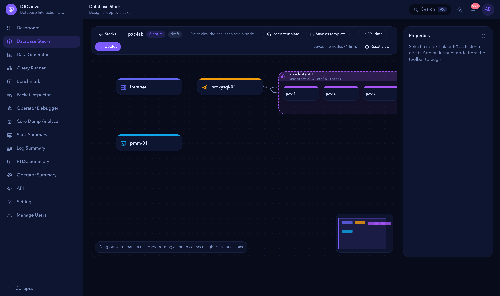
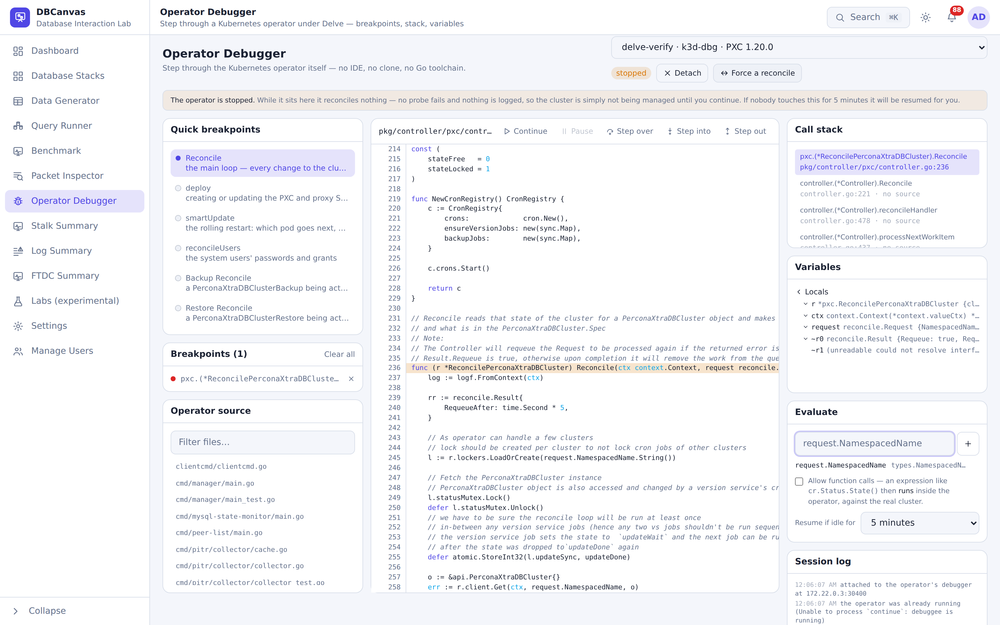
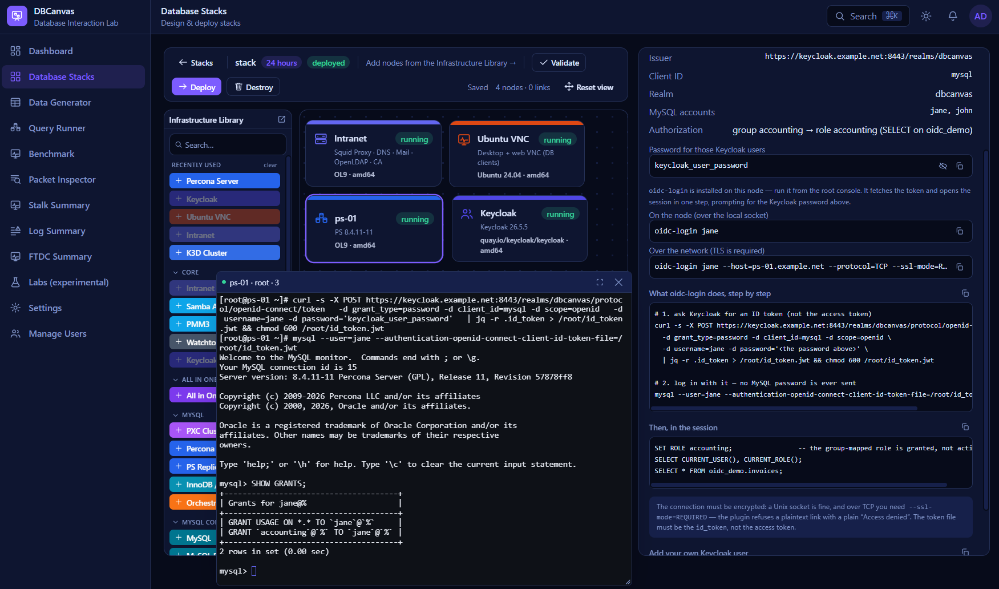
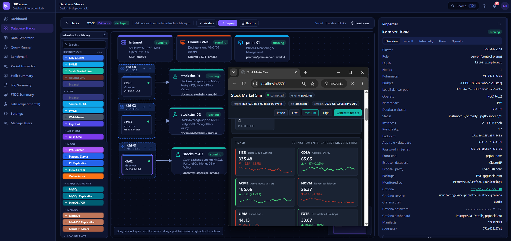
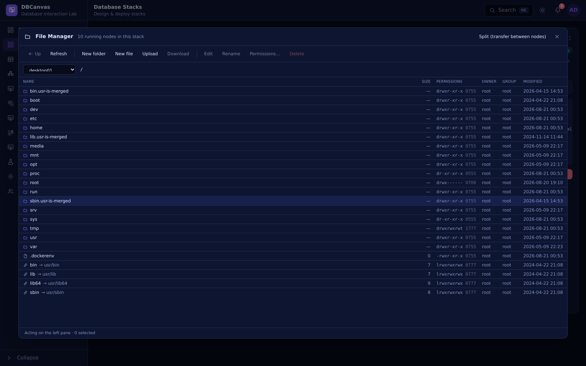

# DBCanvas — Database Interaction Lab

Design a database topology on a canvas, click **Deploy**, and get real running nodes — wired
together with DNS, TLS, LDAP, replication, monitoring and backups. Then use the tools that
come with it to load those databases, watch them work, and find out why they misbehave.

Built for testing, demos, training, troubleshooting, benchmarking and application
development: spin up a production-shaped cluster in minutes, exercise it, tear it down.



## What's New

**Debug the Kubernetes operator itself, without an IDE.** Deploy a K3D frame with *Run the
operator under Delve* ticked, then open the **Operator Debugger**: set a breakpoint, press
**Force a reconcile**, and read the call stack, the locals and any Go expression you type. No
clone of the operator, no Go toolchain, no `launch.json`, no `kubectl port-forward` — and when
you close the page it clears the breakpoints and resumes the operator for you.
[Operator Debugger →](docs/OPERATOR_DEBUGGER.md)



> *Stopped at the top of `Reconcile` on a live PXC cluster — the call stack, the operator's own
> locals, and an expression evaluated on the spot.*

**OpenID Connect sign-in for Percona Server, with Keycloak as the identity provider.**
Percona added the `auth_openid_connect` plugin in **Percona Server 8.4.11-11**, and DBCanvas
wires it up for you: add a **Keycloak** node, tick *Keycloak SSO* on a **Percona Server** node,
and deploy. You get a realm and an OIDC client on Keycloak, sample users in a group, MySQL
accounts bound to those users' identities, and a demo schema only that group's role can read.
Users then sign in with a signed ID token from Keycloak — **no MySQL password is ever sent** —
and their Keycloak group grants the matching MySQL role.



> *The node's **Keycloak SSO** tab gives you the issuer, client, accounts and the sample users'
> password, then the exact commands. In the console beside it, `jane` trades her Keycloak
> password for an `id_token` and logs in with it — `SHOW GRANTS` shows the `accounting` role
> arriving from her Keycloak group.*

The 8.4 LTS series is the only one that has this so far — 9.7 does not carry the plugin yet, so
the designer keeps the node on 8.4 when you turn SSO on. The **Ubuntu VNC** desktop ships the
8.4 client and its OIDC plugin, so you can sign in from there too.

**Every Kubernetes operator can drive a Stock Market Sim.** Link a **Stock Market Sim** node to
a K3D frame and the sim runs a live trading workload against the cluster that frame's operator
built — the fastest way to put real, continuous activity on an operator and watch it behave. All
six are supported: **Percona XtraDB Cluster**, **Percona Server for MySQL**, **Percona Server for
MongoDB**, **Percona PostgreSQL (PGO)**, **CloudNativePG**, and **Crunchy PGO**. The sim picks up
the engine from the operator, resolves the cluster's front end and its generated credentials by
itself, and reports throughput, portfolios and a per-instrument ticker.



> *Three K3D frames, three sims, one canvas. The open one is trading against `k3d-02` through
> that cluster's `k3d-02-rw-lb` Service; the panel on the right is the same frame's k3s node —
> PGO 6.0.2, pgBouncer in front, **Expose · proxy: LoadBalancer**, which is what made it
> reachable.*

The cluster has to be reachable from the stack network first, and that is the one thing the
frame cannot guess: a **ClusterIP** address exists only inside Kubernetes. Set the tier in front
of the database — the proxy, the MySQL Router, the mongos routers, the pgBouncer pool, or the
database pods themselves — to **LoadBalancer** (or NodePort) on the frame. The designer checks
this per operator and warns you before you deploy if every tier is ClusterIP, naming the ones to
change.

**A file manager, and drag and drop.** Drag a file — or a whole folder — from your desktop
straight onto a node on the canvas and DBCanvas asks where to put it: no scp, no bind mount, no
shell. Right-click a running node and choose **File manager** for the whole filesystem —
navigate, upload and download, create, rename, change permissions and ownership, delete, and
**edit a file in place**. **Split** opens a second pane on another node and copies between the
two, which is the fastest way to put one file on every member of a cluster.



## Quickstart

Requires **Docker**, with access to its daemon socket.

```sh
git clone https://github.com/jaimesicam/dbcanvas.git && cd dbcanvas
make install
```

`make install` builds the node images, records what each of them can install, then starts
DBCanvas at **http://localhost:8080**. The first run takes a while — it is building operating
system images — and later runs are just `make compose`.

Open the URL and create the admin account. In a new stack, add an **Intranet** node first: it
provides the DNS, mail, LDAP and certificate authority every other node uses. Then add a
database and press **Deploy**.

Everything has a working default. Before exposing DBCanvas beyond your own machine, change
the passwords in `.env` — see [Configuration](docs/CONFIGURATION.md).

## What you can build

**Databases**, standalone or clustered, on Oracle Linux, Rocky, Alma, Debian or Ubuntu:

- **PostgreSQL** — standalone, Patroni HA, repmgr, Spock multi-master, and CloudNativePG or
  Crunchy PGO on Kubernetes
- **MySQL** — Percona XtraDB Cluster, Percona Server, MySQL Community, asynchronous
  replication, InnoDB Cluster / Group Replication, and MariaDB (standalone, replication,
  Galera)
- **MongoDB** — Percona Server for MongoDB: standalone, replica set, sharded
- **Valkey** — standalone and cluster

**The infrastructure around them**: an Intranet node (DNS · mail · OpenLDAP · Squid proxy ·
a certificate authority), PMM, ProxySQL, HAProxy, Orchestrator, SeaweedFS S3, Keycloak,
OpenBao, Samba AD DC, Watchtower, an Ubuntu VNC desktop, and a Kubernetes cluster frame that
runs any of six database operators.

## What you can do with it

| | |
| --- | --- |
| [**Stacks**](docs/STACKS.md) | Design on a canvas, deploy, and manage every node from its own panel — terminal, files, credentials, certificates, replication. |
| [**Data Generator**](docs/DATA_GENERATOR.md) | Fill tables with realistic data, at the scale it takes to see a problem. |
| [**Query Runner**](docs/QUERY_RUNNER.md) | Run SQL across nodes in parallel, gated on the processlist. |
| [**Benchmark**](docs/BENCHMARK.md) | OLTP, OLAP, read-write and read-only workloads, with throughput and latency. |
| [**Packet Inspector**](docs/PACKET_INSPECTOR.md) | Capture on a node and decode MySQL, PostgreSQL, MongoDB and Valkey off the wire. |
| [**Log Summary**](docs/LOG_SUMMARY.md) | Several nodes' logs on one timeline, split into the good, the warning and the bad. |
| [**Stalk Summary**](docs/STALK_SUMMARY.md) | Turn a pt-stalk capture into charts, and say which variables to change. |
| [**FTDC Summary**](docs/FTDC_SUMMARY.md) | Read MongoDB's own black box — the diagnostic data every mongod already writes. |
| [**Operator Debugger**](docs/OPERATOR_DEBUGGER.md) | Step through the Kubernetes operator itself — breakpoints, stack and variables, no IDE. |
| [**All in One**](docs/ALL_IN_ONE.md) | Many database instances in one node, for when you need versions side by side. |
| [**Labs**](docs/LABS.md) | Hands-on scenarios on a disposable stack, graded against the real cluster. |

## Documentation

- [Feature guides](docs/README.md) — the list above, in detail
- [Configuration & commands](docs/CONFIGURATION.md) — `.env`, every `make` target,
  troubleshooting, recovering an admin password
- [Architecture](docs/ARCHITECTURE.md) — how it is wired, and why

## Requirements

- **Docker**, with access to the daemon socket. DBCanvas drives the daemon to create your
  stacks, which is a privileged capability — run it somewhere you trust.
- Enough resources for what you deploy: a full HA cluster is several containers.
- Linux recommended; also runs on macOS and Windows Docker, including Apple Silicon.
- **k3d** only for Kubernetes frames (the app image ships it), and **Vagrant + VirtualBox**
  only for the hybrid backend, where database nodes are real VMs instead of containers.
