# API & CLI reference, feature by feature

Every feature of DBCanvas, with the endpoint behind it, the `dbcanvas-cli` command
that calls it, and — where a picture helps — the thing you would have clicked instead.

For **how** to authenticate, what scopes mean and how tokens expire, read
[HTTP API](API.md) first. For the CLI's own conventions — profiles, `--json`,
`--wait`, exit codes — read [`dbcanvas-cli`](CLI.md). This page is the map between
the three.

**This page is written by hand and the catalogue is not.** The authoritative,
always-current list is on the **API** page in the app, or:

```sh
dbcanvas endpoints --long
curl -s -H "Authorization: Bearer $DBCANVAS_TOKEN" localhost:8080/api/meta/endpoints
```

If something here disagrees with those, they are right.

**Where a table says `dbcanvas api …`** there is no curated subcommand: that is the
escape hatch, it works for every endpoint, and it is not a lesser option — just a
longer one.

---

## Contents

**Getting in** · [Sign-in & accounts](#sign-in--accounts) · [Your account](#your-account) · [API tokens](#api-tokens) · [Users (admin)](#users-admin) · [Instance settings (admin)](#instance-settings-admin)

**Building** · [Stacks](#stacks) · [Templates](#templates) · [Nodes](#nodes) · [Clusters & backups](#clusters--backups) · [Version catalogues](#version-catalogues) · [Kubernetes frames](#kubernetes-frames) · [All in One](#all-in-one)

**Running load** · [Data Generator](#data-generator) · [Query Runner](#query-runner) · [Benchmark](#benchmark) · [Stock Market Sim](#stock-market-sim)

**Finding out what happened** · [Packet Inspector](#packet-inspector) · [Log Summary](#log-summary) · [FTDC Summary](#ftdc-summary) · [Stalk Summary](#stalk-summary) · [Diagnostic captures](#diagnostic-captures) · [Operator Debugger](#operator-debugger) · [Core Dump Analyzer](#core-dump-analyzer)

**Managing a node** · [Node file manager](#node-file-manager) · [Certificates](#certificates) · [Intranet mail](#intranet-mail) · [Intranet LDAP](#intranet-ldap) · [Samba AD DC](#samba-ad-dc) · [SeaweedFS](#seaweedfs) · [OpenBao](#openbao)

**Watching** · [Dashboard](#dashboard) · [Notifications](#notifications) · [Labs](#labs) · [API metadata](#api-metadata)

---

# Getting in

## Sign-in & accounts

The only five endpoints reachable without a session, because they are the ones an
account needs before it has one.

| To do this | API | CLI |
| --- | --- | --- |
| Ask whether this installation is set up, and who you are | `GET /api/setup/status` | `dbcanvas version` (also prints the server's) |
| Create the first account — it becomes the administrator | `POST /api/setup` | *(UI only; there is nothing to authenticate with yet)* |
| Request an account, pending an admin's approval | `POST /api/auth/register` | *(UI only)* |
| Sign in and get a session cookie | `POST /api/auth/login` | `dbcanvas login` — then swaps it for a token |
| Sign out | `POST /api/auth/logout` | `dbcanvas logout` — also revokes the token |

`dbcanvas login` does all three of the last ones in sequence and keeps only the
token; see [`dbcanvas-cli`](CLI.md#signing-in) for why.

```sh
dbcanvas login --url http://localhost:8080
```

## Your account

**UI:** the avatar menu, top right, and **Settings**.

| To do this | API | CLI |
| --- | --- | --- |
| Who am I | `GET /api/me` | `dbcanvas whoami` |
| Read your UI preferences | `GET /api/me/settings` | `dbcanvas api GET /api/me/settings` |
| Change theme, terminal mode, deployment backend | `PUT /api/me/settings` | `dbcanvas api PUT /api/me/settings --data '{"theme":"forest"}'` |
| **Change your password** | `POST /api/me/password` | `dbcanvas password` |
| Read the release notes, and whether you have seen them | `GET /api/whatsnew` | `dbcanvas api GET /api/whatsnew` |
| Mark the release notes read | `POST /api/whatsnew/seen` | `dbcanvas api POST /api/whatsnew/seen` |


> *`POST /api/me/password` is this form. The current-password field is not a
> formality — it is the check the endpoint exists for. The toggle is the
> `revokeTokens` flag.*

**Changing your password needs your current one**, even though you are already signed
in — a session somebody else got hold of should not be able to lock you out. And **an
API token cannot do it at all**: that is the same asymmetry that stops a token
creating another token. Both the endpoint and `dbcanvas password` ask for the
password, and the CLI signs in with it rather than sending its stored token.

Changing it signs out every *other* session and keeps the one you used.
API tokens survive by default — a routine rotation should not break a CI job — and
`--revoke-tokens` (or the toggle in Settings) takes them with it, which is what you
want if the password may have leaked.

```sh
$ dbcanvas password
Changing the password for jaime on http://localhost:8080.
Current password: ********
New password: ********
New password again: ********
Password changed. Every other session was signed out.
Your API tokens still work. Pass --revoke-tokens if you wanted them gone too.
```

> **Forgotten it entirely, with nobody able to sign in?** That is a different problem
> and has a different answer: `docker exec -it dbcanvas-app-1 dbcanvas_reset_password`
> — see [Configuration](CONFIGURATION.md#recovering-an-admin-password).

## API tokens

**UI:** **API** → **Tokens**.

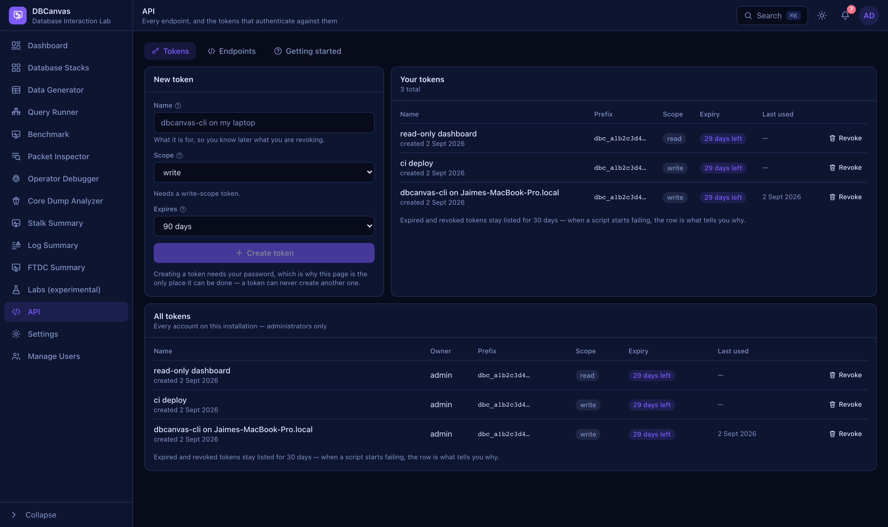

> *Every row is one `GET /api/tokens` entry — name, prefix, scope, expiry, last used
> and state. Active, expired and revoked all stay listed. The lower table is
> `GET /api/admin/tokens`, which adds the owner column and is admin-only.*

| To do this | API | CLI |
| --- | --- | --- |
| List your tokens | `GET /api/tokens` | `dbcanvas token list` |
| Create one (needs a password sign-in) | `POST /api/tokens` | `dbcanvas token create --name N --scope write --expires 30` |
| Revoke one of yours | `DELETE /api/tokens/{id}` | `dbcanvas token revoke <id>` |
| List every token on the instance | `GET /api/admin/tokens` | `dbcanvas token list --all` |
| Revoke anyone's | `DELETE /api/admin/tokens/{id}` | `dbcanvas token revoke <id> --admin` |

The secret is returned once, by the create call, and never again.

## Users (admin)

**UI:** **Manage Users**.

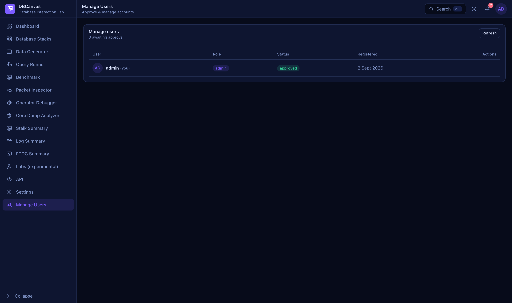

> *`GET /api/users` returns these rows, accounts awaiting approval first. Each button
> is one of the four POSTs below.*

| To do this | API | CLI |
| --- | --- | --- |
| List every account, pending first | `GET /api/users` | `dbcanvas api GET /api/users` |
| Approve a pending account | `POST /api/users/{id}/approve` | `dbcanvas api POST /api/users/1/approve` |
| Reject a request | `POST /api/users/{id}/reject` | `dbcanvas api POST /api/users/1/reject` |
| Disable an approved account | `POST /api/users/{id}/disable` | `dbcanvas api POST /api/users/1/disable` |
| Delete an account and its stacks | `DELETE /api/users/{id}` | `dbcanvas api DELETE /api/users/1` |

Rejecting or disabling revokes that account's sessions **and its API tokens** in the
same operation.

## Instance settings (admin)

**UI:** **Settings** — the upload ceiling and the token-lifetime ceiling.

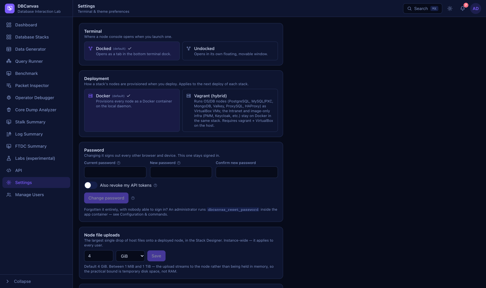

> *Two of these rows are per-account (`/api/me/settings`) and two are instance-wide
> (`/api/system/settings`). The distinction is who the setting belongs to: a theme is
> yours, a ceiling on what the server will do on everyone's behalf is not.*

| To do this | API | CLI |
| --- | --- | --- |
| Read the instance settings | `GET /api/system/settings` | `dbcanvas api GET /api/system/settings` |
| Change them (admin) | `PUT /api/system/settings` | `dbcanvas api PUT /api/system/settings --data '{"maxUploadBytes":8589934592,"maxTokenDays":30}'` |

Out-of-range values are clamped, not refused. `sshForwarding` in the response is
derived from `SSH_FORWARDING_HOST` and read-only.

---

# Building

## Stacks

A stack is a topology on a canvas plus everything it deployed. This is the feature
everything else hangs off.


> *The canvas is a `design` document — nodes, edges and a viewport. `GET
> /api/stacks/{id}` hands you exactly what is drawn here; `PUT` replaces it. Anything
> you can arrange by dragging, you can send as JSON.*

| To do this | API | CLI |
| --- | --- | --- |
| List your stacks | `GET /api/stacks` | `dbcanvas stack list` |
| **Build one from a description** | `POST /api/stacks/compose` | `dbcanvas stack compose <name> --node …` |
| What compose can build | `GET /api/stacks/compose/kinds` | `dbcanvas stack kinds` |
| Create one from a template or a design | `POST /api/stacks` | `dbcanvas stack create <name> --template <t> --ttl 4h` |
| Read one, with every node's state | `GET /api/stacks/{id}` | `dbcanvas stack get <stack>` |
| Replace its name, TTL or design | `PUT /api/stacks/{id}` | `dbcanvas api PUT /api/stacks/1 --data @design.json` |
| Check the design, build nothing | `POST /api/stacks/{id}/validate` | `dbcanvas stack validate <stack>` |
| Deploy it | `POST /api/stacks/{id}/deploy` | `dbcanvas stack deploy <stack> --wait` |
| Remove the containers, keep the design | `POST /api/stacks/{id}/destroy` | `dbcanvas stack destroy <stack>` |
| Delete both | `DELETE /api/stacks/{id}` | `dbcanvas stack delete <stack>` |
| Export the design as JSON | `GET /api/stacks/{id}` | `dbcanvas stack export <stack> > lab.json` |

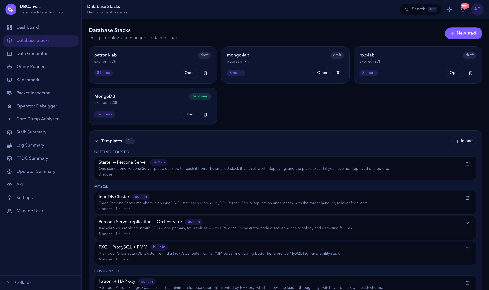

> *Picking a template in **New stack** is `GET /api/templates/{id}` for its design,
> then `POST /api/stacks` with that design — which is exactly what
> `dbcanvas stack create --template` does.*

**`deploy` returns immediately.** It starts provisioning and answers; the node states
in `GET /api/stacks/{id}` are the progress. `--wait` polls that for you, prints each
node transition, and exits **4** if the deploy failed — which is the part a CI job
needs.

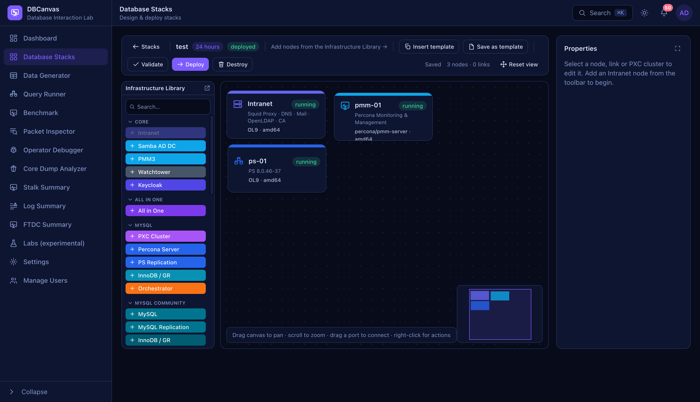

> *Each card here is one entry in the `deployments` array: a `nodeId`, a `state`
> (`pending` → `provisioning` → `running`, or `error`) and a container id.*

```sh
dbcanvas stack create pxc-lab --template "PXC + ProxySQL + PMM" --ttl 4h --deploy --wait
dbcanvas stack get pxc-lab
dbcanvas stack destroy pxc-lab
```

**Set a TTL on anything a script creates.** `2h`, `4h`, `8h`, `24h`, `2w` or
`infinity`. A job that dies between `deploy` and `destroy` otherwise leaves a cluster
running until somebody notices.

### Composing a stack

`POST /api/stacks/compose` takes a description instead of a canvas document. It is the
answer to "three PXC 8.4.5 nodes on EL8, a Percona Server 8.0.45 on EL9 with LDAP, and
a PMM watching both" — which as a hand-written design means knowing that the package
is `8.4.5-5.1` on Oracle Linux and `8.4.5-5-1` on Ubuntu, that a cluster is a *frame*
plus member nodes carrying its id, and that monitoring is a field holding another
node's id rather than a line drawn on the canvas.

```sh
dbcanvas stack compose repro-1234 --ttl 8h \
  --node 'pxc:3,version=8.4.5,os=el8,monitor' \
  --node 'ps,version=8.0.45,os=el9,ldap,monitor' \
  --node 'pmm,version=3' \
  --deploy --wait
```

```json
POST /api/stacks/compose
{
  "name": "repro-1234", "ttl": "8h",
  "nodes": [
    {"kind": "pxc", "count": 3, "version": "8.4.5", "os": "el8", "monitor": true},
    {"kind": "ps",  "version": "8.0.45", "os": "el9", "ldap": true, "monitor": true},
    {"kind": "pmm", "version": "3"}
  ]
}
```

Both produce the same thing:

```
KIND      NAME            OS             VERSION      NODES  MONITORED BY  DIRECTORY
intranet  intranet-01     -              -            1      -             -
pxc       pxc-cluster-01  oraclelinux 8  8.4.5-5.1    3      pmm-01        -
ps        ps-01           oraclelinux 9  8.0.45-36.1  1      pmm-01        intranet-01
pmm       pmm-01          -              3            1      -             -

  + an Intranet node (DNS, CA, LDAP, package proxy) — every stack needs one
```

**What it resolves for you.**

| You write | It becomes | Why you could not write it |
| --- | --- | --- |
| `"os": "el8"` | `oraclelinux` + release `8` | The design wants the pair; every bug report says "el8". |
| `"version": "8.4.5"` | series `8.4`, build `8.4.5-5.1` | The package suffix differs per OS family, and nothing about `8.4.5` says its series is `8.4`. |
| `"version": "8.4"` | that series, latest build | |
| `"version": ""` | the newest series, latest build | |
| `"kind": "pxc", "count": 3` | a frame plus 3 member nodes carrying its `frameId` | The ids do not exist until something generates them. |
| `"monitor": true` | `pmmNodeId` on the frame (cluster) or the node | |
| *nothing* | an Intranet node | Everything else assumes one exists. Reported in `added`. |

**The relationships.** Each is a boolean that resolves to a reference to another node
in the same spec — the part of a design you cannot write by hand, because the field
holds an id that does not exist until something generates it. Each takes an optional
`…With` partner naming which node, for a spec with more than one candidate.

| Option | Wires | Provided by | Available on |
| --- | --- | --- | --- |
| `monitor` | PMM registration | `pmm` | every engine and cluster |
| `ldap` | directory authentication | `intranet`, `sambaad` | `ps`, `pg`, `psm`, `valkey`, `valkey-cluster` |
| `oidc` | Keycloak single sign-on | `keycloak` | `ps`, `pg`, `psm`, `pmm` |
| `kerberos` | GSSAPI single sign-on | `sambaad` | `pg`, `psm` |
| `vault` | data-at-rest keys in OpenBao | `openbao` | `ps`, `psm` |
| `backup` | pgBackRest / Barman / PBM → S3 | `seaweedfs` | `pg`, `patroni`, `repmgr`, `psmrs` |
| `orchestrator` | topology discovery and failover | `orchestrator` | `ps-repl`, `mariadb-repl`, `mysql-repl` |

```sh
dbcanvas stack compose sso-lab \
  --node keycloak \
  --node 'ps,version=8.4.11,os=el9,oidc,monitor' \
  --node 'pmm,oidc' \
  --node openbao --node 'psm,os=el9,vault,ldap'
```

Asking for one a kind does not have is an error naming the kind; asking for one with
no provider in the spec is an error naming the line to add. `dbcanvas stack kinds`
prints the whole matrix for your installation.

**The associations.** A relationship above is a *field*. An association is a **line on
the canvas**, and it is the half of a design that fields cannot express: the
provisioners find a ProxySQL's backend and a simulator's database by walking the edge
graph, never by reading a field. Seven kinds do nothing without one, and an HAProxy
without one cannot even pass validation.

| Kind | Associates with |
| --- | --- |
| `proxysql`, `proxysql-cluster` | `pxc`, `ps-repl` |
| `haproxy` | `patroni`, `repmgr`, `spock`, `pxc`, `ps-repl` — exactly one |
| `trafficsim` | `valkey`, `valkey-cluster` |
| `hotelsim` | `psm`, `psmrs`, `psmdb` |
| `airlinesim` | `ps`, `ps-repl`, `pxc`, `proxysql`, `haproxy` |
| `carsim` | `pg`, `patroni`, `repmgr`, `spock`, `haproxy` |
| `marketchaos` | `ps`, `pxc`, `ps-repl`, `haproxy` |

```json
{"kind": "haproxy", "os": "el9"}
{"kind": "marketchaos", "to": "haproxy-01"}
```

`"to"` names the target. Omit it and compose uses the only legal one and reports it
in the plan; with several it refuses and names them, because driving a cluster
directly and driving it through a proxy are different tests. With none it refuses
rather than composing a design that cannot deploy.

**Shaping the machine.** A slow disk and a lossy link between cluster members are the
failures worth reproducing, and neither is a version string. These are per node, and
each is refused on a kind that would ignore it.

| Field | Effect | Available on |
| --- | --- | --- |
| `netLatencyMs`, `netJitterMs`, `netLossPct`, `netRateMbit` | delay, jitter, loss and a rate cap on the node's own database and cluster ports | every engine and the two proxies |
| `netAllTraffic` | widen that to every packet — a bad NIC rather than a bad link | as above |
| `deviceReadMbps`, `deviceWriteMbps` | disk throughput limits | anything that takes `cpus` |
| `cpus`, `memoryGb` | container limits | **not** `pmm`, `seaweedfs`, `keycloak`, `openbao`, `sambaad`, `vnc`, `watchtower`, `intranet` or the simulators, which never apply them |

That last row is the rule the whole option table follows: an option a kind would
silently ignore is **refused**, not accepted. `GET /api/stacks/compose/kinds` lists
exactly what each kind takes, generated from the same table the builder checks
against.

**Per-engine choices** — each selects a genuinely different topology or mode rather
than a tuning detail: `replMode` (`async`|`semisync`, or `innodbcluster`|
`groupreplication`), `mode` for ProxySQL (`singlewrite`|`loadbal`), `mysqlRouter`,
`setup` for a sharded PSMDB cluster, `dataset` for MarketChaos, `buckets` and `tls`
for SeaweedFS, `alertEmail` for Orchestrator, and `certTtl` (`365d`, `2h`, `30m` — a
short one expires on purpose).

**Clusters with a fixed shape.** Most cluster kinds take `count`. A sharded PSMDB
cluster does not: its shape is one mongos, a config replica set and exactly three
shards, so it takes `"setup": "standard"` (13 containers) or `"minimum"` (5), and
`count` is refused. Compose emits every member with the role and shard index the
provisioner selects on.

**Prerequisites it knows about.** An OIDC issuer has to be reachable over HTTPS, so
composing `oidc` turns on the Keycloak node's certificate and says so — the validator
refuses the alternative and the fix is mechanical. Kinds that work on only one OS take
it (OpenBao is Oracle Linux 9 only; the VNC desktop is Ubuntu 24.04), and the five
singleton kinds are refused twice over rather than composed into a design that cannot
deploy. Composing a Keycloak node also **adds the Ubuntu desktop** it requires: its
admin console publishes no host ports and is only reachable from a browser inside the
stack, so the validator refuses the alternative outright — unlike monitoring, which
is optional and never added for you. And `oidc` on a Percona Server older than
8.4.11-11 is **refused**: `auth_openid_connect` arrived there, and below it the
provisioner skips the plugin without failing, so the flag would be accepted
everywhere and do nothing.

It also lays the result out with the coordinates the built-in templates use, so it
opens on the canvas looking designed rather than piled in a corner.

**`"dryRun": true`** resolves and reports without creating anything — which versions
it settled on, what it added — so you can look before committing. `--dry-run` in the
CLI.

**Errors are the point.** An unavailable version is answered with what *is* available
in that series; an unknown OS with the aliases; a bad member count with the range; and
`"monitor"` with no PMM in the spec with the line to add.

**What compose will not build**, and why, from `GET /api/stacks/compose/kinds`: a
Kubernetes frame (an operator choice, a node budget, expose tiers), an All-in-One node
(a list of per-instance configurations), the Stock Market Sim (three connection modes
and a dozen lab knobs) and a core-dump host (host directory paths and the crashed
build's version). Those are the shapes a terse spec would get subtly and silently
wrong, so it refuses them by name — start from a template and `PUT` the design.

There is deliberately **no `deploy` flag** on compose: `POST /api/stacks/{id}/deploy`
already does that properly, and `dbcanvas stack compose --deploy` simply makes both
calls.

## Templates

**UI:** **New stack** → **Start from**, and **Save as template** on the canvas.

| To do this | API | CLI |
| --- | --- | --- |
| List available templates | `GET /api/templates` | `dbcanvas template list` |
| Save the current canvas as one | `POST /api/templates` | `dbcanvas api POST /api/templates --data @tpl.json` |
| Read one, with its design | `GET /api/templates/{id}` | `dbcanvas api GET /api/templates/builtin:pxc-proxysql-pmm` |
| Rename or re-describe it | `PUT /api/templates/{id}` | `dbcanvas api PUT /api/templates/3 --data '{"name":"…"}'` |
| Delete one of yours | `DELETE /api/templates/{id}` | `dbcanvas api DELETE /api/templates/3` |
| Publish instance-wide (admin) | `POST /api/templates/{id}/share` | `dbcanvas api POST /api/templates/3/share` |
| Download as a `.json` file | `GET /api/templates/{id}/export` | `dbcanvas template export <name> > pxc.json` |
| Import one | `POST /api/templates/import` | `dbcanvas template import pxc.json` |

Built-in templates have ids like `builtin:pxc-proxysql-pmm`; your own are numbers.
Saved templates are stripped of secrets, host paths and pinned host ports, which is
what makes them safe to hand over.

## Nodes

**UI:** click a node for its panel; right-click for the menu.

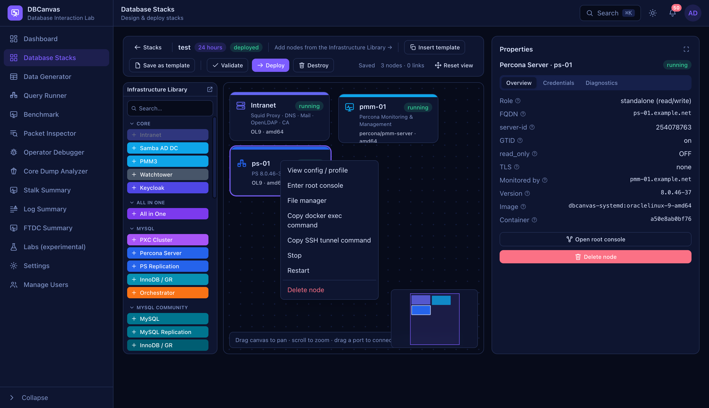

> *Every item on this menu is an endpoint. **Enter root console** is the `…/term`
> WebSocket, **File manager** is the `…/fs/*` family, **Copy SSH tunnel command** is
> `…/sshforward`, and start/stop/restart are the three POSTs below.*

| To do this | API | CLI |
| --- | --- | --- |
| Read a node's panel | `GET /api/stacks/{id}/nodes/{nid}` | `dbcanvas api GET /api/stacks/1/nodes/pxc-01` |
| List a stack's deployed nodes | `GET /api/stacks/{id}` | `dbcanvas node list <stack>` |
| Start · stop · restart | `POST …/nodes/{nid}/start` · `/stop` · `/restart` | `dbcanvas node start\|stop\|restart <stack> <node>` |
| Open a root console | `GET …/nodes/{nid}/term` *(WebSocket)* | `dbcanvas node console <stack> <node>` |
| Run one command | *(the same WebSocket)* | `dbcanvas node exec <stack> <node> -- mysql -e 'SHOW STATUS'` |
| Get the `ssh -L` tunnel line | `GET …/nodes/{nid}/sshforward` | `dbcanvas node tunnel <stack> <node>` |
| Copy files in | `POST …/nodes/{nid}/upload` *(multipart)* | `dbcanvas node cp ./my.cnf <stack>:<node>:/etc/` |

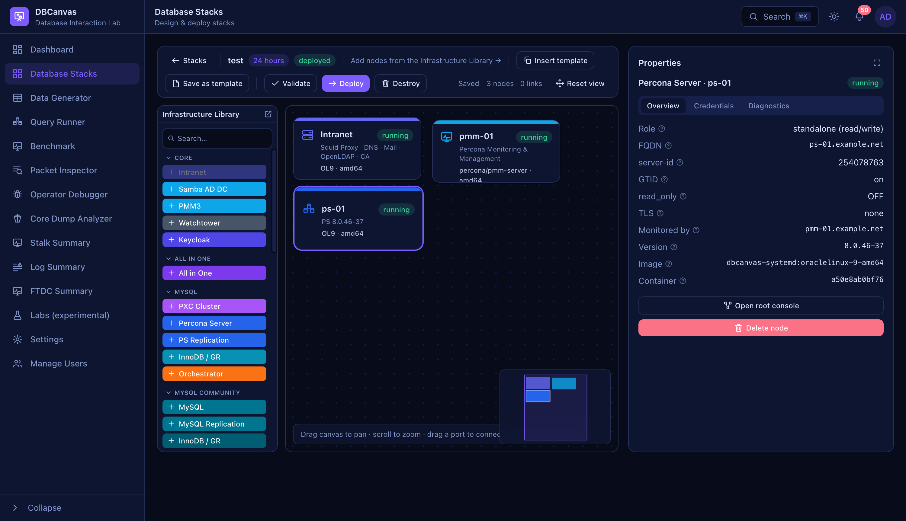

> *`GET /api/stacks/{id}/nodes/{nid}` returns everything on this panel: what the node
> is, its address on the stack network, its published host ports, its generated
> credentials and its certificate.*

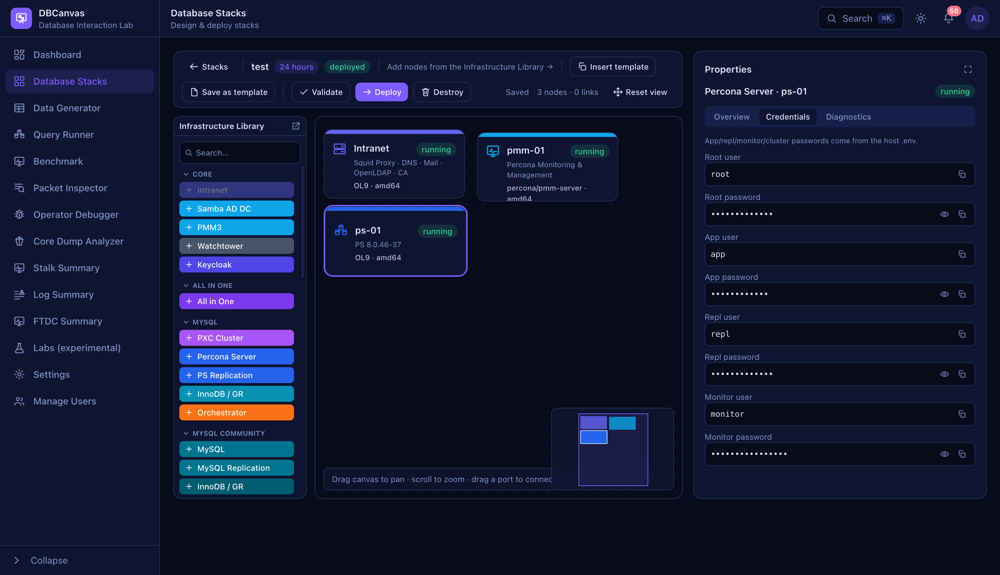

> *The passwords here come back in the same response. They are generated per
> deployment, so reading them from the API is how a script connects without anybody
> having to paste one.*


> *This is the `…/term` WebSocket. `dbcanvas node console` is the same thing in your
> own terminal — binary frames are keystrokes, text frames are `{"type":"resize"}`.
> A browser cannot set an `Authorization` header on a WebSocket handshake and does
> not need to; the CLI can, which is why there is no `?token=` parameter.*

**After a restart, re-read the node.** Docker hands out a new ephemeral host port on
every start, so any port you noted before the restart is stale.

## Clusters & backups

A *frame* on the canvas is a cluster. These act on the frame rather than one node.

| To do this | API | CLI |
| --- | --- | --- |
| Add/remove PMM monitoring on every member | `POST /api/stacks/{id}/frames/{fid}/pmm` | `dbcanvas api POST /api/stacks/1/frames/pxc-cluster/pmm` |
| Add/remove Orchestrator on a MySQL replication cluster | `POST …/frames/{fid}/orchestrator` | `dbcanvas api POST …/orchestrator` |
| pgBackRest backup on a Patroni cluster | `POST …/frames/{fid}/patroni/backup` | `dbcanvas api POST …/patroni/backup` |
| pgBackRest backup on a standalone PostgreSQL node | `POST …/nodes/{nid}/pg/backup` | `dbcanvas api POST …/pg/backup` |
| PBM backup on a MongoDB replica set or shard | `POST …/frames/{fid}/pbm/backup` | `dbcanvas api POST …/pbm/backup` |
| Barman backup on a repmgr primary | `POST …/frames/{fid}/barman/backup` | `dbcanvas api POST …/barman/backup` |


> *Ticking **Monitored by** on a cluster after it is deployed is the `…/frames/{fid}/pmm`
> POST: it creates the monitoring user on every member and registers each agent.*

## Version catalogues

What this installation can actually install, as recorded by `make versions`. The
designer's version pickers are built from these; a script that constructs a design
should read them rather than guessing a version string.

| Engine | API |
| --- | --- |
| Percona XtraDB Cluster | `GET /api/catalog/pxc` |
| Percona Server for MySQL | `GET /api/catalog/ps` |
| Percona Distribution for MySQL | `GET /api/catalog/pdps` |
| MySQL Community | `GET /api/catalog/mysqlce` |
| MariaDB | `GET /api/catalog/mariadb` |
| Percona Server for MongoDB | `GET /api/catalog/psmdb` |
| Percona Distribution for PostgreSQL | `GET /api/catalog/ppg` |
| Spock (pgEdge) | `GET /api/catalog/spock` |
| Valkey | `GET /api/catalog/valkey` |
| ProxySQL · Orchestrator · PMM | `GET /api/catalog/proxysql` · `/orchestrator` · `/pmm` |
| k3s, and the six operators | `GET /api/catalog/k3s` · `/operators` |
| The OS base images built here | `GET /api/catalog/images` |

```sh
dbcanvas api GET /api/catalog/ps | jq '.["oraclelinux-9"]'
```

## Kubernetes frames

**UI:** the k3s node's panel on a K3D frame.


| To do this | API | CLI |
| --- | --- | --- |
| Get an admin kubeconfig | `GET …/frames/{fid}/k3d/kubeconfig` | `dbcanvas api GET …/k3d/kubeconfig` |
| List the RBAC users made for testing | `GET …/frames/{fid}/k3d/users` | `dbcanvas api GET …/k3d/users` |
| Create one with a role | `POST …/frames/{fid}/k3d/users` | `dbcanvas api POST …/k3d/users --data '{"username":"dev","role":"view"}'` |
| Delete one | `POST …/frames/{fid}/k3d/users/delete` | `dbcanvas api POST …/k3d/users/delete` |
| Get a kubeconfig scoped to one user | `GET …/k3d/users/{username}/kubeconfig` | `dbcanvas api GET …/kubeconfig` |

```sh
dbcanvas api GET /api/stacks/1/frames/k3d-01/k3d/kubeconfig | jq -r .kubeconfig > kube.yaml
KUBECONFIG=kube.yaml kubectl get pods -A
```

## All in One

Many database instances inside one node. Every action execs the container's own
`aioctl`, so the API and a shell in the node cannot disagree.

| To do this | API | CLI |
| --- | --- | --- |
| List every instance, with engine, version, port and state | `GET …/nodes/{nid}/aio/instances` | `dbcanvas api GET …/aio/instances` |
| Start · stop · restart one | `POST …/aio/instances/{inst}/start` · `/stop` · `/restart` | `dbcanvas api POST …/aio/instances/mysql-8.0/restart` |
| Tail one instance's log | `GET …/aio/instances/{inst}/logs` | `dbcanvas api GET …/aio/instances/mysql-8.0/logs` |

---

# Running load

## Data Generator

Fill tables with realistic data, at the scale it takes to see a problem.


> *The form is built from `…/columns`: DBCanvas introspects the table and infers a
> generator per column. **Preview** is the `…/preview` POST — it changes nothing,
> so a read-scoped token can call it.*

| To do this | API | CLI |
| --- | --- | --- |
| Which nodes can it write to | `GET /api/datagen/connections` | `dbcanvas datagen connections` |
| List databases on a node | `GET /api/datagen/stacks/{id}/nodes/{nid}/databases` | `dbcanvas datagen databases <stack> <node>` |
| List tables, with row counts | `…/tables` | `dbcanvas datagen tables <stack> <node> --database sbtest` |
| Inspect a table's columns and generators | `…/columns` | `dbcanvas api GET …/columns?database=sbtest&table=sbtest1` |
| Preview rows without writing them | `POST …/preview` | `dbcanvas api POST …/preview --data '{…}'` |
| Start a generation job | `POST …/generate` | `dbcanvas datagen run <stack> <node> --table T --rows N --wait` |
| Poll a job | `GET /api/datagen/jobs/{job}` | *(`--wait` does this)* |
| Cancel a job | `POST /api/datagen/jobs/{job}/cancel` | `dbcanvas api POST /api/datagen/jobs/<job>/cancel` |

```sh
dbcanvas datagen run pxc-lab pxc-01 --database sbtest --table sbtest1 --rows 5000000 --wait
```

Rows already written stay written when a job is cancelled.

## Query Runner

Run SQL across several nodes in parallel, gated on the processlist.


| To do this | API | CLI |
| --- | --- | --- |
| Which nodes can it run against | `GET /api/queryrun/targets` | `dbcanvas query targets` |
| Start a run | `POST /api/queryrun/runs` | `dbcanvas query run --stack S --nodes a,b --sql '…'` |
| Poll it | `GET /api/queryrun/runs/{id}` | *(the CLI waits by default)* |
| Stop it, killing the statements | `POST /api/queryrun/runs/{id}/stop` | `dbcanvas api POST /api/queryrun/runs/<id>/stop` |
| Your previous runs | `GET /api/queryrun/history` | `dbcanvas query history` |

```sh
dbcanvas query run --stack pxc-lab --nodes pxc-01,pxc-02,pxc-03 \
  --sql 'SELECT @@hostname, @@server_id' --json | jq '.nodes[]'
```

`--sql @file.sql` reads the statement from a file, which is easier than quoting.

## Benchmark

OLTP, OLAP, read-write and read-only workloads, with throughput and latency.


| To do this | API | CLI |
| --- | --- | --- |
| Which nodes, and which workloads each supports | `GET /api/benchmark/targets` | `dbcanvas benchmark targets` |
| Start a run | `POST /api/benchmark/runs` | `dbcanvas benchmark run <stack> <node> --workload oltp --duration 60 --wait` |
| Live throughput and latency | `GET /api/benchmark/runs/{id}` | *(`--wait` polls it)* |
| Stop early, keeping the numbers so far | `POST /api/benchmark/runs/{id}/stop` | `dbcanvas api POST /api/benchmark/runs/<id>/stop` |
| Previous runs, for comparison | `GET /api/benchmark/history` | `dbcanvas benchmark history` |

## Stock Market Sim


The sim itself is a node you deploy and link on the canvas — there is no API to drive
it, because linking it *is* the configuration. One endpoint exists, for the case the
canvas cannot guess:

| To do this | API | CLI |
| --- | --- | --- |
| Test a hand-entered database connection from inside the stack network | `POST …/nodes/{nid}/stocksim/test` | `dbcanvas api POST …/stocksim/test --data '{…}'` |

---

# Finding out what happened

## Packet Inspector

`tcpdump` on a database node, decoded packet by packet — MySQL, PostgreSQL, MongoDB
and Valkey.


| To do this | API | CLI |
| --- | --- | --- |
| Which nodes can be captured, and on which port | `GET /api/pktinspect/targets` | `dbcanvas capture targets` |
| Start a capture | `POST /api/pktinspect/captures` | `dbcanvas capture start <stack> <node> --seconds 30` |
| List your captures | `GET /api/pktinspect/captures` | `dbcanvas capture list` |
| A capture's state and counters | `GET /api/pktinspect/captures/{id}` | `dbcanvas capture get <id>` |
| Stop one and decode it | `POST …/captures/{id}/stop` | `dbcanvas capture stop <id>` |
| A page of decoded packets | `GET …/captures/{id}/packets` | `dbcanvas capture packets <id> --limit 50` |
| One packet in full | `GET …/captures/{id}/packets/{no}` | `dbcanvas api GET …/packets/42` |
| The zoomable timeline | `GET …/captures/{id}/timeline` | `dbcanvas api GET …/timeline` |
| Download the raw `.pcap` | `GET …/captures/{id}/download` | `dbcanvas capture download <id>` |
| The server-log records a capture is blind to | `GET …/captures/{id}/serverlog` | `dbcanvas api GET …/serverlog` |
| Upload a `.pcap` from elsewhere | `POST /api/pktinspect/upload` *(multipart)* | `curl -F file=@x.pcap …` |


> *`GET …/packets/{no}` returns exactly this: the decoded fields, the raw bytes, and
> the exchange the packet belongs to.*

```sh
ID=$(dbcanvas capture start pxc-lab pxc-01 --seconds 20 | jq -r .id)
sleep 25 && dbcanvas capture download "$ID"
```

## Log Summary

Several nodes' logs on one timeline, split into the good, the warning and the bad.


| To do this | API | CLI |
| --- | --- | --- |
| What can be collected | `GET /api/logsummary/targets` | `dbcanvas logs targets` |
| Collect several nodes' logs as one bundle | `POST /api/logsummary/collect` | `dbcanvas logs collect <stack> --nodes a,b,c` |
| List your bundles | `GET /api/logsummary/bundles` | `dbcanvas logs list` |
| A bundle's sources, verdict and counts | `GET /api/logsummary/bundles/{id}` | `dbcanvas logs get <id>` |
| A page of classified events | `GET …/bundles/{id}/events` | `dbcanvas logs events <id> --severity error` |
| The per-source swimlane | `GET …/bundles/{id}/timeline` | `dbcanvas api GET …/timeline` |
| What every node was doing at one instant | `GET …/bundles/{id}/at` | `dbcanvas api GET …/at?t=…` |
| Download one source's raw log | `GET …/bundles/{id}/sources/{src}/raw` | `dbcanvas api GET …/raw --out node.log` |
| Correct a source's clock offset | `POST …/bundles/{id}/offset` | `dbcanvas api POST …/offset --data '{…}'` |
| Delete a bundle | `DELETE /api/logsummary/bundles/{id}` | `dbcanvas logs delete <id>` |
| Upload logs from elsewhere | `POST /api/logsummary/upload` *(multipart)* | `curl -F file=@mysqld.log …` |

```sh
dbcanvas logs collect pxc-lab --nodes pxc-01,pxc-02,pxc-03 | jq '{id, verdict}'
dbcanvas logs events <id> --severity error --limit 20
```

The point of collecting several at once is the comparison *across* members, which is
why `collect` takes a node list rather than being per-node.

## FTDC Summary

MongoDB's own black box — the per-second diagnostic data every `mongod` writes with
no configuration.

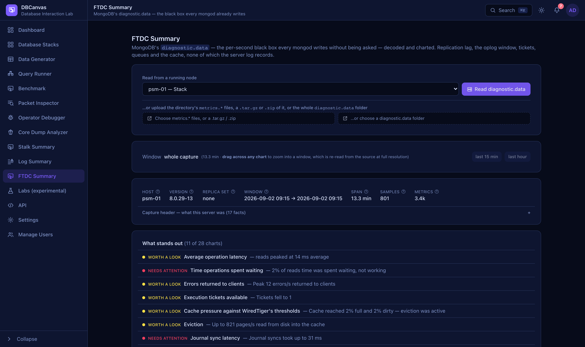

| To do this | API | CLI |
| --- | --- | --- |
| Which MongoDB nodes can be read | `GET /api/ftdc/targets` | `dbcanvas ftdc targets` |
| Read a running node's `diagnostic.data` | `POST …/nodes/{nid}/ftdc` | `dbcanvas ftdc node <stack> <node>` |
| Compare two windows | `POST /api/ftdc/compare` | `dbcanvas api POST /api/ftdc/compare --data '{…}'` |
| Upload `diagnostic.data` from elsewhere | `POST /api/ftdc/upload` *(multipart)* | `curl -F files=@metrics.2026-09-02 …` |

## Stalk Summary

Turn a `pt-stalk` capture into charts, verdicts and configuration advice.


| To do this | API | CLI |
| --- | --- | --- |
| Capture and analyse in one request | `POST …/nodes/{nid}/stalksummary` | `dbcanvas api POST …/stalksummary` |
| Analyse an archive already kept here | `POST /api/stalksummary/archive/{aid}` | `dbcanvas stalk analyse <aid>` |
| Put two captures head to head | `POST /api/stalksummary/compare` | `dbcanvas api POST /api/stalksummary/compare --data '{…}'` |
| Upload an archive | `POST /api/stalksummary/upload` *(multipart)* | `curl -F file=@stalk.tar.gz …` |

## Diagnostic captures

`pg_gather` for PostgreSQL and `pt-stalk` for the MySQL family, run on the node
itself.

| To do this | API | CLI |
| --- | --- | --- |
| Start pt-stalk | `POST …/nodes/{nid}/ptstalk` | `dbcanvas stalk start <stack> <node>` |
| Is it running, and what has it collected | `GET …/nodes/{nid}/ptstalk` | `dbcanvas stalk status <stack> <node>` |
| Download the current capture | `GET …/nodes/{nid}/ptstalk/download` | `dbcanvas stalk download <stack> <node>` |
| Kept archives from this node | `GET …/nodes/{nid}/ptstalk/archives` | `dbcanvas api GET …/ptstalk/archives` |
| Every kept archive | `GET /api/ptstalk/archives` | `dbcanvas stalk archives` |
| Download a kept archive | `GET /api/ptstalk/archives/{aid}/download` | `dbcanvas api GET …/download --out stalk.tar.gz` |
| Annotate one | `POST /api/ptstalk/archives/{aid}/note` | `dbcanvas api POST …/note --data '{"note":"…"}'` |
| Delete one | `DELETE /api/ptstalk/archives/{aid}` | `dbcanvas api DELETE /api/ptstalk/archives/3` |
| Start pg_gather | `POST …/nodes/{nid}/pggather` | `dbcanvas api POST …/pggather` |
| pg_gather status · report | `GET …/pggather` · `…/pggather/download` | `dbcanvas api GET …/pggather` |

Kept archives are deliberately **not** tied to the deployment they came from: a node
can be recreated, and comparing across the change that recreated it is the point.

## Operator Debugger

Step through a Kubernetes operator under Delve — breakpoints, call stack, variables,
no IDE.


| To do this | API | CLI |
| --- | --- | --- |
| Which frames run their operator under Delve | `GET /api/k3d/debug/targets` | `dbcanvas api GET /api/k3d/debug/targets` |
| The operator's source tree | `GET …/frames/{fid}/k3d/debug/sources` | `dbcanvas api GET …/debug/sources` |
| One source file | `GET …/frames/{fid}/k3d/debug/source` | `dbcanvas api GET …/debug/source?path=…` |
| The live debug session | `GET …/k3d/debug/ws` *(WebSocket)* | *(UI only — this one is genuinely interactive)* |
| Force a reconcile so a breakpoint is reached | `POST …/k3d/debug/reconcile` | `dbcanvas api POST …/debug/reconcile` |

## Core Dump Analyzer

Read a crashed server's `mysqld` core dump — and get a diagnosis, not just a
backtrace.

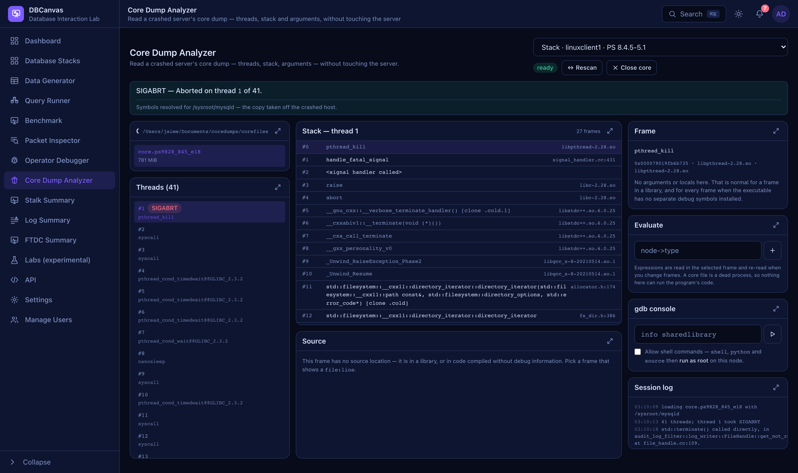

| To do this | API | CLI |
| --- | --- | --- |
| Which Linux Clients are core-dump hosts | `GET /api/gdb/targets` | `dbcanvas api GET /api/gdb/targets` |
| What is in the mounted core directory | `GET …/nodes/{nid}/gdb/cores` | `dbcanvas api GET …/gdb/cores` |
| The live gdb session | `GET …/nodes/{nid}/gdb/ws` *(WebSocket)* | *(UI only)* |

`…/gdb/cores` also reports whether the symbols and libraries actually match the core,
which is the first thing to check and the easiest to get wrong.

---

# Managing a node

## Node file manager

Arbitrary read/write inside a node's filesystem, scoped — like the web terminal — to
a stack you own.


> *Dragging a file from your desktop onto a node card is `POST
> …/nodes/{nid}/upload`, a streamed multipart request. `dbcanvas node cp` is the same
> endpoint from a shell. Nothing is buffered whole, at either end — an 800 MB core
> file goes from disk to socket.*


| To do this | API | CLI |
| --- | --- | --- |
| Which nodes can be browsed | `GET /api/stacks/{id}/fs/nodes` | `dbcanvas api GET /api/stacks/1/fs/nodes` |
| List a directory | `GET …/nodes/{nid}/fs/list` | `dbcanvas api GET …/fs/list?path=/etc` |
| Read a text file | `GET …/nodes/{nid}/fs/read` | `dbcanvas api GET …/fs/read?path=/etc/my.cnf` |
| Write one back | `POST …/nodes/{nid}/fs/write` | `dbcanvas api POST …/fs/write --data '{…}'` |
| Download a file, or a directory as `.tar.gz` | `GET …/nodes/{nid}/fs/download` | `dbcanvas node cp <stack>:<node>:/path ./` |
| Upload into a directory | `POST …/nodes/{nid}/fs/upload` *(multipart)* | `dbcanvas node cp ./file <stack>:<node>:/dir/` |
| mkdir · delete · rename | `POST …/fs/mkdir` · `/delete` · `/rename` | `dbcanvas api POST …/fs/mkdir --data '{"path":"/opt/x"}'` |
| chmod · chown | `POST …/fs/chmod` · `/chown` | `dbcanvas api POST …/fs/chmod --data '{…}'` |
| Users and groups inside the node | `GET …/nodes/{nid}/fs/identities` | `dbcanvas api GET …/fs/identities` |
| **Copy node → node without a round trip** | `POST …/nodes/{nid}/fs/transfer` | `dbcanvas node cp <stack>:a:/f <stack>:b:/f` |

`fs/transfer` is the fastest way to put one file on every member of a cluster: the
bytes never leave the host.

## Certificates

The Intranet node is a certificate authority. Every node in the stack trusts it, and
so does the VNC desktop's browser — so nothing has to be told to skip verification.

| To do this | API | CLI |
| --- | --- | --- |
| The CA's own certificate | `GET …/nodes/{nid}/cert` | `dbcanvas api GET …/cert` |
| Reissue the Intranet node's certificate | `POST …/nodes/{nid}/cert` | `dbcanvas api POST …/cert` |
| List issued client certificates | `GET …/nodes/{nid}/dbcerts` | `dbcanvas api GET …/dbcerts` |
| Issue one for a database user | `POST …/nodes/{nid}/dbcerts` | `dbcanvas api POST …/dbcerts --data '{"user":"appuser"}'` |
| Fetch one, with its key and the chain | `GET …/nodes/{nid}/dbcerts/{user}` | `dbcanvas api GET …/dbcerts/appuser` |
| Delete one | `POST …/nodes/{nid}/dbcerts/delete` | `dbcanvas api POST …/dbcerts/delete` |
| Reissue a node's server certificate | `POST …/{pxc,pg,mongo,pmm}/cert` | `dbcanvas api POST …/pxc/cert` |
| Read one | `GET …/{pxc,pg,mongo,pmm}/cert` | `dbcanvas api GET …/pg/cert` |

## Intranet mail

| To do this | API | CLI |
| --- | --- | --- |
| List mailboxes | `GET …/nodes/{nid}/email/users` | `dbcanvas api GET …/email/users` |
| Create one | `POST …/nodes/{nid}/email/users` | `dbcanvas api POST …/email/users --data '{…}'` |
| Set a password | `POST …/email/users/password` | `dbcanvas api POST …/email/users/password --data '{…}'` |
| Delete one | `POST …/email/users/delete` | `dbcanvas api POST …/email/users/delete --data '{…}'` |

## Intranet LDAP

The directory database LDAP authentication binds against.

| To do this | API | CLI |
| --- | --- | --- |
| List users | `GET …/nodes/{nid}/ldap/users` | `dbcanvas api GET …/ldap/users` |
| Create · update · set password · delete | `POST …/ldap/users` · `/update` · `/password` · `/delete` | `dbcanvas api POST …/ldap/users --data '{…}'` |
| List groups, with members | `GET …/nodes/{nid}/ldap/groups` | `dbcanvas api GET …/ldap/groups` |
| Create · set members · delete | `POST …/ldap/groups` · `/members` · `/delete` | `dbcanvas api POST …/ldap/groups/members --data '{…}'` |

## Samba AD DC

| To do this | API | CLI |
| --- | --- | --- |
| Users: list · create · update · password · delete | `GET/POST …/samba/users[/…]` | `dbcanvas api …` |
| Groups: list · create · members · delete | `GET/POST …/samba/groups[/…]` | `dbcanvas api …` |
| The `krb5.conf` a client needs | `GET …/samba/krb5` | `dbcanvas api GET …/samba/krb5` |
| Nodes a service principal can be minted for | `GET …/samba/targets` | `dbcanvas api GET …/samba/targets` |
| List · register a Kerberos principal | `GET/POST …/samba/principals` | `dbcanvas api POST …/samba/principals --data '{…}'` |
| Export a keytab | `GET …/samba/keytab` | `dbcanvas api GET …/samba/keytab` |
| Issue the LDAPS certificate | `POST …/samba/cert` | `dbcanvas api POST …/samba/cert` |

## SeaweedFS


| To do this | API | CLI |
| --- | --- | --- |
| Browse a bucket's objects (read-only) | `GET …/nodes/{nid}/seaweed/objects` | `dbcanvas api GET …/seaweed/objects` |

Usually to confirm a backup actually landed.

## OpenBao

| To do this | API | CLI |
| --- | --- | --- |
| Initialised? Sealed? Key thresholds? | `GET …/nodes/{nid}/openbao/status` | `dbcanvas api GET …/openbao/status` |
| Unseal with the stored keys | `POST …/nodes/{nid}/openbao/unseal` | `dbcanvas api POST …/openbao/unseal` |

---

# Watching

## Dashboard


| To do this | API | CLI |
| --- | --- | --- |
| Counters: stacks, nodes, engines, jobs, recent activity | `GET /api/dashboard/summary` | `dbcanvas dashboard` |
| A live CPU/memory/network/disk sample per node | `GET /api/dashboard/stats` | `dbcanvas dashboard --live` |

`stats` samples Docker on demand and caches for two seconds, so it costs nothing when
nobody is asking. Polling it from a script is fine; polling it every 100 ms is not.

## Notifications

| To do this | API | CLI |
| --- | --- | --- |
| List, with the unread count | `GET /api/notifications` | `dbcanvas notifications` |
| **Live stream** | `GET /api/notifications/stream` *(SSE)* | `curl -N -H "Authorization: Bearer $T" …/stream` |
| Mark all read | `POST /api/notifications/read-all` | `dbcanvas notifications --read-all` |
| Mark one read | `POST /api/notifications/{id}/read` | `dbcanvas api POST /api/notifications/7/read` |

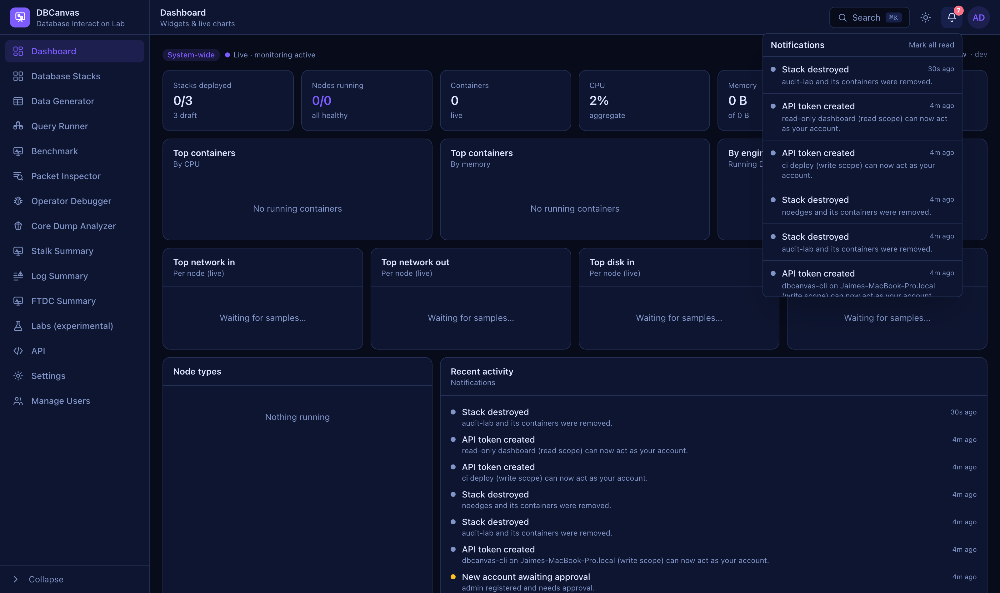

> *These are `GET /api/notifications` items. Each arrived over the SSE stream while
> the page was open — a deploy finishing, a token being created, a stack expiring.*

The stream is `text/event-stream` and stays open; each event's `data` is one
notification as JSON. It is how a long-running script learns that a deploy finished
without polling.

## Labs


| To do this | API | CLI |
| --- | --- | --- |
| The scenarios this installation ships | `GET /api/labs` | `dbcanvas api GET /api/labs` |
| Your attempts and every graded step | `GET /api/labs/runs` | `dbcanvas api GET /api/labs/runs` |
| Start one — deploys its disposable stack | `POST /api/labs/{id}/start` | `dbcanvas api POST /api/labs/pxc-split-brain/start` |
| Grade one step against the real cluster | `POST /api/labs/{id}/steps/{stepId}/check` | `dbcanvas api POST …/steps/1/check` |
| Finish a run | `POST /api/labs/{id}/finish` | `dbcanvas api POST …/finish` |

Grading is a `read`-scope operation: it inspects the cluster and changes nothing.

## API metadata

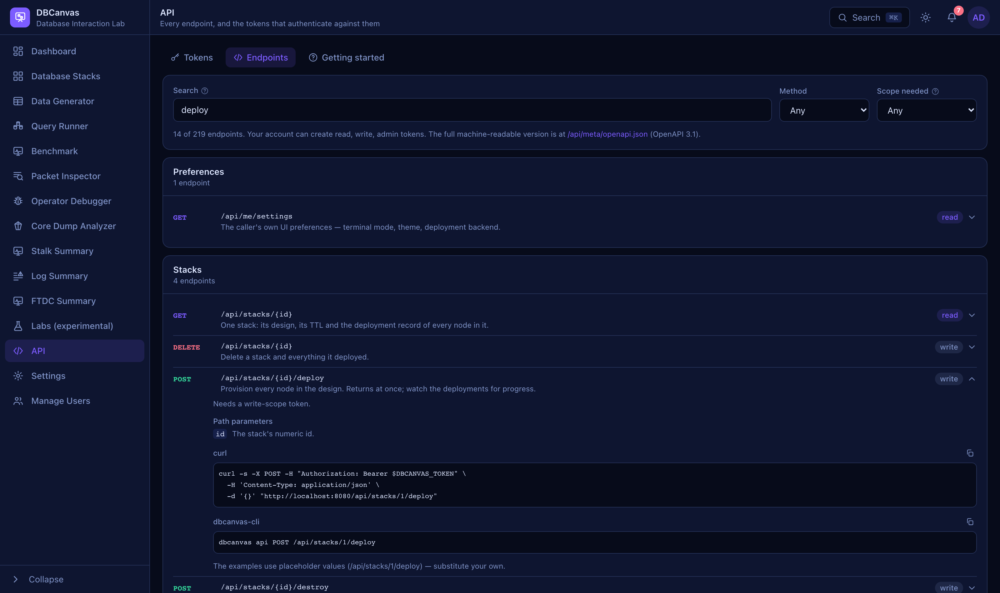

> *This is `GET /api/meta/endpoints` rendered. The expanded row shows what the
> catalogue carries per endpoint — the scope, the path parameters, and the `curl` and
> CLI lines derived from the route record. The count in the corner is the whole
> surface.*

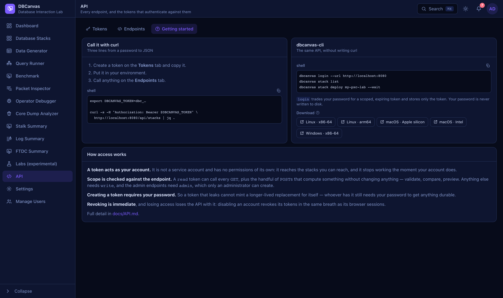

> *The shortest path from a password to a JSON response, the CLI download links served
> by `GET /api/cli/download`, and the four access rules in full.*

| To do this | API | CLI |
| --- | --- | --- |
| The endpoint catalogue | `GET /api/meta/endpoints` | `dbcanvas endpoints [--group G] [-q term] [--long]` |
| OpenAPI 3.1 document | `GET /api/meta/openapi.json` | `dbcanvas api GET /api/meta/openapi.json` |
| Download the CLI for a platform | `GET /api/cli/download?os=&arch=` | *(this is how you get the CLI)* |

---

## Two things the UI does that no endpoint does

Worth stating plainly, so nobody hunts for them:

**Arranging the canvas.** There is no "add a PXC node" endpoint. A stack's topology is
one `design` document, and you change it by `PUT`ting a new one. The practical way to
build a design from a script is to start from a template
(`GET /api/templates/{id}` → `.design`) or export a stack you built by hand
(`dbcanvas stack export`), edit the JSON, and `PUT` it back.

**The interactive debuggers.** The Operator Debugger and Core Dump Analyzer expose
their session as a WebSocket carrying a protocol built for a UI. The CLI can open a
console (`dbcanvas node console`), and deliberately does not try to reimplement a
breakpoint UI in a terminal.

---

See also: [HTTP API](API.md) · [`dbcanvas-cli`](CLI.md) · [Feature guides](README.md)
