# API reference

Every feature of DBCanvas with its HTTP endpoints. For authentication, tokens, scopes
and status codes, read [HTTP API](API.md); for the command line, read
[The `dbcanvas` command](CLI.md).

The always-current list is the **API** page in the app, or the catalogue it is drawn
from:

```sh
curl -s -H "Authorization: Bearer $DBCANVAS_TOKEN" http://127.0.0.1:8080/api/meta/endpoints
```

**Conventions on this page**

- `…/nodes/{nid}` is short for `/api/stacks/{id}/nodes/{nid}`, and `…/frames/{fid}`
  for `/api/stacks/{id}/frames/{fid}`. A *frame* is a cluster on the canvas.
- Where a `dbcanvas` command does the same thing, it is named in brackets after the
  description.
- The `curl` examples assume:

  ```sh
  API=http://127.0.0.1:8080/api
  AUTH="Authorization: Bearer $DBCANVAS_TOKEN"
  ```

  A request with a JSON body also sends `-H 'Content-Type: application/json'`.

## Contents

**Getting in** · [Signing in](#signing-in) · [Your preferences](#your-preferences) · [API tokens](#api-tokens) · [Instance settings](#instance-settings)

**Building** · [Stacks](#stacks) · [Templates](#templates) · [Nodes](#nodes) · [Clusters & backups](#clusters--backups) · [Version catalogues](#version-catalogues) · [Kubernetes frames](#kubernetes-frames) · [All in One](#all-in-one) · [Repository, Ceph and Linux Client nodes](#repository-ceph-and-linux-client-nodes)

**Running load** · [Data Generator](#data-generator) · [Query Runner](#query-runner) · [Database Explorer](#database-explorer) · [Benchmark](#benchmark) · [Stock Market Sim](#stock-market-sim) · [Sample Client Code](#sample-client-code) · [Ledger Sim](#ledger-sim) · [Performance Sim](#performance-sim) · [Pager Panic](#pager-panic)

**Finding out what happened** · [Activity](#activity) · [Packet Inspector](#packet-inspector) · [Log Summary](#log-summary) · [FTDC Summary](#ftdc-summary) · [Stalk Summary](#stalk-summary) · [Operator Summary](#operator-summary) · [Diagnostic captures](#diagnostic-captures) · [Operator Debugger](#operator-debugger) · [Core Dump Analyzer](#core-dump-analyzer)

**Managing a node** · [Node file manager](#node-file-manager) · [Certificates](#certificates) · [Intranet mail](#intranet-mail) · [Intranet LDAP](#intranet-ldap) · [Intranet DNS](#intranet-dns) · [Samba AD DC](#samba-ad-dc) · [SeaweedFS](#seaweedfs) · [OpenBao](#openbao)

**Watching** · [Dashboard](#dashboard) · [Notifications](#notifications) · [Kanban](#kanban) · [Shared sessions](#shared-sessions) · [API metadata](#api-metadata)

---

# Getting in

## Signing in

The browser signs in through a one-time start link: `dbcanvas` or `dbcanvas open`
opens one, and `dbcanvas open --print` prints it. A script sends an API token
instead (see [HTTP API](API.md#authenticate)).

| To do this | API |
| --- | --- |
| Open the app signed in, from a start link that works once, for a minute | `GET /start/{token}` |
| Who the caller is signed in as | `GET /api/setup/status` |
| The signed-in account: id, username and role | `GET /api/me` |
| Sign the browser out | `POST /api/auth/logout` |

These answer on the control socket only, which the `dbcanvas` command uses; the
browser port refuses them:

| To do this | API |
| --- | --- |
| Issue a start link (`dbcanvas open`) | `POST /api/solo/start-link` |
| Whether the service runs, its address, version and architecture (`dbcanvas status`) | `GET /api/solo/status` |
| Stop the service (`dbcanvas stop`) | `POST /api/solo/stop` |
| The node account passwords (`dbcanvas passwords`) | `GET /api/solo/passwords` |

## Your preferences

**UI:** **Profile** (name, avatar, tokens) and **Settings** (preferences).

| To do this | API |
| --- | --- |
| Change your name, email and avatar | `PUT /api/me/profile` `{"firstName", "lastName", "email", "avatar"}` |
| The avatars to choose from | `GET /api/avatars` |
| Read your preferences | `GET /api/me/settings` |
| Change them | `PUT /api/me/settings` |
| Your kept Scratchboard boards | `GET /api/me/scratchboards` · `PUT`/`DELETE /api/me/scratchboards/{bid}` |
| Release notes, and whether you have read them | `GET /api/whatsnew` · `POST /api/whatsnew/seen` |
| Node images beyond the OS bases, and which are present | `GET /api/images` |
| Build one of them (admin scope) | `POST /api/images/{id}/build` |

```sh
curl -s -X PUT -H "$AUTH" -H 'Content-Type: application/json' \
  -d '{"theme":"forest","look":"industrial","maxTabs":20}' $API/me/settings
```

Preference fields (`PUT` changes only the fields you send; an unknown value falls back
to the default):

| Field | Values |
| --- | --- |
| `theme` | `glass-light` (default), `glass-dark`, `light`, `dark`, `midnight`, `solarized`, `synthwave`, `forest` |
| `look` | `glass` (default), `modern`, `industrial`, `editorial`, `soft` |
| `maxTabs` | 2–40 (default 20) |
| `terminalMode` | `docked`, `undocked` |
| `terminalsOnTop` | `on` unless exactly `off` |
| `tooltips` | `on` unless exactly `off` |
| `deploymentBackend` | `docker` |
| `nodeLibrary` | `menu`, `docked` |
| `scratchboard` | `off`, `on` (keep chosen boards on the server) |

## API tokens

**UI:** **API → Tokens**. See [HTTP API](API.md#create-a-token) for scopes, expiry and
limits.

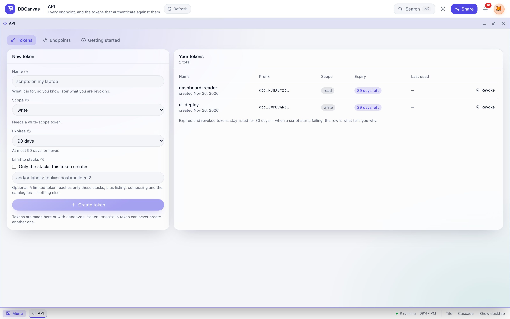

| To do this | API |
| --- | --- |
| List your tokens: active, expired and revoked (`dbcanvas token ls`) | `GET /api/tokens` |
| Create one; refuses a token (`dbcanvas token create NAME`) | `POST /api/tokens` `{"name", "scope", "days", "limit"}` |
| Revoke one (`dbcanvas token rm ID`) | `DELETE /api/tokens/{id}` |

The secret is returned once, by the create call. `days: 0` means never expires.
`limit` takes `ownStacks`, `labels`, `maxTtl` and `deny`.

## Instance settings

**UI:** **Settings**.

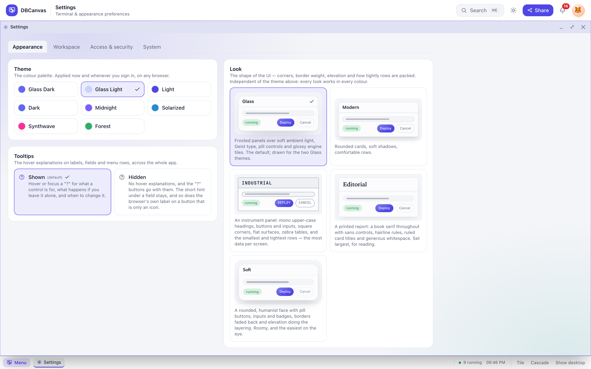

| To do this | API |
| --- | --- |
| Read the instance settings | `GET /api/system/settings` |
| Change them (admin scope) | `PUT /api/system/settings` |
| Check Docker, images, catalogues, passwords, the encryption key and the bundled files (admin scope; `dbcanvas doctor` adds the data folder, networks and the service) | `GET /api/system/doctor` |

```sh
curl -s -X PUT -H "$AUTH" -H 'Content-Type: application/json' \
  -d '{"maxTokenDays":30}' $API/system/settings
```

A `PUT` keeps any field it leaves out, and out-of-range values are clamped, not
refused.

| Field | Settings row | Default |
| --- | --- | --- |
| `maxUploadBytes` | Node file uploads | 4 GiB (1 MiB–1 TiB) |
| `maxTokenDays` | API token lifetime | 90 (1–365) |
| `internalWrites` | Writes to internal databases (PMM's own databases in the Database Explorer) | off |
| `allowGuestSessions`, `maxGuestMinutes`, `sessionRetentionDays`, `recordingRetentionDays` | Shared sessions | off, 120 (5–120), 90 (`0` keeps them while the stack exists), 30 (1–3650) |
| `liveWatchSeconds` | Stack history and alerts: sampling interval | 30 (15–600; `0` off) |

Read-only fields come from `~/.dbcanvas/config.yaml`: `publicUrl` (its `publicUrl:`
key), and `sshForwarding`, `experimental` and `eol` (`SSH_FORWARDING_HOST`,
`EXPERIMENTAL` and `EOL` under `env:`). `hostArch`, `defaultArch` and
`kubernetesArch` are the Docker host's architecture, what a node on Automatic runs as,
and what K3D and Kubeadm nodes run as.

---

# Building

## Stacks

A stack is a design on the canvas plus the containers it deployed.

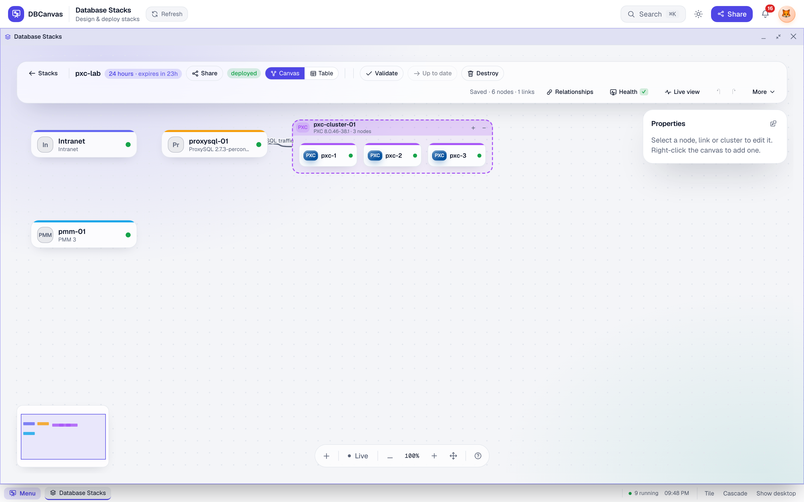

| To do this | API |
| --- | --- |
| List your stacks (`dbcanvas ls`) | `GET /api/stacks[?detail=1][&label=k=v]` |
| **Build one from a short description** | `POST /api/stacks/compose` |
| What compose can build | `GET /api/stacks/compose/kinds` |
| Create one from a template or a design | `POST /api/stacks` `{"name", "ttl", "templateId" or "design"}` |
| Export it as a stack file, YAML (`dbcanvas export STACK`) | `GET /api/stacks/{id}/stackfile` |
| Apply a stack file: create the stack or update its design (`dbcanvas up -f FILE`, which then deploys) | `POST /api/stacks/apply` `{"file", "dryRun"}` |
| Read one, with every node's state | `GET /api/stacks/{id}` |
| Replace its name, TTL or design | `PUT /api/stacks/{id}` |
| Replace its labels | `PUT /api/stacks/{id}/labels` `{"labels": {"tool": "ci"}}` |
| Read the design alone | `GET /api/stacks/{id}/design` |
| **What a design can hold** | `GET /api/stacks/design/catalog[?type=pxc]` |
| Add · change · remove a node | `POST /api/stacks/{id}/design/nodes` · `PUT`/`DELETE …/design/nodes/{nid}` |
| Add · change · remove a cluster | `POST /api/stacks/{id}/design/frames` · `PUT`/`DELETE …/design/frames/{fid}` |
| Draw · remove a line | `POST /api/stacks/{id}/design/edges` · `DELETE …/design/edges/{eid}` |
| Check the design without building | `POST /api/stacks/{id}/validate` |
| What a deploy would do now | `GET /api/stacks/{id}/deploy/preview` |
| Deploy | `POST /api/stacks/{id}/deploy` |
| Live CPU, memory, I/O and replication role per node | `GET /api/stacks/{id}/live` |
| Extend its lifetime | `POST /api/stacks/{id}/extend` `{"by": "4h"}` |
| Remove the containers, keep the design (`dbcanvas down STACK`) | `POST /api/stacks/{id}/destroy` |
| Delete both (`dbcanvas rm STACK`) | `DELETE /api/stacks/{id}` |
| Follow your stacks' lifecycle | `GET /api/stacks/events` *(SSE)* |

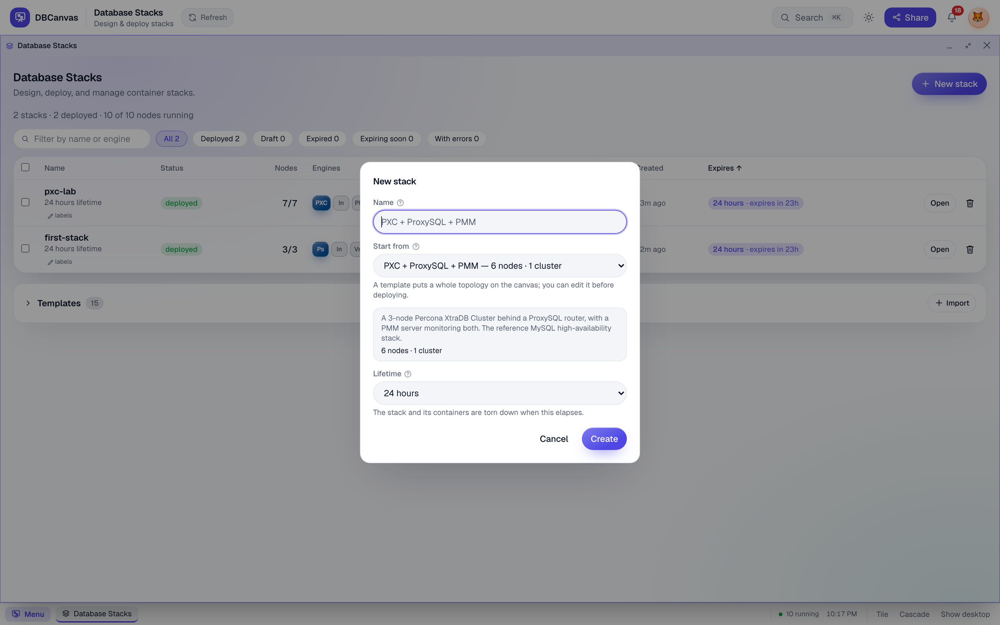

**Deploy returns at once.** Progress is each node's `state` in `GET /api/stacks/{id}`:
`pending` → `provisioning` → `running`, or `error` (`stopped` when stopped on
purpose). `dbcanvas up --wait` polls for you.

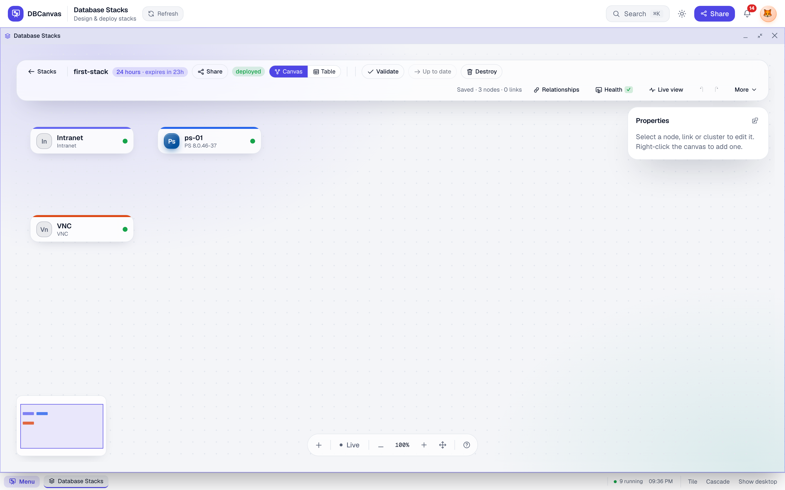

```sh
curl -s -H "$AUTH" $API/stacks/12/stackfile > pxc-lab.yaml
curl -s -H "$AUTH" -H 'Content-Type: application/json' \
  -d "$(jq -n --rawfile f pxc-lab.yaml '{file: $f, dryRun: true}')" $API/stacks/apply
```

**Give every scripted stack a TTL**: `2h`, `4h`, `8h`, `24h`, `2w` or `infinity`. When
the TTL runs out, the stack's containers are removed and the stack is marked
`expired`.

### The design catalogue, and editing a design one piece at a time

`GET /api/stacks/design/catalog` describes everything the designer's panels offer:

| Key | Contents |
| --- | --- |
| `nodes`, `frames` | one entry per node type and cluster type: its `placement` (`standalone`, `member` of listed `frameTypes`, or `frame`), whether it is a `singleton`, what it `requires`, and its `options` (field, JSON `type`, accepted `values`, `default`, `description`, and `when` it applies). Clusters add `memberType`, `defaultMembers`, `minMembers`, `maxMembers`. |
| `relations` | references a node holds to another node — `monitor` (PMM), `backup` (SeaweedFS), `vault` (OpenBao), `oidc` (Keycloak), `ldap`, `kerberos`, `orchestrator`, `repository`, `storage` (Ceph), `app` (All in One) — with the field each is stored in |
| `edges` (per entry) | the lines a type draws and what may be at the other end: a proxy's backend, a simulator's database, replication between clusters (`async` or `bidir`) |
| `actions` (per entry) | endpoints that apply once deployed, with request body and when each applies; `commonActions` apply to every node |

`?type=pxc` narrows it to the `pxc` entries.

The design endpoints change one thing at a time and check it against the catalogue.
An unknown field, a wrong type or value, a relation to the wrong node type, a label
already in use, or a cluster outside its member range is refused with a message
naming what is accepted. Each call returns what it changed plus the validator's
`issues` for the whole design (`"ok": false` on an error); issues do not block the
edit.

```json
POST /api/stacks/12/design/frames
{
  "type": "pxc", "label": "pxc-a", "members": 3,
  "options": {"pxcMajor": "8.4", "generateCert": true},
  "relations": {"monitor": "pmm-mvqf0a1b-1"}
}

POST /api/stacks/12/design/nodes
{"type": "proxysql", "options": {"mode": "singlewrite"}}

POST /api/stacks/12/design/edges
{"from": "frame-mvqf0c2d-1", "to": "proxysql-mvqf0e3f-1", "type": "directional"}

PUT /api/stacks/12/design/nodes/proxysql-mvqf0e3f-1
{"label": "proxy-1", "options": {"cpus": 2}, "relations": {"monitor": null}}
```

- A new node or cluster gets the designer's defaults and is placed to the right of
  the canvas unless `x`/`y` are given. A sharded `psmdb` cluster takes its shape from
  `options.psmdbSetup` (`standard` or `minimum`), not `members`.
- Add a member to a cluster with `POST …/design/nodes` and `frameId`; remove one with
  `DELETE …/design/nodes/{nid}`, down to the cluster's minimum.
- `PUT` changes only what the body names. An option set to `null` is removed; a
  relation set to `null` or `""` is cleared. On a cluster, `memberOptions` applies to
  every member.
- The body takes `type`, `label`, `x`, `y`, `frameId`, `members`, `memberOptions`,
  `options` and `relations`, and nothing else. A setting written at the top level
  (`{"cpus": 2}` instead of `{"options": {"cpus": 2}}`) is refused by name, with a 400.
- Removing a node or cluster also removes its lines and every relation pointing at it,
  and a deployed node's container.
- Nodes cannot be added or removed while a deploy is running; options can change.

### Composing a stack

`POST /api/stacks/compose` builds a whole stack from a short description: kinds,
counts, versions, OS and relationships. It fills in package builds, cluster ids and
node references for you.

```json
POST /api/stacks/compose
{
  "name": "lab-1", "ttl": "8h",
  "nodes": [
    {"kind": "pxc", "count": 3, "version": "8.4.5", "os": "el8", "monitor": true},
    {"kind": "ps",  "version": "8.0.45", "os": "el9", "ldap": true, "monitor": true},
    {"kind": "pmm", "version": "3"}
  ]
}
```

| You write | It becomes |
| --- | --- |
| `"os": "el8"` | Oracle Linux 8 |
| `"version": "8.4.5"` | series `8.4`, the matching package build for that OS |
| `"version": "8.4"` | the latest build in that series |
| `"version": ""` | the newest series, latest build |
| `"kind": "pxc", "count": 3` | a cluster with 3 members |
| `"monitor": true` | monitoring by the PMM node in the spec |
| *(no Intranet node)* | an Intranet node is added (every stack needs one); reported in `added` |

**Relationships.** Each is a boolean that points the node at another node in the
spec. When the spec has more than one candidate, name it with the matching `…With`
option (`monitorWith`, `ldapWith`, …).

| Option | Wires | Provided by | Available on |
| --- | --- | --- | --- |
| `monitor` | PMM monitoring | `pmm` | every engine, cluster and ProxySQL |
| `ldap` | directory authentication | `intranet`, `sambaad` | `ps`, `pg`, `pg-pgdg`, `psm`, `valkey`, `pxc`, `ps-repl`, `valkey-cluster` |
| `oidc` | Keycloak single sign-on | `keycloak` | `ps`, `pg`, `psm`, `pmm`, `pxc`, `ps-repl` |
| `kerberos` | GSSAPI single sign-on | `sambaad` | `pg`, `pg-pgdg`, `psm` |
| `vault` | data-at-rest keys in OpenBao | `openbao` | `ps`, `pg` (pg_tde: PostgreSQL 17/18), `psm`, `pxc`, `ps-repl`, `patroni` |
| `backup` | backups to S3 | `seaweedfs` | `ps`, `pg`, `pg-pgdg`, `pxc`, `ps-repl`, `patroni`, `patroni-pgdg`, `repmgr`, `pg-stream`, `pg-stream-pgdg`, `psmrs`, `mdb-rs`, `psmdb`, `mdb-sharded` |
| `orchestrator` | topology discovery and failover | `orchestrator` | `ps-repl`, `mariadb-repl`, `mysql-repl` |

```json
{
  "name": "sso-lab",
  "nodes": [
    {"kind": "keycloak"},
    {"kind": "ps", "version": "8.4.11", "os": "el9", "oidc": true, "monitor": true},
    {"kind": "pmm", "oidc": true},
    {"kind": "openbao"},
    {"kind": "psm", "os": "el9", "vault": true, "ldap": true}
  ]
}
```

**Lines (`to`).** Proxies and simulators find their database through a line on the
canvas. `"to"` names the target; omit it and compose uses the only valid one, or
refuses and lists the candidates.

| Kind | Connects to |
| --- | --- |
| `proxysql`, `proxysql-cluster` | `pxc`, `ps-repl`, `mysql-repl` |
| `haproxy` | one of `patroni`, `patroni-pgdg`, `repmgr`, `pg-stream`, `pg-stream-pgdg`, `spock`, `pxc`, `ps-repl`, `mysql-repl` |
| `pgbouncer` | one of `pg`, `pg-pgdg`, `patroni`, `patroni-pgdg`, `repmgr`, `pg-stream`, `pg-stream-pgdg`, `spock` |
| `supportsim` | `psm`, `mdb`, `psmrs`, `mdb-rs`, `psmdb`, `mdb-sharded`, `k3d` |
| `pgvectorsim` | `pg`, `pg-pgdg`, `patroni`, `patroni-pgdg`, `repmgr`, `pg-stream`, `pg-stream-pgdg`, `spock`, `haproxy`, `pgbouncer`, `k3d` |

`mclusteradmin` takes no line. MClusterAdmin gets a ready-made
connection string when the spec has exactly one MongoDB.

```json
{"kind": "haproxy", "os": "el9"}
{"kind": "pgvectorsim", "to": "haproxy-01"}
```

**Shaping the machine.** Per-node options; a kind that would ignore one refuses it.

| Field | Effect |
| --- | --- |
| `netLatencyMs`, `netJitterMs`, `netLossPct`, `netRateMbit` | delay, jitter, loss and a rate cap on the node's database and cluster ports |
| `netAllTraffic` | apply those to all of the node's traffic |
| `deviceReadMbps`, `deviceWriteMbps` | disk throughput limits |
| `cpus`, `memoryGb` | container limits |

**Per-engine choices**: `replMode` (`async`, `semisync`, `innodbcluster`,
`groupreplication`), `mode` (ProxySQL `singlewrite`/`loadbal`; PgBouncer pool mode
`transaction` by default, `session` or `statement`), `mysqlRouter`, `setup` (sharded
PSMDB: `standard` or `minimum`; `count` is refused),
`buckets` and `tls` (SeaweedFS), `alertEmail` (Orchestrator), `certTtl` (`365d`,
`2h`, `30m`). `GET /api/stacks/compose/kinds` lists exactly which options each kind
takes.

```json
{
  "name": "pool-lab", "ttl": "4h",
  "nodes": [
    {"kind": "patroni", "count": 3, "os": "el9"},
    {"kind": "pgbouncer", "os": "el9", "mode": "transaction", "cert": true},
    {"kind": "pgvectorsim", "to": "pgbouncer-01"}
  ]
}
```

**What compose adds or refuses for you**

- `oidc` turns on the Keycloak node's certificate, and a Keycloak node brings the
  Ubuntu desktop it needs (its admin console is reachable only from inside the stack).
- `oidc` on Percona Server is refused below 8.4.11-11 (9.7.2-2 on the 9.7 series).
- OpenBao runs only on Oracle Linux 9 and the VNC desktop only on Ubuntu 24.04.
- Only one each of `intranet`, `keycloak`, `openbao` and `vnc` per stack.
- Not composable: Kubernetes frames, All in One, Stock Market Sim and Linux Client
  nodes. Add them with the design endpoints, or start from a template.

**Any other option** by its design-catalogue name: `"options"` sets fields on the node
(or a cluster's frame) and `"memberOptions"` on every member. They are checked like
the design endpoints and override the shorthand.

```json
{"kind": "patroni", "count": 3,
 "options": {"usePgBackRest": true, "pgAudit": true},
 "memberOptions": {"cpus": 2}}
```

**`"dryRun": true`** reports the resolved plan — versions, added nodes and the
validator's `issues` — without creating anything. Errors name what is available: the
builds in a series, the OS aliases, the member range, or the node to add.

Compose does not deploy; call `POST /api/stacks/{id}/deploy` afterwards.

## Templates

**UI:** **New stack → Start from**, and **Save as template** on the canvas.

| To do this | API |
| --- | --- |
| List templates (built-in and yours) | `GET /api/templates` |
| Save a canvas as one | `POST /api/templates` |
| Read one, with its design | `GET /api/templates/{id}` |
| Rename or re-describe it | `PUT /api/templates/{id}` |
| Delete one of yours | `DELETE /api/templates/{id}` |
| Download as `.json` | `GET /api/templates/{id}/export` |
| Import one | `POST /api/templates/import` |

Built-in templates have ids like `builtin:pxc-proxysql-pmm`; saved ones are numbers.
Saved templates are stripped of secrets, host paths and pinned host ports.

## Nodes

**UI:** click a node for its panel; right-click for its menu.

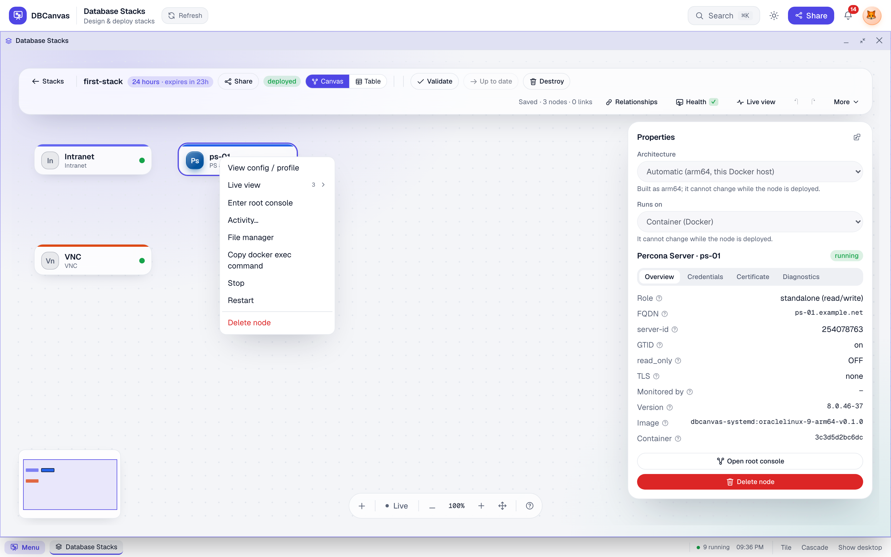

| To do this | API |
| --- | --- |
| A node's panel: type, address, published ports, credentials, certificate | `GET …/nodes/{nid}` |
| List a stack's nodes | `GET /api/stacks/{id}` |
| Start · stop · restart | `POST …/nodes/{nid}/start` · `/stop` · `/restart` |
| Open a root console | `GET …/nodes/{nid}/term` *(WebSocket)* |
| Run one command: stdout, stderr and its exit code | `POST …/nodes/{nid}/exec` `{"argv": [...], "stdin", "timeout", "user"}` |
| List the pods on a Kubernetes server node | `GET …/nodes/{nid}/k8s/pods` |
| Console inside a pod's container | `GET …/nodes/{nid}/term?namespace=&pod=&container=&shell=` *(WebSocket)* |
| The `ssh -L` tunnel line | `GET …/nodes/{nid}/sshforward` |
| Copy files onto a node (drag and drop) | `POST …/nodes/{nid}/upload` *(multipart)* |
| Download a MongoDB node's `diagnostic.data` and log | `GET …/nodes/{nid}/mongo/diagnostic` |
| Who is primary, and who could take over | `GET …/nodes/{nid}/switchover` |
| Make this member the primary | `POST …/nodes/{nid}/promote` |
| Open a node's web UI through the DBCanvas port | `POST /api/browse` `{"url"}` |
| Open a link in the stack's VNC desktop | `POST /api/browse/desktop` `{"url"}` |

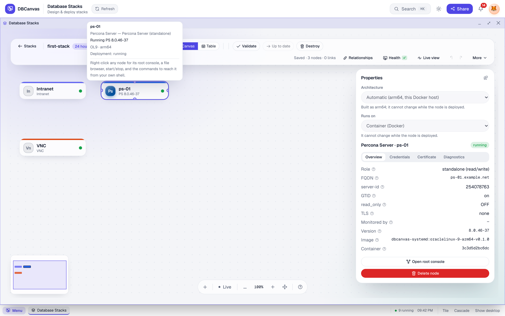
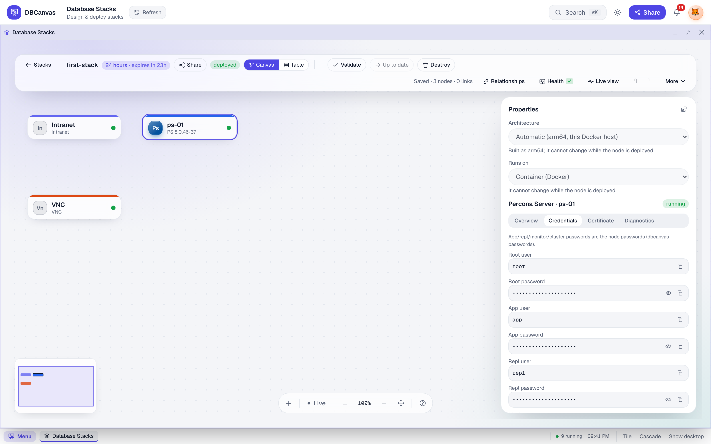

Passwords are generated per deployment and returned by `GET …/nodes/{nid}`, so a
script can connect without anyone pasting one.

```sh
curl -s -H "$AUTH" -H 'Content-Type: application/json' \
  -d '{"argv": ["mysql", "-e", "SHOW STATUS"]}' $API/stacks/12/nodes/$NODE_ID/exec
```

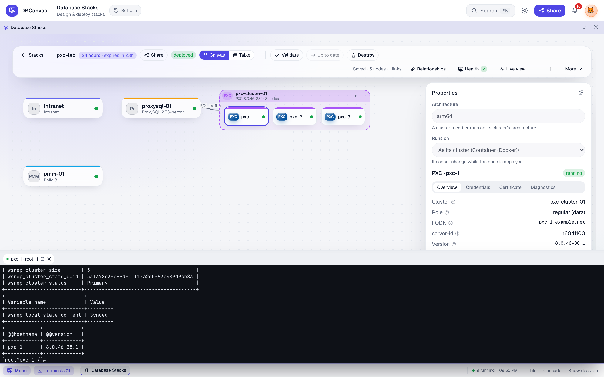

On the console WebSocket, binary frames are keystrokes and text frames are
`{"type":"resize"}` messages.

**Opening a node's web UI in a window.** `POST /api/browse {"url":
"http://localhost:32790/vnc.html"}` finds the node publishing that host port, checks
it is on one of your stacks, and returns a `/_p/<key>/…` address that DBCanvas proxies
to the node — so only DBCanvas's own port needs to be reachable. In a shared session,
a window the host or driver opens opens for everyone. A watching guest can view
proxied pages but not submit to them; a VNC desktop is shown to them view-only.

**Opening a link in the VNC desktop.** `POST /api/browse/desktop {"url": "…"}` opens
the link as a Firefox tab on the stack's running VNC desktop, using the node's
name on the stack network, and returns `{"desktopLink", "desktop", "opened"}`. `409`
when the stack has no running VNC desktop; a watching guest gets `403`.

> [!NOTE]
> A node gets a new host port each time it starts. Re-read the node after a restart.

### Switching the primary

**UI:** right-click a member of a replicated cluster → **Replication role**. A replica
offers **Promote to primary**; the primary offers **Demote — hand primary to** with each
replica's lag. Members that cannot take over are greyed, with the reason.

| Cluster | How the switch is made |
| --- | --- |
| Patroni | `patronictl switchover --candidate` |
| repmgr | `repmgr standby switchover --siblings-follow` |
| Streaming replication | `CHECKPOINT` and a clean shutdown of the primary, the candidate replays past the primary's shutdown checkpoint, `pg_promote()`; the old primary becomes a standby (`pg_rewind` if it cannot follow) and the others re-point `primary_conninfo` |
| MongoDB replica set (and each shard or config set) | other secondaries frozen, primary steps down, candidate elected |
| Group Replication / InnoDB Cluster | `group_replication_set_as_primary()` |
| MySQL and MariaDB replication (GTID or not) | writes frozen on the primary, every replica caught up, then the candidate made writable and the others re-pointed |

For MySQL and MariaDB, if a replica does not catch up within a minute, writes are
restored and nothing changes. A switch is refused while any replica is not
replicating. Semi-sync moves with the primary.

HAProxy, ProxySQL, PgBouncer and MySQL Router follow the new primary. The design is
updated, so a redeploy keeps the new roles. The response lists every step, and which
step failed if one did. PXC, Galera and Spock have no primary to move.

### Rebuilding a replica, rolling restarts, comparing configuration

**UI:** right-click a cluster member.

- **Rebuild from primary…** (**Rebuild (full state transfer)…** on PXC and Galera)
  discards the member's data, copies it afresh and puts it back into replication:

  | Cluster | How |
  | --- | --- |
  | MySQL / Percona Server 8.0.17+ replication | CLONE plugin |
  | MariaDB, older MySQL | a consistent `mariadb-dump` / `mysqldump` of the primary |
  | Group Replication / InnoDB Cluster | rejoin with clone recovery |
  | Patroni | `patronictl reinit` |
  | repmgr | `repmgr standby clone`, then `standby register` |
  | Streaming replication | `pg_basebackup` through the member's replication slot |
  | MongoDB replica set | full initial sync |
  | PXC, MariaDB Galera | full SST |

  `GET …/nodes/{nid}/rebuild` shows the plan (or why not) and the running or last
  rebuild; `POST` starts it.
- **Rolling restart of the cluster…** restarts members one at a time, replicas first,
  each caught up before the next, optionally handing over the primary first.
  `GET`/`POST …/nodes/{nid}/rolling-restart` `{"switchover": true}`.
- **Compare configuration…** shows the settings that differ across members:
  `GET …/nodes/{nid}/config-drift`.

The **Live details** tab of a database node shows its error log
(`GET …/nodes/{nid}/errorlog?lines=200`, up to 1000) and links to its PMM dashboards
when monitored.

### Database users, failure drills, backups

**UI:** right-click a cluster member.

- **Database users…** lists the cluster's accounts, which members have each, and
  whether passwords match. Create (read, read and write, or admin; one database or
  all), rotate or drop an account on the primary. `GET`/`POST …/nodes/{nid}/db-users`
  `{action, name, host, password, privilege, database}`.
- **Failure drill…** breaks the cluster for real and checks off what happened: *kill
  the primary* (Patroni, MongoDB, Group Replication, any Galera member) or *stop
  replication* on a MySQL/MariaDB replica. `GET`/`POST …/nodes/{nid}/drill`,
  `DELETE /api/stacks/{id}/drill`.

A cluster deployed with backups shows the age of its newest backup on its header (red
for none, amber past a day) and **Back up now**: `GET …/frames/{fid}/backup-status`.

### Before a redeploy

Deploy works per member:

- a cluster with no built members is built whole;
- a cluster whose members are all built (running, or stopped on purpose) is left alone;
- a cluster with built and new members builds **only the new members**, which join the
  running cluster.

| Cluster | How a new member joins |
| --- | --- |
| Percona Server / MySQL replication | CLONE from the primary (a consistent dump where CLONE is unavailable), then replicates read-only |
| MariaDB replication | a consistent `mariadb-dump` of the primary |
| PXC, MariaDB Galera | full state transfer |
| InnoDB Cluster / Group Replication | `addInstance` with clone recovery |
| Patroni | joins etcd; Patroni takes a base backup from the leader |
| repmgr | `repmgr standby clone` and `register` |
| Streaming replication | `pg_basebackup` from the primary; added to `synchronous_standby_names` when the cluster is synchronous |
| MongoDB replica set | added with `replSetReconfig`, initial sync |

Sharded MongoDB, Spock, Valkey cluster and Kubernetes frames cannot take a new member
yet; validation and deploy refuse it.

`GET /api/stacks/{id}/deploy/preview` lists what a deploy would do: nodes deleted
from the canvas (removed with their volumes), nodes to build, members to join, and
refused clusters with the reason. Settings changed on running nodes are not applied
by a deploy.

### Health, history and alerts

DBCanvas samples every deployed stack every 30 seconds by default (**Settings → Stack
history and alerts**). The canvas's **Health** button shows:

- **Alerts** open now: a database down, replication broken, a replica behind, a
  filesystem filling, connections running out, a transaction open too long, a long
  lock wait, a deadlock. Each opens after two bad samples (database down: one),
  closes after two good ones, and reaches the notification bell. A node stopped or
  restarted by DBCanvas raises nothing.
- **Timeline**: role changes, unplanned failovers, switchovers, rebuilds, restarts and
  lifetime changes.
- **Trends**: a day of CPU, memory, lag, QPS, TPS, connections, IOPS and filesystem
  use per node.
- **Rules**: the stack's thresholds.

| To do this | API |
| --- | --- |
| Samples, timeline and open alerts | `GET /api/stacks/{id}/history?minutes=60` (up to a day) |
| Open alerts and rules | `GET /api/stacks/{id}/alerts` |
| Change the rules | `PUT /api/stacks/{id}/alert-rules` |
| Open alerts across all your stacks | `GET /api/alerts/summary` |

Default rules: replica lag 30 s, filesystem 85 %, connections 90 %, transaction open
10 minutes (`trxSec`), lock wait 30 s (`lockWaitSec`); `0` switches a threshold off.

### A console inside a pod

On a **k3s server node**, the `…/term` WebSocket also takes `namespace`, `pod`,
`container` and `shell` (`auto`, `bash`, `sh`, `mysql`, `psql` or `mongosh`) and opens
the console inside that container. Nothing is configured on your machine and no port
is published. Invalid names get an HTTP error before the socket opens.

`GET …/nodes/{nid}/k8s/pods` lists every pod with its containers, their state
(`running`, `waiting`, `terminated`), which are init containers, and which database
clients each can start (`clients`). Read it fresh each time: the operator recreates
pods with new names.

```sh
curl -s -H "$AUTH" $API/stacks/12/nodes/$NODE_ID/k8s/pods | jq .
```

With `shell=mysql`, `psql` or `mongosh` the console opens that client already logged
in as an administrator. The password is read inside the container from what the
operator mounted, and never passes through DBCanvas:

| Client | Credential used | Offered on containers |
| --- | --- | --- |
| `mysql` | `/etc/mysql/mysql-users-secret/root`, else `$MYSQL_ROOT_PASSWORD` | `pxc`, `mysql`, `haproxy`, `pxc-monit`, `proxysql` |
| `psql` | peer authentication as `postgres` | `database`, `postgres` |
| `mongosh` | `/etc/users-secret/MONGODB_DATABASE_ADMIN_{USER,PASSWORD}` | `mongod`, `mongos` |

If the client, credential or server is missing, the console says what was missing and
opens a shell instead.

## Clusters & backups

These act on a cluster (frame) or on one database node.

| To do this | API |
| --- | --- |
| Add or remove PMM monitoring on every member | `POST …/frames/{fid}/pmm` |
| Add or remove Orchestrator on a MySQL replication cluster | `POST …/frames/{fid}/orchestrator` |
| When the cluster was last backed up | `GET …/frames/{fid}/backup-status` |
| **Patroni (pgBackRest)**: back up · list backups · restore (latest, a time, or a set) | `POST …/frames/{fid}/patroni/backup` · `GET …/patroni/backups` · `POST …/patroni/restore` |
| **Standalone PostgreSQL (pgBackRest)**: back up · list · restore | `POST …/nodes/{nid}/pg/backup` · `GET …/pg/backups` · `POST …/pg/restore` |
| **MongoDB (PBM)**: back up a replica set or sharded cluster | `POST …/frames/{fid}/pbm/backup` |
| **repmgr**: back up from the primary (pgBackRest or Barman) | `POST …/frames/{fid}/barman/backup` |
| **Streaming replication**: a pgBackRest full backup on the current primary | `POST …/frames/{fid}/pgstream/backup` |
| **XtraBackup, PS or MySQL replication, or PXC cluster**: back up · list · restore · delete | `POST …/frames/{fid}/xb/backup` · `GET …/xb/backups` · `POST …/xb/restore` · `POST …/xb/delete` |
| **XtraBackup, standalone Percona Server or MySQL**: the same four | `…/nodes/{nid}/xb/backup` · `/backups` · `/restore` · `/delete` |
| **Patroni standby cluster**: links and live state · promote (and delete the link) | `GET …/frames/{fid}/patroni/standby` · `POST …/patroni/promote` |
| Run pgbench on a PostgreSQL node · a Patroni leader | `POST …/nodes/{nid}/pg/pgbench` · `POST …/frames/{fid}/patroni/pgbench` |
| Rotate the pg_tde principal key | `POST …/nodes/{nid}/pg/tde/rotate` · `POST …/frames/{fid}/patroni/tde/rotate` |

XtraBackup backups go to SeaweedFS. `xb/backup` takes `{"type": "full"}` or
`{"type": "incremental"}`. `xb/restore` takes `{"mode": "backup", "name"}`,
`{"mode": "latest"}` or `{"mode": "time", "time"}`; `xb/delete` `{"name"}` also deletes
the incrementals built on it.

```sh
curl -s -H "$AUTH" -H 'Content-Type: application/json' \
  -d '{"type":"full"}' $API/stacks/12/frames/$FRAME_ID/xb/backup
```

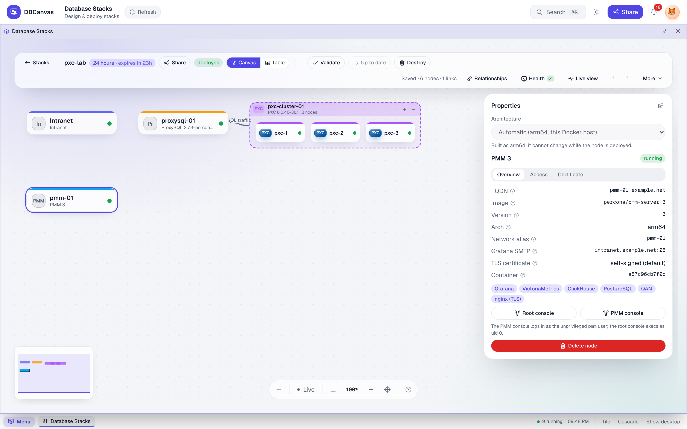
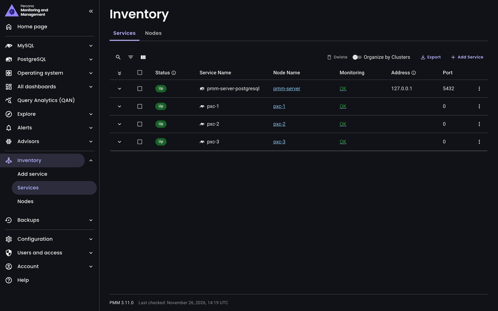

Ticking **Monitored by** on a deployed cluster calls `…/frames/{fid}/pmm`: it creates
the monitoring user on every member and registers each one.

## Version catalogues

What this installation can install. The designer's version pickers use these; a
script that builds a design should read them rather than guess a version.
`dbcanvas versions` shows the catalogue in use; `dbcanvas versions update` downloads
the newest, and `dbcanvas versions reset` goes back to the built-in one.

| Catalogue | API |
| --- | --- |
| Percona XtraDB Cluster | `GET /api/catalog/pxc` |
| Percona Server for MySQL | `GET /api/catalog/ps` |
| Percona Distribution for MySQL | `GET /api/catalog/pdps` |
| MySQL Community | `GET /api/catalog/mysqlce` |
| MariaDB | `GET /api/catalog/mariadb` |
| Percona Server for MongoDB | `GET /api/catalog/psmdb` |
| Percona Distribution for PostgreSQL | `GET /api/catalog/ppg` |
| Spock (pgEdge) | `GET /api/catalog/spock` |
| Valkey | `GET /api/catalog/valkey` |
| ProxySQL · Orchestrator | `GET /api/catalog/proxysql` · `/api/catalog/orchestrator` |
| HAProxy | `GET /api/catalog/haproxy` |
| PMM 3 · PMM 2 | `GET /api/catalog/pmm` · `/api/catalog/pmm2` |
| k3s · Kubernetes operators | `GET /api/catalog/k3s` · `/api/catalog/operators` |
| Kubernetes releases (Kubeadm frame) | `GET /api/catalog/kubernetes` |
| What a Repository node can mirror | `GET /api/catalog/repository` |
| The OS base images built on this host | `GET /api/catalog/images` |

Engine catalogues list versions per OS.

```sh
curl -s -H "$AUTH" $API/catalog/ps | jq .
```

## Kubernetes frames

**UI:** the k3s node's panel on a K3D frame. These endpoints are addressed by frame;
the pod list and pod console are under [Nodes](#nodes).

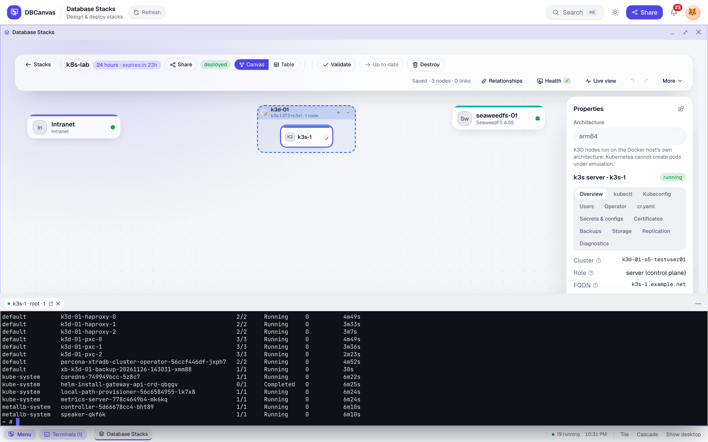

| To do this | API |
| --- | --- |
| An admin kubeconfig | `GET …/frames/{fid}/k3d/kubeconfig` |
| Clusters you can watch live | `GET /api/k3d/states/targets` |
| Every object's state at once | `GET …/frames/{fid}/k3d/states` |
| One container's log (or the previous run's) | `GET …/k3d/states/logs?namespace=&name=&container=&previous=1` |
| One object as YAML | `GET …/k3d/states/manifest?kind=&namespace=&name=` |
| States board from a kept cluster-dump | `POST /api/k8sstates/dumps/{did}` |
| States board from an uploaded cluster-dump | `POST /api/k8sstates/upload` *(multipart)* |
| From an archive: an object's YAML · a pod's files · any file | `GET /api/k8sstates/archive/manifest?dump=&kind=&namespace=&name=` · `/archive/logs?dump=&namespace=&name=&file=` · `/archive/files?dump=&path=` |
| RBAC users: list · create · delete | `GET`/`POST …/frames/{fid}/k3d/users` · `POST …/k3d/users/delete` |
| A kubeconfig for one user | `GET …/k3d/users/{username}/kubeconfig` |
| TLS Secrets, parsed and checked | `GET …/frames/{fid}/k3d/certs` |
| Cross-cluster replication: read · re-seed the replica | `GET …/frames/{fid}/k3d/replication` · `POST …/k3d/replication/reseed` |
| The custom resource: read as a form model · patch | `GET`/`POST …/frames/{fid}/k3d/cr` |
| Secrets and ConfigMaps: list · read one · write keys | `GET …/k3d/objects?kind=secret` · `GET …/k3d/object?kind=&namespace=&name=` · `POST …/k3d/object` |
| Volumes: read · grow | `GET`/`POST …/frames/{fid}/k3d/storage` `{"sizeGiB"}` |
| PostgreSQL standby cluster: promote (and delete the link) | `POST …/frames/{fid}/k3d/pg/promote` |
| PostgreSQL logical replicas: list · add · remove · reseed · bootstrap log | `GET`/`POST …/k3d/logicalreplicas` · `POST …/logicalreplicas/remove` · `/reseed` · `GET …/logicalreplicas/bootstraplog` |
| PSMDB ClusterSync: status · start · stop · pause/resume/finalize | `GET …/k3d/clustersync` · `POST …/clustersync/start` `{"source": "<frame id>"}` · `/stop` · `/{action}` |
| Backups and restores: list · take · delete · restore · delete a restore | `GET`/`POST …/k3d/backups` · `POST …/k3d/backups/delete` · `POST …/k3d/restores` · `POST …/k3d/restores/delete` |
| Manifests the Backups tab applied | `GET …/k3d/backups/manifests[?name=]` |
| Backup bucket: list · delete · download (≤ 64 MiB) | `GET …/k3d/bucket?prefix=` · `POST …/k3d/bucket/delete` · `GET …/k3d/bucket/download?key=` |
| The bucket toolbox pod: status · start/stop | `GET`/`POST …/k3d/bucket/toolbox` `{"action"}` |

```sh
curl -s -H "$AUTH" $API/stacks/1/frames/k3d-01/k3d/kubeconfig | jq -r .kubeconfig > kube.yaml
KUBECONFIG=kube.yaml kubectl get pods -A
```

**Replication** between two PXC-operator frames is set up by drawing a line and
deploying ([Stacks](STACKS.md)). **Re-seed replaces the replica's data** with a fresh
backup of the source.

**Custom resource editor (`k3d/cr`).** `GET` returns the operator's CRD as a form model
(fields, types, enums, bounds) with the live `spec`. `POST` takes a JSON merge patch of
`spec` (`null` deletes a key), always dry-runs it on the API server first, and applies
nothing if it is rejected. Add `"dryRun": true` to validate only.

```sh
curl -s -H "$AUTH" -H 'Content-Type: application/json' \
  -d '{"patch":{"pxc":{"size":4}},"dryRun":true}' $API/stacks/1/frames/k3d-00/k3d/cr
```

**Secrets and ConfigMaps editor (`k3d/object`).** A write is a merge patch of `data`
(`set` and `remove`), dry-run first, `dryRun` to stop there. Secret values are plain
text in this API; DBCanvas handles the base64. The list returns key names and sizes
only. A non-text value is returned as `"binary": true` without its value. Errors
return the API server's message, never the value being written.

```json
POST …/frames/{fid}/k3d/object
{"kind": "secret", "name": "cluster1-secrets", "set": {"root": "new"}}
```

**Backups tab** — see [Operator Backups](OPERATOR_BACKUPS.md). The same calls work for
every Percona operator: the API finds the cluster and its storage from the frame.
Every write returns the manifest it applied and keeps a copy on the node; `"dryRun":
true` returns the manifest without applying it.

> [!WARNING]
> `restores` stops the cluster and replaces its data; there is no undo.
> `backups/delete` with `"data": true` also deletes the backup files from storage
> (refused for the PostgreSQL operator, which does not support it); without it only
> the record is deleted.

```sh
curl -s -H "$AUTH" -H 'Content-Type: application/json' -d '{}' \
  $API/stacks/1/frames/k3d-01/k3d/backups
curl -s -H "$AUTH" $API/stacks/1/frames/k3d-01/k3d/backups |
  jq '.backups[] | {name, state, destination}'
```

**Bucket** calls run `aws` in a toolbox pod on the cluster (`<cluster>-dbcanvas-s3`,
started on demand) with the cluster's own backup credentials, and each answer includes
the command it ran. Listing stops at the next `/` and pages with `after`. A larger
download is refused with the command to copy it inside the cluster instead.

## All in One

Many database instances inside one node.

| To do this | API |
| --- | --- |
| List instances, with engine, version, port and state | `GET …/nodes/{nid}/aio/instances` |
| Start · stop · restart one | `POST …/aio/instances/{inst}/start` · `/stop` · `/restart` |
| Tail one instance's log | `GET …/aio/instances/{inst}/logs` |

## Repository, Ceph and Linux Client nodes

| To do this | API |
| --- | --- |
| Add packages, images or operator releases to a Repository node | `POST …/nodes/{nid}/repository/add` |
| Re-sync a Repository node | `POST …/nodes/{nid}/repository/sync` |
| A Ceph node's health, capacity and RBD images | `GET …/nodes/{nid}/ceph` |
| A Linux Client's kubeconfig · replace it | `GET`/`POST …/nodes/{nid}/kubeconfig` |
| Set a Linux Client's current kubeconfig context | `PUT …/nodes/{nid}/kubeconfig/context` |
| Linux Client ClusterSync (MongoDB to MongoDB): status · start · stop · document counts | `GET …/nodes/{nid}/pcsm` · `POST …/pcsm/start` `{source, target, include, exclude, fresh}` · `POST …/pcsm/stop` · `GET …/pcsm/compare` |
| Pause, resume, resume-failed or finalize it | `POST …/nodes/{nid}/pcsm/{action}` |

Repository `add` and `sync` return `202`; progress shows on the node.

# Running load

## Data Generator

Fill tables with realistic data. See [Data Generator](DATA_GENERATOR.md).

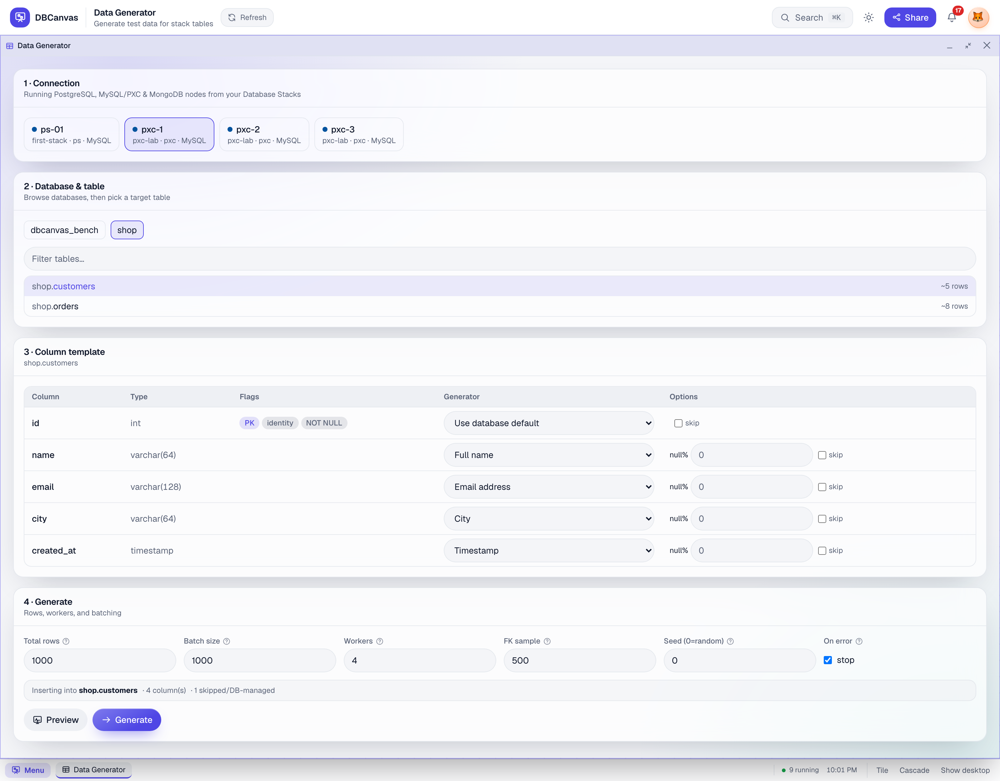

| To do this | API |
| --- | --- |
| Nodes it can write to | `GET /api/datagen/connections` |
| Databases on a node | `GET /api/datagen/stacks/{id}/nodes/{nid}/databases` |
| Tables, with row counts | `…/tables?database=` |
| A table's columns and suggested generators | `…/columns?database=&table=` |
| Preview rows without writing | `POST …/preview` |
| Start a job | `POST …/generate` |
| Poll · cancel a job | `GET /api/datagen/jobs/{job}` · `POST …/cancel` |

Rows already written stay written when a job is cancelled.

## Query Runner

Run SQL on several nodes in parallel. See [Query Runner](QUERY_RUNNER.md).

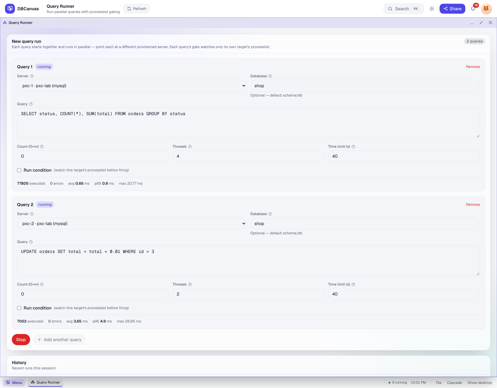

| To do this | API |
| --- | --- |
| Nodes it can run against | `GET /api/queryrun/targets` |
| Start a run | `POST /api/queryrun/runs` |
| Poll it | `GET /api/queryrun/runs/{id}` |
| Stop it, killing the statements | `POST /api/queryrun/runs/{id}/stop` |
| Your previous runs | `GET /api/queryrun/history` |

A run takes the statement, the target nodes, the database, a count per node (`0`
repeats until the time limit, default 60 s) and the number of threads.

## Database Explorer

Browse and query the databases in your stacks — MySQL, PostgreSQL, MongoDB, Valkey and
ClickHouse, including PMM Server's own PostgreSQL and Query Analytics store. See
[Database Explorer](DATABASE_EXPLORER.md).

A connection is an opaque id from the first call. No endpoint takes or returns a host,
user or password.

| To do this | API |
| --- | --- |
| Every database you can reach, by stack and engine | `GET /api/dbexplorer/connections` |
| One connection, with its server version | `GET /api/dbexplorer/connections/{cid}` |
| Its databases (or Valkey keyspaces) | `GET …/connections/{cid}/databases` |
| Its schemas | `GET …/connections/{cid}/schemas?database=` |
| One level of the object tree | `GET …/connections/{cid}/objects?database=&schema=&folder=&cursor=&filter=` |
| Describe one object: columns, indexes, keys, size, DDL | `GET …/connections/{cid}/object?database=&schema=&name=&kind=` |
| Its first page of rows, documents or values | `GET …/connections/{cid}/viewdata?database=&name=&kind=&limit=` |
| Run SQL, a MongoDB query or a Valkey command | `POST /api/dbexplorer/query` |
| Cancel your running query | `POST /api/dbexplorer/cancel` |
| Insert, edit or delete one row, or preview the statement | `POST /api/dbexplorer/mutate` |
| Query history · delete one · clear | `GET /api/dbexplorer/history` · `DELETE …/history/{hid}` · `DELETE …/history` |
| Saved queries | `GET`/`POST /api/dbexplorer/saved` · `DELETE …/saved/{sid}` |
| Give a Kubernetes database an address the load tools can reach · remove it | `POST /api/dbexplorer/expose` · `POST /api/dbexplorer/unexpose` |

```sh
CID=$(curl -s -H "$AUTH" $API/dbexplorer/connections |
      jq -r '.stacks[0].groups[0].connections[0].id')
curl -s -H "$AUTH" -H 'Content-Type: application/json' \
  -d "$(jq -n --arg c "$CID" \
  '{connectionId:$c, database:"shop", sql:"SELECT country, count(*) FROM orders GROUP BY 1", limit:500}')" \
  $API/dbexplorer/query
```

- Results are capped at 500 rows by default, 50,000 at most; queries time out after
  30 s by default, 300 s at most.
- Valkey's `cursor` is a `SCAN` cursor you pass back to continue.
- Databases inside a K3D frame are included. `expose` adds a Service beside the
  operator's own and never changes what the operator owns.
- PMM's databases are read-only unless **Writes to internal databases** is on in
  **Settings**; the database itself also refuses writes.

## Benchmark

OLTP, OLAP, read-write and read-only workloads. See [Benchmark](BENCHMARK.md).

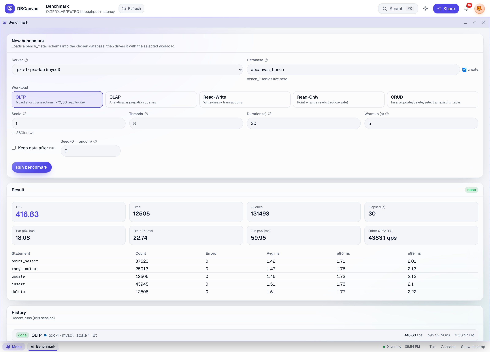

| To do this | API |
| --- | --- |
| Nodes, and the workloads each supports | `GET /api/benchmark/targets` |
| Start a run | `POST /api/benchmark/runs` |
| Live throughput and latency | `GET /api/benchmark/runs/{id}` |
| Stop early, keeping the results | `POST /api/benchmark/runs/{id}/stop` |
| Previous runs | `GET /api/benchmark/history` |

A run takes a workload (`oltp`, `olap`, `rw`, `ro`), a duration and warm-up in
seconds, threads, a database (default `dbcanvas_bench`, created unless told not to)
and a scale.

## Stock Market Sim

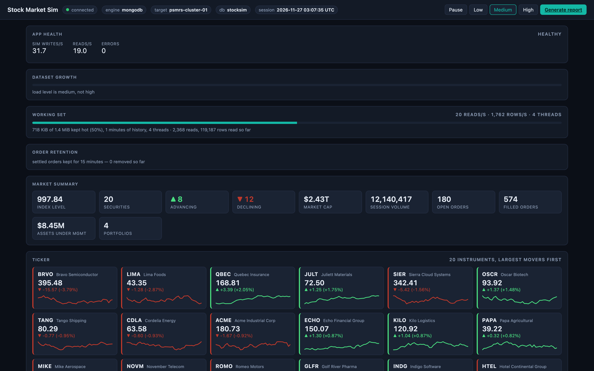

The sim is configured by deploying it and linking it on the canvas. One endpoint
tests a hand-entered connection:

| To do this | API |
| --- | --- |
| Test a database connection from inside the stack network | `POST …/nodes/{nid}/stocksim/test` |

## Sample Client Code

Generate a client program for a deployment, install what it needs on a Linux Client,
and run it. See [Sample Client Code](SAMPLE_CODE.md).

| To do this | API |
| --- | --- |
| Every sample, with dependencies and licences | `GET /api/samplecode/catalog` |
| Linux Clients that can run one | `GET /api/samplecode/nodes` |
| The endpoints in that node's stack | `GET …/nodes/{nid}/samplecode/targets` |
| Render a sample (changes nothing) | `POST …/nodes/{nid}/samplecode/generate` |
| Save · prepare · run · reset | `POST …/nodes/{nid}/samplecode/runs` |
| Follow · stop the job | `GET …/samplecode/runs/{jid}` · `POST …/runs/{jid}/stop` |

```json
{ "sample": "mysql/java/hikari/crud", "target": "ps1", "tls": "verify", "action": "run" }
```

`sample` is database/language/client/scenario. `target` is an id from
`…/samplecode/targets`. `tls` is `off`, `require` or `verify` (omit it to use the
deployment's setting). `action` (`save`, `prepare`, `run`, `reset`) is for `runs`
only. The job log shows every command and its output; a non-zero exit from the
program is reported as `ran: true` with the exit code.

## Ledger Sim

The JDBC simulator, configured by deploying and linking it. Its JDBC URL, driver,
HikariCP settings and workload are changed on its own dashboard while it runs.

| To do this | API |
| --- | --- |
| Test a JDBC connection with the chosen driver, from inside the stack network | `POST …/nodes/{nid}/ledgersim/test` |

The answer includes the driver's version string and any `SQLState`.

## Performance Sim

Configured by deploying and linking it, like the other simulators.

| To do this | API |
| --- | --- |
| Test a manual connection from inside the stack network, before deploying with it | `POST …/nodes/{nid}/perfsim/test` |

## Pager Panic

| To do this | API |
| --- | --- |
| Play every task of the node's bank on its cluster, or the ones in `{"tasks": [...]}`: setup, checks, the task's solve script, checks again, cleanup | `POST …/nodes/{nid}/pagerpanic/selftest` |
| The latest self-test's progress and results, per task | `GET …/nodes/{nid}/pagerpanic/selftest` |

---

# Finding out what happened

## Activity

**UI:** right-click a running database or proxy node → **Activity…** (or *see
Activity* on a transaction or lock-wait alert). It refreshes every 2 seconds by
default while open.

| Tab | Shows |
| --- | --- |
| Overview | what to look at first: the oldest blocker, the longest transaction, DDL stuck in a queue |
| Blocking | who blocks whom: row locks, metadata locks, PostgreSQL blockers, a pool with no free connection |
| Transactions | open transactions by age, rows locked and modified; what an idle one last ran |
| Sessions | every session; optionally CPU, I/O and memory per session |
| DDL | DDL in flight with phase, progress and estimate, and what is queued behind it |
| Deadlocks | each recorded deadlock: the transactions, what each held and waited for, the one rolled back |
| Statements | normalised statements by time per second |
| Pools | ProxySQL's per-backend pool; PgBouncer's per database and user |

Supported: MySQL, MariaDB, PostgreSQL, MongoDB, ProxySQL and PgBouncer (tabs vary by
engine). **Kill** ends a statement or connection; **EXPLAIN** shows a running
statement's plan without re-running it. **Deep** (MySQL family) turns on extra
performance_schema instrumentation for 1–60 minutes and turns back off only what it
turned on.

| To do this | API |
| --- | --- |
| Read the activity | `GET …/nodes/{nid}/activity[?with=digests,resources,deadlock]` |
| Kill a statement or connection | `POST …/nodes/{nid}/activity/kill` `{"session", "mode"}` |
| EXPLAIN a running statement | `POST …/nodes/{nid}/activity/explain` `{"session"}` |
| Deep instrumentation | `POST …/nodes/{nid}/activity/deep` `{"minutes"}` |
| Recorded deadlocks | `GET …/nodes/{nid}/deadlocks` |

```sh
N=$API/stacks/12/nodes/$NODE_ID      # a node id: see GET /api/stacks/12
curl -s -H "$AUTH" "$N/activity?with=digests,resources,deadlock"
curl -s -H "$AUTH" -H 'Content-Type: application/json' \
  -d '{"session": "4711", "mode": "connection"}' "$N/activity/kill"
```

## Packet Inspector

`tcpdump` on a database node, decoded packet by packet — MySQL, PostgreSQL, MongoDB
and Valkey. See [Packet Inspector](PACKET_INSPECTOR.md).

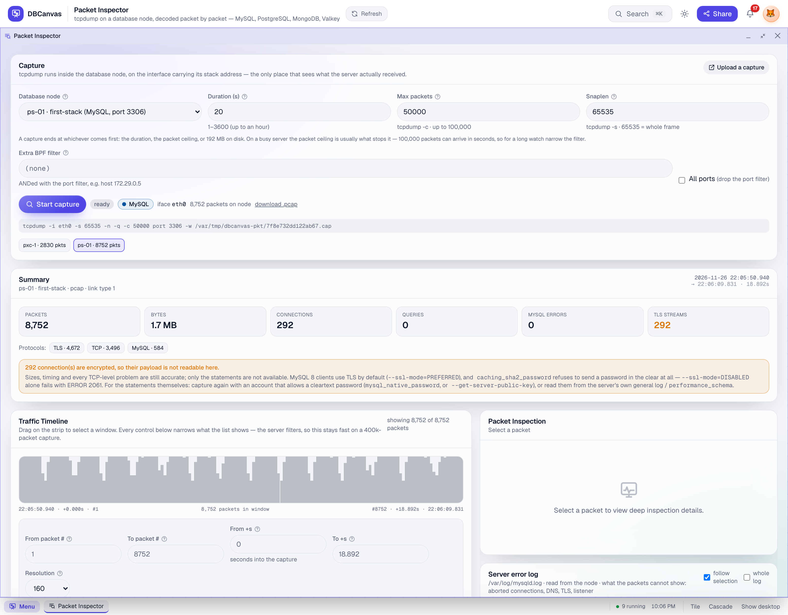

| To do this | API |
| --- | --- |
| Nodes that can be captured, and on which port | `GET /api/pktinspect/targets` |
| Start a capture | `POST /api/pktinspect/captures` |
| List your captures | `GET /api/pktinspect/captures` |
| A capture's state and counters | `GET /api/pktinspect/captures/{id}` |
| Stop and decode | `POST …/captures/{id}/stop` |
| A page of decoded packets | `GET …/captures/{id}/packets` |
| One packet in full | `GET …/captures/{id}/packets/{no}` |
| The timeline | `GET …/captures/{id}/timeline` |
| Download the `.pcap` | `GET …/captures/{id}/download` |
| Server-log records from the same window | `GET …/captures/{id}/serverlog` |
| Upload a `.pcap` | `POST /api/pktinspect/upload` *(multipart, field `file`)* |

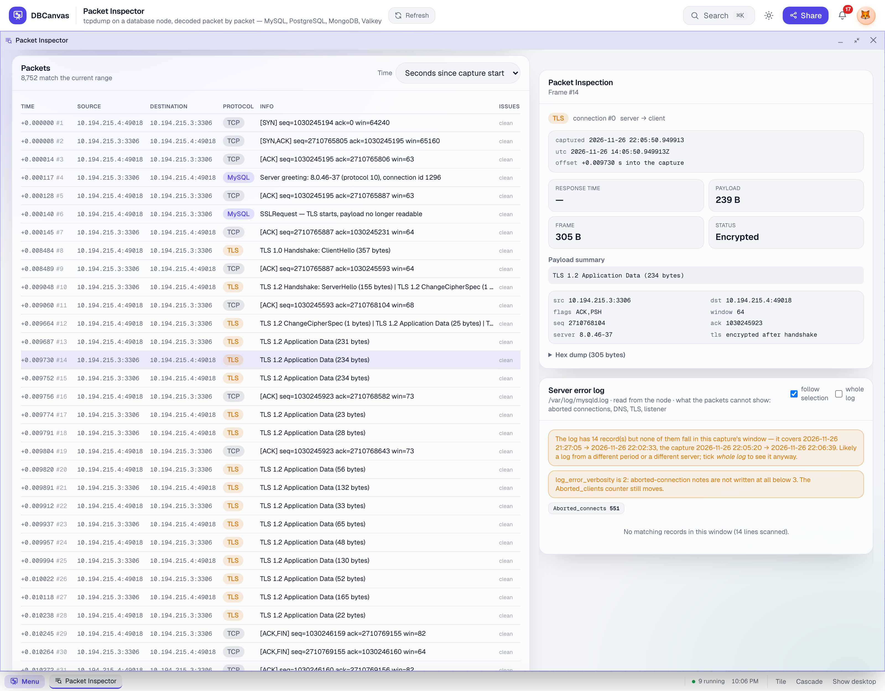

```sh
curl -s -H "$AUTH" -F file=@capture.pcap $API/pktinspect/upload
curl -s -H "$AUTH" -OJ $API/pktinspect/captures/$CAPTURE_ID/download
```

## Log Summary

Several nodes' logs on one timeline, classified by severity. See
[Log Summary](LOG_SUMMARY.md).

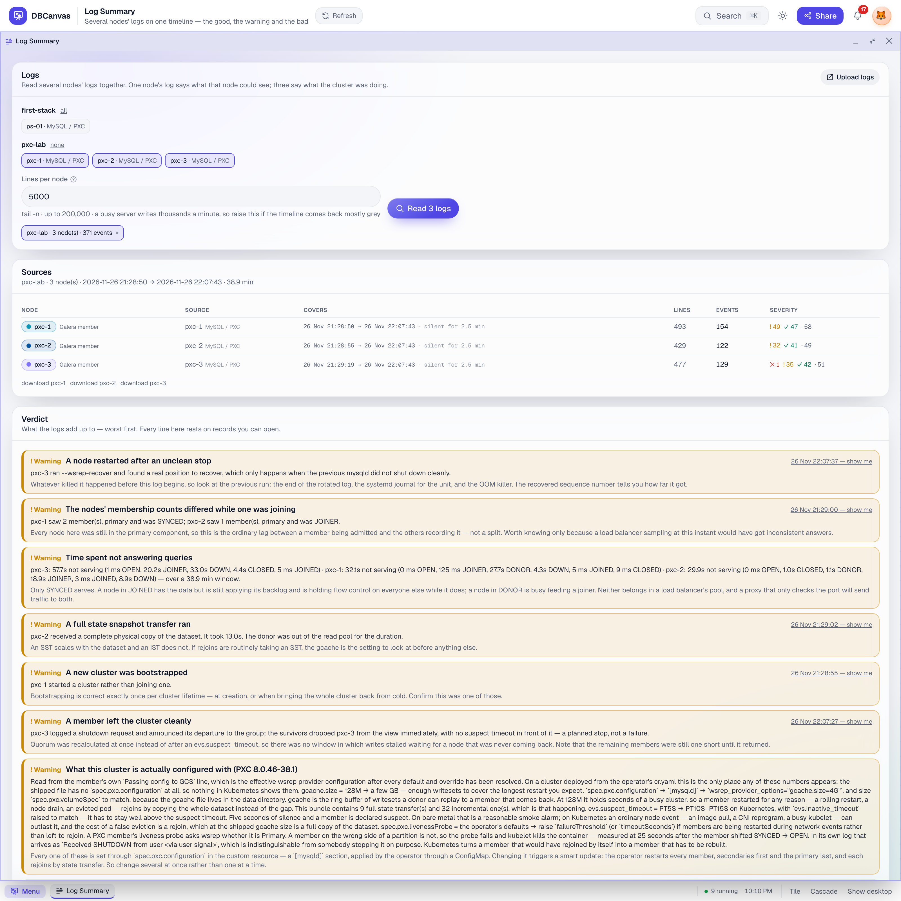

| To do this | API |
| --- | --- |
| What can be collected | `GET /api/logsummary/targets` |
| Collect several nodes' logs as one bundle | `POST /api/logsummary/collect` |
| List your bundles | `GET /api/logsummary/bundles` |
| A bundle's sources, verdict and counts | `GET /api/logsummary/bundles/{id}` |
| A page of events | `GET …/bundles/{id}/events` |
| The per-source timeline | `GET …/bundles/{id}/timeline` |
| What every node was doing at one instant | `GET …/bundles/{id}/at?t=` |
| Download one source's raw log | `GET …/bundles/{id}/sources/{src}/raw` |
| Correct a source's clock offset | `POST …/bundles/{id}/offset` |
| Delete a bundle | `DELETE /api/logsummary/bundles/{id}` |
| Upload logs | `POST /api/logsummary/upload` *(multipart, field `files`)* |

## FTDC Summary

Charts and findings from MongoDB's `diagnostic.data`. See [FTDC Summary](FTDC_SUMMARY.md).

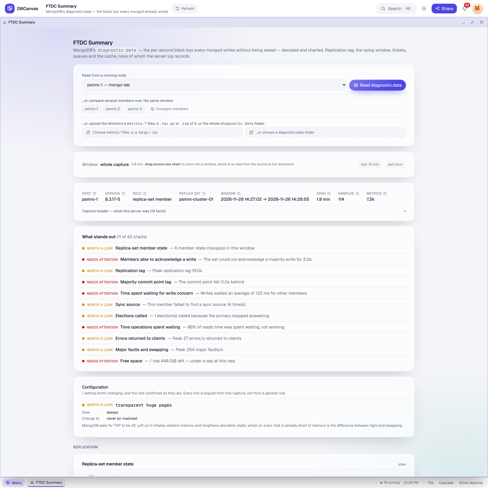

| To do this | API |
| --- | --- |
| MongoDB nodes that can be read | `GET /api/ftdc/targets` |
| Read a running node's `diagnostic.data` | `POST …/nodes/{nid}/ftdc` |
| Compare two windows | `POST /api/ftdc/compare` |
| Upload `diagnostic.data` | `POST /api/ftdc/upload` *(multipart, field `files`)* |

## Stalk Summary

Charts, verdicts and configuration advice from a `pt-stalk` capture. See
[Stalk Summary](STALK_SUMMARY.md).

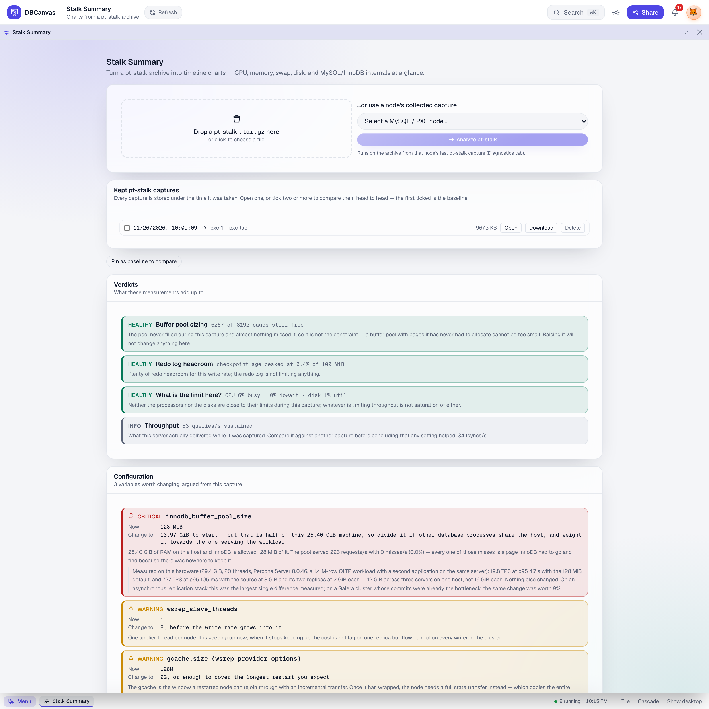

| To do this | API |
| --- | --- |
| Capture and analyse in one request | `POST …/nodes/{nid}/stalksummary` |
| Analyse a kept archive | `POST /api/stalksummary/archive/{aid}` |
| Compare two captures | `POST /api/stalksummary/compare` |
| Upload an archive | `POST /api/stalksummary/upload` *(multipart, field `file`)* |

## Operator Summary

Workload health, custom-resource status and operator errors from a
`pt-k8s-debug-collector` cluster-dump, taken here or on any cluster. See
[Operator Summary](OPERATOR_SUMMARY.md).

| To do this | API |
| --- | --- |
| Capture and analyse in one request | `POST …/frames/{fid}/k3d/opsummary` |
| Analyse a kept cluster-dump | `POST /api/opsummary/dumps/{did}` |
| Every kept cluster-dump | `GET /api/opsummary/dumps` |
| Upload a cluster-dump | `POST /api/opsummary/upload` *(multipart)* |

## Diagnostic captures

`pt-stalk` (MySQL family) and `pg_gather` (PostgreSQL) run on the node;
`pt-k8s-debug-collector` collects a Kubernetes cluster.

| To do this | API |
| --- | --- |
| Start pt-stalk | `POST …/nodes/{nid}/ptstalk` |
| Its status and what it has collected | `GET …/nodes/{nid}/ptstalk` |
| Download the current capture | `GET …/nodes/{nid}/ptstalk/download` |
| Kept archives from this node · from everywhere | `GET …/nodes/{nid}/ptstalk/archives` · `GET /api/ptstalk/archives` |
| Download · annotate · delete a kept archive | `GET /api/ptstalk/archives/{aid}/download` · `POST …/{aid}/note` · `DELETE /api/ptstalk/archives/{aid}` |
| Start pg_gather · status · report | `POST …/nodes/{nid}/pggather` · `GET …/pggather` · `GET …/pggather/download` |
| Start a Kubernetes cluster-dump · status | `POST`/`GET …/frames/{fid}/k3d/collect` |
| Kept cluster-dumps for this cluster | `GET …/frames/{fid}/k3d/collect/dumps` |
| Download · delete a kept cluster-dump | `GET /api/k8sdumps/{did}/download` · `DELETE /api/k8sdumps/{did}` |

Kept archives outlive the node they came from, so you can compare before and after a
node is recreated.

## Operator Debugger

Step through a Kubernetes operator under Delve. See
[Operator Debugger](OPERATOR_DEBUGGER.md).

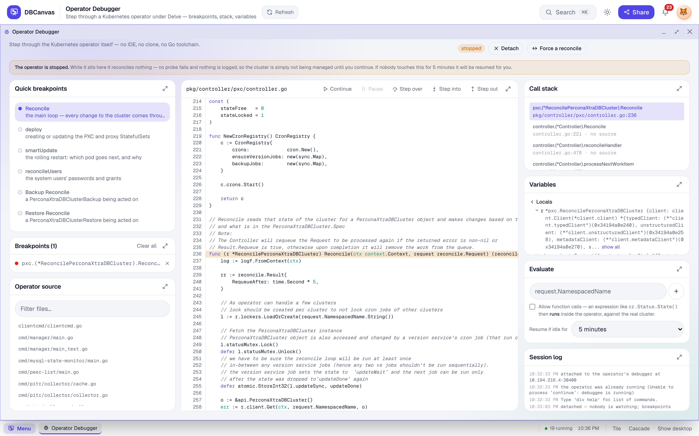

| To do this | API |
| --- | --- |
| Frames running their operator under Delve | `GET /api/k3d/debug/targets` |
| The operator's source tree · one file | `GET …/frames/{fid}/k3d/debug/sources` · `GET …/k3d/debug/source?path=` |
| The live debug session | `GET …/frames/{fid}/k3d/debug/ws` *(WebSocket)* |
| Force a reconcile | `POST …/frames/{fid}/k3d/debug/reconcile` |

## Core Dump Analyzer

Read a crashed `mysqld`'s core dump and get a diagnosis. See
[Core Dump Analyzer](CORE_DUMP_ANALYZER.md#using-it).

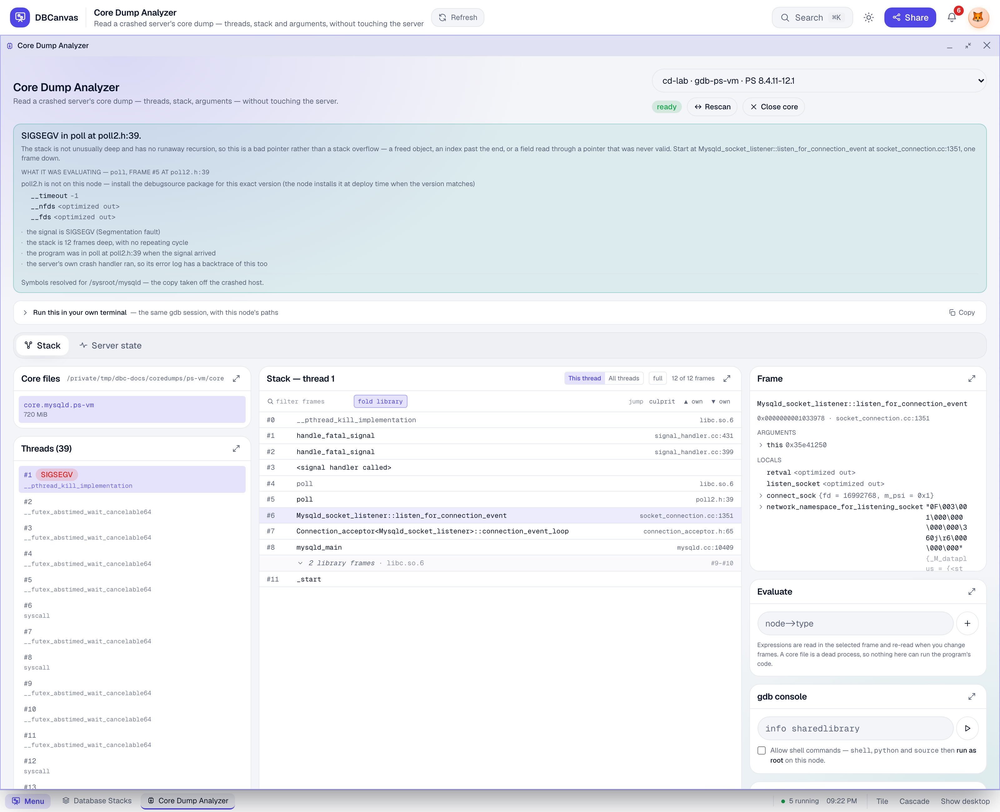

| To do this | API |
| --- | --- |
| Linux Clients set up as core-dump hosts | `GET /api/gdb/targets` |
| The cores available, and whether symbols and libraries match | `GET …/nodes/{nid}/gdb/cores` |
| The live gdb session | `GET …/nodes/{nid}/gdb/ws` *(WebSocket)* |

The WebSocket takes one JSON command per message, `{"cmd": …}`: `open`, `backtrace`,
`variables`, `evaluate`, `disassemble`, `source`, `console`, and:

| `cmd` | Returns |
| --- | --- |
| `threads` | every thread's stack at once, identical stacks folded |
| `framevars` | arguments and locals for the frames in `levels` of `thread` |
| `children` | the members of `expr` in `frame` of `thread`, one level at a time |

`source` returns `file` (as requested) and `path` (where it was found).

> [!NOTE]
> The Operator Debugger and Core Dump Analyzer sessions are interactive WebSockets
> built for the UI.

---

# Managing a node

## Node file manager

Read and write files inside a node.

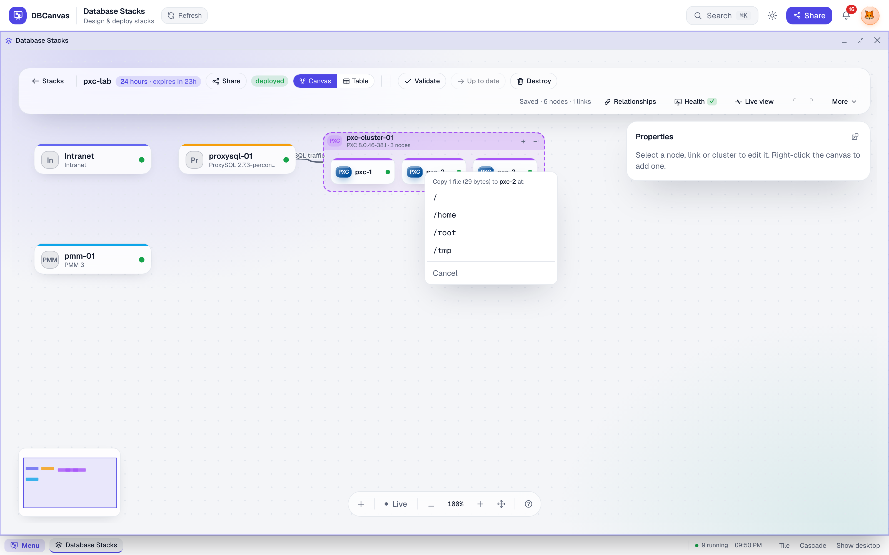
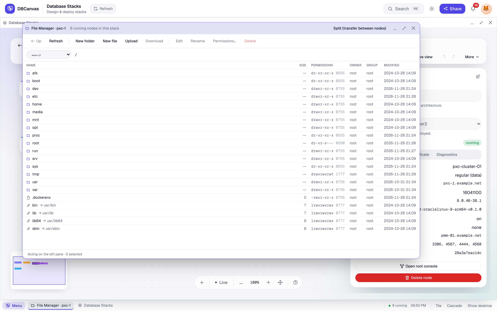

| To do this | API |
| --- | --- |
| Nodes that can be browsed | `GET /api/stacks/{id}/fs/nodes` |
| List a directory | `GET …/nodes/{nid}/fs/list?path=` |
| Read a text file · write one | `GET …/fs/read?path=` · `POST …/fs/write` |
| Download a file, or a directory as `.tar.gz` | `GET …/nodes/{nid}/fs/download?path=` |
| Upload into a directory | `POST …/nodes/{nid}/fs/upload` *(multipart)* |
| mkdir · delete · rename | `POST …/fs/mkdir` · `/fs/delete` · `/fs/rename` |
| chmod · chown | `POST …/fs/chmod` · `/fs/chown` |
| Users and groups inside the node | `GET …/nodes/{nid}/fs/identities` |
| **Copy node to node directly** | `POST …/nodes/{nid}/fs/transfer` |

```sh
curl -s -H "$AUTH" -o my.cnf "$API/stacks/12/nodes/$NODE_ID/fs/download?path=/etc/my.cnf"
curl -s -H "$AUTH" -H 'Content-Type: application/json' \
  -d '{"path":"/opt/x"}' $API/stacks/12/nodes/$NODE_ID/fs/mkdir
```

Uploads are streamed and limited by **Settings → Node file uploads**. `fs/transfer`
copies between nodes on the host without passing through your machine.

## Certificates

The Intranet node is the stack's certificate authority; every node trusts it.

| To do this | API |
| --- | --- |
| The CA certificate | `GET …/nodes/{nid}/cert` (Intranet node) |
| Reissue the Intranet node's certificate | `POST …/nodes/{nid}/cert` |
| Client certificates: list · issue · fetch (with key and chain) · delete | `GET`/`POST …/nodes/{nid}/dbcerts` `{"user"}` · `GET …/dbcerts/{user}` · `POST …/dbcerts/delete` |
| A database node's server certificate: read · reissue with a lifetime (`{"value": 10, "unit": "minutes"}`; `minutes`, `hours` or `days`) over the installed files, without a restart | `GET`/`POST …/nodes/{nid}/mysql/cert` (every MySQL-family node; `/pxc/cert` also works), `/pg/cert`, `/mongo/cert`, `/pmm/cert` |

## Intranet mail

| To do this | API |
| --- | --- |
| List · create mailboxes | `GET`/`POST …/nodes/{nid}/email/users` |
| Set a password · delete | `POST …/email/users/password` · `/email/users/delete` |

## Intranet LDAP

The directory LDAP authentication uses.

| To do this | API |
| --- | --- |
| Users: list · create | `GET`/`POST …/nodes/{nid}/ldap/users` |
| Users: update · set password · delete | `POST …/ldap/users/update` · `/password` · `/delete` |
| Groups (with members): list · create | `GET`/`POST …/nodes/{nid}/ldap/groups` |
| Groups: set members · delete | `POST …/ldap/groups/members` · `/delete` |

## Intranet DNS

Records added by hand beside the automatic ones. A custom record replaces an automatic
one with the same name or address. Every write returns the updated view.

| To do this | API |
| --- | --- |
| Automatic and custom records, and the reverse zones | `GET …/nodes/{nid}/dns` |
| Add an A, CNAME or PTR record | `POST …/nodes/{nid}/dns/records` `{"type":"A","name":"db","value":"10.1.2.3","ptr":true}` |
| Change · delete one, by id | `POST …/dns/records/update` · `/delete` `{"id"}` |

## Samba AD DC

| To do this | API |
| --- | --- |
| Users: list · create | `GET`/`POST …/nodes/{nid}/samba/users` |
| Users: update · set password · delete | `POST …/samba/users/update` · `/password` · `/delete` |
| Groups: list · create | `GET`/`POST …/nodes/{nid}/samba/groups` |
| Groups: set members · delete | `POST …/samba/groups/members` · `/delete` |
| The `krb5.conf` a client needs | `GET …/samba/krb5` |
| Nodes a service principal can be created for | `GET …/samba/targets` |
| Kerberos principals: list · register | `GET`/`POST …/samba/principals` |
| Export a keytab | `GET …/samba/keytab` |
| Issue the LDAPS certificate | `POST …/samba/cert` |

## SeaweedFS

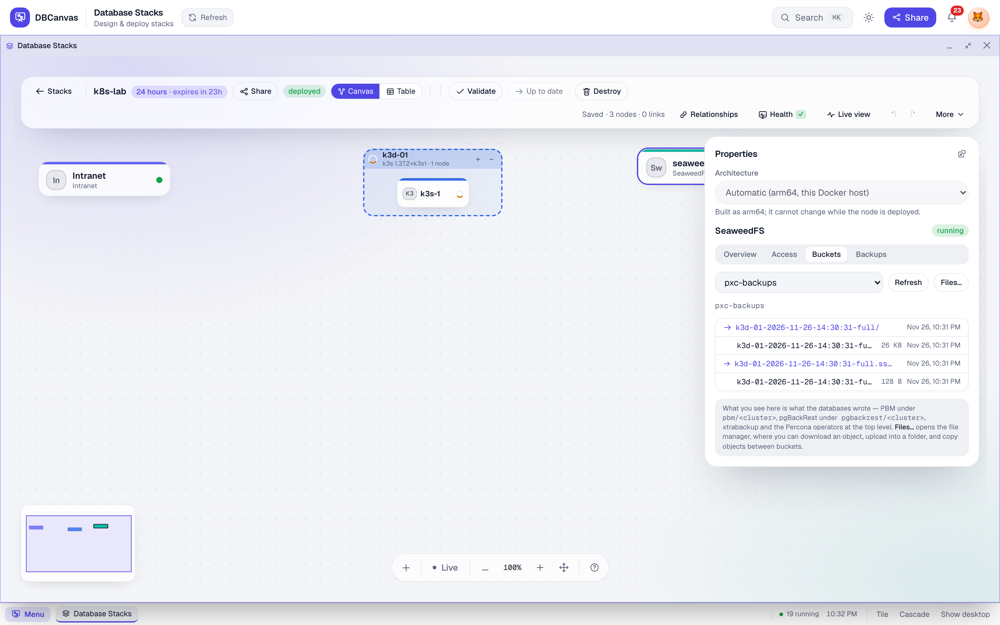

| To do this | API |
| --- | --- |
| Running SeaweedFS nodes and their buckets | `GET /api/stacks/{id}/seaweed/nodes` |
| Browse a bucket | `GET …/nodes/{nid}/seaweed/objects` |
| Download one object | `GET …/nodes/{nid}/seaweed/download?bucket=&path=` |
| Upload files into a folder | `POST …/nodes/{nid}/seaweed/upload` *(multipart)* |
| Copy objects to another bucket | `POST …/nodes/{nid}/seaweed/transfer` |
| Delete objects (a folder needs `recursive`) | `POST …/nodes/{nid}/seaweed/delete` |

**UI:** **Files…** on the node's Buckets tab, or **Bucket file manager** on its
right-click menu: two panes, with download, drag-and-drop upload, delete and copy
between buckets. Uploads follow **Settings → Node file uploads**. Objects are ordinary
S3 objects.

## OpenBao

| To do this | API |
| --- | --- |
| Initialised, sealed, key thresholds | `GET …/nodes/{nid}/openbao/status` |
| Unseal with the stored keys | `POST …/nodes/{nid}/openbao/unseal` |

---

# Watching

## Dashboard

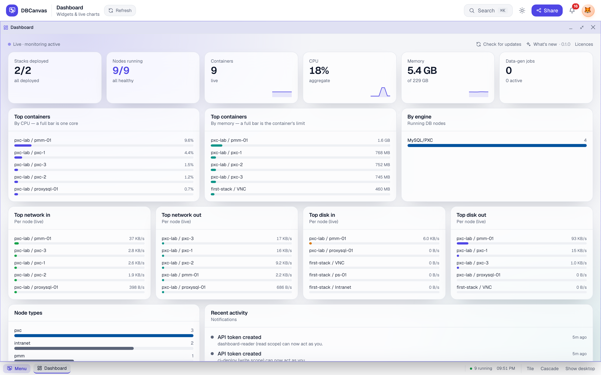

| To do this | API |
| --- | --- |
| Counters: stacks, nodes, engines, jobs, recent activity | `GET /api/dashboard/summary` |
| Live CPU, memory, network and disk per node | `GET /api/dashboard/stats` |
| Is a newer DBCanvas available, and what changed | `GET /api/dashboard/updates` |

`stats` is sampled on request and cached for two seconds.

`updates` is the **Check for updates** button; DBCanvas never checks on its own. It
asks the DBCanvas GitHub repository for the latest released version and its release
notes, and returns `current`, `latest`, `available` and `notes` (each release after
yours, newest first, in the same shape as `GET /api/whatsnew`). A development build
returns `"dev": true` and never `available`. If the notes cannot be read, `notesError`
says why and the check still succeeds. If GitHub cannot be reached, the answer is
`502`.

## Notifications

| To do this | API |
| --- | --- |
| List, with the unread count | `GET /api/notifications` |
| **Live stream** | `GET /api/notifications/stream` *(SSE)* |
| Mark all read | `POST /api/notifications/read-all` |
| Mark one read | `POST /api/notifications/{id}/read` |

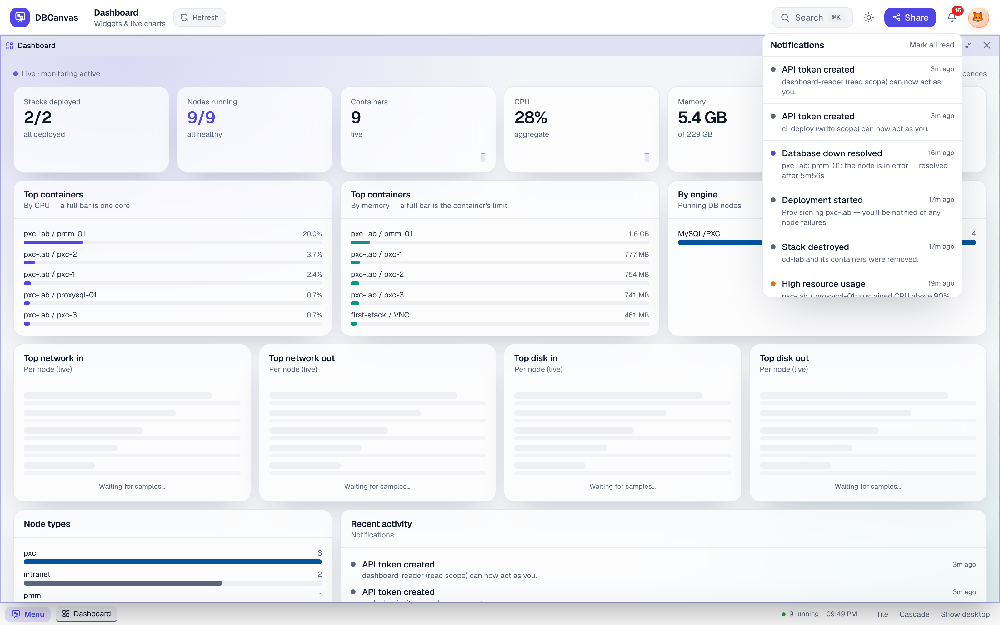

The stream stays open and sends each notification as one JSON event — a deploy
finishing, a token created, a stack expiring — so a script can wait without polling.

```sh
curl -s -N -H "$AUTH" $API/notifications/stream
```

## Kanban

Boards of columns of cards ([Kanban](KANBAN.md)). Positions are indexes: `0` is the
top of a column (or leftmost on the board); an index past the end means the end.

| To do this | API |
| --- | --- |
| Your boards and shared ones | `GET /api/kanban/boards` |
| Create a board | `POST /api/kanban/boards` `{"name", "shared", "columns": ["To do", …]}` |
| A board with its columns and cards (`?since=<rev>` for a cheap poll) | `GET /api/kanban/boards/{id}` |
| Rename or share it · delete it | `PUT /api/kanban/boards/{id}` `{"name", "shared"}` · `DELETE …` |
| Add · change · delete a column | `POST /api/kanban/boards/{id}/columns` `{"name", "index"}` · `PUT /api/kanban/columns/{cid}` `{"name", "wipLimit"}` or `{"color"}` · `DELETE …` |
| Move a column | `POST /api/kanban/columns/{cid}/move` `{"index"}` |
| Add a card | `POST /api/kanban/columns/{cid}/cards` `{"title", "description", "labels", "assigneeId", "due", "color", "index"}` |
| Change · delete a card | `PUT` · `DELETE /api/kanban/cards/{kid}` |
| Move a card | `POST /api/kanban/cards/{kid}/move` `{"columnId", "index"}` |
| Who a card can be assigned to | `GET /api/kanban/people` |

## Shared sessions

The owner shares a live session through a link that lasts up to two hours (the
**Shared sessions** setting may set less). Guests give a name and email, wait in a
lobby until admitted, then follow the host and chat; a guest given control can do
anything the host can in the workspace. It is off until `allowGuestSessions` is
turned on in **Settings**. Guests reach the port through the `publicUrl` in
`config.yaml`. See [Shared sessions](SHARED_SESSIONS.md).

Ended sessions' records (guests' names, emails and addresses, the transcript, guest
actions) are deleted after `sessionRetentionDays` (default 90). Recordings are kept
`recordingRetentionDays` (default 30) unless the host changes the date.

| To do this | API |
| --- | --- |
| Start a session and get its link *(refuses a token)* | `POST /api/share/sessions` `{"minutes": 5–120, "hideSecrets": false, "mirror": true}`, or `POST /api/stacks/{id}/share` to file it on a stack |
| Mirror everything on or off | `POST /api/share/sessions/{sid}/mirror` `{"mirror"}` |
| Your sessions (`?live=1` for running ones) | `GET /api/share/sessions` |
| One session: guests and who has control | `GET /api/share/sessions/{sid}` |
| Admit · deny · remove a guest | `POST …/sessions/{sid}/guests/{gid}/admit` · `/deny` · `/remove` |
| Mute or unmute a guest | `POST …/guests/{gid}/mute` `{"muted"}` |
| Give or take back control | `POST /api/share/sessions/{sid}/control` `{"to": 5}` or `{"to": "host"}` |
| Let every guest draw, or none · one guest | `POST …/sessions/{sid}/draw` `{"draw"}` · `POST …/guests/{gid}/draw` |
| Start recording (video from the host's browser) | `POST /api/share/sessions/{sid}/recordings` `{"mime"}` |
| Append a chunk, in order | `POST /api/share/recordings/{rid}/chunks?seq=N` *(raw bytes)* |
| Stop a recording | `POST /api/share/recordings/{rid}/finish` `{"durationMs"}` |
| Your recordings | `GET /api/share/recordings` |
| Download one (`?inline=1` to play) | `GET /api/share/recordings/{rid}/file` |
| Its chat transcript (text; `?format=json`) | `GET /api/share/recordings/{rid}/transcript` |
| Rename it or move its purge date | `PUT /api/share/recordings/{rid}` `{"title", "purgeAt": "2026-12-31"}` |
| Purge it now | `DELETE /api/share/recordings/{rid}` |
| New invitation link (retires the old one) *(refuses a token)* | `POST /api/share/sessions/{sid}/link` |
| End it now | `POST /api/share/sessions/{sid}/end` |
| Transcripts filed on a stack | `GET /api/stacks/{id}/share/transcripts` |
| Download a session transcript (text; `?format=json`) | `GET /api/share/sessions/{sid}/transcript` |
| **Live channel**: presence, follow, cursor, chat, control, drawings | `GET /api/share/sessions/{sid}/ws` *(WebSocket)* |
| Shared terminal: open · close · watch | `POST …/sessions/{sid}/terms` · `DELETE …/terms/{tid}` · `GET …/terms/{tid}/ws` |
| Guest side *(the join link is the credential)*: the join page · join · status · leave | `GET /api/join/{token}` · `POST /api/join/{token}` `{"name", "email", "avatar"}` · `GET …/status` · `POST …/leave` |

```sh
curl -s -H "$AUTH" -OJ $API/share/recordings/4/file
```

**Guests are not accounts.** A guest's requests carry `X-DBCanvas-Guest` (or
`?guest=1` on sockets and downloads) and act as the host with `read` scope while
watching and `write` while in control. A guest never reaches the host's tokens,
notifications or settings. Every guest write is recorded, with the guest's name, in
the transcript.

## API metadata

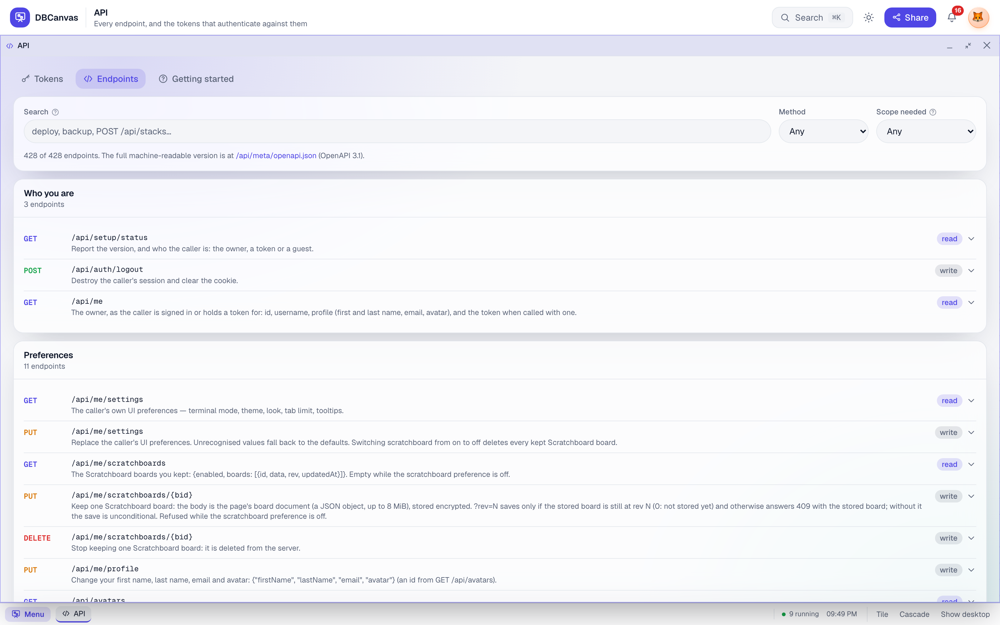
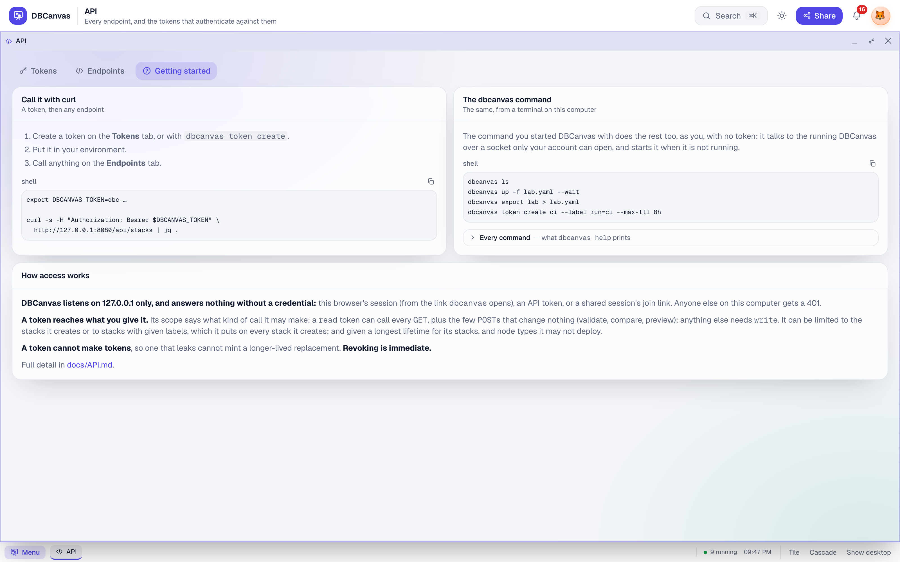

| To do this | API |
| --- | --- |
| The endpoint catalogue | `GET /api/meta/endpoints` |
| OpenAPI 3.1 document | `GET /api/meta/openapi.json` |
| The `dbcanvas` command's usage, as `dbcanvas help` prints it | `GET /api/cli/help` |

```sh
curl -s -H "$AUTH" $API/meta/endpoints | jq '.groups[] | {name, count: (.endpoints | length)}'
```

---

See also: [HTTP API](API.md) · [The `dbcanvas` command](CLI.md) · [Feature guides](README.md)
