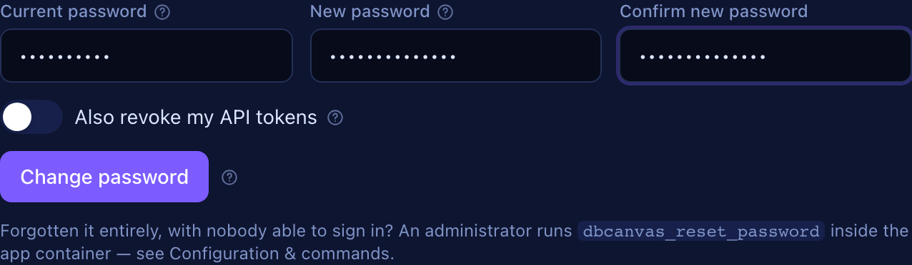

# `dbcanvas-cli`

Drive DBCanvas from a terminal: deploy a stack, watch it come up, open a root console
on a node, run a benchmark, tear it down. Everything the web UI does, because it
speaks the same [HTTP API](API.md).

---

## Install

**From a checkout:**

```sh
make cli                      # → dist/dbcanvas-cli_<os>_<arch>
install dist/dbcanvas-cli_darwin_arm64 /usr/local/bin/dbcanvas
```

**From a running installation** — no checkout needed, which is the point on a shared
server. The **API** page has download links, or:

```sh
curl -fL -o dbcanvas "http://localhost:8080/api/cli/download?os=linux&arch=amd64"
chmod +x dbcanvas && sudo mv dbcanvas /usr/local/bin/
```

`dbcanvas version` prints the CLI's version and, once signed in, the server's.

## Signing in

```
$ dbcanvas login --url http://localhost:8080
Username: jaime
Password: ********
Created token "dbcanvas-cli on thinkpad" (dbc_a1b2c3d4…), write scope, expires 2026-12-01.
Saved to ~/.config/dbcanvas/config.json
```

What that actually did: signed in with your password, used that session to create an
API token, then **signed the session out again**. Only the token is written to disk,
at mode `0600`. Your password is never stored, and never sent again.

That is worth the extra round trip because the credential left behind is a much better
one to leave lying around: it is scoped, it expires, you can see it in **API →
Tokens**, and you can revoke it from your phone if the laptop goes missing.

```sh
dbcanvas login --expires 30 --scope read   # a token for a read-only script
dbcanvas whoami                            # account, scope, expiry, server version
dbcanvas logout                            # revoke the token and forget it
```

`logout` revokes server-side as well as deleting the local copy — a config file you
merely delete leaves a live credential behind.

## Changing your password



```sh
dbcanvas password                    # prompts for the current one, then the new one twice
dbcanvas password --revoke-tokens    # …and revoke every API token, including this CLI's
dbcanvas password --user jaime       # when the profile does not name an account
```

This signs in with your current password rather than sending the stored token,
because `POST /api/me/password` refuses bearer authentication outright — the same
asymmetry that stops a token creating another token. A leaked token can read and write
your stacks; it cannot take over your account.

Changing your password signs out every *other* browser and device and keeps the one
you used. API tokens survive unless you pass `--revoke-tokens`: a routine rotation
should not break a CI job, but a password changed because it may have leaked should be
able to take everything with it. When it does, the CLI drops its own now-dead token
from the config and tells you to sign in again.

Forgotten it entirely, with nobody able to sign in? That is a different problem —
an administrator runs `dbcanvas_reset_password` inside the app container, see
[Configuration](CONFIGURATION.md#recovering-an-admin-password).

## Configuration and profiles

`~/.config/dbcanvas/config.json` (`%AppData%\dbcanvas\config.json` on Windows), mode
`0600`:

```json
{
  "current": "local",
  "profiles": {
    "local": { "url": "http://localhost:8080", "token": "dbc_…", "user": "jaime" },
    "lab":   { "url": "https://dbcanvas.lab.internal", "token": "dbc_…", "user": "jaime" }
  }
}
```

| | |
| --- | --- |
| `--profile lab` | use another installation for this command |
| `dbcanvas login --profile lab --url …` | add or replace one |
| `DBCANVAS_URL`, `DBCANVAS_TOKEN` | override everything; what CI should use, so nothing is written to disk at all |
| `--url`, `--token` | override for a single command |

## Building a stack

`compose` describes what you want; the server works out the rest.

```sh
dbcanvas stack kinds          # every kind, its options, and the OS aliases

dbcanvas stack compose repro-1234 --ttl 8h \
  --node 'pxc:3,version=8.4.5,os=el8,monitor' \
  --node 'ps,version=8.0.45,os=el9,ldap,monitor' \
  --node 'pmm,version=3' \
  --deploy --wait
```

```
KIND      NAME            OS             VERSION      NODES  MONITORED BY  DIRECTORY
intranet  intranet-01     -              -            1      -             -
pxc       pxc-cluster-01  oraclelinux 8  8.4.5-5.1    3      pmm-01        -
ps        ps-01           oraclelinux 9  8.0.45-36.1  1      pmm-01        intranet-01
pmm       pmm-01          -              3            1      -             -

  + an Intranet node (DNS, CA, LDAP, package proxy) — every stack needs one
```

The syntax is **`kind[:count][,flag][,key=value]`**:

| | |
| --- | --- |
| `pxc:3` | three members; the count only means something for a cluster kind |
| `version=8.4.5` | an upstream release, a series (`8.4`), a full package version, or omit for latest |
| `os=el8` | also `ol9`, `rhel9`, `noble`, `jammy`, `bookworm`, `ubuntu24.04`, `oraclelinux:10`… |
| `monitor` · `ldap` · `oidc` · `kerberos` · `vault` · `backup` · `orchestrator` | relationships — each wires this node to another in the spec |
| `to=` | the association *line* — the backend a proxy fronts, the database a simulator drives |
| `export` · `cert` · `proxy` · `gtid` · `mysqlRouter` · `tls` | plain switches; `gtid=false` turns a default off |
| `name=` · `count=` · `cpus=` · `memoryGb=` · `exportPort=` · `certTtl=` | values |
| `netLatencyMs=` · `netJitterMs=` · `netLossPct=` · `netRateMbit=` · `netAllTraffic` | network shaping |
| `deviceReadMbps=` · `deviceWriteMbps=` | disk throughput limits |
| `replMode=` · `mode=` · `setup=` · `dataset=` · `buckets=a+b` | per-engine, on the kinds that have them |
| `monitorWith=` · `oidcWith=` · … | which provider, when the spec has more than one |

Every option is checked against the kind. `cpus=` on a Keycloak node is **refused**,
not ignored, because nine node types never apply a CPU limit; `netLatencyMs=` is
refused anywhere the shaper has no ports to shape. `dbcanvas stack kinds` lists
exactly what each kind takes, and that list is generated from the same table the
builder checks against.

The relationships are the part you could not write by hand — each is a field holding
another node's generated id:

```sh
dbcanvas stack compose sso-lab \
  --node keycloak \
  --node 'ps,version=8.4.11,os=el9,oidc,monitor' \
  --node 'pmm,oidc' \
  --node openbao --node 'psm,os=el9,vault,ldap'
```

```
KIND      NAME         OS             VERSION      NODES  WIRED TO
keycloak  keycloak-01  -              -            1      -
ps        ps-01        oraclelinux 9  8.4.11-11.1  1      monitor→pmm-01  oidc→keycloak-01
pmm       pmm-01       -              -            1      oidc→keycloak-01
psm       psm-01       oraclelinux 9  8.0 (latest) 1      ldap→intranet-01  vault→openbao-01

  + vnc-01 — Keycloak's admin console publishes no host ports, so it is only reachable from a browser inside the stack
  + a certificate on keycloak-01 — an OIDC issuer has to be reachable over HTTPS
```

`dbcanvas stack kinds` prints which relationships each kind supports and what each
connects to.

### End to end: single sign-on, composed and deployed

The whole of "an Intranet, Percona Server 8.4.11 with Keycloak SSO, and PMM 3 watching
it" is one command. This is a real run, output included:

```sh
dbcanvas stack compose sso-lab --ttl 8h \
  --node keycloak \
  --node 'ps,version=8.4.11,os=el9,oidc,monitor' \
  --node 'pmm,version=3' \
  --deploy --wait
```

```
KIND      NAME         OS             VERSION      NODES  WIRED TO
intranet  intranet-01  -              -            1      -
keycloak  keycloak-01  -              -            1      -
ps        ps-01        oraclelinux 9  8.4.11-11.1  1      monitor→pmm-01  oidc→keycloak-01
pmm       pmm-01       -              3            1      -

  + an Intranet node (DNS, CA, LDAP, package proxy) — every stack needs one

  + vnc-01 — Keycloak's admin console publishes no host ports, so it is only reachable from a browser inside the stack

  + a certificate on keycloak-01 — an OIDC issuer has to be reachable over HTTPS
  info     All checks passed

Created "sso-lab" (id 5), 8h.
Deploying sso-lab…
  n-intranet-01            provisioning
  n-keycloak-01            provisioning
  n-pmm-01                 provisioning
  n-ps-01                  provisioning
  n-vnc-01                 provisioning
  n-intranet-01            running
  n-vnc-01                 running
  n-keycloak-01            running
  n-pmm-01                 running
  n-ps-01                  running
sso-lab is up: 5 node(s) running.
```

Five containers from four `--node` flags: the Intranet, the desktop and the
certificate are prerequisites compose knows about, and it says so rather than doing it
quietly. `--wait` follows every node to `running` and exits **4** if any of them does
not get there.

**Why the version is spelled out.** `auth_openid_connect` arrived in Percona Server
8.4.11-11. Below that the provisioner skips the plugin *without failing*, so you would
get a node with no SSO and no error at compose, validate or deploy. Compose refuses it
instead, naming the minimum — and `8.4.11` resolves to `8.4.11-11.1`, just past the
line.

**Proving the SSO works** is worth doing, because a deployed stack does not by itself
tell you the plugin loaded and the accounts bound:

```sh
dbcanvas node console sso-lab ps-01
```

```sh
oidc-login jane                      # prompts for the password; nothing hits history
```

```sql
SET ROLE accounting;                 -- granted by the Keycloak group, but NOT active
SELECT CURRENT_USER(), CURRENT_ROLE();
SELECT * FROM oidc_demo.invoices;
```

`SET ROLE` is the step people miss. A role mapped from a Keycloak group is granted for
the life of the connection but left inactive — `SHOW GRANTS` lists it while
`CURRENT_ROLE()` is still `NONE` — so the query fails with *SELECT command denied*
until you activate it. DBCanvas deliberately does not flip
`activate_all_roles_on_login`, because that would change role behaviour for every
other account on the node. Expect:

```
jane@%	`accounting`@`%`
```

`oidc-login` is installed on the node during provisioning: it trades a Keycloak
password for an ID token and logs into MySQL with it. Keycloak is seeded with `jane`
and `john`, whose password is `KEYCLOAK_USER_PASSWORD` from your `.env`. Connecting
over TCP rather than the socket additionally needs `--ssl-mode=REQUIRED`; OIDC refuses
`DISABLED` with a bare *Access denied*.

The node's panel in the UI carries the same guide with your real account names filled
in. Reach Keycloak's own admin console from a browser on the `vnc-01` desktop — that
is what that node is for.

### Associations — `to=`

A relationship is a field. An **association is a line on the canvas**, and some nodes
do nothing without one: a ProxySQL has no backend, an HAProxy fails validation
outright, and every application simulator has no database to drive. The provisioners
find these by walking the canvas graph, so no field substitutes for the line.

```sh
dbcanvas stack compose chaos-lab \
  --node 'pxc:3,version=8.4.5,os=el8,netLatencyMs=40,netLossPct=0.5,monitor' \
  --node 'haproxy,os=el9' \
  --node 'marketchaos,to=haproxy-01' \
  --node pmm
```

```
KIND         NAME            OS             VERSION    NODES  WIRED TO
pxc          pxc-cluster-01  oraclelinux 8  8.4.5-5.1  3      monitor→pmm-01
haproxy      haproxy-01      oraclelinux 9  -          1      to→pxc-cluster-01
marketchaos  marketchaos-01  -              -          1      to→haproxy-01
```

The HAProxy needed no `to=`: there was one legal backend, so compose used it and said
so. The MarketChaos node did, because it could have driven the cluster *directly* or
gone *through* the proxy — a real difference, and not one to guess at. Omit it where
there is nothing to attach to and compose refuses rather than building a stack that
cannot deploy.

### Shaping the machine, not just the version

A slow disk and a lossy link between cluster members are the failures worth
reproducing, and neither is a version string:

```sh
dbcanvas stack compose flaky --node 'pxc:3,os=el9,netLatencyMs=80,netJitterMs=20,netLossPct=1'
dbcanvas stack compose slowdisk --node 'ps,os=el9,deviceReadMbps=20,deviceWriteMbps=10'
```

Shaping applies to the node's own database and cluster ports; `netAllTraffic` widens
it to every packet, which models a bad NIC rather than a bad link and can make a node
fail its own provisioning. `dbcanvas stack validate` prints what each shaped node
will get, before anything is built.

### Clusters with a shape of their own

Most cluster kinds take `:count`. A sharded PS MongoDB cluster does not — its shape
is fixed at one mongos, a config replica set and three shards — so it takes `setup=`
instead:

```sh
dbcanvas stack compose mongo-lab --node 'psmdb,setup=minimum,os=el9' --node hotelsim
```

`setup=standard` is 13 containers, `setup=minimum` is 5. The Hotel Sim needs no `to=`:
the cluster is the only thing in the spec it can speak to.

**`--dry-run` prints the plan and creates nothing** — worth doing first, because the
interesting column is what your version string resolved to. `8.4.5` is `8.4.5-5.1` on
Oracle Linux and `8.4.5-5-1` on Ubuntu, and the plan tells you which one you got.

An **Intranet node is added for you** if the spec has none, since everything else
assumes one. `monitor` is *not* — a PMM server is a heavy container, so compose tells
you to add `--node pmm` rather than starting one on your behalf.

**`--spec file.json`** sends the API's own JSON for anything the flag form cannot say,
and `dbcanvas stack kinds` prints what this installation can build — including the
handful it refuses, with the reason.

## Stacks

```sh
dbcanvas stack list                          # id, name, status, nodes, expires
dbcanvas stack get my-pxc-lab                # the design and every node's state
dbcanvas stack compose my-pxc-lab --node 'pxc:3,monitor' --node pmm --ttl 4h
dbcanvas stack create my-pxc-lab --template "PXC + ProxySQL + PMM" --ttl 4h
dbcanvas stack validate my-pxc-lab           # check the design, build nothing
dbcanvas stack deploy my-pxc-lab --wait      # deploy and follow it to running
dbcanvas stack destroy my-pxc-lab            # remove the containers, keep the design
dbcanvas stack delete my-pxc-lab             # remove both
dbcanvas stack export my-pxc-lab > lab.json
```

Anywhere a stack is named you can use its **name or its id**. Names are matched
exactly first, then case-insensitively; if two of your stacks share a name the CLI
says so and asks for the id rather than picking one.

`--wait` polls until every node is `running` or something has failed, printing state
changes as they happen, and exits non-zero if the deploy did not finish. That exit
code is the useful part in CI.

## Nodes

```sh
dbcanvas node list my-pxc-lab                              # NAME, NODE ID, STATE, CONTAINER
dbcanvas node restart my-pxc-lab pxc-01
dbcanvas node console my-pxc-lab pxc-01                   # interactive root shell
dbcanvas node exec my-pxc-lab pxc-01 -- mysql -e 'SHOW STATUS LIKE "wsrep%"'
dbcanvas node cp ./my.cnf my-pxc-lab:pxc-01:/etc/my.cnf.d/
dbcanvas node cp my-pxc-lab:pxc-01:/var/log/mysqld.log ./
dbcanvas node tunnel my-pxc-lab pxc-01                    # print the ssh -L line
```

Nodes are named the same way stacks are: **by name or by id**. The name is the
node's hostname — `pxc-01`, what the canvas and the compose plan show — and the id is
the design's internal one, which for a stack drawn in the UI looks like
`pxc-mt1kvaak-3`. Names are matched exactly first, then case-insensitively. `node
list` prints both, which is where to look after a failed guess.

`console` puts your terminal in raw mode and bridges it to the same WebSocket the
browser's console uses, forwarding window resizes. `Ctrl-D` or `exit` to leave.

## Templates

```sh
dbcanvas template list
dbcanvas template export "PXC + ProxySQL + PMM" > pxc.json
dbcanvas template import pxc.json
```

## Load

```sh
dbcanvas datagen connections
dbcanvas datagen databases my-pxc-lab pxc-01
dbcanvas datagen tables my-pxc-lab pxc-01 --database sbtest
dbcanvas datagen run my-pxc-lab pxc-01 --database sbtest --table sbtest1 --rows 5000000 --wait

dbcanvas query targets
dbcanvas query run --stack my-pxc-lab --nodes pxc-01,pxc-02 \
                   --sql 'SELECT @@hostname, @@server_id' --json
dbcanvas query history

dbcanvas benchmark run my-pxc-lab pxc-01 --workload oltp --duration 60 --wait
dbcanvas benchmark history
```

`--sql @file.sql` reads the statement from a file, which beats quoting it.

## Diagnosis

```sh
# Several nodes' logs as one timeline — the comparison across members is the point
dbcanvas logs collect my-pxc-lab --nodes pxc-01,pxc-02,pxc-03
dbcanvas logs list
dbcanvas logs get <bundle-id>
dbcanvas logs events <bundle-id> --severity error --limit 50

# tcpdump on a node, decoded
dbcanvas capture start my-pxc-lab pxc-01 --seconds 30
dbcanvas capture get <id>
dbcanvas capture packets <id> --limit 50
dbcanvas capture download <id>            # the raw .pcap, for Wireshark

# pt-stalk
dbcanvas stalk start my-pxc-lab pxc-01
dbcanvas stalk status my-pxc-lab pxc-01
dbcanvas stalk download my-pxc-lab pxc-01 --out ./
dbcanvas stalk archives
dbcanvas stalk analyse <archive-id>

# MongoDB's own black box
dbcanvas ftdc targets
dbcanvas ftdc node my-mongo-lab psmdb-01
```

## Watching

```sh
dbcanvas dashboard              # the counters
dbcanvas dashboard --live       # a live CPU/memory/network sample per node
dbcanvas notifications
dbcanvas notifications --read-all
```

Every command that produces a table also takes `--json`, which emits the API's own
response unchanged — so a pipeline into `jq` never depends on the CLI's formatting.
The diagnosis commands print the server's JSON either way: a verdict object has no
sensible table form.

## Everything else

The curated commands above cover what people run daily. They are not the limit:

```sh
dbcanvas endpoints                       # the whole catalogue
dbcanvas endpoints --group Stacks -q backup
dbcanvas api GET /api/stacks/12
dbcanvas api POST /api/stacks/12/deploy
dbcanvas api POST /api/templates/import --data @pxc.json
dbcanvas api PUT  /api/me/settings --data '{"theme":"forest"}'
```

`dbcanvas api` reaches **any** endpoint, with your token applied and errors reported
the same way. So the CLI covers the entire API from the day it ships, and a
convenience subcommand can be added later without touching the server.

## Exit codes

| Code | Means |
| --- | --- |
| `0` | success |
| `1` | the request failed — the server's error message is printed to stderr |
| `2` | the command line is wrong |
| `3` | not signed in, or the token is expired or revoked (`dbcanvas login` again) |
| `4` | `--wait` gave up: the deploy failed, or a node ended in `error` |

Distinct codes exist so a CI job can tell "the cluster failed to come up" from "my
token lapsed", which are not the same problem and should not page the same person.

## Scripting notes

- **In CI, use `DBCANVAS_URL` and `DBCANVAS_TOKEN`** from the secret store. Nothing
  is written to disk, and nothing has to be cleaned up.
- **Give the CI token `write` and a short expiry**, and let it lapse. Renewing a
  90-day token four times a year is a smaller risk than a token that never dies.
- **`--wait` is what makes a pipeline honest.** Without it, `deploy` returns as soon
  as provisioning has *started*, and the next step runs against a cluster that is not
  there yet.
- **Set a TTL on anything a script creates** (`--ttl 4h`). A CI job that dies between
  `deploy` and `destroy` otherwise leaves a cluster running until somebody notices.

---

See also: [HTTP API](API.md) for tokens, scopes and the endpoint catalogue, and
[API & CLI reference](API_REFERENCE.md) for every feature's endpoint and its CLI
equivalent side by side.
