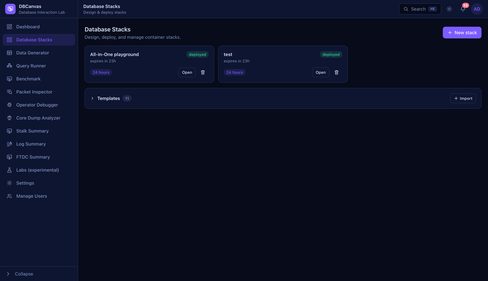

# Getting started

Everything from an empty machine to a running cluster you can connect to, in order.
If you have already installed DBCanvas, skip to [Your first stack](#your-first-stack).

- [Install](#install)
- [Create the admin account](#create-the-admin-account)
- [Where things are](#where-things-are)
- [Your first stack](#your-first-stack)
- [Building one by hand](#building-one-by-hand)
- [Operating a running node](#operating-a-running-node)
- [Connecting to your databases](#connecting-to-your-databases)
- [Putting load on it](#putting-load-on-it)
- [Watching it work](#watching-it-work)
- [Saving a topology for next time](#saving-a-topology-for-next-time)
- [Cleaning up](#cleaning-up)
- [When something goes wrong](#when-something-goes-wrong)

---

## Install

You need **Docker**, and DBCanvas needs access to its daemon socket — it drives the daemon
to create your stacks. That is a privileged capability, so run it somewhere you trust.

```sh
git clone https://github.com/jaimesicam/dbcanvas.git && cd dbcanvas
make install
```

`make install` does three things: builds the base node images, records what each of them
can install (the version pickers read this), and starts DBCanvas at
**http://localhost:8080**.

**The first run takes a while** — it is building operating-system images with systemd in
them. Later runs are just `make compose`, which is quick.

| Command | What it does |
| --- | --- |
| `make install` | Full first-time setup: images, version catalog, start. |
| `make compose` | Rebuild the app and start it. The everyday command. |
| `make up` / `make down` | Start / stop without rebuilding. |
| `make logs` | Follow the application log. |
| `make versions` | Re-probe the repositories for new database versions. |

Every setting has a working default. **Before exposing DBCanvas beyond your own machine,
change the passwords in `.env`** — see [Configuration](CONFIGURATION.md).

## Create the admin account

Open http://localhost:8080. The first time, you are asked to create an account — and
because it is the first, **it becomes the administrator automatically**.

Anyone who signs up afterwards is created as a *pending* user and cannot log in until an
admin approves them under **Manage Users**. That is deliberate: an instance of DBCanvas can
create containers on the host, so accounts are not self-serve.

> Lost the admin password? The app image ships a reset tool — see
> [Recovering an admin password](CONFIGURATION.md#recovering-an-admin-password).

## Where things are

The sidebar is grouped by what you are trying to do.

| | |
| --- | --- |
| **Dashboard** | What is running right now — containers, CPU, memory, recent activity. |
| **Database Stacks** | Where you design, deploy and operate everything. This is the main screen. |
| **Data Generator**, **Query Runner**, **Benchmark** | Put data and load on what you built. |
| **Packet Inspector**, **Log Summary**, **Stalk Summary**, **FTDC Summary** | Find out what happened. |
| **Operator Debugger**, **Core Dump Analyzer** | The deep end — step through a Kubernetes operator, or read a crashed server's core dump. |
| **Labs (experimental)** | Guided scenarios on a disposable stack. |
| **Settings**, **Manage Users** | Your preferences; and, for admins, who may sign in. |

**Anything with a small `?` next to it explains itself.** Hover it — or tab to it — and
DBCanvas tells you what the setting is for, what happens if you leave it alone, and when you
would change it. That is true of every field, every value on a deployed node, every toolbar
button and every entry in the node library. If you are unsure what something does, the
answer is on the screen rather than in this document.

## Your first stack

**The fastest route is a template.** Go to **Database Stacks** → **New stack**, give it a
name, and pick something under **Start from**.


> *Eleven templates ship with the app. Picking one describes what it builds and how many
> nodes it takes before you commit — this one is the reference MySQL HA stack.*

**Lifetime** is how long the stack lives before DBCanvas tears it down for you. Lab stacks
are easy to forget and expensive to leave running, so pick the shortest one that covers what
you are doing; `Infinity` is there when you genuinely need it.

Press **Create** and the whole topology is on the canvas, ready to edit. Then:

1. **Validate** — checks the design without building anything: missing links, impossible
   topologies, host ports that clash. Cheap, and worth doing before a long deploy.
2. **Deploy** — builds it. Nodes come up in dependency order and the console shows each step
   as it happens.
3. Watch the node cards turn **running**.


> *A deployed stack. Green `running` badges mean the container is up **and** provisioning
> finished — a node that failed provisioning says `error` instead, and the deployment console
> has the step that failed.*

A first deploy pulls packages, so it takes minutes rather than seconds. Subsequent deploys of
the same OS are faster, and faster still if you leave *Use Intranet proxy* on — the second
and later nodes take their packages from the proxy's cache.

## Building one by hand

If you would rather assemble it yourself, the rule is: **the Intranet node goes on first.**

Every other node type in the library is greyed out until it is there, because the Intranet
provides what the rest of the stack assumes exists — DNS for the stack's hostnames, a
certificate authority the other nodes trust, OpenLDAP, mail, and the Squid proxy that caches
package downloads.

Then:

1. **Add nodes** from the **Infrastructure Library** on the left. Hover any entry to see what
   that node type actually gets you before you add it.
2. **Connect them** by dragging from one node's port to another's — a database to a PMM
   server to monitor it, a cluster to a ProxySQL in front of it, a backup tool to a SeaweedFS
   S3 node.
3. **Set the options** in the **Properties** panel on the right: the OS and version, whether
   to publish a port to the host, whether to mint a TLS certificate, which PMM node watches
   it.
4. **Validate**, then **Deploy**.

Clusters live inside **frames** — a dashed box that owns its members. Add a *PXC Cluster* and
you get the frame plus its nodes; the frame's own panel sets what is true of the whole
cluster (its name, version, replication mode), and each member's panel sets what is true of
just that node.

## Operating a running node

Two places do everything.

**Right-click any node** for the actions:


| Action | What it is for |
| --- | --- |
| **View config / profile** | Everything DBCanvas recorded: image, version, credentials, certificate, and the provisioning steps it ran. |
| **Enter root console** | A root shell inside the node, in the browser. |
| **File manager** | Browse the filesystem — upload, download, edit a config in place, change permissions. |
| **Copy docker exec command** | The same shell, from your own terminal. |
| **Copy SSH tunnel command** | Only when `SSH_FORWARDING_HOST` is set — see [connecting](#connecting-to-your-databases). |
| **Stop** / **Restart** / **Start** | Lifecycle. The data survives a stop. |
| **Delete node** | Removes it from the canvas and tears down its container. The data goes with it. |

**Click a node** for its panel, which is where the node explains itself:


> *The **Overview** tab: what it actually is, where it is on the network, what monitors it,
> and the exact image and container it is running in. Every row has a `?` saying what to do
> with that value.*

The tabs differ by node type — a Percona Server node has **Overview**, **Credentials** and
**Diagnostics**; a PXC member adds **Certificate**; an Intranet node has LDAP users and mail;
a SeaweedFS node has a bucket browser. The **Diagnostics** tab is where you capture a
`pg_gather` report or a `pt-stalk` archive to feed into
[Stalk Summary](STALK_SUMMARY.md).

## Connecting to your databases

Four ways, roughly in the order you will want them.

**1. The web terminal.** Right-click → **Enter root console**. You are root inside the node,
with its client already installed. Nothing to set up, and it works no matter how the node is
exposed. Consoles survive navigating away, and **Settings** decides whether they open docked
at the bottom or in their own window.

**2. From another node.** Every node resolves every other node by name, so from any shell in
the stack, `mysql -h ps-01.example.net -u root -p` just works. The **Ubuntu VNC** desktop node
is the version of this with a browser in it: it resolves the stack's DNS and trusts the
Intranet CA, so it is how you open a PMM console or a Keycloak admin console that is not
published to the host.

**3. From your own machine.** Tick **Export DB port to the host** on the node before
deploying. Leave **Host port** at `0` and Docker picks a free one; the node's panel then shows
which. Connect a local `mysql`, `psql`, `mongosh` or a GUI to `127.0.0.1:<that port>`.

The credentials are on the node's **Credentials** tab:


> *Passwords are masked until you click them. They come from the host's `.env`, so they are
> the same across every node in the installation and a redeploy re-reads them — which also
> means they are not secrets worth protecting. Treat everything in a DBCanvas stack as
> disposable.*

**4. Through an SSH tunnel, when DBCanvas runs on a server.** Published ports bind to the
server's loopback by default (`CONTAINER_BIND_IP`), which is right — an unauthenticated PMM
should not be on the LAN — but it means the browser and the client on your laptop cannot reach
them. Set `SSH_FORWARDING_HOST` in `.env` to where the server answers SSH, and a running
node's right-click menu gains **Copy SSH tunnel command**: the exact `ssh -L` line forwarding
every port that node publishes, each to the same port locally, so every address the UI shows
works verbatim through the tunnel.

The login is filled in from **whoever is signed in to DBCanvas** — sign in as `jaime` and you
get `jaime@10.0.0.7`, which on a server install is usually the account you ssh in with anyway.
Add `user@` to the `.env` value only if everyone should use one fixed login instead.

## Putting load on it

An idle database does not show you very much.

| | |
| --- | --- |
| [**Data Generator**](DATA_GENERATOR.md) | Fills tables with realistic data at the scale it takes to see a problem. Start here — most of the other tools are more interesting against real data. |
| [**Query Runner**](QUERY_RUNNER.md) | Runs SQL across nodes in parallel, gated on the processlist. Good for "do this a thousand times and watch". |
| [**Benchmark**](BENCHMARK.md) | OLTP, OLAP, read-write and read-only workloads with throughput and latency. |
| **App simulators** | Nodes on the canvas that drive continuous, realistic traffic — a hotel booking system, an airline, a car rental fleet, a stock exchange. Link one to a database and it runs by itself. |

The simulators are the closest thing to a real application, and the **Stock Market Sim** is
the one you operate rather than watch — it will drive a Kubernetes operator's cluster too.

## Watching it work

| | |
| --- | --- |
| **PMM** | Add a PMM node and set **Monitored by (PMM)** on your databases. They register themselves at deploy, with metrics and Query Analytics. Open its console from the VNC desktop, or from your browser if you published its port. |
| **Dashboard** | Containers, CPU, memory and recent activity across every stack. |
| [**Log Summary**](LOG_SUMMARY.md) | Several nodes' logs on one timeline, sorted into the good, the warning and the bad. |
| [**Packet Inspector**](PACKET_INSPECTOR.md) | Capture on a node and decode MySQL, PostgreSQL, MongoDB or Valkey off the wire — what the client actually sent, not what you think it sent. |
| [**Stalk Summary**](STALK_SUMMARY.md) / [**FTDC Summary**](FTDC_SUMMARY.md) | Turn a pt-stalk archive or MongoDB's own diagnostic data into charts and a verdict. |

## Saving a topology for next time

Once a canvas is worth keeping, **Save as template** in the toolbar turns it into one you can
apply again. Passwords, host paths and pinned host ports are deliberately left out, so the
template travels — to another stack, another user, or another installation as a `.json` file.

**Insert template** merges a saved topology into a canvas you are already building: ids are
rewritten, a singleton you already have (the Intranet, Keycloak, the desktop) is reused rather
than duplicated, and colliding hostnames are numbered. Whatever had to change is reported when
it lands.

Full detail in [Templates](STACKS.md#templates--save-a-topology-deploy-it-again).

## Cleaning up



- **Destroy** (in the designer toolbar) tears down every container and volume but keeps the
  design on the canvas, so you can deploy it again. The data inside the nodes is gone.
- **Delete** (the bin icon in the stack list) removes the stack entirely, containers included.
- **The lifetime** does it for you. A stack past its TTL is torn down automatically — which is
  why picking a short one is the right default.

Containers are not free. If the Dashboard says more is running than you expect, that is where
to look.

## When something goes wrong

**A deploy failed.** Open the deployment console — it shows every provisioning step per node,
and the one that failed is the one to read. A node that fails leaves the rest of the stack
running on purpose, so you can get into it and look.

**A node says `error`.** Right-click → **Enter root console** and look at the service:
`systemctl status`, then the log. The **View config / profile** entry shows the steps DBCanvas
ran, which tells you how far it got.

**"Add an Intranet node first".** Every node type depends on the Intranet for DNS, the CA and
the package proxy. Add it and the rest of the library becomes available.

**A deploy fails on a port that is already taken.** A pinned **Host port** collides with
something else on the machine — another stack, or something outside DBCanvas. Set it back to
`0` and let Docker choose.

**A version is missing from a picker.** The lists come from `make versions`, which probes the
repositories. Re-run it to pick up newly published builds — see
[Troubleshooting](CONFIGURATION.md#troubleshooting) for the case where a specific minor never
appears.

**You cannot reach a published port.** If DBCanvas runs on another machine, that is expected —
see the [SSH tunnel](#connecting-to-your-databases) above. If it is local, check the node
actually has *Export ... to the host* ticked; without it the node is reachable from inside the
stack only.

---

## Next

- [Stacks](STACKS.md) — every node and cluster type in detail, and everything the canvas can do
- [Feature guides](README.md) — the tools, one page each
- [Configuration & commands](CONFIGURATION.md) — `.env`, `make` targets, troubleshooting
- [Architecture](ARCHITECTURE.md) — how it is wired, and why
