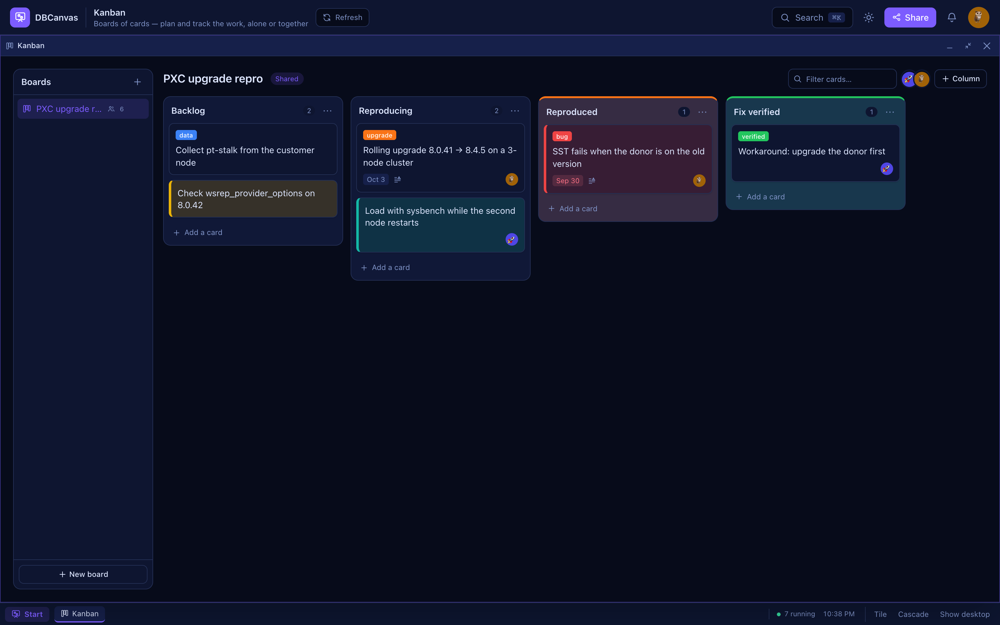

# Kanban

**Kanban** keeps boards of work: columns for each stage, cards for each piece of work, in
the order you put them. Open it from **Start → Workspace → Kanban**.

## Boards

The list on the left is your boards, then the ones colleagues shared. **New board** asks
for a name and what to start with — Basic (To do → In progress → Done), Sprint, Incident,
Support repro, or a blank board — and whether to share it.

A board is yours. **Share with everyone** lets every signed-in user see it and work on its
cards and columns; only you can rename it, share or unshare it, or delete it (right-click
it in the list, or its **⋯**). A shared board follows what others do within a few seconds.

## Cards

- **Add** — **Add a card** at the foot of a column, type, and press **Enter**; the box stays
  open for the next one. **Shift+Enter** is a new line, **Escape** closes it. A column's
  **⋯** adds one at the top instead.
- **Move** — drag a card wherever it belongs: up or down its column, into another column,
  between two cards. A gap opens where it will land, and it lands exactly there. Near the
  edge, the board and the column scroll. **Escape** puts it back. On a touch screen, press
  and hold a card to pick it up.
- **From the keyboard** — **Tab** to a card, **Space** to pick it up, the arrow keys to move
  it (up and down within a column, left and right across columns), **Space** to drop it,
  **Escape** to cancel. **Enter** opens it.
- **Open** — click a card for its title, description, assignee, due date and labels (a
  colour, with a word if you like). Closing the card saves it; **⌘/Ctrl+Enter** saves and
  closes too. A due date shows on the card, amber when it is today or tomorrow and red once
  it has passed.
- **Colour** — right-click a card (or use **Card colour** in the open card) to give it a
  colour: it is tinted, with a stripe down its left edge, so a kind of work stands out.
  The same menu moves a card to the top or the bottom of its column, or deletes it.
- **Delete** — from the open card, or its right-click menu. **Undo** in the notice that follows puts it back where
  it was.
- **Filter** — type in **Filter cards** to see only the cards that mention something, or
  click a face to see only that person's cards.

## Columns

Drag a column by its header to reorder the board. Double-click a column's name to rename
it. Its **⋯** sets a **work-in-progress limit** — the count turns red when the column holds
more — gives it a **column colour** (the lane is tinted, with a coloured top edge), and
deletes the column, together with its cards once you confirm.

## What is stored

Board, column and card text — names, titles, descriptions — is encrypted at rest with the
rest of what people type into DBCanvas (see [Configuration](CONFIGURATION.md)). The
endpoints are under `/api/kanban/` in the [API reference](API_REFERENCE.md).
