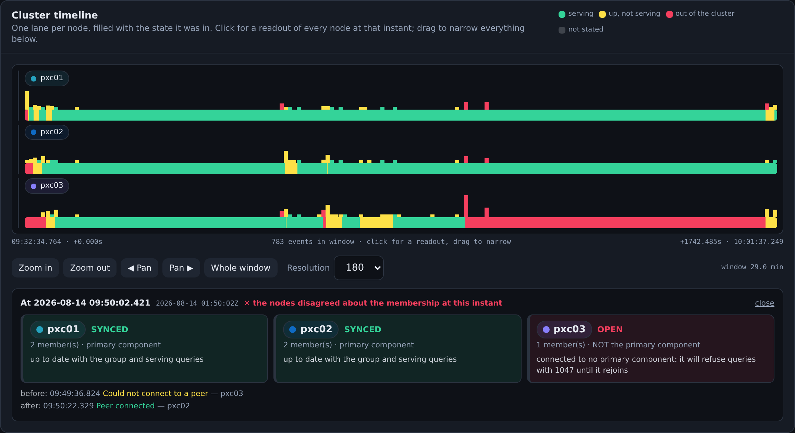

# Log Summary

The **Log Summary** reads several database servers' logs **together**, on one timeline,
and separates the good, the warning and the bad. It is for the question three log files
are opened to answer and none of them answers alone:



> *A Percona Server node's log, read and classified: 32 lines became 23 events over a 16-minute
> window, and the verdict names what they add up to — 6.6 seconds not answering queries, split
> into the 1.5s it spent starting and the 5.1s it was down. The lane below is the state the node
> was actually in, minute by minute; pick several nodes and each gets a lane on the same
> timeline.*

Open it from the sidebar (**Log Summary**) or at `#log-summary`.

It is the other half of the [Packet Inspector](PACKET_INSPECTOR.md). That one answers
"what crossed the wire"; this one answers "what did the servers say about themselves" —
which for a cluster is where the entire story of an outage lives, because the events that
matter most are the ones the server never sends to anybody.

| Family | Depth |
| --- | --- |
| **MySQL / Percona XtraDB Cluster** | full — a Galera event catalogue, cluster-state reconstruction, and verdicts. See [PXC](#pxc-the-log-that-never-says-error). |
| **MySQL asynchronous replication** | full — a replication catalogue and its own verdicts. See [async replication](#asynchronous-replication-a-different-vocabulary). |
| **PostgreSQL** | the Packet Inspector's classifier, on the shared timeline |
| **MongoDB** | the Packet Inspector's classifier, on the shared timeline |
| **PostgreSQL** | full catalogue — standalone, streaming replication and Patroni |
| **Valkey** | the Packet Inspector's classifier, on the shared timeline |
| **Percona Operator for MySQL (PXC)** | full — the operator's own log, the PITR binlog collector's, and every member's, read together. See [the operator](#percona-operator-for-mysql-pxc-three-logs-and-the-outage-is-in-none-of-the-obvious-ones). |
| **Percona Operator for MongoDB (PSMDB)** | full — the operator's log, every member's mongod log, and every member's `pbm-agent` sidecar. See [PSMDB](#percona-operator-for-mongodb-psmdb-the-backup-agents-are-three-logs-and-only-one-of-them-is-working). |
| **Percona PG · Crunchy PGO · CloudNativePG** | full — each operator's own format, with the Patroni-based members read by the existing Patroni catalogue. See [the three PostgreSQL operators](#the-three-postgresql-operators-three-formats-and-only-one-of-them-mentions-the-failover). |
| **Percona Operator for MySQL (Percona Server)** | full — and its members need no new rules: their logs are Group Replication's. See [the sixth operator](#the-sixth-operator-and-the-source-that-is-not-a-log). |
| **Kubernetes Events** | the reason a container was killed, which is in no log at all. See [Events](#the-sixth-operator-and-the-source-that-is-not-a-log). |

---

## Where the logs come from

Two ways, and both make one **bundle**:

- **Read them from the nodes.** Tick the members of a stack and press *Read N logs*. The
  logs are tailed from inside each container and parsed together. Several nodes in **one**
  request, deliberately: three members' logs pulled seconds apart are three views of the
  same cluster, and a UI that made you fetch and combine them by hand would be a worse
  version of `tail`.
- **Upload them.** One file per node, in a single pick. The format is read from the bytes,
  so nothing has to be declared.

The paths tried per engine are the same ones the Packet Inspector uses
(`/var/log/mysqld.log`, `/var/log/mysql/error.log`, PostgreSQL's day-of-week files plus
Patroni's own, MongoDB's, and for Valkey the file **or** the systemd journal, because
dbcanvas sets no `logfile` and Valkey writes to stdout).

A Kubernetes cluster is one hop further: the container this app can reach is the k3s node,
and the logs are inside pods it schedules. So for a K3D frame running one of the two
supported operators the collector runs `kubectl` on the node, and the picker offers every
log the cluster has — **five** sources for a three-member PXC cluster (the operator, three
members, the binlog collector) and **seven** for a three-member MongoDB replica set (the
operator, three members, three backup agents), in one bundle. See
[PXC](#percona-operator-for-mysql-pxc-three-logs-and-the-outage-is-in-none-of-the-obvious-ones)
and [PSMDB](#percona-operator-for-mongodb-psmdb-the-backup-agents-are-three-logs-and-only-one-of-them-is-working).

Bundles live in memory, like the Packet Inspector's captures, and do not survive an app
restart. The raw text of every source is kept alongside the parse, so **Show this in the
file** and **download** both work on exactly what was read.

> **Upload every member's log, not just the one that looks broken.** A node reporting that
> a peer went inactive is telling you about its own network as much as about the peer, and
> the only way to tell those apart is the peer's own log for the same seconds.

---

## Severity is not the log's level

On a Percona XtraDB Cluster node the level field is nearly useless for this. A capture
containing a complete node crash, an eviction, a state transfer and a full rejoin held:

```
314 [Note]     8 [System]     5 [Warning]     0 [ERROR]
```

`declaring node with index 1 suspected`, `suspected node without join message, declaring
inactive` and `Shifting SYNCED -> OPEN` are the whole story of an outage, and every one of
them is a `[Note]`.

So severity here comes from what a record **means**:

| | | |
| --- | --- | --- |
| ✓ **Good** | the cluster reaching a healthy state | `Synchronized with group, ready for connections`, `Member synced with group`, `State transfer complete` |
| **!** **Warning** | degraded, transitional, or expensive but working | `Shifting SYNCED -> DONOR/DESYNCED`, `SST in progress`, `Applying backlog`, `Peer went quiet` |
| ✕ **Bad** | broken, gone, or refusing to serve | `Received NON-PRIMARY`, `declaring node … inactive`, `Will never receive state. Need to abort.` |
| · Background | real records, but not news | quorum results, view restatements, provider configuration |

A record the catalogue calls background but the server itself called an error is still an
error — an unrecognised `[ERROR]` is never filed as information.

Colour is never the only signal. The palette is the validated `--status-ok` /
`--status-warn` / `--status-crit` triad (see the note in `app/web/src/index.css`), and
every row carries the glyph and the word as well, so it survives greyscale and every form
of colour-vision deficiency.

### Which node, in its own colour

Severity answers "how is it doing". A node also needs an identity — "which one is this" —
and the two must not share a channel, or a reader has to work out each time whether magenta
means *pxc03* or *bad*.

So each node gets a colour of its own, from a **separate palette drawn only from the cool
arc**: cyan, blue, periwinkle, violet, magenta. Red, amber and green are the status
palette's and stay reserved. The chip appears everywhere a node is named — the timeline
lane, the sources table, every event row, the node filter, the instant readout — and always
beside the node's **name**, which is what makes the colour an accelerant rather than the
signal.

| Slot | Hue | Light | Dark |
| --- | --- | --- | --- |
| 1 | cyan | `#0e97b4` | `#26a2bf` |
| 2 | blue | `#03539e` | `#0f6ac3` |
| 3 | periwinkle | `#8273ff` | `#887efb` |
| 4 | violet | `#8708d9` | `#9f13fd` |
| 5 | magenta | `#910574` | `#c4039e` |

Chosen by search and checked with a validator, not picked by eye. Measured with `--pairs
all` — all-pairs rather than adjacent, because any two nodes can end up next to each other
in the event list — on every surface this app renders on (`#ffffff` and `#fbf1d3` light;
`#161b24`, `#0e1530`, `#241546`, `#122019` dark):

| | within the set | vs the status triad |
| --- | --- | --- |
| **light** | CVD ΔE 9.6 · normal 16.6 · all ≥ 3:1 | CVD ΔE 9.1 · normal 15.1 |
| **dark** | CVD ΔE 8.8 · normal 16.3 · all ≥ 3:1 | CVD ΔE 15.5 · normal 17.0 |

(ΔE is OKLab ×100; CVD is the worse of protanopia and deuteranopia under
Machado–Oliveira–Fernandes 2009 at severity 1.0. The gates are CVD ≥ 8 and normal-vision
≥ 15.)

Three details that are deliberate:

- **Slot N is the same hue family in both modes**, stepped for each surface. Searching the
  two modes independently produced two perfectly valid palettes made of *different* hues,
  which would have meant a node changing colour when the viewer changed theme — and the
  colour is its identity.
- **The dot carries the colour; the label stays in ink.** A hue validated to 3:1 against the
  surface is a legal mark, not legal type.
- **It stops at five.** A sixth hue in that arc could not be separated from the first five
  by a colour-blind reader, and cycling would put two nodes on screen wearing the same
  colour. So a sixth source gets a neutral chip and the page says so. That is only safe
  because the name is always there.

---

## Records, not lines

The most informative things a Galera node writes are **not single lines**:

```
2026-08-14T01:42:31.045860Z 0 [Note] [MY-000000] [Galera] Current view of cluster as seen by this node
view (view_id(PRIM,0bc20092-ac42,4)
memb {
	0bc20092-ac42,0
	23503af2-adb5,0
	}
joined {
	}
left {
	}
partitioned {
	119e686d-8942,0
	}
)
```

The header says nothing at all. Everything that matters — who is still here, who is gone,
and whether the view is the primary component — is in the lines below it. A line-at-a-time
reader throws all of it away. The same is true of `Quorum results:` (`members = 2/3`) and
of the `View:` block, which is the only place member UUIDs are paired with node names.

So a log is folded into **records**: a header plus every line under it that is not itself a
header. Two consequences worth knowing:

- **Untimestamped blocks are placed.** `Log of wsrep recovery (--wsrep-recover):` and its
  output carry no timestamps at all. They inherit from the record beside them and are
  marked `≈` in the list.
- **Repeats collapse.** A partitioned node writes the same peer-timeout line every three
  seconds for as long as the outage lasts. Identical records fold into one row with a count
  and a span (`×24 over 47.3s`) — but **never** state transitions, membership changes or
  state transfers, because folding those would destroy the timeline they are built from.

Roughly one event is kept per twenty raw lines of a Galera log; the rest is internal
bookkeeping. Nothing is hidden — the raw file is one click away on every event.

---

## The cluster timeline

One **lane per node**. The filled bar underneath is the state that node was in; the ticks
above it are events, coloured by the worst thing in each bucket.

The state track is the point. A row of event dots tells you something happened; a filled
lane tells you what each node **was** during and between them — which is the only way to
see at a glance that two members stayed green while a third went red for fifty seconds.

| State | Colour | Meaning |
| --- | --- | --- |
| `SYNCED` | good | up to date with the group and **serving queries** |
| `JOINED` | warning | has the data, still applying its backlog — not in the read pool, and holding flow control on everyone else |
| `JOINER` | warning | receiving a state transfer; answers nothing |
| `DONOR` | warning | feeding a transfer to a joiner, desynced while it does |
| `PRIMARY` | warning | in the primary component but not yet joined |
| `OPEN` | bad | no primary component — refuses every query with **1047** |
| `CLOSED` | bad | the provider is shut down |
| `DOWN` | bad | the server is not running |
| `UNKNOWN` | grey | the log does not say |

The two Kubernetes sources have lanes of their own, and neither claims to say anything
about whether queries were being answered — the members' lanes do that:

| State | Colour | Meaning |
| --- | --- | --- |
| `LEADER` | good | the operator holds the leader lease — this is the process actually reconciling |
| `NOT-LEADER` | warning | the operator is up and holds no lease: it is watching, and changing nothing |
| `COLLECTING` | good | binary logs are being uploaded; point-in-time recovery reaches the present |
| `PITR-GAP` | bad | the collector cannot continue its sequence — recovery cannot cross this point |
| `PITR-OFF` | bad | no collector is running: from here, only a full backup can be restored |
| `CR-READY` | good | the MongoDB operator considers the cluster to match its spec |
| `CR-INIT` | warning | it is changing the cluster — ordinary during a rollout, and a cluster that never leaves it is stuck |
| `CR-ERROR` | bad | it could not bring the cluster to its spec |
| `SLICING` | good | this backup agent holds the PITR lock and is streaming the oplog — the only member of its set that is |
| `PBM-IDLE` | warning | the agent is up and another member won the nomination: normal, and its log will say almost nothing |
| `PBM-LOST` | bad | the agent cannot reach the cluster, so it can neither slice the oplog nor record that it failed to |
| `SWITCHOVER` | warning | CloudNativePG is moving the primary — no member is accepting writes until it finishes |
| `MANAGING` | good | a CloudNativePG instance manager is up and looking after its member |

**Click** for a readout of every node at that instant. **Drag** to narrow a window — the
event list, the ticks and the filters below, *and the verdict above*.

### The verdict narrows with it

Dragging a window is asking "what does this stretch add up to", not "show me fewer rows",
so the verdict answers for the window rather than for the whole bundle. Three kinds of
conclusion come back and only two of them can be filtered by time:

| | |
| --- | --- |
| a **span** (`restore ran for 24m`) | kept when it **overlaps** the window. Containment would be wrong: a four-minute restore is exactly what you still want to see when you drag a thirty-second window into the middle of it, which is the case people zoom in to investigate |
| an **instant** (`a server stopped abnormally`) | kept when it falls inside |
| **undated** (`what this cluster is configured with`, `point-in-time recovery is not running`, `these logs do not cover a common period`) | **never hidden.** These stay true of any window, and a page that silently dropped the most important line on it because the reader zoomed in would be worse than one that never narrowed at all |

The undated ones move to an **About the whole bundle** group underneath, so the narrowed
list reads as the answer to "what happened *here*" without the bundle-wide notes on top of
it. The header carries the window and a **whole window** link back out, and the count says
how many dated conclusions were hidden — never how many were dropped silently.

### Where the state track comes from when the log does not say

A log is almost always a fragment, and a node that was already `SYNCED` when it begins
never logs a transition *into* `SYNCED`. Two answers, and the UI distinguishes them:

1. **Stated.** The left-hand side of the first transition *out* of a state is not a guess:
   `Shifting SYNCED -> DONOR/DESYNCED` says outright what the node was doing a moment
   earlier.
2. **Deduced**, drawn at reduced opacity and labelled *deduced* in the tooltip. A member
   that logs no state transition at all did not change state during the window — every
   transient state necessarily ends and would have logged its end. If it also reports
   itself inside a primary component, `SYNCED` is the only state left.

Anything else stays `UNKNOWN`, which is an honest answer and is drawn as one.

**A deduction never covers time the log did not.** The weakest of the seeds is "this server
was writing to its log, so it was running" — sound for the stretch the log spans, and
nothing outside it. Painting it across the whole bundle is how a reader got two different
pictures of the same cluster: five thousand lines of a busy `mongod` is *2,702 NETWORK and
1,900 ACCESS records with no REPL among them*, covering eight minutes of a two-and-a-half
hour window, and all three members were drawn **serving, in green, for the whole of it**.
Uploading the same members' full logs gave the correct and much less green answer.

So a deduced seed now begins at the source's own first record, and the lane before it is
`UNKNOWN`. A **stated** seed is untouched — the left-hand side of a first transition is a
real statement about the moment before it, not an inference from the record's existence.

The asymmetry with the end of a track is deliberate: a log that *stops* is a server that
carried on and had nothing to say, while a log that *starts late* is a server this bundle
knows nothing about until it does. Which is also why the tail length matters more than it
looks: on a busy server, raise it until the lanes stop being grey.

### Transitions are not states

Galera walks several states in the same microsecond. Cutting a member off produced, within
370 µs: a view saying "1 member, non-primary" while the node was still nominally `SYNCED`,
then `NON-PRIMARY`, then `Shifting SYNCED -> OPEN`. All three are real records. A readout
that lands in the first of them reports "SYNCED, 1 member, non-primary" — three facts that
were momentarily all true and together describe nothing. So a state lookup skips phases
shorter than 50 ms; the timeline still draws them.

---

## Clocks

MySQL writes RFC3339 with an explicit zone (`Z` under the default `log_timestamps=UTC`, an
offset under `SYSTEM`), so records from nodes in **different timezones** land on the correct
absolute instant with nothing to configure.

What parsing cannot fix is host clock skew. Each source carries an adjustable **offset**,
and the bundle reports when two sources do not overlap at all — the shape of "you uploaded
logs from different days", which otherwise draws a perfectly plausible and completely wrong
timeline.

### A log that stops is not a log that ended

The other half of that, and it was wrong until a Kubernetes bundle made it visible. **A
source's last record is not the end of what it covers.** A healthy PXC member writes
nothing at all — measured: thirty seconds of continuous inserts across three members
produced zero records on all three — so its file simply stops, hours before you read it.

Reading the stop as the end of its coverage produced a false "no common period" on five
logs tailed from **one** cluster in **one** request: three healthy members whose last line
was the 06:14 record where they finished starting, beside a binlog collector whose pod had
restarted at 06:23, so its container log begins there. Latest start after earliest
last-record, and the page announced that nothing could be compared across nodes.

So a log **read from a node** is covered up to the moment it was read, and the sources
table says how long it has been quiet:

```
cluster1-pxc-0   22 Aug 14:11:26 → 22 Aug 14:14:53 · silent for 2.1 h
```

which is the good news stated as such, rather than a range that looks like it ran out. An
**uploaded** file keeps the strict reading: nothing knows when it was cut, so its last
record really is all the evidence there is about how far it reaches. And a genuine
disjointness on a node bundle — a rotated log, or a pod whose container log starts after
another's ends — is still reported, now with the sentence that says which of the two it is.

---

## PXC: the log that never says ERROR

The Galera catalogue was written against logs from a **real three-node PXC 8.0.46 cluster**,
captured while doing the things that produce them. The corpus is in
`app/testdata/logsummary/` and the tests read it:

| Fixture | What was done to the cluster |
| --- | --- |
| `s01-bootstrap` | a cluster created from nothing, then joined by two members |
| `s03-crash-kill9` | `kill -9` on pxc02 under write load → eviction, auto-restart, IST rejoin |
| `s04-graceful-restart` | `systemctl restart mysql` on pxc03 — the clean departure |
| `s05a-ftwrl-desync` | `FLUSH TABLES WITH READ LOCK` held 50 s → Donor/Desynced |
| `s05b-flow-control` | a hard write flood against a deliberately slowed member |
| `s06-network-partition` | pxc03 cut off ports 4567/4568/4444 with `tc netem` for 52 s |
| `s07-sst-rejoin` | the aborted node started again, rejoining by full SST |
| `s08-crash-signal11` | `kill -11` to mysqld on pxc02 under load — a real crash, with the handler's own block |

Four things that corpus taught, each of which changed the design:

### 1. `left {}` does not mean "shut down cleanly"

That was the first guess and the fixtures disproved it. Across **every** capture,
including a plain `systemctl restart mysql`, `left` is empty and the departing member
appears under `partitioned` — the EVS layer sees a closed socket either way.

What actually separates maintenance from an incident is what the survivors logged in the
seconds **before** the view changed:

| | Survivors' log in the seconds before the view change |
| --- | --- |
| `systemctl restart` | *nothing* — the view changes ~1 ms after the socket closes, because the leaving node announced itself |
| `kill -9` | ~5 s of `reconnecting to … attempt 0` and `Connection refused`, then `declaring node with index 1 suspected, timeout PT5S (evs.suspect_timeout)` and `declaring inactive` |

So that is what the verdict decides on. One more wrinkle the corpus supplied: a process
that **aborts** also closes its sockets on the way out, so from the survivors' side a crash
looks identical to a clean stop — the "clean departure" verdict is therefore withheld
whenever the bundle holds a crash around the same time.

### 2. A NON_PRIM view is a statement about *this* node

When a node leaves or is cut off it writes a `NON_PRIM` view whose `partitioned` list names
every **other** member. Read at face value, one node's departure becomes "the entire cluster
vanished". The view kind decides which of the two records this is.

### 3. `kill -9` is not a crash

The first version of this feature could not see a crash at all, and the corpus is why: its
crash fixture was made with `kill -9`. SIGKILL cannot be caught, so no handler runs, the
process simply stops, and the only trace is what the *survivors* logged. A process that
dies on a catchable signal is a different event, and it writes a block in a format of its
own — no thread column, no `[Level]`, no `[MY-nnnnnn]`, no subsystem, because the signal
handler cannot call into the normal logging path:

```
2026-08-14T07:51:05Z UTC - mysqld got signal 11 ;
Most likely, you have hit a bug, but this error can also be caused by malfunctioning hardware.
Server Version: 8.0.46-38.1 Percona XtraDB Cluster (GPL), Release rel38 …
Thread pointer: 0x0
stack_bottom = 0 thread_stack 0x100000
 #0 0x7c27e246dc2f <unknown>
 …
```

Since none of that matched a header, the whole block folded into the **body of the record
above it** — which on a live cluster was `Member synced with group`, severity **good**. A
crash was being reported in green. And when the block happened to start an excerpt, with no
record above to absorb it, it was dropped outright.

Crash blocks are now records of their own. The record names the signal and what it means,
the build, whether a statement was running (the handler prints it when there was one), and
whether the backtrace resolved — a package build with no debug symbols prints every frame
as `<unknown>`, which is worth saying rather than leaving the reader wondering. The handler's
whole output stays in the record's detail, because that is the bug report.

`TestLogSummaryCrashEvidenceIsNeverLost` asserts the general rule against the raw fixture
text rather than the parsed events: if a line in the file says the server crashed, an event
must say the server crashed, at that line. Folding is what makes this feature work and also
what makes it dangerous, and that test is the guard.

### 4. Flow control is very nearly invisible

Driving a three-node cluster hard enough to register **ten** received flow-control messages
and **91 ms** of measured pause (`wsrep_flow_control_recv`, `wsrep_flow_control_paused_ns`)
produced exactly **one line** in the error log — and it was the *threshold*, not a pause.

So the Log Summary never reports "no flow control" from silence. It says the log cannot
tell you, and where to look instead (`wsrep_flow_control_paused`, `_sent`, `_recv`,
`wsrep_local_recv_queue_avg`, or the same series in PMM). What the log *can* tell you is the
interval itself, and an unusually low one is promoted to a warning: the default is
`gcs.fc_limit` (100) scaled by member count — 141 for two members, 173 for three — so a
cluster reporting `[2, 2]` will pause every writer as soon as one node is a couple of
writesets behind.

Setting `gcs.fc_debug` does add `FC: queue size: …` records, at the cost of a lot of volume.

---

## Asynchronous replication: a different vocabulary

Galera is a *synchronous* cluster, and its log is about membership and quorum.
Asynchronous replication has neither. Its records are about channels, the I/O and SQL
threads, GTID sets and binary-log coordinates — and its failure modes differ in kind: a
Galera member that falls behind is held back by flow control, while a replica that falls
behind is simply allowed to, silently, for as long as you let it.

The rules were written against a live three-node Percona Server 8.0.46-37 GTID topology —
one source, two replicas — captured while doing this to it:

| Fixture | What was done |
| --- | --- |
| `r02-dupkey-conflict` | a row written straight onto a replica, then the same key from the source → the applier stops with **1062** |
| `r03-repl-auth-fail` | the replication user's password rotated under a running replica → **1045** |
| `r04-binlog-purged` | `PURGE BINARY LOGS` while a replica was stopped and behind → **1236** |
| `r05-replica-lag` | a replica held 61 s behind by a table lock |
| `r06-stop-start-replica` | a clean `STOP REPLICA` / `START REPLICA` |
| `r07-source-crash` | SIGSEGV to the source with both replicas connected |
| `r08-replica-crash` | SIGSEGV to a replica mid-apply, and its XA crash recovery |
| `r09-source-unreachable` | 100% packet loss on 3306 from a replica for 80 s |

Unlike Galera, the **level field is usable here**: replication failures arrive as real
`[ERROR]` records with MY- codes and the good news as `[System]`. What the level cannot
tell you is which of them stopped replication and which the server will quietly retry out
of — so severity still comes from meaning.

Three things that capture taught, each of which changed the code:

### A replica can stop and keep looking healthy

`Replica_IO_Running: Connecting` is not a state anything logs repeatedly. When the
replication user's password was rotated, the replica wrote **one** error and then said
nothing for the rest of its life:

```
Error connecting to source 'repl@mysql01.example.net:3306'. This was attempt 1/86400,
with a delay of 60 seconds between attempts. Message: Access denied … Error_code: MY-001045
```

`1/86400` at 60-second intervals is **sixty days** of silent retrying. The record says so
in words, because that retry policy is the difference between "it will fix itself" and "it
will sit there until somebody looks".

### Lag is invisible, and so is a network outage

A replica held 61 seconds behind its source, while the source wrote continuously, produced
**not one record** about it — the same shape of blindness as Galera's flow control, and
handled the same way: the page states that the log cannot tell you, and points at
`Seconds_Behind_Source` and `performance_schema.replication_applier_status_by_worker`.

Worse, cutting a replica off its source with 100% packet loss produced **no disconnect
record at all**. The I/O thread blocked until `slave_net_timeout` rather than erroring, so
an 80-second outage left exactly one trace: the line saying it had *connected*. So a
"connected to source" with no failure and no restart before it is itself the evidence —
`lsFindingSilentReconnect` reports it, and names the other thing that looks identical
(somebody running `START REPLICA`), because the log genuinely cannot separate them.

### A server that is not a cluster member has no wsrep state

The first version reused the Galera state vocabulary for every MySQL log, so a plain
replica sat in `CLOSED` from its first start-up record onward — nothing ever moved it out.
A live, entirely healthy replication topology was reported as three servers that had not
served a query in thirteen minutes. Non-cluster servers now get the only two states they
have, `RUNNING` and `DOWN` (plus `STARTING`), and "was it serving" is a predicate over both
vocabularies rather than "is it SYNCED".

### The verdicts it adds

| | |
| --- | --- |
| **Replication stopped** / **still broken at the end of the log** | per replica, the failure that caused it and — when there is one — the recovery that paired with it, with the outage measured |
| **The source purged binary logs this replica still needed** | the async twin of "IST impossible, falling back to SST": the missing GTID range, and that the replica has to be rebuilt |
| **A replica reconnected without anything saying it had disconnected** | see above |
| **Replication lag is not recorded in this log** | the honest note |

One more thing the fixtures produced, which is not about replication at all: Percona Server
writes the crash block **twice** — once raw and once again line by line through the error
log as `MY-013951`. Left alone, one crash became twenty-odd separate "Server crashed" rows,
the bug-report URL among them. The re-emitted block now folds into the raw one, so a crash
is one record whichever way the build writes it.

---

## Group Replication and InnoDB Cluster: the log that says what it means

The third cluster vocabulary, and the one that reads most easily. Where a Galera node
narrates an outage in `[Note]` records and multi-line view blocks, the Group Replication
plugin writes one coded, complete, single-line record per event and says what it is doing
in plain English:

    Plugin group_replication reported: 'Member with address gr03:3306 has become unreachable.'
    Plugin group_replication reported: 'Primary server with address gr01:3306 left the group. Electing new Primary.'
    Plugin group_replication reported: 'This server is not able to reach a majority of members
                                        in the group. This server will now block all updates.'

Every rule was written against a live three-node Percona Server 8.0.46-37 single-primary
group, deployed by DBCanvas in **both** of its modes — raw `groupreplication` and
MySQL-Shell-managed `innodbcluster` — and driven through fifteen scenarios. The fixtures
are the `g*` directories under `app/testdata/logsummary/`.

Member states are GR's own, spelled as `performance_schema.replication_group_members`
spells them, plus one the plugin describes but the table does not name:

| state | |
| --- | --- |
| `ONLINE` | in the group, caught up, serving |
| `RECOVERING` | in the group, still applying the backlog — it has the data, it is not usable |
| `BLOCKED` | cannot see a majority: every write refused, reads still served, **stale** |
| `ERROR` | the plugin stopped on an error and the member removed itself |
| `OFFLINE` | mysqld is up, Group Replication is not — the server is not in its cluster |

They are deliberately not folded into Galera's `SYNCED`/`JOINER`/`DONOR`. The two machines
answer the same question, but `RECOVERING` is not `JOINER` — a joiner has no data, a
recovering member has data and is catching up — and somebody reading a GR member wants the
word that appears in the table they are about to query.

### 1. A clean stop and a death *are* distinguishable here

This is the thing Galera cannot do (see `left {}` above), and GR settles it with one
record. A `systemctl stop` produces `Members removed from the group` with **nothing** in
front of it, because the leaving member announces itself. A `kill -9` produces
`Member with address … has become unreachable` **first**, and the removal follows one
expel timeout later — 16.0 s in the captures, twice, to the tenth of a second.

### 2. The two ways of leaving the group have opposite read-only outcomes

The single most dangerous thing in the file, and the reason the catalogue was worth
writing:

| exit | what the plugin does | left |
| --- | --- | --- |
| applier failure (`MY-011451`/`MY-011452`) | `MY-011712` — "set into read only mode" | **safe** |
| refused at join (`MY-011526`/`MY-011522`) | `Setting super_read_only=OFF` | **writable** |

Both read as "the member left the group" if you only match the leave record. A member out
of the second exit is up, accepting writes, and holding data the cluster does not have —
and the corpus caught it happening: the load generator running during the capture did what
any connection pool does, reconnected to the first member that answered, and wrote 1,263
rows into a server that was no longer part of the cluster.

### 3. A split does not heal itself, and the log does not say so

Cutting one of two remaining members off port 33061 produced `MY-011495` on **both** sides:
neither had a majority, both blocked every write, and every member was up and answering
reads perfectly happily throughout.

Restoring the link changed nothing. For the two and a half minutes until an operator
intervened, neither side logged another word. The plugin does own the vocabulary for
recovery — `MY-011494` *is reachable again*, `MY-011498` *has resumed contact with a
majority* — and it appeared only once somebody acted. So a block with no matching
`MY-011498` after it is reported as **still in force at the end of the window**, rather
than as something that presumably sorted itself out.

### 4. A member can be up, writable, and not in the group — silently

`kill -9` left systemd to restart mysqld, which came back, logged `ready for connections`,
and stopped there: `group_replication_start_on_boot` is OFF in raw GR mode, so nothing
rejoined. Measured at that moment: `super_read_only=0`, one row in
`replication_group_members` (itself), and 666 transactions behind the group. Its own log
never mentions any of it — a monitor that checks whether mysqld is up sees a healthy
server.

That is why `ready for connections` on a group member resolves to `OFFLINE` and not
`RUNNING`, and why a member whose own fragment contains no plugin records at all is still
recognised as one when **another** source names it as a member.

### 5. Flow control is invisible — more absolutely than in Galera

Measured, and pushed as far as the settings allow: `flow_control_mode=QUOTA`, both
thresholds at 1 (the most eager configuration there is), a member slowed to 120 ms RTT with
netem, and **1,364 transactions certified** through the flood. All three members wrote
**zero** lines. Galera at least writes its interval once when membership changes; GR does
not write even that. The numbers live in
`performance_schema.replication_group_member_stats`, and the finding says so instead of
letting silence read as health.

### 6. A healthy InnoDB Cluster is *full* of errors

Deploying a perfectly good three-node cluster through MySQL Shell wrote **26 `[ERROR]`
records** across the three members. Every one was Shell checking the instance: it opens a
throwaway replication channel called `mysqlsh.test` and deliberately fails to start it, to
learn whether the instance can replicate and whether its server id collides — and it asks
the server to start Group Replication before configuring it, so *"the
group_replication_group_name option is mandatory"* and *"Group Replication plugin is not
installed"* are answers to Shell's questions, not faults.

This is the exact mirror of the PXC lesson at the top of this document. There the level
**under**-reports the severity; here it wildly **over**-reports it. Trusting it would
report every InnoDB Cluster as broken on the day it was built, so those records are kept —
deleted evidence is not evidence — and filed as information with the explanation attached.
The one rule in the package that may overrule a record's own level is used here and
nowhere else.

The two modes differ in one more way worth knowing, and it is the difference between an
outage that ends by itself and one that does not: Shell sets
`group_replication_start_on_boot=ON`. The same `kill -9` that strands a raw GR member
outside its group leaves a Shell-managed one to rejoin on its own — verified by doing it
to both.

### The verdicts it adds

| | |
| --- | --- |
| **Every member lost its majority — the cluster stopped accepting writes** | who blocked, when, and whether anything ever recorded them recovering |
| **A member left the group and went back to accepting writes** | the split-brain check: a leave followed by `super_read_only=OFF` that was not an election |
| **A member has transactions the group does not, and was refused** | with the offending GTID ranges, and why raising the clone threshold cannot fix it |
| **A server restarted and never rejoined its group** | built on the absence of a plugin start after the last start-up |
| **The group elected a new primary** | with the write outage measured from the earliest notice that the old primary had gone quiet |
| **A member rebuilt itself from a clone** | including the two surprises: the recipient's data is erased first, and mysqld restarts itself at the end |
| **A member is stuck recovering and is not serving** | the donor-cycling loop, which never reports a final failure |
| **Some of these errors are MySQL Shell testing the instance, not failures** | see above |
| **Flow control leaves no trace in this log at all** | the honest note |

---

## MongoDB replica sets: the log that repeats itself

The fourth cluster vocabulary, and structurally the easiest: since 4.4 `mongod` writes one
JSON object per line, and every message carries a numeric `id` that is stable across
releases even when the English changes. A rule keyed on `21358` keeps working through an
upgrade that rewords the message — the opposite of MySQL's guarantee, and much the more
useful one.

The whole state machine is one record:

```json
{"t":{"$date":"…"},"s":"I","c":"REPL","id":21358,"ctx":"conn301",
 "msg":"Replica set state transition","attr":{"newState":"SECONDARY","oldState":"PRIMARY"}}
```

`newState` **and** `oldState`, which is what makes a fragment readable — a member already
PRIMARY when the excerpt begins never logs a transition into it. Its companion `21215`
reports the same about a *peer* (`{"hostAndPort":…,"newState":…}`), so one member's file
describes the whole set.

Every `mongod` log is parsed here rather than by the shared MongoDB classifier the Packet
Inspector uses, because the facts that matter live in `attr` and the shared entry type does
not carry it. The replica-set sniff decides only the **flavour** — which findings may speak
about this source — and a standalone `mongod` gets no swimlane of replica-set states,
because it has no member states, no elections and no rollbacks and inventing a topology for
it would be worse than saying nothing.

Every rule was written against live three-node Percona Server for MongoDB replica sets,
driven through `rs.stepDown()`, a SIGKILL on the primary under write load, a member cut off
port 27017, a **partitioned primary written to and then healed**, and a wiped data directory
resynced from scratch. The fixtures are `m*` under `app/testdata/logsummary/`.

### Sharded clusters: the router that logs nothing

A sharded cluster is three kinds of process and only one of them is a database. A shard
member and a config-server member are ordinary `mongod`s, and everything above reads them
unchanged. A **mongos** is not a `mongod` at all — it stores nothing, replicates nothing,
and its log is about where things *are* rather than what they are doing.

Which makes it the most misleading file in the set. Stopping an entire three-member shard
under live traffic on 6.0 and 7.0 produced two client-visible failures — a read that failed
with `FailedToSatisfyReadPreference` and a write refused outright — and the router's log
recorded **neither**. Not a warning, not an error. What it recorded was the shard's topology
changing, at `INFO`, over and over. An operator handed that log sees a healthy router for an
outage the application saw plainly.

So a router gets its own flavour, `mongos`, which does two things. It keeps every
replica-set finding away from it — a router monitors every shard and logs a great deal about
replica sets without being in one, and without the gate a perfectly healthy router is
reported as a member that never became primary. And it lets the verdict end with the honest
note, the sharded twin of the replication-lag one: **failed routing is not in this log.**

**One record covers the whole sharding vocabulary.** Every topology change a cluster makes —
a shard added or removed, a collection sharded, a chunk split or moved, every balancer round
— is written by whichever config server is primary under id **22080**, with the operation in
`attr.event.what`:

```json
{"id":22080,"msg":"About to log metadata event","attr":{"namespace":"changelog",
 "event":{"what":"addShard","ns":"","server":"cfg1:27017",
          "details":{"name":"rs0","host":"rs0/s0r1.example.net:27017,…"}}}}
```

One rule reads all of it, and keeps reading it when MongoDB adds an operation, because the
operation is *data* rather than a rule. It is also the only place any of it is recorded — a
bundle without that config server contains none of it, which the finding says out loud.

**A shard with no primary is readable from the router.** `4333213` carries a topology
description whose `topologyType` is `ReplicaSetNoPrimary`, so one router's log says which
shard could not take writes and for how long — including the config servers, which is the
worse case: while *they* have no primary the cluster's metadata is read-only, no chunk can
move, and any migration already in its critical section holds writes to that range.

Measuring that span is where the first version was wrong. Taking the first and last
`NoPrimary` record for a set reported one that was merely still being formed as an outage
"for 0s", and inflated a **twelve-second** config-server outage into **14.4 minutes**,
because the last such record was fourteen minutes after the first with a healthy period in
between. The span is now measured to the record that *ends* it.

The version sweep applies here too, and holds across all three. Between 6.0 and 7.0 MongoDB
replaced the distributed lock manager with DDL coordinators, reworded the shard-identity
warning from "--shardsvr" to "ShardServer role", and stopped auto-splitting chunks; 8.0 added
automatic chunk merging. Every one of those is a different message; **not one is a different
id**. The same driven incident produces the same nine findings on 6.0, 7.0 and 8.0.

8.0's `autoMerge` is the clearest evidence that keying the changelog on one id was right: it
appeared in the 8.0 capture through a rule written and tested entirely against 6.0 and 7.0,
with no code change, because the operation is *data* rather than a rule.

### Across versions: 6.0, 7.0 and 8.0

The design rests on one claim — that MongoDB's numeric ids are stable across releases even
when the English changes — and that claim was worth checking rather than believing. The same
incident was driven against **6.0.29-23** and **7.0.39-21** and the id namespaces diffed
against 8.0.

The claim holds. Every id in the catalogue that fires at all carries the **identical
message** on all three releases; the same physical incident produces the same eight findings
on each. What the sweep did find was three things wrong on this side of the line:

**One record does not exist before 7.0.** `6984700` "Operations reverted by rollback" is the
obvious source for how much a rollback threw away, and a 6.0 rollback read through it reports
that data was lost without saying how much — the one number the reader actually needs.
`21612` "Rollback summary" carries the same counts on every version *and* names the affected
collections and the directory the discarded documents went to, so it is now preferred
outright. 7.0 and 8.0 had been reporting **less** than 6.0 could.

**One rule was a guess and the sweep disproved it.** `20557` sat in the catalogue as "Unclean
shutdown detected". SIGKILLing a `mongod` on 6.0, 7.0 and 8.0 never produced it once.
`22271` ("Detected unclean shutdown - Lock file is not empty"), `501401` and `20631` all did,
on every version — `mongod` says it three times from three subsystems, which is why they
share a rule and collapse into one row.

**A twenty-thousand-line tail with no REPL records in it.** One member's excerpt turned out
to be entirely the replica-set monitor complaining about an unreachable peer — `NETWORK` and
`CONNPOOL`, several thousand records, not one `REPL` among them. The sniff filed it as a
standalone `mongod`, which sent it through the shared classifier, which has no severity
filter: twenty thousand records became twenty thousand events of class *other*, and the
verdict layer read them as an asynchronous replica whose replication was broken. Two fixes:
the sniff now also accepts `attr.replicaSet`, which every replica-set-monitor record carries
on every version, and the MongoDB filter is applied to *every* `mongod` log rather than only
to recognised members.

### 1. A rollback is silent data loss, with a receipt

The one incident in this whole package where committed, acknowledged data is deliberately
discarded. A primary on the wrong side of a partition accepts writes, the majority elects
somebody else, and when the old primary rejoins it throws its writes away. The client was
told they succeeded and is never told otherwise.

The log says exactly how much went and where it was put:

```
21612    Rollback summary   {"rollbackCommandCounts":{"insert":300,"create":1},
                             "affectedNamespaces":["ftdctest.doomed"],
                             "rollbackDataFileDirectory":"/var/lib/mongo/rollback/4275fd4d-…"}
21609    Preparing to write deleted documents to a rollback file
         {"namespace":"lab.t","file":"/var/lib/mongo/rollback/…/removed.…bson"}
```

`21612` rather than the more obvious `6984700`, because `6984700` did not exist before 7.0 —
see the version notes above. The finding leads with the count, names the collections, and its
advice carries the file paths: that file is the only copy left, nothing deletes it for you and
nothing replays it for you.

### 2. It repeats itself, endlessly

A dead peer produces `Heartbeat failed after max retries` **every two seconds for as long as
it is dead** — 1,234 log lines in the forty seconds after one SIGKILL. MySQL and Galera
write a failure once and go quiet. Record collapsing is not a nicety here; without it one
member's outage buries every other record in the file. It is also an asset: the span of the
collapsed row *is* the length of the outage, as the survivors experienced it.

### 3. A cut-off secondary does nothing, and says almost nothing

Galera's minority node refuses queries with 1047 and Group Replication's blocks every write.
A MongoDB secondary that cannot see the primary just keeps serving reads of whatever it has,
falling further behind, logging only heartbeat failures. There is no state change to find.

### 4. Severity comes from the id, because the level is useless

A rollback — the one event here that loses data — is logged entirely at `"s":"I"`. So is an
election, an initial sync, and a member going DOWN.

### And three rules that were wrong

Written from memory rather than from the corpus, and all three caught by it: `22322` is
*"Shutting down checkpoint thread"*, not a fatal assertion; `21444` is a dry-run election
**succeeding**, not failing; `20698` is a restart marker, not a shutdown. Four further rules
have never matched a real record and are fenced off in the catalogue under a heading that
says so — an unexercised rule is a guess until a real log matches it.

### The verdicts it adds

| | |
| --- | --- |
| **Acknowledged writes were rolled back and lost** | how many operations, and the rollback files that hold the only copy |
| **The set had no primary for …** | measured from the peer reports, so one file is enough. A killed primary costs about `electionTimeoutMillis`; the fixture measures 9.6s against a 10s default |
| **A member could not be reached by the rest of the set** | measured from the heartbeat-failure span |
| **The set elected a primary** | and whether it was a requested step-up or a failure |
| **A member rebuilt itself from another member's data** | an initial sync, with how long it took |
| **Replication lag is not in this log** | the honest note — and it points at `diagnostic.data`, which is already on the machine. See [`FTDC_SUMMARY.md`](FTDC_SUMMARY.md) |

---

## The verdict

Everything in the verdict is a statement that could not be made from one node's log alone,
or that requires holding two distant records side by side.

| | |
| --- | --- |
| **A server stopped abnormally** | an abort, an assertion, a fatal signal, an inconsistency eviction |
| **A node restarted after an unclean stop** | `--wsrep-recover` found a *real* position. It runs on every start — including the first on an empty datadir, where it recovers the null UUID and seqno −1 — so only a real position is evidence |
| **A member was lost, not shut down** | a departure with a suspect timeout in front of it |
| **A member left the cluster cleanly** | a departure without one, or a shutdown record |
| **The cluster split — one side kept quorum, the other did not** | who was non-primary, and who was still serving while they were |
| **The nodes did not agree on who was in the cluster** | the same instant, described differently by two members. Downgraded to a warning when everyone was still primary and one was joining, which is ordinary lag rather than a split |
| **Time spent not answering queries** | per node, summed across every stretch outside `SYNCED`, with the reason. Rated *bad* only for time spent in `OPEN` — a running server that can see no primary component — because `JOINER`/`DONOR`/`CLOSED` is planned work |
| **A rejoin needed a full SST because the gcache was too small** | named against the **donor**, whose `gcache.size` is the setting to raise |
| **A full state snapshot transfer ran** / **A state transfer failed** | with duration, and both ends named from the record rather than from whose file it was found in |
| **A member desynced itself from the group** | with duration. Desyncs shorter than 2 s are ignored — a donor desyncs for milliseconds as part of every transfer |
| **A new cluster was bootstrapped** | *bad* rather than a warning when two different nodes did it, which produces two clusters that will never merge |
| **These logs do not cover a common period** | nothing here can be compared across nodes |
| **A backup was restored / a point-in-time restore ran** | per restore, with the full-cluster outage measured, and the two things it quietly did: erased the members' logs and started a new binlog timeline |
| **Point-in-time recovery has a gap** | with the missing GTID range, and that the bucket goes on growing across it |
| **No binlog collector log is in this bundle** | turning PITR off writes nothing anywhere, so the shape of the bundle is the only evidence |
| **A rolling restart applied a configuration change to every member** | with the order, the duration, and which pod the operator treats as primary |
| **A member was shut down while it had no primary component** | on Kubernetes that is the liveness probe, and it is spelled identically to a deliberate stop |
| **The operator's log says nothing about N of the M incidents in the members' logs** | the honest note, and the largest one here |
| **What this cluster is actually configured with** | the effective wsrep provider options, read from the members' own logs, with measured advice — see [tuning](#tuning-a-pxc-cluster-on-kubernetes-what-the-logs-say-it-is-and-what-to-set) |
| **Nothing was written in this window** | a healthy PXC cluster under load writes **nothing** to its error log — measured: thirty seconds of continuous inserts across three nodes produced zero records on all three. So silence is reported as the good news it usually is, together with the other explanation for it |

---

## Two ways to read the events

The event list has a **Merged** and a **By node** layout, and they answer different
questions.

**Merged** is one column in time order: what happened next, whoever said it.

**By node** is the same events and the same order, one column per source, each event under
the node that wrote it. It answers "what was *each* node saying at that moment" — the
question three logs are opened to compare, and the one a single interleaved column makes
you reconstruct by eye. A stretch where only one node is talking is a stripe down one
column; a moment where all of them are is a row across. Two replicas coming up in lockstep
look like this and are hard to see any other way:

```
19:13:54.780   pgc-instance1-44gj-0   Entering standby mode
19:13:54.787   pgc-instance1-44gj-0   WAL replay started
19:13:54.790                          pgc-instance1-6h22-0   Entering standby mode
19:13:54.796                          pgc-instance1-6h22-0   WAL replay started
19:13:54.896   pgc-instance1-44gj-0   Consistent state reached
19:13:55.013                          pgc-instance1-6h22-0   Consistent state reached
```

Three details that make it usable rather than merely correct:

- **The pane scrolls, not the page**, on both axes. `overflow-x` alone is not an option:
  CSS resolves `overflow-x: auto` beside a visible `overflow-y` to `auto` on *both*, so the
  header would stop sticking to the page anyway. Making the pane the scroll container is
  what lets the header stick where it is wanted.
- **The header row and the time column are both sticky.** Scrolling down keeps the node
  names; scrolling right keeps the clock. Without the second, the far columns tell you that
  something happened and not when.
- **Severity is on the cell, not the row.** Two nodes at the same instant are routinely one
  good and one bad, and colouring the row would have to pick one.

---

## Reading a record

Selecting an event shows the classified record, **what it means** in words, the structured
facts pulled out of it (peer, state, member counts, sequence number), the folded
continuation lines, and **Show this in the file** — the surrounding lines of the original,
because a classifier is a *reading* of a log and the reader has to be able to check it.

Member UUIDs are translated to node names wherever the bundle knows one, with the UUID kept
beside the name so a line can still be found in the raw file. The mapping is pooled across
sources: one node's log usually names only some of the members, and the name for the UUID
in front of you is very often in a different file. That is the whole reason to read three
logs together rather than one at a time.


---

## PostgreSQL: the log that says the least

The fifth cluster vocabulary, and the one with the weakest guarantee of the lot.

MongoDB gives every message a numeric id and promises it is stable. MySQL gives most of them
an `MY-nnnnnn` code. PostgreSQL gives **neither** — a server log line is a timestamp, a pid,
a level and a sentence, and the sentence is the only thing to match on. It is also
**translated**: a server running with `lc_messages` set to anything but English writes a log
this catalogue cannot read at all. That is a limitation worth stating rather than
discovering.

There is one escape and the catalogue uses it wherever it can. **SQLSTATE** is five
characters, defined by the standard, unchanged between releases and never translated — but it
reaches the log only if the operator puts `%e` in `log_line_prefix`, which is not the default
and which dbcanvas does not set either. So every rule that has one carries **both**, and a
server configured with `%e` gets the robust match while a server without it falls back to the
English:

```
2026-08-15 11:00:00.000 UTC [123] 53300 FATAL:  sorry, too many clients already
                                   ^^^^^ matched on this when it is there, on the words when it is not
```

### FATAL does not mean what it means everywhere else

The single most important thing about reading a PostgreSQL log, and the thing that made the
first version of this page wrong in both directions.

In MySQL and MongoDB the level is a reliable floor: an `[ERROR]` is a problem and nothing may
be filed below it. PostgreSQL does not work that way.

- **`FATAL` means THIS BACKEND is ending**, not that the server is failing. A client that
  connects while the server is still starting gets a FATAL. So does every connection the
  cluster manager terminates during a routine switchover, and so does a standby noticing that
  its primary has gone. On the corpus, taking the level as a floor produced **twenty-seven
  "bad" events for clients that arrived a second too early during an ordinary restart**.
- **`LOG` is where the important records are.** Every promotion, every timeline switch, every
  recovery, every checkpoint. A page that trusted the level would rank a failover below a
  mistyped password.

So rules that know better say so, and the ones that do not still take the floor.

### Three flavours, because three things share a log

| flavour | what it is | what may be said about it |
| --- | --- | --- |
| `postgres` | a server with no replication in evidence | nothing about clusters |
| `pgstream` | streaming replication, with or without repmgr | replication, promotion, timelines |
| `patroni` | a Patroni member | all of it, plus leader locks and the DCS |

A Patroni member's PostgreSQL log is indistinguishable from a streaming standby's — because
that is what it is. What separates them is the **second log**, and collecting it turned out
to be the first bug: `/var/log/patroni/` exists on an ordinary Patroni node and is **empty**,
because Patroni logs to the journal. The collector now reads the PostgreSQL file *and*
appends `journalctl -o cat -u patroni`, which prints the message without the syslog prefix —
exactly the shape Patroni's own format already has. Both halves are wanted, not one or the
other: Patroni decides the failover and PostgreSQL carries it out, so the decision is in one
file and its consequence in the other, seconds apart.

That also produced the second bug. Two logs concatenated means the file is **not** in time
order, and the state machine walked it as it arrived — carrying the state from the end of the
PostgreSQL log onto the beginning of the Patroni journal. The corpus showed it immediately:
records from the first seconds of a cluster were labelled `STANDBY`, a state that member did
not reach for another minute.

### The finding this catalogue exists for

Stop etcd on every member of a healthy Patroni cluster. Patroni writes:

```
INFO: demoting self because DCS is not accessible and I was a leader
```

and PostgreSQL writes:

```
LOG:  received fast shutdown request
```

**and nothing else.** An operator reading only the database log sees a primary that stopped
for no reason at all. Nothing was wrong with PostgreSQL — Patroni will not stay leader while
it cannot renew its lock, because it cannot tell an unreachable DCS from one that has already
given the lock to somebody else, so it steps down to guarantee there is never more than one
primary. The cause is a network problem between the leader and etcd, and it is in a different
file written by a different process.

The verdict says that outright, and a test asserts the other half of it: that PostgreSQL's
own records for the same window mention neither etcd nor the DCS.

### The honest note, and PostgreSQL's is the worst of the three

MySQL writes nothing when a replica falls behind. MongoDB writes nothing when a member does.
A PostgreSQL standby is worse than silent — it writes

```
LOG:  waiting for WAL to become available at 0/6AE1E88
```

steadily, and that message means the same thing whether the standby is idle and up to date or
**receiving nothing at all**. The corpus contains both cases and they are indistinguishable.
The reader of such a file is not merely uninformed; they are actively reassured.

The fixture proves it: `p02-streaming` contains that message interleaved with
`could not connect to the primary server` while the primary was stopped outright, and a test
asserts both halves are present so the claim stays supported by evidence.

### Three fixtures

`p01-patroni-cluster` is a live three-node Patroni cluster on PostgreSQL 16.14, driven
through a planned switchover, an unplanned failover with the leader SIGKILLed, and a
whole-DCS outage. `p02-streaming` is three nodes streaming with **no** cluster manager
running — the primary stopped, nothing promoted anything, and a standby was promoted by hand.
`p03-standalone` is one server on its own, and exists to prove the cluster findings stay
quiet: telling somebody with a single server that their cluster has no leader is worse than
saying nothing.

## Valkey and Valkey Cluster: the log with no level worth reading

The sixth cluster vocabulary, and the one whose log is least like the other five. Every other
engine here writes a structured header — a level, usually a code, a subsystem. Valkey writes
a pid, a **role letter**, a date with the day first and the month as a name, and one of four
punctuation marks:

```
253:M 15 Aug 2026 23:03:55.100 * Ready to accept connections tcp
  ^  ^ ^                       ^ ^
  |  | |                       | the message
  |  | |                       level: . debug  - verbose  * notice  # warning
  |  | the timestamp — no zone, no year on the journald prefix, no ISO anything
  |  the role this process thought it had when it wrote the line
  the pid
```

### The role letter is the state track

This is the one thing Valkey's log does better than any other engine's here. Everywhere else,
working out what state a node was in means pairing transitions that may be hundreds of lines
apart, and a fragment containing no transition leaves the lane blank — which is why
`lsSeedState` exists and why it has to mark its answers as deduced. Valkey stamps the role on
**every line**. A file whose letters run `M M M S S S` is a demotion with a timestamp on it.

Two things outrank the role, and both are cases where it is true and irrelevant. A server
**LOADING** its dataset off disk reports `M`, is listening, and refuses every command with
`-LOADING`. And a cluster member whose cluster has uncovered slots reports `M` or `S`, is
completely healthy, and refuses every command with `CLUSTERDOWN`.

### The level is worth less than nothing

Across the whole corpus, the entire story of an automatic failover — the failure detection,
the election, the vote, the promotion — is written at `*`, notice. What is written at `#`,
the top of Valkey's scale, is this, on every start of every healthy node:

```
# WARNING Memory overcommit must be enabled! Without it, a background save or replication
  may fail under low memory condition...
```

Taking the level as a floor painted **17 healthy starts** in the corpus amber and would file
a promotion below a host-tuning hint. So the floor applies only to records the catalogue does
*not* recognise, where the server's own opinion is the only one available. The overcommit and
THP warnings are filed as background deliberately — with a `means` that says they matter
exactly once, on the day a fork fails, and that a failed background save elsewhere in the
same log is that day.

### The kill that writes nothing

dbcanvas sets no `logfile`, so Valkey writes to stdout and systemd keeps it: the collector
reads the **journal**, and the journal holds systemd's records beside Valkey's. That is not
noise to filter out. A SIGKILLed `valkey-server` writes **nothing whatsoever** — no crash
report, no last line — so the Valkey half of the file is simply a log that stops and starts
again. systemd's half of the same file is the entire evidence:

```
Aug 15 23:07:26 vkc2 systemd[1]: valkey@dbcanvas.service: Main process exited, code=killed, status=9/KILL
```

Both halves are parsed, marked with different subsystems and given separate catalogues — the
same shape as the PostgreSQL/Patroni pair, and for the same reason: running one rule list over
both matches the wrong things.

It also explains a restart that leaves no trace anywhere else. `Restart=on-failure` brought a
SIGKILLed node back **inside the same second**, so no peer ever noticed and the Valkey log
shows one ordinary start. `Scheduled restart job, restart counter is at 1` is the only record
that it was not one.

### A clean stop and a crash look identical to every other node

Galera can tell a member that left cleanly from one that was lost, and the Log Summary makes a
finding of each. Valkey Cluster cannot. Stopping a node with `systemctl stop` produced on its
peers *exactly* the record a `kill -9` produces, 6.3 seconds later:

```
* Marking node 81ce2216adbcc1e6e9e781d0b280ae899f08b789 (172.19.0.6:6379) as failing (quorum reached).
```

There is no goodbye message in the protocol. The answer is only ever in the departed node's
**own** log — `Received SIGTERM scheduling shutdown` for a stop, systemd's `status=9/KILL` for
a kill — and only if it is in the bundle. So the page says that out loud rather than staying
quiet, because silence here reads as "it was a crash". When the departing node's log *is*
present, the finding gives the answer instead of the caveat — looking only near the departure,
because a node can be killed early in a window, restarted within the second, and stopped
cleanly a minute later, which is exactly what the `v02` corpus contains and what an
unrestricted search got wrong.

### The finding this catalogue exists for

A Valkey Cluster refuses **every** client when any shard's slots are uncovered — and the nodes
doing the refusing are not the node that failed. Measured: one shard of three stopped for
thirty seconds left the other two logging

```
# Cluster state changed: fail
# Cluster is currently down: At least one hash slot is not served by any available node.
```

and nothing else, while every client of every node got `CLUSTERDOWN`. Asked what each node was
doing in the middle of it, the page now answers:

```
vkc1   CLUSTERDOWN  bad   up, healthy, and refusing every command because some other shard's slots are uncovered
vkc2   DOWN         bad   the server is not running
vkc3   CLUSTERDOWN  bad   up, healthy, and refusing every command because some other shard's slots are uncovered
```

That is the sentence three logs are opened to find, and no single one of them contains it.

`cluster-require-full-coverage` decides the blast radius and defaults to `yes`, which is why
one shard's outage is the whole keyspace's. dbcanvas's own Valkey Cluster frame is
**all-primary** (`--cluster-replicas 0`), so there is nothing to promote and a single node
stopping is a cluster-wide outage until it comes back — a separate finding, because the advice
is different: a three-node all-primary cluster is a third of the availability of one server,
not three times it.

### Building a cluster is not an outage

Every node writes `Cluster is currently down: At least one hash slot is not served` while the
cluster is being *created*, before anybody has met anybody. Treating that as an incident would
report every healthy deployment as broken on the day it was built. What is **never** written
during formation is `Cluster state changed: fail` — a cluster that has never been ok cannot
change to fail — and that is the discriminator, verified across both cluster fixtures.

### The honest note, and Valkey's is the largest of the six

Three things a Valkey server does are entirely absent from its log, and each was measured
rather than assumed:

| what happened | what the log said |
|---|---|
| 40,000 writes against an 8 MB `maxmemory` evicted **19,156 keys** | nothing at all |
| a real failed snapshot left the server refusing every write with `MISCONF` | `# Background saving error` — the word `MISCONF` appears nowhere |
| three failed authentications | nothing at all |

The MISCONF one is the worst, because the log does record the *cause* and never the
*consequence*. `stop-writes-on-bgsave-error` defaults to `yes`, so from that line until a save
succeeds the server answers every write with an error only the client ever sees. When a
bundle contains a failed save the note stops being a caveat and becomes a warning about that
server, and its severity rises to say so.

### Three fixtures

`v01-cluster-failover` is six nodes on Valkey 8 — three shards, one replica each — driven
through an automatic failover with the primary SIGKILLed, the old primary rejoining as a
replica, a manual failover handing the shard back, and a whole shard killed so its slots went
uncovered. It is in the bare stdout shape a container or a `logfile`-configured node writes.
`v02-cluster-nocover` is three all-primary nodes on Percona Valkey 9.1.1, read through
`journalctl` exactly as the collector reads it, with one shard stopped for thirty seconds and
no replica to take over. `v03-standalone-repl` is a primary and a replica wired by hand,
driven through a full sync, a killed primary, a partial resync, a manual promotion, a real
persistence failure and the 40,000 writes above.

Both log shapes are in the corpus deliberately: the bare form and the journald-prefixed one
have to parse to the *same instant*, and the inner stamp is the precise one — journald's
prefix carries no milliseconds and no year, so a systemd record borrows its year from the
Valkey records beside it or lands at the far left of every timeline it appears on.

---

## Percona Operator for MySQL (PXC): three logs, and the outage is in none of the obvious ones

The seventh vocabulary, and the first that is not a database's at all.

A PXC cluster deployed onto a K3D frame writes **three** kinds of log, and reading any one
of them alone gets a different wrong answer:

| source | what it is | what only it can tell you |
| --- | --- | --- |
| `<cluster> · operator` | the `percona-xtradb-cluster-operator` Deployment: controller-runtime, tab-separated, facts in a trailing JSON object | the **decisions** — a rolling restart and its order, a backup, a restore and what it cost, which pod it calls primary, how far point-in-time recovery reaches |
| `<cluster>-pxc-N` | each member's ordinary Galera error log | everything an outage actually consists of |
| `<cluster> · binlog collector` | the PITR sidecar Deployment, written with Go's standard `log` package: a date, a time, a sentence | whether point-in-time recovery is running at all, and whether its sequence has a hole in it |

Tick any of them in the picker and they are read together, on one timeline. The member
logs come off the volume (`kubectl exec … tail /var/lib/mysql/mysqld-error.log`); the two
controller logs come from `kubectl logs` against the Deployment rather than a pod, so an
operator that has been restarted is still readable by name.

Everything below was written against a live cluster — PXC operator **1.20.0** running PXC
**8.4.8-8.1** on k3s **v1.36.3**, three members behind HAProxy, backing up to a SeaweedFS
S3 endpoint — driven under continuous write load through a bootstrap, two full backups, a
full restore, a point-in-time restore, PITR on and off, a member force-deleted, a member
cut off with `netem`, a `cr.yaml` change, and two ways of making a backup fail. The corpus
is `app/testdata/logsummary/k*/` and the tests read it.

### 1. The operator's log says nothing about the database

This is the finding the catalogue exists for, and it is the opposite of what everyone
expects from a Kubernetes operator.

`kubectl delete pod cluster1-pxc-1 --force` under write load produced, in the two
survivors' logs: five seconds of reconnect attempts, `declaring node with index 1
suspected, timeout PT5S (evs.suspect_timeout)`, an eviction, a view change, a rejoin and a
state transfer. In the **operator's** log over the same two minutes:

```
06:29:33  INFO  Updated PITR timelines   {…}
06:29:39  INFO  Updated PITR timelines   {…}
06:30:40  INFO  Updated PITR timelines   {…}
06:31:38  INFO  Updated PITR timelines   {…}
```

An operator reconciles a desired state; it does not watch the cluster. So the page says
that out loud — `The operator's log says nothing about N of the M incidents in the
members' logs` — rather than letting a quiet controller read as a healthy database.

### 2. A member that goes non-primary is killed, not left to rejoin

The single most important difference between PXC on Kubernetes and PXC on a machine, and
neither the operator nor the member says it.

`cluster1-pxc-2` was cut off with `tc netem loss 100%`. It did exactly the right thing:

```
05:39:03.843  [Note] [Galera] Shifting SYNCED -> OPEN (TO: 5073)
```

no primary component, refuse every query with 1047, wait to rejoin. **Twenty-five seconds
later** its own log says:

```
05:39:28.069  [System] [MY-013172] Received SHUTDOWN from user <via user signal>
```

Nobody stopped it. A PXC pod's liveness probe asks wsrep whether the member is `Primary`;
a member on the wrong side of a partition is not, so the probe failed and kubelet killed
the container. The record it wrote is **byte-for-byte what a deliberate `systemctl stop`
writes** — so read on its own, this package's own Galera verdict called it *a member left
the cluster cleanly*, a reassuring sentence about a member that was killed.

The pairing is the evidence, and neither log states it: a member that leaves the primary
component and then receives a shutdown signal within a minute, with nothing in the
operator's log about it, was killed by its probe. The reason itself lives in a **Kubernetes
Event** — `Container pxc failed liveness probe, will be restarted` — which is not a log
file anybody tails, so the finding names it rather than pretending to have read it.

Cost: a member that would have rejoined by itself has to be restarted, and at the operator's
shipped `gcache.size` that rejoin is a full copy of the dataset.

### 3. The operator logs its errors at INFO, and its retries at ERROR

The PXC lesson at the top of this document, in a new dialect, and it goes both ways.

```
INFO   reconcile replication error   {… "err": "get primary pxc pod: failed to get proxy
                                      connection: dial tcp 10.43.61.172:3306: i/o timeout"}
ERROR  Reconciler error              {… "error": "exec binlog collector pod …"}
       sigs.k8s.io/controller-runtime/pkg/internal/controller.(*Controller[...]).reconcileHandler
       	/go/pkg/mod/sigs.k8s.io/controller-runtime@v0.24.1/…/controller.go:494
       …
```

The **INFO** record is a failure to reach the database at all — while it repeats, users,
grants and PITR settings are not being reconciled and an edit to `cr.yaml` sits unapplied.
The **ERROR** record is controller-runtime's retry notice, re-emitted on every attempt with
an exponential backoff, so one persistent fault produces dozens of them: 64 in this corpus,
from five distinct faults. Counting them measures the backoff, not the damage. The page
reports the first and last of each fault and the sentence in between, as one finding.

That block also shows why folding matters here: an `ERROR` drags eight to twelve
unindented stack frames behind it, and a line-at-a-time reader turns one failed reconcile
into nine events named after functions in `sigs.k8s.io`.

### 4. The field object has duplicate keys and both of them matter

```
{"controller": "pxc-controller", "PerconaXtraDBCluster": {"name":"cluster1","namespace":"pxc"},
 "namespace": "pxc", "name": "cluster1", "name": "178f8-daily-backup", "schedule": "0 0 * * *"}
```

`name` is written twice: the object being reconciled, then whatever the message is about.
Decoding that into a map keeps the last and throws the cluster's name away — so the fields
are read **in order and with the duplicates intact**, and a rule asks for the first or the
last by name. It is not a corner case; most reconcile records are shaped like this.

### 5. `kubectl logs` on a member is not the member's log

Two traps found by doing it, both now handled:

- **`kubectl logs <pod> -c pxc` is the entrypoint's `bash -x` trace** — `+ echo 'set
  wsrep_on=1;'`, `+ file_env MYSQL_DATABASE` — because mysqld is started with
  `--log-error` pointing at a file on the volume. Reading stdout gets you the shell script
  that started the server and almost none of what the server said. The collector reads the
  file.
- **There is a second copy of it, JSON-wrapped.** The pod's `logs` container tails that
  same file and re-emits every line inside an envelope:

  ```json
  {"log":"2026-08-22T05:21:16.881342Z 2 [Note] … Synchronized with group…\n","file":"/var/lib/mysql/mysqld-error.log"}
  ```

  which is worth having precisely when `kubectl exec` cannot be used — and the member whose
  log you most want to read is the one that is not running. So the file is the primary path
  and the sidecar is the fallback, unwrapped back into the raw error log the parser wants.

### 6. A restore is a full outage, and it erases the members' logs

The operator's restore sequence is legible and the page measures it:

```
05:55:00  stopping cluster            ← the cluster is scaled to zero
05:55:45  starting restore
05:56:05  invalidating binlog collector cache
05:56:05  preparing cluster
06:11:46  point-in-time recovering    ← only when the restore asked for one
05:57:15  starting cluster
```

Measured: **5m 25s** for a full restore of a 130k-row dataset, **5m 54s** when binary logs
had to be replayed on top. The operator writes *no* record saying a restore finished — the
controller simply stops polling — so the end is its last `Waiting for cluster to start`,
which is exact to the five-second poll interval.

Two consequences a reader only meets afterwards, and the finding names both:

- The restore replaces every member's data directory, and `mysqld-error.log` **lives in
  it**. Measured: a member's log went from 923 lines to 313, all of them after the restore.
  A bundle read after a restore may therefore report that its sources do not overlap, which
  is true and is worth knowing rather than puzzling over.
- The restore rewinds the GTID history, the collector's cache is invalidated, and a new
  timeline begins. `Gap detected in binary logs` followed three minutes later in the corpus.
  **Take a fresh full backup immediately** — point-in-time recovery cannot cross the
  boundary.

### 7. Point-in-time recovery: the two things only the collector knows

The collector's log is the third format — Go's standard logger, no level, no timezone, and
multi-line records whose continuations are the data:

```
2026/08/22 06:00:33 Peer list updated
was []
now [cluster1-pxc-0.… cluster1-pxc-1.… cluster1-pxc-2.…]
```

Two of its records are the reason to read it at all:

```
ERROR: Gap detected in the binary logs. Binary logs will be uploaded anyway,
       but full backup needed for consistent recovery.
```

A gap is silent data loss with a delay on it. The collector *keeps uploading*, so the
bucket goes on growing and every dashboard looks healthy until somebody tries to restore
across the hole. The operator's own half of it names the range —
`Gap detected in binary logs {"missingGTIDSet": "635a239e-…:6497-6504"}`.

```
switching PITR binlog source from cluster1-pxc-0.… to cluster1-pxc-1.…
  because current source host cluster1-pxc-0.… is not healthy (not Synced/Primary)
```

The collector reads binary logs from **one member at a time** and moves when that member
stops being Synced/Primary. That makes this line a *second witness* that a member was
unhealthy, at a moment the operator's own log says nothing about.

And one absence: turning PITR **off** writes nothing anywhere. `spec.backup.pitr.enabled:
false` deletes the collector Deployment, and a deleted Deployment writes no farewell. So
the only evidence is the shape of the bundle — an operator log with no collector beside it
— and the page says exactly that rather than staying quiet, because from that moment the
only recovery point is the last full backup.

The one number worth watching is in the operator's log and nowhere else:

```
INFO  Updated PITR timelines  {… "latest": "2026-08-22 06:12:53 +0000 UTC", "lastBackup": "backup2"}
```

`latest` is the newest moment a restore could currently reach. A restore asking for
anything after it cannot be served.

### 8. A rolling restart, and the one fact Galera does not have

Changing `spec.pxc.configuration` triggers a **smart update**, which the operator narrates
in full:

```
statefulSet was changed, run smart update
primary pod                      {… "pod": "cluster1-pxc-0"}
apply changes to secondary pod
Pod is not updated  ×2 · pod is waiting · Pod is not running
Pod is updated, running and ready
apply changes to primary pod
smart update finished
```

Measured: **3m 0s** for three members. `primary pod` is the interesting one — in Galera
every member is a primary, but the operator picks one for HAProxy to send writes to and
restarts it **last**, so the write endpoint moves exactly once instead of once per member.
That fact exists in no member's log.

### 9. A failing backup stays `Running`

A backup pointed at an unreachable S3 endpoint produced five errored Jobs over
**seventeen minutes**, and the `PerconaXtraDBClusterBackup` stayed in `Running` the whole
time — because the operator retries up to `spec.backup.backoffLimit` (6). A dashboard
reading the CR's status sees a backup in progress, not a backup that is not going to
happen. The page reports backups that started with no success recorded, and points at
`kubectl get jobs -l percona.com/backup-job=true`, where the reason is.

The other failure mode is louder and cheaper: a storage name that does not exist fails the
CR immediately with `"error": "storage nosuchstorage doesn't exist"`.

---

## Tuning a PXC cluster on Kubernetes: what the logs say it is, and what to set

The shipped `cr.yaml` has **no `spec.pxc.configuration` section at all**, so a reader of
the custom resource sees no numbers whatsoever — and neither does `kubectl describe`, or a
dashboard, or the operator's log. There is exactly one place the effective configuration
exists, and it is a line every member writes on every start:

```
[Note] [Galera] Passing config to GCS: … evs.suspect_timeout = PT5S; …
  gcache.size = 128M; … gcs.fc_debug = 0; gcs.fc_limit = 100; … socket.ssl = YES; …
```

Ninety-odd options, resolved after every default and override. The Log Summary reads it,
reports it as **What this cluster is actually configured with**, and advises against the
ones that will hurt. Every number below was measured on the corpus cluster, not asserted.

| setting | shipped | measured | set it to |
| --- | --- | --- | --- |
| `gcache.size` | **128M** | the corpus cluster wrote 28 MB in the first 40 s of load; every restart in it rejoined by **SST**, not IST | **2–4G**, and size `spec.pxc.volumeSpec` to match — the gcache file lives in the data directory |
| `gcs.fc_limit` | 100 → interval **[173, 173]** for three members (100 × √3) | at 100, a member slowed to 800 ms RTT under load never once triggered flow control. At **16** (interval 28) it sent one message and the cluster paused **3.5 µs** | leave at 100 unless you are deliberately bounding staleness |
| `gcs.fc_debug` | 0 | at 1, **16–22 records per member, all inside the ~2 s of that member's own join and none afterwards** — including through a run that did trip flow control | leave at 0; read `wsrep_flow_control_paused_ns` / `_sent` / `_recv` / `wsrep_local_recv_queue_avg`, or PMM |
| `evs.suspect_timeout` | **PT5S** | 5.0 s from the last packet to `declaring node … suspected`, twice | **PT10S–PT15S** on Kubernetes, with `evs.inactive_timeout` raised to stay well above it |
| `spec.pxc.livenessProbe` | operator default | **25.0 s** from `Shifting SYNCED -> OPEN` to kubelet killing the container | raise `failureThreshold`/`timeoutSeconds` if members are restarted during network events rather than left to rejoin |
| `socket.ssl` | **YES** | — | leave it. The operator issues the certificates and encrypts both replication and SST; a hand-built cluster usually has neither |

A `cr.yaml` that applies the four that matter:

```yaml
spec:
  pxc:
    configuration: |
      [mysqld]
      wsrep_provider_options="gcache.size=4G; gcache.recover=yes; evs.suspect_timeout=PT10S; evs.inactive_timeout=PT30S"
    livenessProbe:
      failureThreshold: 5
    volumeSpec:
      persistentVolumeClaim:
        resources:
          requests:
            storage: 20Gi     # dataset + gcache + binary logs
  backup:
    pitr:
      enabled: true
      storageName: <your storage>
      timeBetweenUploads: 60
    schedule:
      - name: daily-backup
        schedule: "0 0 * * *"
        storageName: <your storage>
        retention: {type: count, count: 5, deleteFromStorage: true}
```

Three things about applying it, all of which the corpus demonstrated:

- **Every change here restarts every member.** It is a smart update: secondaries first, the
  primary last, three minutes for three members, and each member rejoins by state transfer.
  So change several settings at once rather than one at a time — and raise `gcache.size`
  in the *first* change, because it is what decides whether all the later ones are cheap.
- **`timeBetweenUploads` is your worst-case data loss.** 60 s by default: a point-in-time
  restore can lose up to one upload interval plus the upload itself.
- **A backup schedule and PITR are not alternatives.** PITR is only ever a continuation of a
  full backup, and the operator says which one: `"lastBackup": "backup2"`. Without a recent
  base, a long binlog chain is a long replay.

---

## Percona Operator for MongoDB (PSMDB): the backup agents are three logs, and only one of them is working

The eighth vocabulary, and it is built on the seventh: the PSMDB operator **is** the same
controller-runtime process the PXC one is, writing the same tab-separated zap lines with
the same trailing JSON object. Nothing about the *shape* of a line separates them — only
the controller group (`psmdb.percona.com`) does — so the fold is shared and only the
catalogue is new. What is genuinely different is the third log, and it is not one log but
three:

| source | what it is | what only it can tell you |
| --- | --- | --- |
| `<cluster> · operator` | the `percona-server-mongodb-operator` controller | the **decisions**, plus a real cluster state machine it logs every transition of, and `latestRestorableTime` |
| `<cluster>-rs0-N` | each member's mongod log, JSON, read from `/data/db/logs/mongod.log` | everything an outage consists of — read by the same catalogue as any other replica set |
| `<cluster>-rs0-N · backup agent` | each member's `pbm-agent` **sidecar** | whether backups and point-in-time recovery are actually happening. There is one per member and **only ever one of them is doing the work** |

Everything below came off a live cluster: PSMDB operator **1.23.0** running
percona-server-mongodb **8.0.26-11** with PBM **2.15.0** on k3s **v1.36.3**, a three-member
replica set backing up to a SeaweedFS S3 endpoint, under continuous write load, driven
through a bootstrap, two backups, a full restore, a point-in-time restore, PITR on and off,
a force-deleted primary, a `netem` partition, and a `cr.yaml` edit that broke the cluster.
The corpus is `app/testdata/logsummary/km*/`.

### 1. Point-in-time recovery is running on exactly one member

PBM **nominates** one agent per replica set. The winner writes:

```
[pitr] streaming started from 2026-08-22 08:35:45 +0000 UTC / 1787387745
[pitr] created chunk 2026-08-22T09:00:10 - 2026-08-22T09:01:16
```

The losers write `skip after pitr nomination, probably started by another node` and then go
quiet — which is **indistinguishable from an agent whose PITR is switched off**. Reading a
single agent's log, the obvious thing to do, is therefore the mistake this page exists to
prevent. It names the member that is slicing, and says what the others' silence means.

The corollary is the alerting rule: alert on the **absence of `created chunk` across all
agents together**, never on any one of them.

### 2. After a restore, PITR reports ON and does not run

The most dangerous line in these logs, and it is in the agent's:

```
ERROR while running PITR backup:
  [pitr] init: catchup: no backup found after the restored 2026-08-22T08:35:39Z,
         a new backup is required to resume PITR
```

Everything above the agent goes on reporting health: `spec.backup.pitr.enabled` is still
`true`, the custom resource is `ready`, and `pbm status` still prints `Status [ON]` with a
running member. Nothing is being written to object storage. The recoverable window is
frozen at the moment of the restore, and every write since exists only in the database.

The operator's `latestRestorableTime` is the only signal above the agent that notices, and
it notices by *not moving*. That makes it the one number worth alerting on — not whether
PITR is "enabled".

### 3. A logical restore runs in place, with the cluster still accepting writes

The difference between the two operators, and it is a data-integrity difference.

A PXC restore scales the cluster to zero: nothing can write, and the outage is visible to
everybody. A PSMDB **logical** restore happens in place — the pods keep running and keep
accepting connections while PBM drops the collections, re-creates them from the dump, and
replays the oplog on top.

Measured, and the measurement is the finding. A point-in-time restore to `09:02:35` left:

| | |
| --- | --- |
| documents between the target and the collection drop at 09:05:43 | **0** — the restore itself was exact |
| documents after the collection was re-created | **32,000** |

Every one of those 32,000 was written by a load generator that was merely *slow to shut
down*, into the collection PBM had just re-created, during the seventeen minutes the replay
took. They were never in the backup and nothing in the restore removes them.

**Fence the application off before restoring** — scale the workload to zero, or take the
Service away — and afterwards check for documents newer than the moment PBM re-created the
collections, which is in the agent's log.

### 4. The replay is the slow half, and it scales with writes, not with data

From the same restore:

```
finished restoring `sim.trades` (414500 documents, 0 failures)   ← 2.3 seconds
starting oplog replay
+ applying {rs0 pbmPitr/…090009-6.090116-4.oplog.s2 … 91661}     ← 7 minutes 32 seconds
```

About **200 oplog operations a second**. The cost of a point-in-time restore is set by how
much was *written* since the base backup, not by how big the dataset is — so a daily backup
on a busy cluster is a very long recovery, and frequent full backups are the fix.

### 5. A partitioned member is left alone — the opposite of PXC

A PXC member that leaves the primary component is killed by its liveness probe within 25
seconds, because that probe asks wsrep whether the member is `Primary`. A mongod's probe
asks whether the process answers. Measured: **3 minutes 46 seconds of 100% packet loss on a
secondary, zero restarts, and no probe event at all.** The member sat there serving stale
reads exactly as MongoDB intends.

Which means the evidence for the partition is not in the database's log either. It is in
the **sidecar's**:

```
E [agentCheckup] check PBM connection: … current topology: { Type: ReplicaSetNoPrimary, …
E [pitr] init: get conf: … context deadline exceeded
```

And when the slicer was on the partitioned member, another agent breaks its lock and takes
over — `stale lock: {PITR incremental backup rs0 my-cluster-name-rs0-2…}` — which names the
member that had the problem.

### 6. The agent log is two formats, and the second only appears when things are wrong

```
2026-08-22T08:35:46.000+0000 I [backup/…] backup finished     ← pbm-agent's own
2026/08/22 08:42:19 [ERROR] writing log: db: server selection error: …
2026/08/22 08:32:45 [entrypoint] `pbm-agent` exited with code 1
2026/08/22 08:32:45 [entrypoint] restart in 5 sec
```

**PBM keeps its log inside MongoDB.** The Go-stdlib lines are what it prints to stderr when
it cannot write there — so that half of the file is, by construction, written while the
cluster was unreachable. The container's entrypoint wrapper uses the same format, and is
the only place an agent crash-loop is recorded at all.

Both halves are parsed, with different subsystems and separate catalogues — the same shape
as the PostgreSQL/Patroni and Valkey/systemd pairs, and for the same reason.

One more thing folds: every agent start prints a 26-line ASCII-art *Join Percona Squad*
banner and a version block, none of it timestamped. It becomes the detail of the start
record rather than 26 events per start.

### 7. A stuck rollout is 1,151 INFO records saying two things

A `cr.yaml` edit left one member unschedulable. The operator produced, at INFO, forever:

```
770 ×  StatefulSet is not up to date
381 ×  SmartUpdate  can't start/continue 'SmartUpdate': waiting for all replicas are ready
```

and nothing that says the cluster is stuck. It will not restart the next member until every
replica is ready, so one member that cannot become ready stops the rollout indefinitely and
never escalates. The count is the reconcile interval; the **span** is the outage, and that
is what the page reports.

The cause was a Kubernetes fact the operator never mentions — a `Pending` pod — and the
reason for *that* is worth its own warning: **`spec.replsets` is a list, and a JSON merge
patch replaces a list rather than merging into it.** Patching it with `{"name":"rs0",…}`
silently dropped `affinity.antiAffinityTopologyKey: none`, the operator's default spreads
members across nodes, and on a single-node cluster the third pod never schedules again.

### 8. What the operator says that the members cannot

Two records worth knowing, both unique to it:

```
INFO  Cluster state changed  {"previous": "ready", "current": "initializing"}
INFO  my-cluster-name-rs0-0 is the writable primary
```

`initializing` has no timeout: it is ordinary during a rollout and a cluster that enters it
and does not come out is stuck. It is `.status.state` on the custom resource, which makes
it the cheapest thing in the whole stack to alert on. And the primary is a dated record of
something `rs.status()` only ever tells you about *now*.

---

## Tuning a PSMDB cluster on Kubernetes

MongoDB gives less to read than Galera did. A mongod prints the engine's real cache size
and its command-line options — which `logsummary_mongo_config.go` already reads — and
everything else in `spec.replsets[].configuration` reaches the member as a config file and
is echoed nowhere. So half of this comes from the operator's own records instead.

| setting | shipped | measured | set it to |
| --- | --- | --- | --- |
| `spec.backup.pitr.oplogSpanMin` | **10 minutes** | this *is* your RPO: `latestRestorableTime` trails the present by up to one chunk. At **1**, the window tracked to within a minute | **1–5**, unless you have measured that the extra chunks cost you something |
| `storage.wiredTiger.engineConfig.cacheSizeGB` | unset | the corpus's untuned cluster reports **14,527 MB per member, unpinned** — three members claiming 44 GiB on a 29.4 GiB host, because WiredTiger sizes from what it thinks the *machine* has | pin it to about half of `resources.limits.memory`. The non-Kubernetes measurement in this package: 111 TPS / p95 710 ms unpinned vs **637 TPS / p95 71 ms** pinned |
| restore fencing | none | a restore that was exact to its target still gained 32,000 documents from a client slow to shut down | scale the workload to zero before restoring — there is no setting for this |
| backup frequency | — | replay runs at ~200 ops/s; the dump at ~180,000 docs/s | frequent full backups. The replay, not the dump, is what makes a restore slow |

A `cr.yaml` that applies them:

```yaml
spec:
  replsets:
    - name: rs0
      size: 3
      affinity:
        antiAffinityTopologyKey: none    # keep this when you edit the list — see §7
      configuration: |
        storage:
          wiredTiger:
            engineConfig:
              cacheSizeGB: 1
        operationProfiling:
          mode: slowOp
          slowOpThresholdMs: 100
        replication:
          oplogSizeMB: 2048
  backup:
    enabled: true
    pitr:
      enabled: true
      oplogSpanMin: 1
      compressionType: s2
```

Three things about applying it:

- **Every change restarts every member**, secondaries first. Batch them.
- **Edit `replsets` as a whole object.** It is a list; a merge patch replaces it. This is
  how the corpus's cluster lost its anti-affinity and stopped rolling out entirely.
- **`oplogSizeMB` and `oplogSpanMin` are a pair.** The oplog has to hold at least one
  chunk's worth of writes, or the slicer falls off the end of it between uploads.

---

## The three PostgreSQL operators: three formats, and only one of them mentions the failover

PostgreSQL is where the Kubernetes story stops being tidy. MySQL and MongoDB each had one
Percona operator writing one format. PostgreSQL has **three** operators writing **three**
formats — and Percona's is a *fork of Crunchy's* that nevertheless chose a different
logging library:

| operator | format | members |
| --- | --- | --- |
| **Percona Operator for PostgreSQL** | zap, tab-separated — the same shape the PXC and PSMDB operators write | **Patroni**, plus PostgreSQL's own log on the volume |
| **Crunchy PGO** | logfmt — `time="…" level=debug msg="…" key=value` | **Patroni**, same as above |
| **CloudNativePG** | JSON, one object per line | no Patroni: an **instance manager**, and PostgreSQL's records wrapped inside its stream |

Because Percona's operator drives Crunchy's own `PostgresCluster` custom resource, its log
is full of `postgres-operator.crunchydata.com` and only `pgv2.percona.com` tells the two
apart — which is why that check runs first.

### The members needed no new catalogue at all

The best outcome of the three. A Percona or Crunchy member's `database` container **is
Patroni**, and this page has had a Patroni catalogue since the Patroni frames were added.
Point the collector at the container and the existing rules read an operator-managed
cluster unchanged — `The cluster had no primary for 2.7s`, `The cluster changed primary`,
`A member was rebuilt from the leader` all come out with no operator-specific code.

PostgreSQL's own log is a file beside it (`/pgdata/<version>/log/`), and both are read
together for the reason `lsPGTailScript` already gives for a hand-built Patroni node: the
failover decision is in one and its consequence in the other.

### Two of the three say nothing about a failover

Three clusters were deployed side by side on one host and their leaders force-deleted at
the same moment. In the following minute the operators logged:

```
Percona   7 × "v1 Endpoints is deprecated in v1.33+; use discovery.k8s.io/v1 EndpointSlice"
Crunchy   14 × "reconciled instance", 7 × "reconciled cluster", 5 × "patched cluster status"
CNPG      13 × "There is a switchover or a failover in progress, waiting…"
          "Old primary pod not found in managed instances, skipping label demotion"
          "Setting primary label" · "Setting replica label" · "Switchover completed"
```

The two Patroni-based operators delegate availability to Patroni and never mention it — the
whole story (the lost TTL lock, the election, the new leader, the rejoin) is inside the
members. **CloudNativePG narrates it because CloudNativePG *is* the failover manager**, and
it is therefore the only one of the three whose log can date a switchover: measured,
56.3 seconds with nothing accepting writes.

So the page reports the silence rather than letting it read as calm, and measures the
switchover where it can.

### A CloudNativePG member's log is two documents in one

No Patroni means the instance manager's records and PostgreSQL's share a single JSON
stream, and PostgreSQL's are not text at all — they are the CSV log's *fields* as an
object:

```json
{"level":"info","logger":"postgres","msg":"record","logging_pod":"cnpgc-1",
 "record":{"log_time":"2026-08-22 11:16:54.106 UTC","error_severity":"LOG",
           "message":"redo starts at 0/6000028"}}
```

Left alone that is a wall of `msg: record` saying nothing. They are unwrapped back into
ordinary PostgreSQL records — timestamp, severity, message, with `DETAIL`/`HINT` folded
into the body — so a CloudNativePG member is read by the same PostgreSQL catalogue as any
other server, and the instance manager's own records stay beside them as their own events.

### Three operators, three restore models

Driven on all three, and the difference is the one that matters to whoever is watching:

| | what a restore does | what the page reports |
| --- | --- | --- |
| **Percona** | **in place.** Every instance is stopped, the repository is restored onto one, the others rebuild from it | the outage, measured — and that most of the elapsed time on a multi-instance cluster is the replicas rebuilding, not the restore |
| **CloudNativePG** | **a new cluster beside the original.** The original keeps running and serving throughout | that nothing was rolled back, and **the application is still pointed at the original** — switching is a deliberate act |
| **Crunchy** | in place, like Percona's | *nothing.* Its operator logged 39 × `reconciled instance` through the whole restore and never named it |

A point-in-time restore verified end to end on Percona: 100 rows written before the target,
500 after it, restored to the target, and the cluster came back with exactly the 100 —
`max(at)` four minutes before the recovery point. Beside it the operator logs
`failed to cleanup outdated backups` at ERROR, which is housekeeping rather than a failure:
a PITR starts a new timeline and the backups from the old one are no longer a base for it.
**Take a fresh full backup immediately.**

### The finding this catalogue exists for

WAL archiving failing is invisible everywhere except the instance manager's log:

```
error  wal-archive  failed to run wal-archive command
       {"error":"unexpected failure invoking barman-cloud-wal-archive: exit status 4"}
```

Measured on the corpus: **23 minutes** in which every segment failed to archive. The
cluster kept serving, reported `Cluster in healthy state` throughout, and the first thing
that failed visibly was a backup somebody asked for. Meanwhile PostgreSQL keeps every
segment it cannot archive, so the volume fills at the rate the cluster writes WAL.

`pg_stat_archiver` answers the same question from inside the database, and a filling
`pg_wal` is the consequence to watch for.

One more record worth knowing, from the same corpus:
`Detected ready WAL files in a former primary, triggering WAL archiving` — a demoted
primary still holding WAL that never reached the archive. Discard that volume before it
ships and point-in-time recovery has a hole in it that survives the failover.

---

## Advising a PostgreSQL cluster: the server diagnoses itself

Every other advisor in this document reads a **configuration** and reasons about it. Galera
prints its whole provider config; a mongod prints the cache it opened with. PostgreSQL
prints *neither* — and gives something better instead. It reports the **symptoms**, in its
own words, and for one of them it names the parameter to change:

```
LOG:  checkpoints are occurring too frequently (10 seconds apart)
HINT: Consider increasing the configuration parameter "max_wal_size".
LOG:  temporary file: path "base/pgsql_tmp/…", size 8192
LOG:  checkpoint complete: wrote 12 buffers (0.1%); … write=1.127 s, sync=0.028 s, total=1.199 s
LOG:  duration: 2409.738 ms  statement: copy pgbench_accounts from stdin …
```

So the advice is a **reading of evidence**, not a lint of settings — and it is **per
member**, because three members of one cluster do not share a performance story. Only the
primary takes the writes, so only the primary checkpoints hard. Averaging them would hide
the one you are looking for.

### What was measured, and why there is no "raise shared_buffers" rule

Three clusters were deployed side by side on one host — Percona Operator for PostgreSQL and
Crunchy PGO with three instances each, CloudNativePG with two — and driven with pgbench at
**identical scale and client counts**, first on the operators' own defaults and then with
the settings everybody reaches for first (`shared_buffers` 128MB → 1GB, `max_wal_size` 1GB →
4GB, `work_mem` 4MB → 16MB, `effective_cache_size` → 3GB):

| | defaults | tuned | |
| --- | --- | --- | --- |
| Percona Operator for PostgreSQL | 2,150 tps · 7.43 ms | 1,981 tps · 8.06 ms | **−8%** |
| Crunchy PGO | 2,150 tps · 7.43 ms | 2,185 tps · 7.31 ms | +1.6% |
| CloudNativePG | 2,974 tps · 5.37 ms | 3,006 tps · 5.31 ms | +1.1% |

All three ship the **same** PostgreSQL defaults — `shared_buffers=128MB` (PostgreSQL's own
compiled default: none of the three sets it), `max_wal_size=1GB`, `work_mem=4MB` — and
none of them puts a memory limit on the database container either. Raising the obvious
settings did essentially nothing on this workload, and on one cluster made it worse.

That is why there is no rule in this advisor of the form *"setting X looks small"*. It says
what the server complained about, and nothing else.

### What it reports

| | from | |
| --- | --- | --- |
| **`max_wal_size` is too small** | `checkpoints are occurring too frequently (N seconds apart)` | the only advice here the server gives you by name, in its own HINT. Measured on a deliberately starved cluster: 21 complaints, the closest **2.0 seconds** apart |
| **Checkpoints forced by volume, not time** | the ratio of `checkpoint starting: wal` to `checkpoint starting: time` | a cluster where most checkpoints are the first kind is checkpointing as fast as it writes |
| **Checkpoint sync is stalling commits** | `sync=` in `checkpoint complete` | `write=` is paced; `sync=` is fsync waiting on storage, and while it runs commits wait too. Whole seconds here is a storage answer, not a PostgreSQL one |
| **`work_mem` is too small** | `temporary file: path …, size N` | the log gives the exact size the sort needed — better than any rule of thumb. Measured: 10 spills totalling **153 MB**, the largest **76.5 MB**, against a `work_mem` of 64kB |
| **Slow statements** | `duration: N ms statement: …` | recorded with their full text, and the share of the window spent inside them |
| **Lock contention** | `still waiting for …Lock`, `deadlock detected` | a lock wait is logged only after `deadlock_timeout`, so every one waited at least that long |

### The finding that outranks all of them

Every count above is meaningless unless the server was told to record it — and **all three
operators ship with `log_min_duration_statement`, `log_temp_files` and `log_lock_waits` off
or unset**. So the advisor ends with the gate:

> no records from `log_min_duration_statement` (slow statements), `log_temp_files` (sorts
> that spilled to disk) — the absence of these in this window is not evidence that there
> were none, it is evidence that nobody asked.

That is the difference between a quiet log and a healthy server, and it is the one thing on
the page you can fix *before* the next incident rather than during it. Turning them on is a
`spec.patroni.dynamicConfiguration.postgresql.parameters` change for the two Patroni-based
operators and a `spec.postgresql.parameters` change for CloudNativePG.

> **Percona's operator owns an inner Crunchy `PostgresCluster` and reverts hand edits to
> it.** Patch the outer `PerconaPGCluster` (`pgv2.percona.com`); a change applied to the
> inner one is silently undone on the next reconcile, which looks exactly like a setting
> that would not take.

---

## The sixth operator, and the source that is not a log

### Percona Operator for MySQL (Percona Server)

The last of the six, and the cheapest of them all, because everything before it had already
paid for it:

- the operator writes the **same zap format** the PXC, PSMDB and Percona PostgreSQL
  operators write, so the fold is shared and only the controller group (`ps.percona.com`)
  and the catalogue are new;
- `kubectl logs <pod> -c mysql` returns **the mysqld error log itself** — not the
  entrypoint's `bash -x` trace the PXC operator's pods print — and its records are **Group
  Replication's**, which this page already reads in full. The members need no new rules at
  all.

Where it sits between the two MySQL operators is the finding. Killing the primary of each:

| | what the operator logged |
| --- | --- |
| **PXC** | nothing whatsoever |
| **Percona Server** | `Assigning primary label to pod psc-mysql-0` — it names the new primary, and nothing else |

So this one records the single fact that is genuinely hard to reconstruct afterwards — which
member the writes moved to, and when — while the *reason* stays in the members' own Group
Replication records. Both halves are on the page together.

### Kubernetes Events: the reason a container was killed

The fourth thing this feature kept deferring, and the reason it kept coming back. A PXC
member cut off from its cluster does the right thing — goes non-primary and waits — and is
killed twenty-five seconds later by its liveness probe. Its own log records that as
`Received SHUTDOWN from user <via user signal>`, byte-for-byte what a deliberate stop
writes. The operator's log says nothing. The reason exists in exactly one place:

```
Warning  Unhealthy  Liveness probe failed: + [[ -n non-Primary ]]…
Normal   Killing    Container pxc failed liveness probe, will be restarted
```

which is an **API object, not a file**. So a cluster's namespace Events are offered as a
source of their own — `kubectl get events -o json`, one JSON List rather than a line
stream — and folded into the same records everything else here becomes.

Three things about Events shape how they are read:

- **They expire.** The default TTL is one hour, so an incident investigated the next
  morning has none, and their absence is not evidence of a quiet night.
- **They are counted, not repeated.** One object carries `count` and a first/last
  timestamp — exactly the shape a folded log record already has — so forty probe failures
  are one row with a span rather than forty rows or one.
- **`type` is only Normal or Warning, and it is not a severity.** `Killing` — the most
  consequential thing Kubernetes does to a database — is filed as **Normal**. Severity here
  therefore comes from the *reason*, the same way it comes from meaning everywhere else on
  this page.

The engine column says **Kubernetes API** rather than naming a database, because nobody
tailed a file to get it.
