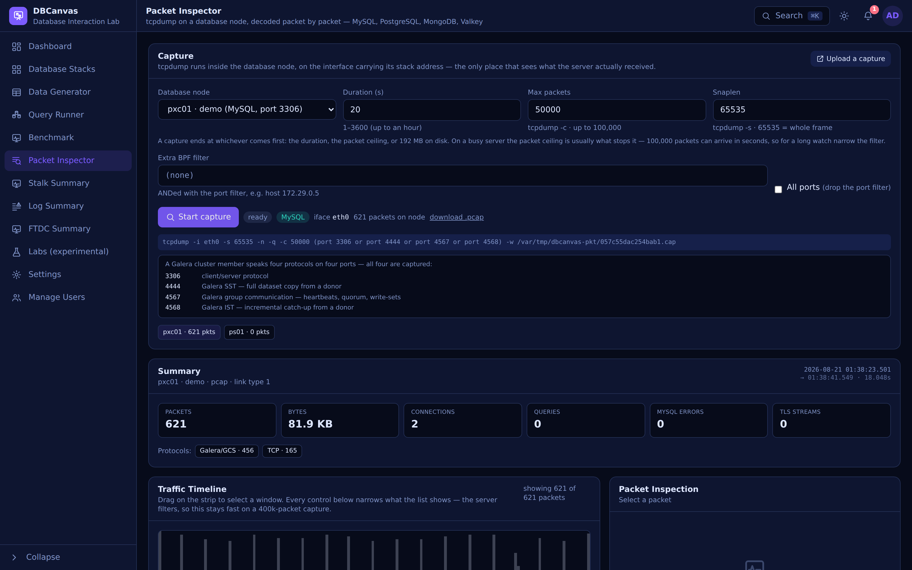

# Packet Inspector

The **Packet Inspector** captures traffic on a provisioned database node with `tcpdump`
and reads it back as **decoded protocol**: the statements, the responses, the response
times, and the network problems underneath them — retransmissions, gaps, resets, zero
windows. It's for the question "what actually crossed the wire, and what did the
server say back", which neither the slow log nor `SHOW PROCESSLIST` can answer.


> *A 20-second capture on a Percona Server node: 38,009 packets, 1,159 connections, and every
> one of them encrypted. The summary says so, and says what to do about it, rather than showing
> an empty query list.*


> *Selecting a frame shows its timing, its TCP state, a payload summary and a hex dump. Below it
> the node's own error log is read and narrowed to the capture's window — the place where the
> things packets cannot show (aborted connections, DNS, TLS, the listener) are recorded.*



> *A Galera member speaks four protocols on four ports, and a capture on a PXC node takes all
> four: 3306 for clients, 4444 for SST, 4567 for group communication, 4568 for IST.*

Open it from the sidebar (**Packet Inspector**) or at `#packet-inspector`.

Four protocols are decoded:

| Family | Nodes | Cluster traffic also captured |
| --- | --- | --- |
| **MySQL** | Percona Server, PXC, MariaDB (incl. Galera), MySQL Community, All-in-One MySQL instances | Galera on 4567 / 4568 / 4444 |
| **PostgreSQL** | PostgreSQL, Patroni, repmgr, Spock, All-in-One PostgreSQL instances | Patroni's REST API on 8008, etcd on 2379 / 2380 |
| **MongoDB** | Percona Server for MongoDB — standalone, replica set, sharded cluster (mongod, mongos and config servers), All-in-One MongoDB instances | all of it, on 27017: heartbeats, elections, oplog tailing, mongos→shard routing |
| **Valkey** | Valkey — standalone or clustered, All-in-One Valkey instances | the binary cluster bus on 16379 (client port + 10000), and Sentinel on 26379 |

Everything below applies to all four unless a section says otherwise. The
engine-specific parts are [PostgreSQL](#postgresql-the-frontendbackend-protocol),
[MongoDB](#mongodb-one-port-many-conversations),
[Valkey](#valkey-resp-and-a-binary-cluster-bus),
[PXC / Galera](#pxc--galera-four-ports-four-protocols),
[Patroni](#patroni-postgresql-its-rest-api-and-etcd) and
[MySQL communication errors](#mysql-communication-errors-where-each-one-is-visible).

The four engines put their cluster traffic in strikingly different places, which is why
each gets its own section:

| | Client protocol | Replication | Cluster control |
| --- | --- | --- | --- |
| MySQL/PXC | 3306 | binlog stream on 3306 | Galera on **three separate ports** |
| PostgreSQL/Patroni | 5432 | walsender on **5432**, alongside clients | Patroni REST + etcd on **three separate ports** |
| MongoDB | 27017 | oplog tailing on **27017** | heartbeats, elections, routing — **all on 27017** |
| Valkey | 6379 | PSYNC on **6379**, alongside clients | a binary gossip bus on **16379** |

MongoDB is the extreme case: one port carries everything, so its connections are told
apart by what is *in* them rather than by where they arrived. Valkey sits in between — one
port for clients and replication, a separate one for the cluster's own decisions.

## Where the capture happens

Inside the **database node's own container**, on the interface holding its stack
address:

```
tcpdump -i eth0 -s 65535 -n -q -c 50000 port 3306 -w /var/tmp/dbcanvas-pkt/<id>.cap
```

The exact command is shown in the UI. Three details matter:

- **The interface is detected, not assumed.** The one carrying the node's stack
  address is chosen (`eth0` on a Docker node, `eth1` on a Vagrant node). `-i any`
  would yield Linux-cooked frames and duplicate loopback traffic.
- **The server is the vantage point.** A capture taken anywhere else misses traffic
  that never arrives — which is exactly what you are looking for when a client
  reports timeouts.
- **Loopback traffic is invisible here.** A client on the same node connecting over
  `127.0.0.1` or a socket does not appear on the stack interface. Capture from the
  node the client actually reaches over the network.

`tcpdump` is installed on the node on first use. Every capture is bounded three ways at
once, and ends at whichever comes first:

| Bound | Limit | Why |
| --- | --- | --- |
| **Duration** | up to **3600 s** (one hour) | long enough to sit and wait for an intermittent problem |
| **Packets** (`-c`) | up to **100,000** | what actually stops a capture on a busy server — 100k packets can arrive in seconds |
| **Size** | 192 MB on disk | a file bigger than this cannot be read back over the exec channel, so the capture is stopped and what was captured is kept (the UI says it was capped) |

Then the pcap is pulled back into the app, decoded, and deleted from the node. For a long
watch on a busy server, narrow the BPF filter — otherwise the packet ceiling will end the
capture long before the hour is up.

## What gets decoded

| Layer | Read |
| --- | --- |
| Capture file | classic pcap (µs and ns) and pcapng — tcpdump writes the first, Wireshark saves the second |
| Link | Ethernet (incl. VLAN tags), Linux cooked v1/v2, raw IP, BSD loopback |
| Network | IPv4 / IPv6 |
| Transport | TCP: payload, flags, seq/ack, window |
| MySQL | greeting (server version, connection id), login (user), `COM_QUERY` and the rest, OK / ERR / EOF, result sets (columns, rows, bytes), prepared statements, and replication (`COM_BINLOG_DUMP` + the binlog event stream) |
| PostgreSQL | startup (user, database, `application_name`), authentication (SCRAM, md5, cleartext, GSSAPI), simple and extended query protocol (Parse/Bind/Describe/Execute/Sync), row descriptions and data rows, `CommandComplete` tags, ErrorResponse/NoticeResponse with SQLSTATE, COPY, `ReadyForQuery` with its transaction status, and replication — physical and logical, with both ends' LSNs |
| MongoDB | the wire protocol (OP_MSG, OP_QUERY/OP_REPLY, OP_COMPRESSED) and the **BSON** inside it: the command and its namespace, filters, sorts, pipelines, document sequences, replies with their cursors and counts, `ok: 0` errors with code and codeName, `writeErrors` and `writeConcernError`, sessions and transactions — plus **snappy and zlib decompression**, since a real deployment compresses by default |
| Valkey | **RESP2 and RESP3**: commands with their keys and arguments, every reply type (including maps, sets, doubles, big numbers and pushes), pipelined batches matched by order, error replies by their code word, pub/sub delivery, and replication — PSYNC, `+FULLRESYNC`/`+CONTINUE`, the RDB transfer (disk-based and diskless) and the propagated command stream with both ends' offsets. Plus the **binary cluster bus**: message type, sender, epochs and the slot bitmap |
| TLS | records by type and version once a connection upgrades — see [Encrypted traffic](#encrypted-traffic) |
| DNS | queries and responses: name, type, answers, response code, and the lookup's latency |
| ARP | who-has / is-at, gratuitous announcements, and who claims which address |

MySQL packets are **reassembled across TCP segments**, so a 40 KB result set or a
statement split over three frames reads as one thing, reported on the frame that
completed it.

### Captures that start mid-connection

Most connections on a busy server are **older than the capture**. Without the
connection's SYN there is no way to know whether a server packet is an OK or the
middle of a result set, so those frames are labelled *"capture joined
mid-connection"* rather than decoded into something plausible-looking.

Two things then recover most of it automatically, because MySQL is strictly
request/response:

- a complete **client command** proves the server's next packet begins a response, and
- a completed **response** proves the client's next packet begins a command.

So a long-lived connection becomes fully readable one round-trip into the capture. An
**ERR packet** is decoded even before that — it carries its own marker byte, code and
SQLSTATE — which is how a `1205 Lock wait timeout` on a connection that has been open
for hours still shows up. A **binlog event stream** is likewise recognised by shape,
because a replica's connection essentially never starts inside a capture window.

**PostgreSQL** recovers the same way, from different landmarks:

- **`ReadyForQuery`** is always the six bytes `5A 00 00 00 05` and a status byte, and it
  ends every command cycle. Finding one aligns the server's stream — and the client's,
  because the protocol says the client's next byte begins a message.
- A **replication stream** has no such cycle: a standby that attached hours ago sends no
  Query and receives no `ReadyForQuery`, ever. It is anchored on its own `CopyData`
  sub-types instead (`w` WAL data, `k` keepalive, `r` standby status, `h` hot standby
  feedback), each of which has a length only it can have.

That second one is not a nicety. On the live 3-node Patroni cluster this was built
against, the first version decoded the server's half of every session and left **22 000
client frames** and every standby stream as "joined mid-connection"; with both anchors,
one frame in a 20-second capture stayed unknown.

**Valkey** is the hardest of the four to re-anchor, and the reason is that RESP is text: a
type byte and a CRLF occur constantly inside ordinary data. A cached JSON document, a
serialised session, an RDB chunk — any of them contains bytes that look like the start of a
value. So the re-anchor requires a **complete, well-formed aggregate or bulk string**, and
a lone `+OK` or `:1` is never enough to anchor on. Being conservative costs a few frames of
"framing lost" and buys not inventing commands out of somebody's cache contents.

**MongoDB** needs no re-anchoring logic once the stream is aligned — every message states
its own length in its first four bytes — but finding that alignment mid-stream is the
riskiest of the three, because "a small integer followed by a known opcode" occurs by
chance in binary data. A candidate header is therefore accepted only if the body matches
what its opcode requires (for OP_MSG: a valid BSON document at the right offset) and, when
the whole message is present, the bytes after it look like another header. A guessed
anchor is also capped at 1 MB and abandoned if the message it claims never arrives —
losing one message and re-anchoring beats waiting forever on a header that was never
there.

## The Traffic Timeline

The **Packet Inspection** panel is sticky on a wide screen: it stays in place while the
packet list scrolls, so a frame selected from deep in a capture can still be read.

The density strip is bucketed **server-side** over the range you are looking at, so a
400 000-packet capture draws instantly and the browser only ever holds one page of
rows. Bars are coloured by the worst thing in the bucket: errors red, warnings amber,
plain query traffic accented, everything else grey.

A range can be set five ways, and they all drive the same query:

| Control | Use |
| --- | --- |
| **Drag on the strip** | Select a window visually. |
| **From / To packet #** | Exact packet numbers — the way to quote a range to somebody else. |
| **From / To +s** | Seconds into the capture, to millisecond precision. |
| **Zoom in / out · Pan ◀ ▶** | Halve, double, or slide the current window. |
| **last 1s / 5s / 10s · Whole capture** | Presets for "what just happened". |

**Resolution** sets the bucket count (40–640), which is how you tell a burst apart
from a steady rate.

Alongside them: filter by **connection**, **protocol**, **direction**, **issue kind**,
and a free-text **search** over the info line, the SQL and the addresses. The issue
chips in the Summary are clickable and do the same thing.

## Timestamps

Every packet carries the absolute time it was captured — epoch seconds with a
microsecond fraction, or nanoseconds for a `pcap-ns` capture — so the same instant can
be read four ways. The **Time** control above the packet list chooses which:

| Mode | Shows | Use |
| --- | --- | --- |
| **Seconds since capture start** (default) | `+5.500000` | how long after the start something happened — the usual way to read a 20-second window |
| **Time of day** | `19:19:01.501234` | comparing against a wall clock |
| **Date and time** | `2026-08-03 19:19:01.501234` | a capture read the next day, or one of several |
| **UTC (ISO)** | `2026-08-03 11:19:01.501234Z` | pasting next to a server error-log line, which is UTC |
| **Delta from previous row** | `+0.000181` | reading a gap between two adjacent packets |

The Summary card shows the capture's own date and window (`2026-08-03 19:19:01.501 →
19:19:21.502 · 20.001s`), the timeline's axis is labelled with real times as well as
offsets, and the detail panel gives all three forms for the selected frame — local, UTC
and offset. Hovering any time in the list shows the UTC form.

Times are rendered in the **viewer's own timezone**; the UTC form is there because the
server's log is not.

## Issues

Flagged per packet, counted in the summary, and filterable:

| Issue | Means |
| --- | --- |
| **TCP retransmission** | Bytes already seen were sent again — something dropped them. |
| **TCP gap — N bytes missing** | The capture never saw bytes the sequence numbers account for. |
| **TCP duplicate ACK** | The peer is re-acknowledging the same byte: loss being signalled. |
| **TCP zero window** | The receiver's buffer is full and it has told the sender to stop. |
| **TCP reset** | Someone hung up hard, rather than closing. |
| **High latency — N ms** | Time from a command to the first response byte, over 100 ms. |
| **Heavy result set** | A single answer over 1 MB. |
| **MySQL error N** | An ERR packet, with the operational ones named: `1045` auth failed, `1040` too many connections, `1205` lock wait timeout, `1213` deadlock, `1290`/`1836` read-only, `1129`/`1130` host blocked. |

Warnings reported in an OK packet are shown in the info line but **not** flagged —
MySQL raises them for entirely ordinary statements, and flagging them buries the real
problems.

## PostgreSQL: the frontend/backend protocol

PostgreSQL's protocol is simpler to frame than MySQL's and richer to read. Every message
after the first is a type byte, a length **that counts itself**, and a body — no 16 MB
chunking to stitch back together. Every error carries a SQLSTATE, a message, a detail and
a hint. And replication is not a separate port: a standby is an ordinary connection with
`replication=true` in its startup parameters, which means one capture of 5432 holds the
application traffic *and* the replication, with the LSNs of both ends in it.

Three places in the protocol decide whether a decoder works at all, and each was got
wrong here first:

- The **first client message has no type byte** — just a length and a code, which is
  either the protocol version (196608 = 3.0) or one of `SSLRequest`, `GSSENCRequest`,
  `CancelRequest`.
- The answer to `SSLRequest` is **a single naked byte**, `S` or `N`, outside the message
  framing entirely. Miss it and every following length is read four bytes off.
- Requests and responses do **not** alternate. The extended query protocol pipelines
  Parse/Bind/Describe/Execute/Sync and the server answers with a run of messages ending
  in `ReadyForQuery` — so response time is measured to the end of the cycle, not to "the
  next server packet".

### What a session looks like

| Shown as | From |
| --- | --- |
| `StartupMessage 3.0: user=carsim database=rental application_name=carsim` | the startup parameters — also where the connection's user and database in the stream list come from |
| `AuthenticationSASL: SCRAM-SHA-256` → `SASLInitialResponse` → `AuthenticationSASLFinal` | the authentication exchange, named at each step |
| `Query: SELECT id, plate FROM cars WHERE branch_id = 12` | a simple query |
| `Parse "s1": UPDATE cars SET mileage = …` / `Bind "s1" → portal unnamed portal, 4 parameter(s), largest 10 B` / `Execute portal unnamed` | the extended protocol. A Bind carries no SQL of its own, so the statement's text is remembered from its Parse and shown against it |
| `Row description: 3 column(s) — id, plate, mileage` | `RowDescription`, with the column names |
| `Result set complete: 2 row(s), 3 column(s), 180 B — SELECT 2` | the completed result set, its size, and the server's own tag |
| `ReadyForQuery (in transaction), 1.2 ms` | the end of the cycle, its transaction status, and the round-trip time |
| `ERROR 40P01 (deadlock_detected): deadlock detected \| detail: … \| hint: …` | an ErrorResponse, in full |
| `Terminate` | a clean disconnect |

A **result set with no column count** is not a bug: an extended-protocol client asks for
a `RowDescription` once and every later execution of that statement returns rows without
one. The count is left out rather than reported as zero.

### PostgreSQL errors: SQLSTATE, and what it costs you

A SQLSTATE is reported with its condition name, its message, and — for the states a
capture is the right tool for — what it means operationally. The full catalogue is
`pgErrCatalog` in `app/pktpgerr.go`; the ones that become **findings** are:

| Class | States | Why it is a finding |
| --- | --- | --- |
| **08** connection | `08000` `08001` `08003` `08004` `08006` `08007` `08P01` | the connection failed at the protocol level. `08P01` in particular means the server could not make sense of the bytes — a broken driver, a proxy corrupting the stream, or something that is not PostgreSQL talking to the port |
| **28** authorization | `28000` `28P01` | refused at the door. `28000` with "no pg_hba.conf entry" is a configuration answer, not a password answer, and the tool says which |
| **3D000** | database does not exist | a connection string pointing at the wrong server, or a dropped database |
| **53** resources | `53100` disk full · `53200` out of memory · `53300` too many connections · `53400` configuration limit | the server is out of something. `53300` is the one a connection pool exists to prevent |
| **55** state | `55000` `55006` `55P03` | `55P03` lock not available means a `NOWAIT` or `lock_timeout` gave up — and on a busy table, what it gave up to is often an idle-in-transaction session |
| **57** intervention | `57014` cancelled · `57P01` admin shutdown · `57P02` crash shutdown · `57P03` cannot connect now · `57P05` idle session timeout | the server is going away or said no. A capture full of `57P01` is a restart or a failover, and everything after it is a consequence |
| **58** external | `58000` `58030` `58P01` | the storage under PostgreSQL failed |
| **40001 / 40P01** | serialisation failure, deadlock | concurrency. Both are expected to be retried by the application, and both are worth counting |
| **25006 / 25P02 / 25P03** | read-only transaction, failed transaction, idle-in-transaction timeout | `25006` is the one to look for after a failover: **a write reached a standby** — a load balancer routing writes to a replica, a stale DNS record, or `default_transaction_read_only` left on |
| **42501** | permission denied | after a restore or a role change, this is what "the application is failing everywhere" looks like |
| **XX000 / XX001 / XX002** | internal error, data or index corruption | belongs in a bug report, with the server log around it |

Ordinary SQL errors — `23505` unique violation, `42601` syntax error, `42P01` undefined
table — are **decoded and shown but never flagged**. The workload this was tested against
produces unique violations by design, and flagging them would have painted the timeline
red for something nobody needs to know about.

Three states are read together with their message text, because the code alone is
ambiguous:

- `57014` is a **statement timeout**, a **client cancellation**, a **lock timeout** or a
  **recovery conflict on a standby** — four different things to fix.
- `40001` on a standby is a recovery conflict rather than a serialisation failure.
- `0A000` with "unsupported frontend protocol" means something that is not a PostgreSQL
  3.0 client is talking to the port.

### Severity is separate from the code

The same SQLSTATE arrives as an `ERROR` that leaves the session usable or as a `FATAL`
that ends it. A FATAL is flagged as such, with the consequence spelled out: *the server
closes the connection after this message; the client sees a lost connection rather than a
query error*. An application reporting "the database dropped my connection" is almost
always looking at a FATAL it never logged.

### Replication, and lag measured from the wire

A walsender connection is announced when it starts (`replication=physical` or
`replication=logical` in the startup, or `START_REPLICATION` / `BASE_BACKUP` as a query),
and adopted mid-stream when the capture joined late.

| Shown as | Means |
| --- | --- |
| `XLogData: 1.4 KB WAL at 0/25211F38` | the primary streaming WAL, with the LSN it starts at |
| `Standby status: write 0/25211F38, flush 0/25211E10, apply 0/25211E10, 24.0 MB behind` | the standby's own report — and the difference from what the primary has sent, **in bytes of WAL** |
| `Primary keepalive: WAL end 0/5100000, reply requested` | the primary has not heard back and is asking |
| `XLogData at 0/1A2B3C4D: BEGIN xid 821` / `relation public.cars` / `INSERT on public.cars` / `COMMIT at 0/1A2B3C99` | logical decoding with **pgoutput**, whose format is documented and stable. A third-party output plugin is described by size instead of guessed at |
| `Query: BASE_BACKUP ( LABEL 'pg_basebackup base backup', PROGRESS, CHECKPOINT 'fast', …)` | a new standby cloning this server — PostgreSQL's equivalent of a Galera SST, and it competes with production traffic for disk and network |

Two findings come out of this and out of nothing else:

- **`Replication lag N` — the standby has flushed X but the primary has sent up to Y.**
  Raised once per connection past one WAL segment (16 MB). No access to either server is
  needed: both LSNs are on the wire.
- **The primary is asking the standby to reply and has not heard from it for N s** —
  what precedes a dropped replication connection.

### Findings only a capture can make

| Finding | Why it is invisible elsewhere |
| --- | --- |
| **Cleartext password authentication on an unencrypted connection** | the password is on the wire, and in the capture file. The server logs a successful login, not a weak one |
| **Connection opened and closed without sending anything** | a TCP health check (HAProxy's `tcp-check`, a Kubernetes probe) or a port scan. The server writes "incomplete startup packet" and nothing else; each one still costs a backend fork |
| **Connection opened and closed without running a statement** | a pool churning connections: full startup, full authentication round trip, then `Terminate` |
| **Idle in transaction for N s** | the snapshot and every lock were held for that whole time and VACUUM could not clean up behind it. `pg_stat_activity` shows it only while it is happening |
| **The same statement has been parsed N times as an unnamed prepared statement** | every execution is being re-planned. Measured per connection, said once |
| **SSL refused by the server** | a client with `sslmode=require` aborts here; one with `sslmode=prefer` silently continues in the clear |
| **Unrecognised protocol version in a startup message** | a port scanner, or a client pointed at the wrong port |
| **Query cancellation requested for backend pid N** | a `CancelRequest` arrives on its own short-lived connection, which is why it looks like nothing in the session it kills |

## Patroni: PostgreSQL, its REST API, and etcd

Capturing a **Patroni** target covers four ports, for the same reason a PXC capture
covers four: the thing that decides whether the cluster works is not on the database
port.

    tcpdump -i eth0 -s 65535 -n -q -c 50000 (port 2379 or port 2380 or port 5432 or port 8008) -w …

| Port | Carries | Shown as |
| --- | --- | --- |
| 5432 | client sessions **and** WAL streaming — replication is a normal connection here | `PostgreSQL` — fully decoded |
| 8008 | **Patroni's REST API**: HAProxy polls `/primary` and `/replica` to decide where to route, `patronictl` drives switchovers through it, and every member exposes `/cluster`. Plain HTTP/1.1 | `Patroni/REST` |
| 2379 | **etcd client API** — where Patroni takes and renews the leader lock. A member that cannot reach it gives up the lock and demotes itself, whatever PostgreSQL is doing | `etcd/client` |
| 2380 | **etcd peer traffic** — raft heartbeats and log replication between the etcd members themselves | `etcd/raft` |

Patroni's REST exchanges are decoded and explained by endpoint:

- `GET /primary → 200 OK — this member IS the leader`
- `GET /primary → 503 Service Unavailable — this member is not the leader (normal for a replica)`
- `POST /switchover — a controlled role change: the leader steps down to a named candidate`
- the JSON body's `role`, `state`, `timeline`, `pending_restart`, `paused` and any
  scheduled switchover, read out without unmarshalling — a snaplen-truncated body would
  make `json.Unmarshal` reject the whole thing

**A 503 on `/primary` is not flagged.** It is the correct answer from every member that
is not the leader, it arrives every couple of seconds per member per port, and flagging
it would bury the capture. A **500** is flagged: that is Patroni itself failing, and
HAProxy will route away from the member while `patronictl` cannot drive it either.

**etcd is described, not decoded.** Patroni's etcd3 client talks to the gRPC gateway, so
in practice the paths are readable HTTP/1.1 (`POST /v3/lease/keepalive`, `/v3/kv/txn`,
`/v3/kv/range`) and each is explained — the lease *is* the leader lock, and a `txn` is
how the lock is contested. When a connection is real HTTP/2 instead, the frame layer is
named (`HEADERS`, `DATA`, `GOAWAY`, `PING`, with stream ids) and any gRPC method visible
as a literal string in a HEADERS frame is reported **as what it is**: a string seen in a
header frame. HPACK is not implemented, and pretending to decode protobuf inside a
compressed header table would print plausible nonsense. Raft peer traffic on 2380 is
reported by volume, because its stream framing is internal to etcd.

An etcd **5xx** is flagged with its consequence, because this is the failure every
Patroni cluster eventually has: *a member that cannot read or write the DCS gives up the
Patroni leader lock and demotes itself*. On the wire it is visible seconds before
anything changes on the PostgreSQL side — which no PostgreSQL-only capture can show.

**All-in-One PostgreSQL instances use their slot's ports**, not the defaults: several
instances share one container, so 8008 and 2379 can only belong to one of them. A
capture of a Patroni instance uses that instance's REST and etcd ports, and the Capture
card lists exactly which ports it covered.

## MongoDB: one port, many conversations

MongoDB's framing is the simplest of the three — a 16-byte header (length, requestID,
responseTo, opCode) and then a body — and its classification problem is the hardest.
Every MongoDB process listens on **27017**: mongod members, config servers and mongos
routers alike. That one port carries all of this at once:

| On 27017 | What it is |
| --- | --- |
| queries, writes, aggregations | the application |
| `hello` / `isMaster` | monitoring — every driver, every few seconds, plus every member watching its peers |
| `replSetHeartbeat` | replica-set heartbeats: every member checks every other every 2 seconds, forever |
| `find` / `getMore` on `local.oplog.rs` | **oplog tailing — this IS MongoDB replication** |
| `replSetUpdatePosition` | secondaries reporting how far they have applied, which is what write concern waits on |
| `replSetRequestVotes`, `replSetStepUp` | an election: the seconds in which the primary changes |
| commands carrying `shardVersion` | mongos → shard, routed |
| reads of `config.*` | mongos → config server: the routing table |

So a MongoDB capture is classified **by content**, per connection, and the protocol
column shows the kind: `MongoDB`, `MongoDB/heartbeat`, `MongoDB/oplog`,
`MongoDB/replpos`, `MongoDB/monitor`, `MongoDB/election`, `MongoDB/config`,
`MongoDB/routed`, `MongoDB/internal`. This is not cosmetic. A 30-second capture of the
testbed's replica-set primary under load came back:

    MongoDB/replpos    9 731 frames      MongoDB/heartbeat    172
    MongoDB            6 621             MongoDB/monitor       30
    TCP                4 586

Two thirds of it is one secondary telling the primary where it has got to. Clicking
`MongoDB/replpos` away in the summary is what makes the 6 621 frames that are the
application visible — and no port-based tool can offer that, because there is only one
port.

Classification is by precedence rather than first-past-the-post: a heartbeat connection
stays a heartbeat connection, but **every** driver connection opens with `hello`, so one
that later runs a query is promoted from `monitor` to a client. Getting that wrong is
what labelled real application connections "monitor" and left them there.

### Reading a command

| Shown as | From |
| --- | --- |
| `find hotelsim.bookings — filter {status: "confirmed"}, sort {createdAt: -1}, limit 20` | the command document. The **first key is the command name** — MongoDB's own rule — so element order is preserved when the BSON is walked |
| `insert hotelsim.bookings — 3 document(s) in a "documents" sequence, 1.2 KB` | an OP_MSG kind-1 document sequence, counted rather than printed: a bulk insert is one section holding 10 000 documents |
| `aggregate hotelsim.bookings — 3-stage pipeline: $match → $group → $sort` | the pipeline's stage names, which is what identifies an aggregation at a glance |
| `hello admin — driver MongoDB Internal Client 8.0.26-11, app OplogFetcher` | the handshake's client metadata: **which driver and which application** opened this connection. On a shared cluster this is the fact a capture is most often taken to establish |
| `find → 2 doc(s) in firstBatch, cursor 7648922318530284142 stays open (2.4 ms)` | the reply, its cursor, and the round trip. A reply is matched to its request by **responseTo**, not by order — a driver pipelines and the server may answer out of order |
| `getMore local.oplog.rs — cursor 7648922318530284142, maxTimeMS 5000` | a getMore, with the namespace resolved from the cursor the `find` opened |
| `commitTransaction admin — writeConcern: {w: "majority"}, txnNumber: 1745, autocommit: false` | a multi-document transaction committing |
| `[snappy] find hotelsim.bookings — …` | the message was compressed on the wire and decompressed here |

BSON values are rendered for one line, not round-tripped: an ObjectId becomes its hex, a
40 KB array becomes `[…128 items]`, and the fields every message carries (`$db`, `lsid`,
`$clusterTime`, `$readPreference`) are skipped because they would be noise on every row.

### Compression: snappy is not optional

Percona Server for MongoDB negotiates **snappy** by default, for driver *and* internal
connections. The first capture taken against the testbed came back with almost every
message reading "compressed with snappy (not decoded)" — which would have made the whole
feature a description of MongoDB traffic rather than a decode of it.

So OP_COMPRESSED is unwrapped for three of its four compressors:

| Compressor | Treatment |
| --- | --- |
| `noop` | not compression at all — the inner message is decoded |
| `snappy` | decompressed (`app/pktsnappy.go`: the raw block format is a varint length and two element kinds, which did not justify a dependency) |
| `zlib` | decompressed with the standard library |
| `zstd` | **named, not decoded** — Huffman plus FSE plus a dictionary format is a dependency, not a function. The same honest line Galera's SST stream gets |

### MongoDB errors: the reply body is the only signal

MongoDB reports a failed command **inside an otherwise ordinary reply**: `ok: 0` with a
`code`, a `codeName` and an `errmsg`. There is nothing at the transport level to notice,
which is exactly why a decoder has to read the BSON. Worse — and more useful — a *partly*
failed write comes back inside a **successful** reply:

- **`writeErrors`** — a duplicate key rejected one document of a bulk insert while the
  command as a whole succeeded. A tool that watches command status never sees it.
- **`writeConcernError`** — the write was applied on this member but not acknowledged by
  enough of the set. It is **not durable** and can still be rolled back if this primary
  steps down. The command said `ok: 1`.

The catalogue is `mongoErrCatalog` in `app/pktmongoerr.go`. The codes that become
findings:

| Family | Codes | Why it is a finding |
| --- | --- | --- |
| **the primary** | `10107` NotWritablePrimary · `189` PrimarySteppedDown · `11602` InterruptedDueToReplStateChange · `91` ShutdownInProgress | a write reached a member that cannot take it. Either an election is happening or the driver's view of the topology is stale — and `11602` means the operation was killed mid-flight, which a retryable write survives and an ordinary one does not |
| **read preference** | `13435` NotPrimaryNoSecondaryOk · `13436` NotPrimaryOrSecondary · `133` FailedToSatisfyReadPreference | the read went somewhere that will not serve it, or nothing matching the preference exists |
| **the network** | `6` HostUnreachable · `7` HostNotFound · `89` NetworkTimeout · `9001` SocketException | one member's view of another. On a heartbeat, `89` is what starts an election |
| **durability** | `64` WriteConcernFailed · `79` UnknownReplWriteConcern · `100` UnsatisfiableWriteConcern | the write is not as safe as the application thinks |
| **contention** | `112` WriteConflict · `24` LockTimeout · `251` NoSuchTransaction · `225` TransactionTooOld | concurrency. `251` usually means the transaction timed out — 60 seconds by default |
| **sharding** | `13388` StaleConfig · `63` StaleShardVersion · `82` NoProgressMade · `118` CannotSplit | the router's routing table is behind the cluster's. A few after a chunk migration are normal; a stream of them is not |
| **auth** | `18` AuthenticationFailed · `13` Unauthorized · `11` UserNotFound | refused. `18` as `__system` is a keyFile mismatch, and no application change will fix it |
| **cursors** | `43` CursorNotFound · `237` CursorKilled | the cursor is gone — killed, or timed out after 10 idle minutes |
| **limits** | `50` MaxTimeMSExpired · `262` ExceededTimeLimit · `292` QueryExceededMemoryLimitNoDiskUseAllowed | a deadline or a memory ceiling the client or the server imposed |

Deliberately **never** flagged: `11000` DuplicateKey (a unique index doing its job — the
test workload produces them by design), `26` NamespaceNotFound, `59` CommandNotFound and
`72` InvalidOptions. Those last two are how every driver discovers what a deployment
supports; 21 of them turned up in one two-minute capture of a nearly idle replica set.

Three codes are read together with their message, because the code alone is ambiguous:
`50`/`262` on a tailing cursor is normal and is not flagged, `10107` on a routed command
means the shard just failed over, and `18` as `__system` is a cluster-trust problem
rather than a user one.

### Events worth knowing about

| Flagged | Means |
| --- | --- |
| **Election in progress** (`replSetRequestVotes`) | a member is standing for primary. Every write is refused with NotWritablePrimary until one wins — what an application experiences as a brief outage |
| **replSetStepDown / replSetStepUp** | a planned failover starting |
| **Replica-set configuration change** | membership or settings being rewritten |
| **Chunk migration** (`moveChunk`, `_shardsvrMoveRange`) | the balancer is moving data between shards; it competes with production traffic and briefly blocks writes on the range |
| **shutdown** | this member is being stopped deliberately, so every later connection failure is a consequence |
| **A legacy opcode** (OP_INSERT, OP_UPDATE, OP_DELETE, OP_GET_MORE, OP_KILL_CURSORS) | removed from the server in MongoDB 5.1. A driver still sending these will fail against any current server — and "OP_INSERT, removed in 5.1" is a better answer than "TCP data" for somebody wondering why an old application stopped working |
| **Connection opened and closed without sending anything** | a TCP health check or a port probe |
| **Heavy reply** | over 1 MB in one message |
| **Slow response** | over 100 ms, matching MongoDB's own slow-query threshold — but never for `hello` with `topologyVersion` or a tailing `getMore`, both of which block **on purpose** |

### mongos and the same-port problem

A capture on a mongos holds connections where mongos is the server (the application's) and
connections where mongos is the client (to shards and config servers) — and **both are
27017 to 27017**. No port comparison can say which end is which.

The header settles it: `responseTo` is 0 in a request and the request's id in a reply, so
each message states its own side. The stream list's client/server columns additionally use
the SYN — whoever sent it is the client — which is remembered per address pair and only
consulted for same-port connections.

## Valkey: RESP, and a binary cluster bus

Valkey puts two protocols on two ports, which is Galera's model rather than MongoDB's:

| Port | Carries | Shown as |
| --- | --- | --- |
| 6379 | **RESP** — client commands *and* replication. A replica's link starts as an ordinary connection, sends PSYNC, and then never stops | `Valkey`, `Valkey/replication`, `Valkey/pubsub`, `Valkey/monitor` |
| 16379 | the **cluster bus**: binary gossip between nodes — heartbeats, failure detection, failover votes and slot ownership. Always the client port + 10000 | `Valkey/bus` |
| 26379 | **Sentinel**: RESP again, for monitoring and failover of a non-clustered pair | `Valkey/sentinel` |

RESP itself is the only text protocol of the four, and the only one with **no request id**.
Replies are matched to commands by order alone, so the decoder keeps a FIFO of outstanding
commands per connection — which is also the only way to report a command's latency at all.
A client may pipeline dozens of commands into one segment before reading any reply, and
that depth is reported once per connection: it is good for throughput, and it is the depth
a decoder has to stay in step with.

### Reading a command

| Shown as | From |
| --- | --- |
| `SET session:abc ← user=1000;cart=3 (16 bytes) [EX 1800]` | the command, its key, the value's size, and the expiry options — because a `SET` with no expiry in a cache is where a memory problem starts |
| `GET → "alice" (0.3 ms)` | the reply, paired with its command by position, and the round trip |
| `LRANGE → ["a" "b" "c"]` / `HGETALL → {…4 fields}` | aggregate replies, rendered shallowly: a 10 000-element reply is summarised by its count, never printed |
| `AUTH user default, password (not shown)` | the password is **never** rendered — see below |
| `MGET → 12 key(s): …` / `aggregate 3-stage pipeline` | the commands whose shape matters get their own summary |
| `HELLO protocol 3` | the RESP version negotiated, which changes what a reply can be |
| `push: message on "news", 17 bytes` | pub/sub delivery — **unprompted**, so it must not consume a queued command, or every later reply is mislabelled |
| `PING (inline, no RESP framing)` | an inline command: bare text, no array. Legal, and what a health check or a telnet session sends |

**The password is never shown.** `AUTH` and `HELLO … AUTH` are decoded down to the user
name and stop there. What *is* reported is that the password crossed an unencrypted
connection at all — Valkey sends it as a plain RESP bulk string, so it is in the capture
file, and only a TLS port prevents that.

### Valkey's errors: the code word is the whole convention

Valkey has no error numbers. An error reply is a line of text whose first word is an
uppercase code, and that convention is the entire diagnostic surface. The catalogue is
`valkeyErrCatalog` in `app/pktvalkeyerr.go`; the two that look alike and behave completely
differently are worth stating on their own:

| | Means | The client must |
| --- | --- | --- |
| **MOVED** | the slot has moved **permanently** | update its slot map, then retry there |
| **ASK** | the slot is **mid-migration** and this key is already on the far side | retry with `ASKING` and **not** touch its slot map |

A client that treats them the same either caches a redirect it should not or re-asks
forever, and both look like ordinary error replies to the application. A steady stream of
MOVED means the client is not caching the slot map at all — every operation costing two
round trips — which is exactly the sort of thing only a capture shows.

The rest, grouped by what they mean for the server:

| Family | Codes | Why it is a finding |
| --- | --- | --- |
| **the cluster is not serving** | `CLUSTERDOWN` · `TRYAGAIN` · `CROSSSLOT` · `MASTERDOWN` | slots are uncovered, mid-migration, or spread across nodes in a way a multi-key command cannot satisfy |
| **writes are refused** | `LOADING` · `MISCONF` · `READONLY` · `OOM` · `NOREPLICAS` | each is an outage with a specific cause. `MISCONF` means a background save keeps failing and Valkey has stopped accepting writes on purpose; `READONLY` means a write reached a replica; `LOADING` means the node is still reading its dataset from disk |
| **auth** | `NOAUTH` · `WRONGPASS` · `NOPERM` | refused. `NOPERM` is the one that looks like an application bug: the connection works and the operation does not |
| **scripting** | `BUSY` · `UNKILLABLE` | a Lua script is still holding the single execution thread, so nothing else is being served |

Deliberately **never** flagged: `WRONGTYPE`, a plain `ERR`, `NOSCRIPT` (normal after a
restart or `SCRIPT FLUSH`) and `EXECABORT`. Those are the application's business.

### Replication, read off the wire

A replica's link is an ordinary connection until it sends `PSYNC`, and then it is one of
the two most informative conversations in a Valkey deployment:

| Shown as | Means |
| --- | --- |
| `REPLCONF listening-port 6379 \| REPLCONF capa eof capa psync2` | the handshake, including whether the replica can accept a diskless transfer |
| `PSYNC <replid> <offset>` | the replica asking to continue from where it was |
| `+FULLRESYNC replid … offset …` | **the expensive path**: the primary will fork, serialise its entire dataset, and send it. A partial resync was not possible — usually because the backlog no longer holds the replica's offset |
| `+CONTINUE` | the cheap path: only the missing stream is sent |
| `3 keep-alive newline(s)` | bare `\n` bytes the primary sends **while it forks**, so the replica does not time out during a transfer that can take minutes |
| `RDB transfer begins, 8.0 KB to come` / `RDB transfer begins (diskless, EOF-delimited)` | the two forms of dataset transfer |
| `RDB payload (diskless), 479.2 KB so far` → `RDB transfer complete` | progress, counted rather than kept |
| `propagated: SET prop:1 ← v1 (2 bytes)` | the incremental stream: every write the primary applies, forwarded forever |
| `propagated: PING` / `REPLCONF GETACK` | the primary's keep-alive, and its request for the replica's position |
| `REPLCONF ACK 22902` | the replica's offset — and with the primary's own offset, **the lag** |

Three details here are the difference between a decoder that works on a real link and one
that does not, and all three were found on a live one:

- **The keep-alive newlines are not RESP.** Buffering them desynchronised the parser badly
  enough that the `+FULLRESYNC` line which followed was discarded.
- **The RDB payload has no trailing CRLF**, and it is as large as the dataset. Parsing it
  as an ordinary bulk string would buffer the whole database in the decoder and never
  complete.
- **The primary's half of the link is one-way.** Consuming the reply queue for propagated
  writes mislabelled every one of them as an answer to the replica's last `REPLCONF`.

### The cluster bus

Unlike Galera's gcomm, this binary protocol is documented enough to decode rather than
merely describe. Every message begins with the four bytes `RCmb` and a self-consistent
length, and its fixed header states the sender, the type, both epochs, the sender's
replication offset and a 2 048-byte bitmap of the slots it claims:

    PING from 00089dc7c673…, claims 5461 slot(s), epoch 3/1, offset 0, 1 gossip section(s)
    PONG from 43080f81daeb…, claims 5461 slot(s), epoch 3/3, offset 12345, 1 gossip section(s)

The slot count is the most useful field after the type: a node claiming none is a replica,
and a primary that has lost its slots is a resharding caught halfway. `PING`/`PONG` are
heartbeats and are never flagged — they arrive constantly, forever. What *is* flagged:

| Message | Means |
| --- | --- |
| **MEET** | a node is being introduced into the cluster. Clusters do not grow on their own |
| **FAIL** | a majority of primaries agreed a node is unreachable. Its slots are uncovered until a replica takes over, and clients hitting them get `CLUSTERDOWN` |
| **FAILOVER_AUTH_REQUEST** | a replica is asking the primaries to vote for its promotion — a cluster election, with its slots unserved until it wins |
| **FAILOVER_AUTH_ACK** | a primary voted. Once a majority does, the slots move and every client's cached slot map is stale |
| **UPDATE** | a node is being told its configuration is out of date — how a partitioned node learns it no longer owns its slots |
| **MFSTART** | a manual failover: the primary pauses writes so its replica can catch up completely |
| a rising **epoch** | the cluster's own clock for configuration changes; a jump is what a failover or a resharding leaves behind |

### Commands worth catching in the act

Valkey executes commands **one at a time**. That makes a handful of ordinary commands
operationally different from their equivalents in a threaded database, and a capture is the
only place to see them happen:

| Flagged | Why |
| --- | --- |
| **KEYS** | walks the entire keyspace in one blocking operation, so every other client waits for it. `SCAN` does the same job in cursor-sized pieces |
| **FLUSHALL / FLUSHDB** | every key deleted — synchronously unless `ASYNC` was given |
| **SAVE** | a synchronous snapshot; the server is blocked for the whole write. `BGSAVE` forks instead |
| **DEBUG SLEEP** | the server deliberately blocked. Every other client is stalled |
| **SCRIPT FLUSH** | every cached script gone, so every `EVALSHA` afterwards fails with `NOSCRIPT` until clients resend the bodies |
| **CONFIG SET** | the configuration changed at runtime, and only until restart unless `CONFIG REWRITE` follows |
| **MONITOR** | this connection now receives every command from every client, and the server serialises each one a second time for it |
| **SHUTDOWN / FAILOVER / CLUSTER FAILOVER** | the topology is being changed by hand |
| a **slow reply** (over 50 ms) | tighter than the SQL engines' 100 ms on purpose: Valkey's own slowlog threshold is 10 ms, and a 50 ms command delayed every other client. Blocking commands (`BLPOP`, `XREAD`, `WAIT`, `SUBSCRIBE`, `PSYNC`) are exempt — waiting is the point of them |

Each is flagged **once per connection**, not once per call: three `KEYS` in a row are one
finding, because the second and third tell you nothing new.

## PXC / Galera: four ports, four protocols

A cluster member's traffic is not just 3306. Capturing a PXC (or MariaDB Galera) target
covers all four ports, because a capture of 3306 alone contains none of the replication
that makes a cluster interesting:

    tcpdump -i eth0 -s 65535 -n -q -c 50000 (port 3306 or port 4444 or port 4567 or port 4568) -w …

| Port | Carries | Shown as |
| --- | --- | --- |
| 3306 | the client/server protocol | `MySQL` — fully decoded |
| 4567 | **group communication** (gcs/gcomm): heartbeats, quorum votes and write-set replication, between every member and every other member, continuously. TCP, and UDP when multicast is configured | `Galera/GCS` |
| 4568 | **IST** — incremental state transfer: a rejoining member catching up from the donor's writeset cache. The cheap path | `Galera/IST` |
| 4444 | **SST** — state snapshot transfer: a full physical copy of the dataset from a donor, streamed by xtrabackup/xbstream (or rsync, or mysqldump). The expensive path | `Galera/SST` |

**Galera's wire formats are not decoded, deliberately.** gcomm's message layout is
internal to Galera and not a documented, stable protocol, and an SST is an opaque backup
stream — running the MySQL decoder over either would manufacture exactly the confident
nonsense this tool exists to avoid. What is reported is what the wire says for certain:
volume, direction, continuity, and for a state transfer its cumulative size and which
stream format it is (the xbstream magic, rsync's greeting, gzip/zstd, or SQL text).

Three Galera-specific events are flagged:

| Event | Means |
| --- | --- |
| **Galera IST started** | a member is catching up incrementally — the outcome you want |
| **Galera SST started (xbstream / xtrabackup)** | a donor is streaming its whole dataset; on a large database this is the difference between a quick rejoin and an hour |
| **Galera SST is large — N transferred** | raised once per connection past 1 MB, not once per frame |

Everything at the TCP layer applies to these ports unchanged, which is the point:
**retransmissions and gaps on 4567 are the classic cause of a cluster that keeps
evicting members**, and they are now attributed to the port that explains them.

**All-in-One PXC instances use their slot's ports**, not the defaults — several
instances share one container, so 4567 can only belong to one of them. The capture uses
that instance's group/IST/SST ports (`aioPortsFor`), and the Capture card lists exactly
which ports it covered.

## The traffic that is not the database

A capture on a database port is mostly database traffic, but the frames that are not are
often the explanation — and both of these were showing up as `ARP frame, 42 bytes` and
`UDP … 43 bytes` until a real 50 000-frame PXC capture made the point.

**DNS.** Every connection begins with a name lookup, and a lookup that fails means no
connection was ever attempted — so nothing on port 3306 can explain it:

| Event | Means |
| --- | --- |
| `DNS query A mysql-1.example.net` / `DNS response A … → 10.0.0.5 (2.0 ms)` | the normal case, with the latency every connection pays |
| **DNS NXDOMAIN / SERVFAIL / REFUSED** | the name did not resolve — what a MySQL client reports as `2005 CR_UNKNOWN_HOST` ("Unknown MySQL server host") and libpq as "could not translate host name" |
| **DNS returned no A record** | the name resolves but has nothing to connect to. Only flagged for `A`, `SRV` and `PTR`: a resolver asks `A` and `AAAA` in parallel, so every IPv4-only host answers `AAAA` with NOERROR and no records, and flagging that produced a dozen meaningless issues on a real capture |
| **DNS query unanswered** | the resolver never replied; the client waits out its timeout |
| **Slow DNS response** | over 100 ms, which is added to every connection that resolves that name |

**ARP.** Layer 2, where a host either exists or does not:

| Event | Means |
| --- | --- |
| `ARP who-has 10.0.0.5? tell 10.0.0.9` / `10.0.0.5 is-at aa:bb:…` | the normal exchange |
| **Gratuitous ARP** | an address announcing itself — how a virtual IP says it has moved, which is the moment a cluster's clients get disconnected |
| **ARP conflict** | two MAC addresses claiming one IP: connections to it can reach either host. Usually a VIP mid-move, or two nodes configured with the same address |
| **ARP unanswered** | nothing replied for that address, so it is unreachable at layer 2 — which surfaces much later as a connect timeout |

## MySQL communication errors: where each one is visible

MySQL's network failures split three ways, and the split decides where you can find
them. Nothing below is inferred from the others.

**1. Server ERR packets — on the wire, named by the tool.** The server told the client,
so a capture has it. All of these produce an Issues entry with the label, the code and
the symbol:

| Code | Symbol | Shown as |
| --- | --- | --- |
| 1152 / 1184 | ER_ABORTING_CONNECTION / ER_NEW_ABORTING_CONNECTION | Aborted connection |
| 1153 | ER_NET_PACKET_TOO_LARGE | Packet bigger than max_allowed_packet |
| 1154 | ER_NET_READ_ERROR_FROM_PIPE | Read error from the connection pipe |
| 1155 | ER_NET_FCNTL_ERROR | fcntl() error on the connection |
| 1156 | ER_NET_PACKETS_OUT_OF_ORDER | Packets out of order |
| 1157 | ER_NET_UNCOMPRESS_ERROR | Could not uncompress a packet |
| 1158 / 1159 | ER_NET_READ_ERROR / ER_NET_READ_INTERRUPTED | Error / timeout reading communication packets |
| 1160 / 1161 | ER_NET_ERROR_ON_WRITE / ER_NET_WRITE_INTERRUPTED | Error / timeout writing communication packets |
| 1835 | ER_MALFORMED_PACKET | Malformed communication packet |
| 1189 / 1190 | ER_SOURCE_NET_READ / ER_SOURCE_NET_WRITE | Replication: net error reading/writing source |
| 1040 / 1203 | ER_CON_COUNT_ERROR / ER_TOO_MANY_USER_CONNECTIONS | Too many connections / user over max_user_connections |
| 1042 | ER_BAD_HOST_ERROR | Cannot resolve the client's address |
| 1043 | ER_HANDSHAKE_ERROR | Bad handshake |
| 1045 | ER_ACCESS_DENIED_ERROR | Authentication failed |
| 1047 | ER_UNKNOWN_COM_ERROR | Unknown command |
| 1053 | ER_SERVER_SHUTDOWN | Server shutdown in progress |
| 1129 / 1130 | ER_HOST_IS_BLOCKED / ER_HOST_NOT_PRIVILEGED | Host blocked / not allowed to connect |

Plus the contention and topology errors chased alongside them: `1205` lock wait
timeout, `1213` deadlock, `1290`/`1836` read-only, `1301` result truncated at
max_allowed_packet, `1317` query interrupted. Any code not in the list is still
reported, with its message.

**One code is read by its message as well as its number.** PXC reuses `1047`
(`ER_UNKNOWN_COM_ERROR`) for *"WSREP has not yet prepared node for application use"* — a
node that is joining, donating or desynced, refusing queries. That reads as **Node not
ready for application use (1047 wsrep)** rather than "Unknown command", because a real
capture held 69 of them and what they meant was that clients were being turned away by a
node that was not ready.

A network-class error **during the handshake** reads "Connection dropped during
handshake" rather than "Login refused" — 1156 and 1045 mean different things.

**2. Client-side codes (2xxx) — never on the wire; the evidence is.** These are the
client library's own diagnoses. A capture cannot contain them, so the tool flags what
the client saw instead:

| The client reports | The capture shows |
| --- | --- |
| `2003` CR_CONN_HOST_ERROR | **Connection refused** — a RST answering the SYN; or **Connection attempt unanswered** — a SYN nothing ever replied to (the client then waits out its connect timeout) |
| `2013` CR_SERVER_LOST | **Server closed the connection with COM_QUERY in flight** — a RST while a command was unanswered |
| `2006` CR_SERVER_GONE_ERROR | the same, with a FIN instead of a RST |
| `2026` CR_SSL_CONNECTION_ERROR / `2075` | **TLS alert** — the handshake or session was rejected |
| `2027` CR_MALFORMED_PACKET / server `1156` | **MySQL packet sequence expected N, got M** — a break in MySQL's own per-packet numbering |
| `2020` CR_NET_PACKET_TOO_LARGE | the server's `1153`, usually followed by a reset |
| `2065` / `2066` compression codes | **Compressed protocol negotiated** — see below |

Windows named-pipe and shared-memory codes (2016–2018, 2038–2046) are out of scope:
those transports are not TCP and never appear in a capture.

**Compressed connections.** If a client negotiates `CLIENT_COMPRESS` or
`CLIENT_ZSTD_COMPRESSION_ALGORITHM`, every packet is wrapped in a zlib/zstd frame and
nothing below it can be read — the same ceiling as TLS. The tool says so on the
handshake and marks the rest of the connection `MySQL/compressed`, rather than
emitting nonsense. (This is also where `1157` and `2065`/`2066` live.)

**3. Error-log records (MY-xxxxxx) — in the log only.** See the next section.

## The server error log

Aborted connections, DNS failures, TLS/certificate problems and listener errors are
written by the server to **its own log** and sent to nobody. No capture can contain
them, however long it runs — by the time the server writes "Aborted connection …
(Got an error reading communication packets)" there is no client left to tell.

All four engines' logs are read, and the format is detected rather than asked for:

| | MySQL | PostgreSQL | MongoDB |
| --- | --- | --- | --- |
| Where | `/var/log/mysqld.log` and the distribution alternatives | `/var/lib/pgsql/*/data/log/postgresql-*.log` and the distribution alternatives. PostgreSQL rotates by day of week, so the path is a glob and the newest match is used — a fixed path would happily read last Tuesday's file | `/var/log/mongo/mongod.log`, plus the upstream and container defaults |
| Line shape | `2026-08-03T19:19:01.501234Z 12 [Note] [MY-010914] [Server] …` | `2026-08-04 06:15:44.142 UTC [2948] ERROR:  …`, with `%u@%d` and `%l` prefixes tolerated | one **JSON object per line**: `{"t":{"$date":…},"s":"I","c":"COMMAND","id":51803,"msg":"Slow query","attr":{…}}` |
| Record identity | the `MY-` code | the message text | the numeric **`id`**, which is stable across releases where wording is not |
| Timestamps | `Z` or an offset (`log_timestamps=SYSTEM`) | a zone name (`UTC`) or an offset (`+08`, `+0800`) | RFC3339 with an offset |
| Also read | — | **Patroni's own log**, when it writes to a file. A failover is Patroni's decision, taken because a lease expired or a member could not reach etcd; PostgreSQL's log only records the consequences | — |
| Counters | `Aborted_clients`, `log_error_verbosity` and the `Connection_errors_*` family, because MySQL may not log an abort at all | none, and the panel says why: PostgreSQL logs a dropped or refused connection unconditionally | none: MongoDB logs every connection accepted and ended (ids 22943 and 22944) at its default verbosity |

Valkey's is different enough to describe separately — see below.

**MongoDB's log is the one that pairs best with a capture**, because it holds the *reason*
for what the wire only times. A capture says a command took 219 ms; the log record for the
same instant says `planSummary=IXSCAN { date: 1, availableRooms: 1 }`,
`keysExamined=5600`, `docsExamined=5600`, `numYields=12`. None of that is on the wire in
any form, and the correlation is by time, which the panel already does. Records worth
knowing about:

| Record | Means |
| --- | --- |
| `Slow query` (id 51803) | with its plan summary and examined counts — the explanation the capture cannot give |
| `Connection accepted` / `Connection ended` (22943 / 22944) | every connection, unconditionally |
| `Election succeeded` (20698) / `Replica set state transition` (21358) | the primary changed, and which way |
| `Heartbeat failed` | what precedes an election |
| `Rollback` | this member had writes the new primary does not, and is discarding them |
| `too stale to catch up` | the member has fallen off the oplog and needs a full resync |
| `Authentication failed` (20883) | with the mechanism and the user |

**Valkey's log is the odd one**, in two ways. Its format is its own and predates anyone
caring about machine parsing:

    253:M 04 Aug 2026 12:16:19.361 * Cluster state changed: ok
      ^  ^ ^                       ^ the level: . debug  - verbose  * notice  # warning
      |  | the timestamp: day first, month by name, and no zone at all
      |  the role — M primary, S replica, C the RDB/AOF child, X sentinel
      the pid

The **role letter** is worth having: it says what the process thought it was when it wrote
the line, so a log that turns from `M` to `S` partway is a demotion, which is often the
whole story of an incident. The timestamp carries no zone, so it is read as UTC and the
log's own text is kept for display — correct on a dbcanvas node, and honest everywhere
else.

And it is **not in a file**. dbcanvas sets no `logfile`, so Valkey writes to stdout and
systemd captures it: the log is in the **journal**, and the unit is a templated one
(`valkey@dbcanvas.service`, so one host can serve several named instances). `journalctl -u
valkey` matches none of that, which is why the patterns tried are globs. A node that does
set `logfile` is read from the file instead.

Records worth knowing about:

| Record | Means |
| --- | --- |
| `Full resync from primary` / `Starting BGSAVE for SYNC` | the expensive path, and the fork behind it |
| `Partial resynchronization accepted` / `Unable to partial resync` | the cheap path, or why it was not available |
| `MASTER aborted replication` / `Connection with primary lost` | the link broke |
| `Setting secondary replication ID` | this node was promoted or reparented |
| `Cluster state changed: fail` / `FAIL message received` / `Failover auth granted` | the cluster's own decisions |
| `Can't save in background` | the failure that makes writes return `MISCONF` |
| `max number of clients reached` | new connections refused |
| `WARNING overcommit_memory` / `Transparent Huge Pages` | the host warnings people ignore until a fork fails or latency spikes |

PostgreSQL's continuation records — `DETAIL`, `HINT`, `STATEMENT`, `CONTEXT`, `QUERY` —
are folded into the record above them rather than listed separately. `STATEMENT` carries
the SQL that failed, which is exactly what somebody reading an `ERROR` wants next; on its
own row it would be an unexplained fragment.

The families PostgreSQL's log is classified into are the same ones MySQL's is (aborted,
auth, DNS, listener, TLS, replication, lifecycle, cluster), so the class filter, the
window view and the packet correlation are shared rather than duplicated. The
PostgreSQL-specific records worth knowing about:

| Record | Means |
| --- | --- |
| `incomplete startup packet` | a TCP health check or a port probe — the connection is gone before it says anything |
| `could not receive data from client: Connection reset by peer` | the client vanished mid-statement |
| `terminating connection because of crash of another server process` | one backend died, so every other connection was dropped. The capture shows the drops; only the log says why |
| `requested WAL segment … has already been removed` | a standby asked for WAL the primary no longer has. Replication is over until it is rebuilt |
| `checkpoints are occurring too frequently` | `max_wal_size` is too small for this write rate, and the resulting I/O is the latency the capture measures |
| Patroni: `failed to update leader lock` / `Error communicating with DCS` / `Loop time exceeded` | the member is about to lose, or has lost, the leadership race |

So a ready capture also shows the error log, classified and narrowed to the capture's own
window (±30 s, because the server notices an abort a little after the packets that
explain it). It comes from one of two places:

- **A capture taken on a node** tails that node's own log — no setup, it just appears.
- **An uploaded capture** uses a log **uploaded alongside the pcap**: a capture from
  somebody else's server has no node to ask. The upload form takes the log as a second,
  optional file, and both `log_timestamps` forms are accepted — UTC (`…Z`) and SYSTEM
  (`…+08:00`), the latter resolved to the same instant so a log from a server in another
  timezone still lines up with the packets.

If a log is uploaded whose records **do not overlap the capture at all**, the panel says
so and shows both time ranges, rather than reporting "no events" — a log from the wrong
day or the wrong server is the mistake this pairing actually makes.

**The pane follows the packet list.** It sits under *Packet Inspection* in the right-hand
column, and selecting a packet scrolls it to the record nearest that packet in time and
highlights it — with the exact offset stated (`Nearest record to frame #1221: −0.200 s`),
because a note the server wrote two seconds later is related and one written an hour later
is not. Records within ±2 s of the selection are tinted; the closest one is ringed and
labelled *nearest*. When nothing is close, it says that instead of highlighting something
irrelevant. **follow selection** turns the scrolling off for reading the log on its own.

**And back again.** Clicking a log record sends the **packet list** to the moment it
describes: the server finds the page holding the packet nearest that instant, selects it,
and tints everything within ±2 s of the record. Your **range and filters are untouched** —
only the paging moves, and only packets those filters admit are candidates, because jumping
to a row the list is filtering out would misrepresent what you are looking at. If nothing
in the current range is near the record, it says so rather than jumping somewhere arbitrary.

Families recognised:

| Class | Records |
| --- | --- |
| **aborted** | MY-010914 / MY-013104 / MY-013130 "Aborted connection …", with the parenthesised reason pulled out: got an error/timeout reading or writing communication packets, packets out of order, closed without authentication, disconnected for inactivity |
| **auth** | Access denied, host blocked, too many connections |
| **dns** | MY-010055–MY-010058: address/hostname could not be resolved, reverse-DNS mismatches |
| **listener** | MY-010249–MY-010271: socket creation, bind, listen, port or Unix-socket already in use |
| **tls** | MY-013595, MY-015005–MY-015011, MY-010068: certificate cannot be opened, validation failed, self-signed CA |
| **replication** | error connecting/reconnecting to source, net error reading/writing source, COM_REGISTER_REPLICA failed, binlog dump request failed |

Anything else well-formed is passed through with its MY- code and level intact.

**Two things that will otherwise mislead you**, both surfaced in the panel:

- **`log_error_verbosity` below 3 means aborted connections are never logged at all.**
  The panel says so when it sees a lower value.
- **Even at verbosity 3, a note is only written when the disconnect produced a real
  read/write error.** A client that simply vanishes increments `Aborted_clients`
  without a line in the log. The panel therefore shows the counters —
  `Aborted_clients`, `Aborted_connects`, `Connection_errors_*` — next to the records,
  because on a live node those were 15 and 9 while the log held nothing.

## Encrypted traffic

A plaintext capture stops at the TLS record header, and this tool says so instead of
guessing: the stream is marked **TLS**, the handshake steps are named
(ClientHello, ServerHello, Certificate…), application data is reported by size, and no
SQL is invented.

That is the normal case, not an edge case, and it is the normal case in both families:

- MySQL 8's client defaults to `--ssl-mode=PREFERRED`, so an ordinary interactive
  session is encrypted without anyone choosing it.
- `caching_sha2_password` — the default plugin — **refuses to send a password over an
  unencrypted channel**. `--ssl-mode=DISABLED` on its own fails with
  `ERROR 2061 (HY000): Authentication requires secure connection`.
- **psql and libpq default to `sslmode=prefer`**, so every connection to a server with
  `ssl = on` is encrypted too. The first 150-second capture taken for this feature came
  back **99 097 TLS frames and 71 PostgreSQL ones** for exactly this reason — the whole
  battery of deliberate faults ran inside TLS. Setting `PGSSLMODE=disable` for the
  diagnostic window is what makes a PostgreSQL capture readable.

PostgreSQL's upgrade is visible either way: `SSLRequest` is decoded, the server's naked
`S` or `N` answer is decoded, and a refusal is flagged with its consequence.

**Valkey is the same**: TLS is a separate port (`tls-port`) with no in-band upgrade, so a
capture of it is opaque from the first byte. The remedies are the plaintext port for a
diagnostic window, the server's own `SLOWLOG`, or a `MONITOR` stream — remembering that
MONITOR makes the server serialise every command a second time.

**MongoDB has no in-band upgrade at all**: TLS either starts the connection or never
happens. So a capture of a TLS-enabled member is opaque from the first byte — there is no
handshake-in-the-clear to read, and the only remedies are to capture with TLS off for the
diagnostic window, or to read the commands from the server's own log (a `Slow query`
record carries the whole command document) or the profiler.

### When the server has `ssl = off`

This is the case a capture is *most* useful for, because everything stays readable — and
it has a shape worth knowing:

| Client `sslmode` | On the wire |
| --- | --- |
| `prefer` (**the default**), `allow` | `SSLRequest` → **`N`** → the client carries on **in the clear**: StartupMessage, authentication, statements, all decoded |
| `require`, `verify-ca`, `verify-full` | `SSLRequest` → **`N`** → the client aborts immediately. psql says *"server does not support SSL, but SSL was required"*, and the capture shows the refusal followed straight by a FIN — no startup message ever |
| `disable` | no `SSLRequest` at all; the connection opens with the StartupMessage |

The refusal itself is flagged once per connection, because which of those three outcomes
follows is the client's setting and not the server's — the same `N` either lets the whole
session be read or ends it.

**The StartupMessage after a refusal is a second untyped message.** A PostgreSQL
connection's first message has no type byte, and `SSLRequest` is one of them — but so is
the StartupMessage that follows when SSL is declined, and libpq sends *three* in a row
(`GSSENCRequest`, `SSLRequest`, `StartupMessage`) when both negotiations fail. Treating
the untyped state as used up by the first one cost the startup parameters and the entire
authentication exchange on every plaintext connection to an `ssl = off` server, which is
about the most common shape there is; see IMPLEMENTATION.md §216.

### Reading an encrypted session

**This tool does not decrypt anything.** What it gives you for a TLS connection is real
and often enough — the handshake steps, record sizes, timing, response latency, and every
TCP-level problem underneath — but the statements are not available, and it says so rather
than guessing.

If you need the statements themselves, there are two ways to get them, neither of which
involves this capture:

1. **Take TLS off for the diagnostic window** and capture again. On MySQL,
   `--ssl-mode=DISABLED` needs an account whose plugin allows a cleartext password —
   `mysql_native_password` — or a client that fetches the server's RSA key
   (`--get-server-public-key`). On PostgreSQL, `PGSSLMODE=disable` is enough unless
   `pg_hba.conf` demands `hostssl`.
2. **Ask the server what it ran.** MySQL's general log or
   `performance_schema.events_statements_history`, PostgreSQL's `log_statement` or
   `pg_stat_statements`, has the statements regardless of how they arrived; use this tool
   alongside it for the timing and the TCP behaviour, which are readable either way. For
   replication this is the only option, since both ends are the server itself.

## Uploads and downloads

- **Upload a capture** decodes a pcap you already have — from a production server, or a
  file a colleague sent. Same decoder, so it reads exactly like one taken here. Give it
  the server port if the traffic is not on 3306, and optionally **the server's error log
  covering the same period**, which is then correlated with the capture's window exactly
  as a node's own log would be (see [The server error log](#the-server-error-log)).
- **download .pcap** hands over the raw file. Everything shown here is derived from it, so
  when an analysis needs a tool this one does not have, that is the way to continue it.

## Sample captures

No capture files ship with the repository, but you can generate a set for checking the
tool without deploying anything. They are built byte-exactly by the decoder's own test
builder, so each one contains exactly the faults it advertises and nothing incidental:

```
PKT_SAMPLE_DIR=/tmp/pkt-samples go test -run TestWriteSampleCaptures ./app
```

| File | Contents |
| --- | --- |
| `mysql-tcp-trouble.pcap` | 15 packets: a retransmission, a duplicate ACK, a gap, a zero window, a reset, a high-latency response — every transport-level flag in one small file. |
| `mysql-midstream-join.pcap` | A connection already running when the capture began, whose first server payload starts with the byte an OK packet starts with. Must read *"capture joined mid-connection"* rather than being decoded; a later client command re-anchors the stream. |
| `mysql-tls-upgrade.pcap` | Greeting in the clear, `SSLRequest`, handshake records by name, then application data — where a plaintext capture stops being able to read a connection. |
| `net-arp-dns.pcap` | 13 packets of the traffic underneath a database problem that is not database traffic: a resolving name with its latency, an `AAAA` answering NOERROR-with-nothing (normal, deliberately not flagged), an NXDOMAIN, a 280 ms lookup, an ARP who-has/is-at pair, a gratuitous ARP, an address conflict, and an unanswered who-has. |
| `pg-session-errors.pcap` | One PostgreSQL connection doing everything an application connection does — SCRAM authentication, a simple query with a result set, a named prepared statement bound and executed in a transaction — and then failing in the four ways worth recognising: a **deadlock (40P01)**, a **write to a read-only connection (25006)**, a **statement cancelled by `statement_timeout` (57014)**, and a **FATAL (57P01)** that ends the session. |
| `pg-replication.pcap` | A standby streaming from a primary, captured **mid-stream** — the normal case, since a replication connection outlives any capture. Its `CopyData` sub-types are the only thing available to anchor on, and the LSNs in them produce `Replication lag 24.0 MB` once the standby stops keeping up. |
| `mongo-session-errors.pcap` | One MongoDB application connection doing what an application does — a `hello` handshake with client metadata, SCRAM, a find with a cursor and a getMore, a 3-stage aggregation, a bulk insert — and then failing in the four ways worth recognising: a **duplicate key inside an otherwise successful reply**, a write to a member that is **not the primary**, a **write-concern failure** (applied here, not durable), and a **killed cursor**. |
| `mongo-replset.pcap` | What a replica-set member's port actually carries, and almost none of it is the application: heartbeats every 2 s, a secondary **tailing the oplog** (with `awaitData` getMores that block on purpose and must not be called slow), `replSetUpdatePosition`, and an **election**. Four connections on four client ports — one port would be one connection, and a connection keeps the classification of its first command. Also carries `electionTime` as MongoDB really sends it: an OpTime's raw bits in a Date-typed field. |
| `valkey-session-errors.pcap` | One Valkey client connection: AUTH, `HELLO 3`, ordinary key/hash work, a 40-command pipeline, `KEYS` on the keyspace, a slow `SINTERSTORE` — and the five errors worth recognising: **MOVED**, **READONLY**, **OOM**, **MISCONF** and `WRONGTYPE` (the last reported but deliberately not flagged). |
| `valkey-replication.pcap` | A replica attaching to a primary: the `REPLCONF` handshake, `PSYNC`, the **keep-alive newlines a forking primary sends**, a **diskless RDB transfer** with its EOF delimiter, the propagated command stream, and the `REPLCONF ACK` offsets that make lag measurable. |
| `valkey-cluster-bus.pcap` | The cluster's own binary protocol, and none of it is RESP: gossip between three primaries with their slot counts and epochs, a **FAIL** message, a **FAILOVER_AUTH_REQUEST**, the **ACK** that grants it, and the winner claiming the slots at a higher epoch. |
| `pg-patroni-cluster.pcap` | The traffic that decides who leads, and none of it is PostgreSQL: HAProxy's health checks against `/primary` and `/replica` (200 and 503 — the 503 deliberately **not** flagged), Patroni renewing its etcd lease, and finally etcd answering **503**, which is the failure that precedes every Patroni failover. Also a test of the engine sniffer: there is no PostgreSQL protocol in the file at all, and it must still be read as PostgreSQL. |
| `mysql-oversized-blob.pcap` | ~17 MB, because a MySQL packet only splits above `0xffffff`: a 16 MB+ row arriving as a `0xffffff` chunk plus a remainder across 11 600 segments. Must come back as one complete row with a heavy-result-set flag. |

`TestSampleCapturesDecode` decodes the same bytes in memory on every test run, so a
change that stops one of them demonstrating its case fails the suite whether or not the
files have been written.

Any pcap from anywhere decodes here as long as the traffic is MySQL, PostgreSQL, MongoDB or
Valkey. The upload form takes a **protocol** and a **server port**, and both default to
being worked out rather than asked for:

- The **protocol** is sniffed from the bytes — PostgreSQL's four fixed first-message
  codes, its `ReadyForQuery`, its replication sub-types; MySQL's protocol-10 greeting;
  MongoDB's 16-byte header **plus the body structure its opcode requires**. That last
  condition is not pedantry: "a plausible length and a known opcode" matched a MySQL
  greeting whose bytes 12-16 happen to read as OP_REPLY, which sent a whole suite of MySQL
  captures through the MongoDB decoder. When a capture contains no database payload at all
  (a Patroni cluster capture is entirely HTTP), the *ports* decide: 8008/2379/2380 say
  PostgreSQL cluster, 4567/4568/4444 say MySQL cluster, 27017 says MongoDB, and
  6379/16379/26379 say Valkey. A payload tell always outweighs a port.
- The **port** then defaults to that protocol's own — which is why it is chosen after the
  protocol and not before. Give it explicitly for a capture taken off a non-standard port
  (an All-in-One instance is on 13000-something, never 3306 or 5432).

The capture's badge says which protocol it was decoded as, so a wrong guess is visible
rather than mysterious. To capture by hand the way the tool does:

```
tcpdump -i eth0 -s 65535 -n -q -c 50000 port 3306 -w /tmp/mysql.cap
tcpdump -i eth0 -s 65535 -n -q -c 50000 '(port 5432 or port 8008 or port 2379)' -w /tmp/pg.cap
tcpdump -i eth0 -s 65535 -n -q -c 50000 port 27017 -w /tmp/mongo.cap
tcpdump -i eth0 -s 65535 -n -q -c 50000 '(port 6379 or port 16379)' -w /tmp/valkey.cap
```

Three things worth knowing before you do:

- **A client on the node itself will not appear.** Connecting to the node's own address
  from inside the node is routed over loopback, not the stack interface, so tcpdump on
  `eth0` sees nothing. The first PostgreSQL capture taken for this feature came back with
  zero packets for exactly this reason. Drive the traffic from another node.

- **On a busy server the `-c` ceiling ends the capture in seconds.** Airline Sim's load
  hits 8 000 packets in about three.
- **Loss injected on the server's own egress is invisible to a server-side capture.**
  `netem` drops after tcpdump's tap point, so the dropped packet is never recorded and its
  retransmission looks like a first transmission. Inject on the *client* to see
  retransmissions and gaps at the server.

## Oversized packets and blobs

A MySQL packet carries at most `0xffffff` (16 MiB) bytes, so anything larger — a
LONGBLOB, a huge `IN (…)` list, a multi-megabyte result row — is split into a
16 MiB chunk plus a remainder. Those are reassembled, and the completed packet is
reported on the frame that finished it, with a **heavy result set** flag over 1 MB.

Two related events are named rather than left as generic errors:

| Event | What happened |
| --- | --- |
| `1153` Packet bigger than max_allowed_packet | The client sent more than the server's `max_allowed_packet` allows. The server answers with the error **and then resets the connection** — both are visible in the capture, one after the other. |
| `1301` Result truncated at max_allowed_packet | A server-side expression (a big `REPEAT()`, `GROUP_CONCAT`) produced more than the limit and was truncated. Nothing oversized crossed the wire in this case. |

A capture that ends mid-transfer leaves the tail of a large packet unassembled; those
frames read as `[continuation] N bytes, M buffered`, which is the honest answer — the
completion never arrived.

## Limits & notes

- Captures live **in memory** in the app process (the newest 12, like Query Runner's
  and Benchmark's runs) and do **not** survive a restart. Download anything you want
  to keep.
- Ceilings: 3600 s per capture, 100 000 packets on the node (`-c`), 400 000 packets
  decoded, 192 MB per capture file. A capture that hits the decode limit says how many
  packets it skipped.
- `packets dropped by kernel` in the summary means the load outran tcpdump's buffer —
  shorten the capture or narrow the filter; the decode is still valid for what was
  captured.
- The **extra BPF filter** is ANDed with the port filter, so you can narrow to one
  peer (`host 10.0.0.7`) but not accidentally widen past the database port. **All
  ports** drops the port term when you need to see something else entirely.
- A **snaplen** below 65535 truncates payloads; the summary counts how many frames
  were cut short, and a truncated MySQL or PostgreSQL message reads as a continuation.
- **Nothing is decoded across engines.** A capture is read as one protocol, chosen from
  the node's own record or sniffed from the bytes; a file holding both a MySQL and a
  PostgreSQL conversation will have one of them read as TCP payload.
- **A Valkey capture of a cluster is mostly gossip.** Three nodes exchange bus messages
  continuously, and each one is 2 256 bytes of header; filter by protocol to see the client
  traffic. And a **replication** capture is as large as the dataset, because a FULLRESYNC
  transfers all of it — the RDB payload is counted rather than kept, so the decode stays
  cheap, but the capture file does not.
- **MongoDB captures are large for their duration.** Two thirds of a replica-set member's
  traffic can be `replSetUpdatePosition` and heartbeats, so the packet ceiling arrives
  sooner than the clock does. Filter by protocol in the summary rather than capturing
  longer.
- **Uploads are not persisted anywhere.** A capture — and any server log uploaded with it
  — lives in the app's memory for as long as it is one of the newest 12, and is gone when
  the process restarts. Nothing is written to the database or to disk, and nothing leaves
  the app.
