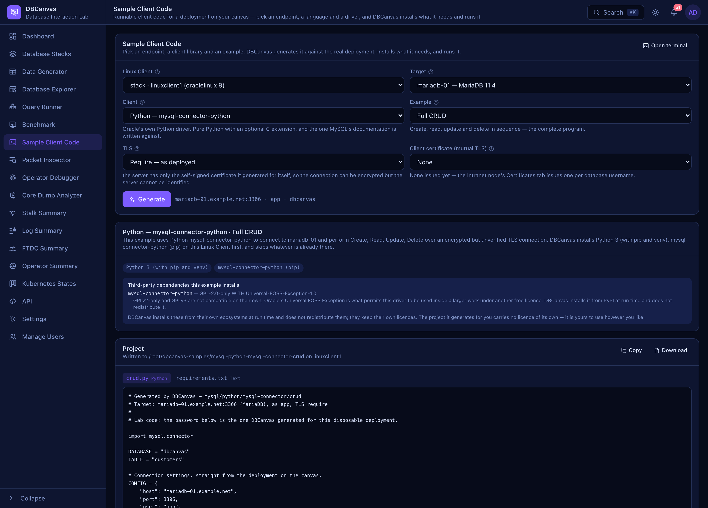

# Sample Client Code

**Sample Client Code** writes a runnable client program for a database you deployed on the canvas,
puts it on a Linux Client, installs whatever it needs, and runs it.

Open it from the sidebar (**Sample Client Code**) or at `#sample-code`. A deployed **Linux Client**
node also has a **Sample Client Code** button in its panel and the same entry in its right-click
menu, both of which open the page on that node.



## The problem it replaces

You have a cluster running. The next question is always the same one: *how do I talk to it
from an application?* So you find the driver's quickstart, and it says this:

```python
conn = mysql.connector.connect(host="localhost", user="root", password="CHANGEME")
```

Every value in it is wrong, and you are the one who has to know that. The host is a DNS name
the Intranet publishes. The port might be 3306, or 5000 because the endpoint is HAProxy's
write port, or 6446 because it is a MySQL Router. The account is not root — root cannot
connect over TCP at all. The password came out of `.env`. And if the node was deployed with a
certificate, the TLS arguments are four more lines, spelled differently by every driver.

DBCanvas deployed the thing. It knows all of it. So the workflow is:

**Deploy a database → deploy a Linux Client → Sample Client Code → choose an endpoint → choose a
language and client → Generate → Run.**

## The three choices

```
Target    ps-01 — Percona Server for MySQL 8.4
Client    Python — mysql-connector-python
Example   Full CRUD
                                              → Generate
```

Everything else follows from those. The client list is filtered by the target's engine, so an
impossible combination is not greyed out — it is absent.

### Target: every endpoint, not every node

The list is derived from the stack you are pointed at, and it is wider than the node list
because an application connects to more things than nodes:

| What appears | Why it is separate |
| --- | --- |
| every running database node | including each member of a cluster — connecting to one on purpose is most of what a lab is for |
| a **replica set** as a whole | with its member list and set name, which is what a MongoDB driver needs to follow a failover |
| a **Valkey cluster** as a whole | the seed list a cluster-aware client discovers the slot map from |
| **HAProxy**'s write port *and* its read port | two endpoints, two meanings. Generating the same example against the read port and watching the write fail is the shortest demonstration of why |
| **ProxySQL**'s client port | it splits reads from writes inside itself, so it is one endpoint |
| **MySQL Router**'s 6446 and 6447 | what a Group Replication cluster publishes on every member: the primary wherever it is, and a secondary |
| each instance inside an **All in One** node | several databases on one host, each with its own port and credentials |

Nothing there is hard-coded to a stack shape. Two PXC clusters with a proxy in front of each
produce the endpoints those clusters actually have.

**Only the selected Linux Client's own stack is offered.** The generated code resolves hosts
by DNS name, which works from inside that stack and nowhere else.

### Client: the library, not just the language

Only the libraries that speak the selected engine are listed.

| Database | Python | Node.js | Go | Java | C# (.NET) | Shell |
| --- | --- | --- | --- | --- | --- | --- |
| MySQL family | mysql-connector-python, PyMySQL | mysql2 | database/sql + go-sql-driver | JDBC, JDBC + HikariCP | MySqlConnector | `mysql` |
| PostgreSQL | psycopg 3 | pg | database/sql + pgx | JDBC, JDBC + HikariCP | Npgsql | `psql` |
| MongoDB | PyMongo | mongodb | mongo-driver | MongoDB Java Driver | MongoDB C# Driver | `mongosh` |
| Valkey | valkey-py | iovalkey | go-redis | valkey-java | StackExchange.Redis | `valkey-cli` |

The MySQL family covers Percona Server, PXC, MySQL Community and MariaDB — one wire protocol,
one set of drivers.

**Two Python drivers for MySQL is deliberate**, and so is two Java options. Pointing two
drivers at one server is the only honest way to tell a driver problem from a server problem,
which is the question a support engineer is actually handed. It is also a licence choice: see
[Licensing](#licensing) below.

### Example: what the program does

| Example | What it does |
| --- | --- |
| Connection Test | Opens a connection, asks the server what it is, closes it. |
| Create | Creates the table (or collection, or key space) and inserts one row. |
| Read | Seeds a row, then reads it back. |
| Update | Seeds a row, changes it, reads the change back. |
| Delete | Seeds a row, deletes it, confirms it is gone. |
| Full CRUD | All four in sequence — the complete program. |

An example that is not *about* the insert still has to have a row to work on, and the output
says `SEED` rather than `CREATE` when that is what happened.

### The same data model everywhere

One `customers` model across every engine, so the same behaviour can be read side by side in
five languages against four databases:

| | |
| --- | --- |
| SQL | a `customers` table: `id`, `name`, `email`, `created_at` |
| MongoDB | a `customers` collection, one document per customer, with a unique index on `email` |
| Valkey | `{dbcanvas}:customer:<id>` — a hash per customer, a set indexing the ids, and a counter to allocate from |

The braces in the Valkey key are a hash tag. On a cluster, keys are assigned to slots by
hashing the key unless it contains a braced substring, in which case only that substring is
hashed — so the hash and its index set land on the same shard and a multi-key command is not
refused with `CROSSSLOT`. One program runs unchanged against a standalone node and a cluster.

Everything is created in a database called **`dbcanvas`**, which is not a system database in
any of the four engines.

## Preparing the environment

**A Linux Client starts bare.** No Python, no Node, no JDK, no database client. You do not
have to install any of it by hand: press **Run** and DBCanvas works out what the sample needs,
checks what is already there, installs only what is missing, and then runs it.

Nothing about that is hidden. The transcript is the point:

```
Preparing environment
✓ Python 3 (with pip and venv): installed
· mysql-connector-python: missing
$ /root/dbcanvas-samples/.venv/bin/pip install mysql-connector-python
Successfully installed mysql-connector-python-26.7.0
✓ Environment ready.

Running mysql-connector-python
$ cd /root/dbcanvas-samples/mysql-python-mysql-connector-crud && .venv/bin/python crud.py
Connected to ps-01.example.net:3306 - MySQL 8.4.0-1
Schema ready: dbcanvas.customers
CREATE
Created customer 1: Alice
READ
1 | Alice | alice@example.com | 2026-09-14 09:12:44
UPDATE
Updated customer 1 (1 row)
1 | Alice | alice@dbcanvas.example
DELETE
Deleted customer 1 (1 row)
Rows with that id now: 0
Full CRUD example completed successfully.
✓ Finished — exit 0.
```

DBCanvas is a testing, troubleshooting and learning environment: *what did it actually run*
is not a debugging question here, it is the product.

### Nothing is installed twice

Every step carries a check that is cheap and true — `command -v node`, an import inside the
virtualenv, `npm ls` against the project's `package.json` — and a step whose check passes is
reported as already installed and skipped. Running the same sample a second time installs
nothing.

Go is the one exception, and it is not a download: DBCanvas rewrites `go.mod` every time the
project is saved, so no check survives it and `go mod tidy` simply runs. Against a warm module
cache that is under a second and fetches nothing.

The ecosystems' own caches do the rest, and they live above any one project so a *different*
sample reuses them:

| | |
| --- | --- |
| Python | one virtualenv per node at `/root/dbcanvas-samples/.venv` |
| Node.js | `node_modules` in the project |
| Go | the module cache under `/root/go` |
| Java | Maven's `~/.m2` |
| C# | NuGet's `/root/.nuget/packages` |

A virtualenv rather than the system Python for a reason that is not stylistic: Debian and
Ubuntu mark their system Python as externally managed (PEP 668) and `pip install` refuses to
write to it, so the obvious command fails on half the base images.

### On-demand, not at deploy

A Linux Client is not built with every runtime preinstalled. Choosing **Java — JDBC +
HikariCP** is what causes a JDK and Maven to be installed; choosing **Python — psycopg** only
installs Python, pip and that one driver. The base node stays small, and the samples are still
one click.

### Which package manager

A sample never says `dnf` and never says `apt-get`. It declares what it needs —
`python3`, `nodejs`, `mysql-client` — and the resolver turns that into packages for the
distribution the node is actually running:

```
sample requirement  →  dependency resolver  →  distribution package installer
```

That is the only place in the feature that knows a package manager exists, which is what
makes it correct on Oracle Linux 8/9/10, Ubuntu 22.04/24.04 and Debian 12/13 without
twenty-three samples having to care.

Runtimes and native clients come from the package manager; library dependencies come from the
ecosystem's own tool (pip, npm, Go modules, Maven, NuGet). The native database clients come from
Percona's repositories at the series the *target* runs — so the `psql` installed for a
PostgreSQL 17 endpoint is the 17 client, not whatever the distribution happens to ship.

If the node was deployed with **Use Intranet proxy (Squid)**, the proxy is exported to pip,
npm, Go, Maven and `dotnet` too. `dnf` and `apt` were already configured for it at deploy; those
five were not.

**.NET comes from the distribution where it can.** Oracle Linux 8, 9 and 10 and Ubuntu 24.04
install the .NET 10 SDK from their own AppStream or archive; Ubuntu 22.04 stops at .NET 8 and
installs that. Debian packages no .NET in any release, so on Debian 12 and 13 the SDK comes
from Microsoft's own archive — `dotnet-sdk-10.0.401`, pinned and checked against a SHA-256 per
architecture, exactly as Node on Ubuntu 22.04 and Go on Debian 12 are. No Microsoft package
repository is added to any node. The generated project targets `net8.0` and rolls forward, so
the same project builds and runs on an 8-only node and a 10-only one.

## TLS

**The generated code reflects how the endpoint was actually deployed**, and the page says why
it chose what it chose:

| Situation | Default | Why |
| --- | --- | --- |
| MySQL or PostgreSQL node deployed with a generated certificate | **Verify** | the certificate is signed by the stack CA, which `trustIntranetCA` already put in this Linux Client's trust store — so the chain *and* the hostname can be checked |
| MySQL node without one | **Require** | the server generated its own certificate at initialization, so the connection can be encrypted but the server cannot be identified |
| PostgreSQL node without one | **Off** | it is not listening for TLS |
| MongoDB | **Off** | a node gets a signed certificate when you ask for one, but turning cluster TLS *on* is an all-members-at-once operator step that DBCanvas deliberately does not take. Switch this to Verify once you have done it from the node's TLS tab |
| Valkey | **Off** | Valkey's TLS is runtime configuration (`CONFIG SET tls-*`) and is off on a fresh node |
| HAProxy, ProxySQL | **Off** | the connection is terminated or passed through under the proxy's own name, so the backend's certificate would not match it |

You can override any of it — you know what you changed after deploying — and the generated
code changes with the choice.

> **A node deployed before DBCanvas 0.0.6 needs its certificate re-issued before a Go or Java
> client can verify it.** Server certificates used to carry only a Common Name, which OpenSSL
> clients (psql, psycopg, the `mysql` CLI) accept and Go's `crypto/x509` has refused since Go
> 1.15. They now carry a `subjectAltName`; press **Reissue certificate** on the node's
> certificate tab and restart the server to pick it up.

**Each client is given its own spelling of that choice**, not a generic one:

| | |
| --- | --- |
| mysql-connector-python | `ssl_ca`, `ssl_verify_cert`, `ssl_verify_identity` |
| PyMySQL | an `ssl` dict with `ca` and `check_hostname` |
| mysql2 / pg / iovalkey | an options object with `ca` bytes and `rejectUnauthorized` |
| go-sql-driver | a `tls.Config` registered by name with `RegisterTLSConfig`, then `tls=dbcanvas` |
| pgx, psycopg, `psql` | libpq's own `sslmode=verify-full` and `sslrootcert` |
| Connector/J | `sslMode=VERIFY_IDENTITY` and a PKCS#12 truststore |
| pgJDBC | `sslmode=verify-full` and `sslrootcert` — it reads a PEM directly |
| MongoDB drivers | `tls` and `tlsCAFile`, or the JVM's truststore properties |
| MySqlConnector, Npgsql | `SslMode=VerifyFull` with `SslCa` / `RootCertificate` |
| MongoDB C# Driver | a validation callback that builds the chain against the stack CA alone — the .NET driver takes no CA file |
| StackExchange.Redis | `TrustIssuer(ca)` |
| `mysql`, `mongosh`, `valkey-cli` | `--ssl-mode`, `--tlsCAFile`, `--cacert` |

The JVM is the one that needs help: it will not read a PEM certificate authority. When a Java
sample verifies TLS, DBCanvas runs `keytool` to build a PKCS#12 truststore beside the source
first, and you see it happen. pgJDBC is the exception — it reads the PEM itself, so it gets no
pointless keystore.

### Mutual TLS

Pick a **client certificate** and the sample presents one as well. The list is what the
Intranet CA has issued; issue one per database username from the Intranet node's
**Certificates** tab.

DBCanvas copies the certificate and its key from the Intranet onto the Linux Client beside the
project — **the private key goes from node to node through the app and never reaches your
browser** — and writes all three forms the drivers ask for between them:

| | |
| --- | --- |
| `client-cert.pem`, `client-key.pem` | what most clients want |
| `client.pem` | the two concatenated, which is what the MongoDB drivers want (the C# one reads the two PEM files instead) |
| `keystore.p12` | built with `openssl pkcs12` for the JVM |
| `client-key.pk8` | PKCS#8 DER, because pgJDBC will not read a PEM private key |

A client certificate on a plaintext connection is refused rather than quietly ignored.

## JDBC and HikariCP

JDBC is a database access option here, not the architecture of the feature — but it is a
first-class one, for both SQL families.

**JDBC** generates the URL from the deployment, with the properties that matter explained in
the file:

```
jdbc:mysql://ps-01.example.net:3306/dbcanvas?createDatabaseIfNotExist=true&sslMode=VERIFY_IDENTITY&…
jdbc:postgresql://patroni-01.example.net:5432/dbcanvas?sslmode=verify-full&sslrootcert=…
```

Three of those properties are worth knowing about, and the generated comments say so:
`createDatabaseIfNotExist`, because a JDBC URL otherwise names a database that must already
exist; `sslMode`, which is Connector/J's own vocabulary and does not match libmysqlclient's;
and `allowPublicKeyRetrieval`, which `caching_sha2_password` needs when the connection is
*not* encrypted — leave it out on a plaintext connection and the first login fails with an
error that says nothing about keys.

**JDBC + HikariCP** is the same driver behind a pool: `HikariConfig`, the same URL,
credentials and TLS, a pool created once, a connection borrowed per operation and returned by
closing it, and the pool closed at the end.

```java
private static final int MAX_POOL_SIZE = 5;
private static final int MIN_IDLE = 1;
```

> These are lab defaults, not tuning recommendations. Five connections is enough to watch
> them being borrowed and returned; sizing a real pool is a question about the server's
> capacity and the application's concurrency, and neither is what the example shows.

PostgreSQL is the case where a pool cannot do the whole job: `CREATE DATABASE` cannot run
inside a transaction and cannot be run from the database being created, so the bootstrap is
one `DriverManager` connection to the maintenance database before the pool exists.

## What you get, and what you can do with it

A minimal, reproducible project — no framework scaffolding:

| | |
| --- | --- |
| Python | `crud.py`, `requirements.txt` |
| Node.js | `crud.js`, `package.json` |
| Go | `main.go`, `go.mod` |
| Java | `pom.xml`, `src/main/java/DbCanvasCrud.java` |
| C# | `Program.cs`, `DbCanvasSample.csproj` |
| Shell | `crud.sh` (and `crud.js` for `mongosh`, which is a JavaScript runtime) |

The manifests are generated from the same dependency metadata the installer used, so the
project stays reproducible after the install — and still builds somewhere that is not this
Linux Client.

| Action | What it does |
| --- | --- |
| **Copy** / **Download** | the file in front of you, to your clipboard or your machine |
| **Save to Linux Client** | writes the project to `/root/dbcanvas-samples/<sample>/` and stops |
| **Prepare environment** | installs the runtime, the driver and any native client — without running anything |
| **Run** | prepares the environment if it needs it, then runs the program and shows stdout, stderr and the exit code |
| **Open terminal** | a root shell on that node, to run it again by hand or change it |
| **Reset** | removes that one project directory. The shared caches are left alone — "start again" almost never means "download the internet again" |

**A non-zero exit is the program's answer, not a DBCanvas failure**, and the page says so. It
is also where the interesting cases land: a write against a read-only endpoint, a TLS mode the
server will not accept, a `caching_sha2_password` login over a plaintext connection.

## Adding a language or a library

The registry is data. One entry in `scClients` (`app/samplecode_*.go`) is a new sample:

```go
{
    Database: scPostgres, Language: "php", ID: "pdo", Label: "PDO",
    Summary:  "…",
    Runtime:  scRuntimePHP,
    Deps:     []scDep{{Manager: "…", Name: "…", License: "…", URL: "…"}},
    Files:    func(g scGen) []scFile { … },
    Run:      func(g scGen) string { return "php crud.php" },
}
```

A sample is addressed as **database/language/client/scenario** —
`mysql/java/hikari/crud` — and the picker, the dependency plan, the licence list and the
generated project all follow from the entry. The page does not change.

A new *runtime* additionally needs its system packages in `scSysPackages` (per distribution
family) and its dependency step in `scDepSteps`. That is still the only place in the feature
that knows what a package manager is.

`TestSampleCodeRendersEverySample` renders every sample in the registry, in every scenario and
every TLS posture, and fails on a template that does not parse or a generated file that still
contains a placeholder. `TestSampleCodeDump` writes them all to a directory so a real
toolchain can compile them — see the comment at the top of `app/samplecode_dump_test.go`.

Deliberately not here: Spring Boot, Hibernate, application frameworks, Git integration,
application hosting, deployment pipelines. This is not an IDE or an application generator.

## Licensing

**DBCanvas is licensed under the GNU General Public License, version 3.0** (see `LICENSE`), and
so is the source of this feature — the registry, the templates and the code that runs them.

**The projects it writes for you are not.** As an explicit exception to the above, DBCanvas
places no restrictions on the sample projects this feature generates: use, modify and
redistribute them as part of your own work, under whatever licence you choose, with no
obligation to this project. That covers the generated source files and the generated manifests
(`requirements.txt`, `package.json`, `go.mod`, `pom.xml`, `DbCanvasSample.csproj`).

The exception exists because the alternative is silly. A generated CRUD example is close to the
minimum expression of "connect to this server and insert a row"; a copyleft notice on top of it
would assert a great deal over very little, and would make a quickstart something you have to
think about before pasting into your own application. That is the opposite of what a sample is
for. The same reasoning is why Bison and GCC's runtime library carry output exceptions of their
own.

It does not, and cannot, change the licence of anything third-party. The generated files carry
no licence notice, only a line saying where they came from and a warning that a real password is
in them.

**The drivers keep their own licences.** They are third-party components, and DBCanvas's
relationship with them is worth stating precisely:

- **DBCanvas installs them; it does not redistribute them.** pip, npm, Go modules, Maven and NuGet
  fetch each dependency from its own ecosystem onto the lab node at run time. No third-party
  driver source or binary is vendored into this repository.
- **Installing a dependency at run time is not the same as incorporating its source.** Nothing
  about a package's licence changes because DBCanvas installed it or invoked it, and DBCanvas
  does not claim ownership of any of them.
- **The example code is original.** Every template is written against the drivers' documented
  public APIs rather than copied from an upstream project's examples or documentation — which
  would put third-party code in this repository under terms that would have to be reasoned
  about file by file.
- **Every dependency's licence is recorded** in the registry beside it, and shown on the page
  before you install anything.

### What each example pulls in

| Dependency | Licence |
| --- | --- |
| mysql-connector-python, MySQL Connector/J | GPL-2.0-only **WITH** Universal-FOSS-Exception-1.0 |
| PyMySQL, valkey-py, iovalkey, valkey-java, mysql2, pg, slf4j-api, slf4j-simple, MySqlConnector, StackExchange.Redis | MIT |
| Npgsql | PostgreSQL |
| psycopg 3 | LGPL-3.0 |
| pgJDBC | BSD-2-Clause |
| go-sql-driver/mysql | MPL-2.0 |
| pgx | MIT |
| go-redis | BSD-2-Clause |
| PyMongo, MongoDB drivers (Node, Go, Java, C#), HikariCP, mongosh | Apache-2.0 |
| OpenJDK (Temurin or the distribution's build) | GPL-2.0-only **WITH** Classpath-exception-2.0 |
| .NET SDK (the distribution's build, or Microsoft's archive on Debian) | MIT |

Two of those are worth reading twice:

- **MySQL Connector/J and mysql-connector-python are GPL-2.0-only**, which on its own is *not*
  compatible with GPLv3. They are usable inside another free-licensed work through Oracle's
  **Universal FOSS Exception 1.0**. That is why the MySQL family offers a second option in both
  languages: **PyMySQL** (MIT) is the Python one. There is no such alternative in the Java
  list yet — MariaDB Connector/J (LGPL-2.1-or-later) reaches the same servers and is what the
  Ledger Sim image ships for exactly this reason, and adding it here is one registry entry.
  The same reasoning is written down in `ledgersim/NOTICE`.
  In C# the MySQL family is served by **MySqlConnector** (MIT) rather than Oracle's
  Connector/NET (`MySql.Data`, GPL-2.0 with the same exception), for the same reason.
- **HikariCP logs through SLF4J and needs a binding.** The samples use **slf4j-simple** (MIT),
  with **slf4j-api 2.0.19** declared explicitly beside it — HikariCP 6.x still brings the 1.7 API
  transitively, and a 1.7 API with a 2.0 binding finds no provider and says so on stderr instead
  of logging. Logback is EPL-1.0/LGPL-2.1 dual-licensed and EPL-1.0 is GPL-incompatible — the
  easiest accidental violation available to a Java project.

### If you redistribute a generated project

The project itself is yours to do as you like with, under the exception above. What travels
with it is the manifest, and a manifest *references* third-party components: if you ship the
two together, consult the upstream licence of every dependency it names. Those terms are
theirs, not DBCanvas's — and this page is a description of what was checked, not legal advice.

If you are adding a dependency to the registry and its compatibility is not obvious, **flag it
for review rather than adding it quietly.** An unclear licence is a reason to stop, not a
detail to resolve later.

## Troubleshooting

**"There is no running Linux Client."** Add one from the designer's **Storage & Clients**
group and deploy it. These samples only run on a Linux Client: the feature installs packages as root,
which is a thing to do to a disposable jump box and not to a database node.

**The endpoint list is empty.** Nothing in that Linux Client's stack is a running database
yet. Only its own stack is offered, because the generated code resolves hosts by DNS name.

**`x509: certificate relies on legacy Common Name field`.** The server's certificate predates
the `subjectAltName` fix — re-issue it from the node's certificate tab and restart the server,
or set TLS to **Require** to encrypt without verifying.

**A package will not install.** The log shows the exact command and the package manager's own
error. Common causes: the node has no route to the internet (tick **Use Intranet proxy
(Squid)** on it and redeploy), or the series' repository is not published for that OS. The
node's terminal is right there, and anything you install by hand is found by the check on the
next run.

**Maven or Go is slow the first time.** An empty `~/.m2` or module cache is a real download.
The second sample in the same language reuses it; **Reset** does not remove it.

**The program exits non-zero.** Read its output — that is the answer. `--super-read-only`
means the endpoint you picked is a replica; `Public Key Retrieval is not allowed` means a
`caching_sha2_password` account over a plaintext connection; a TLS handshake failure usually
means the server is not listening for TLS and the posture should be **Off**.

**The generated code is wrong for your case.** Copy it out and edit it — that is what it is
for. The page is a starting point that happens to already be connected to your deployment.
