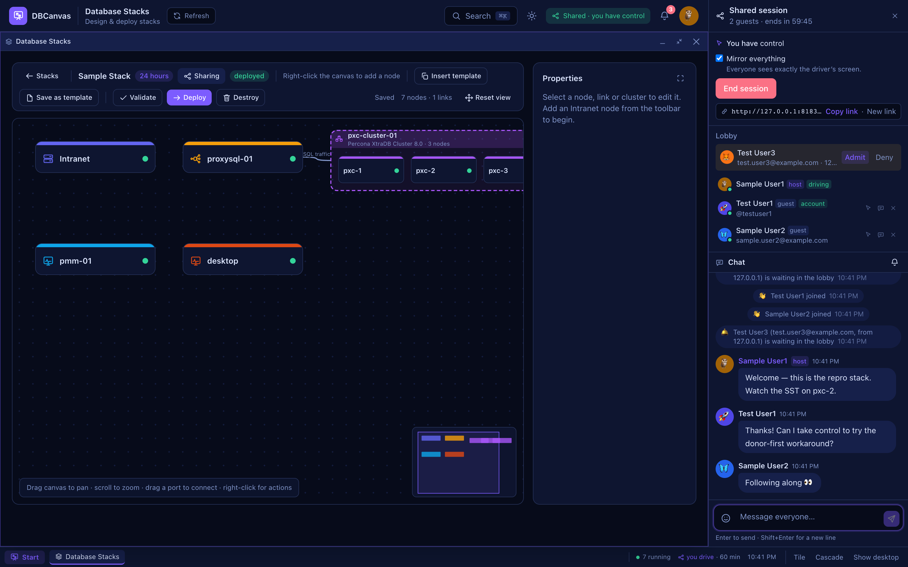
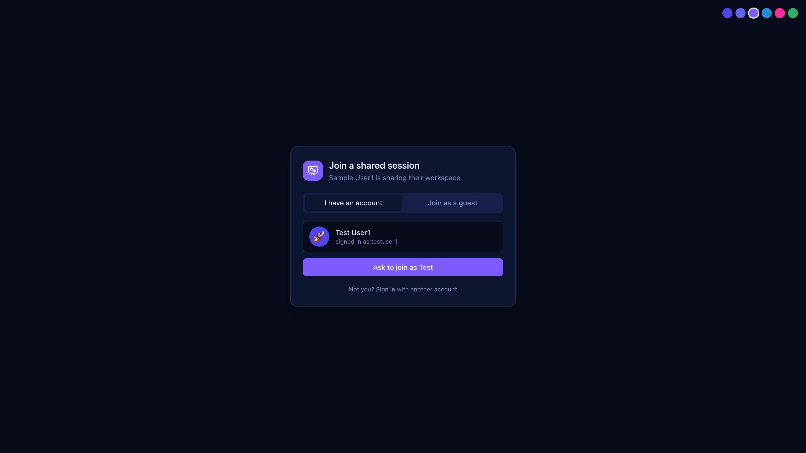
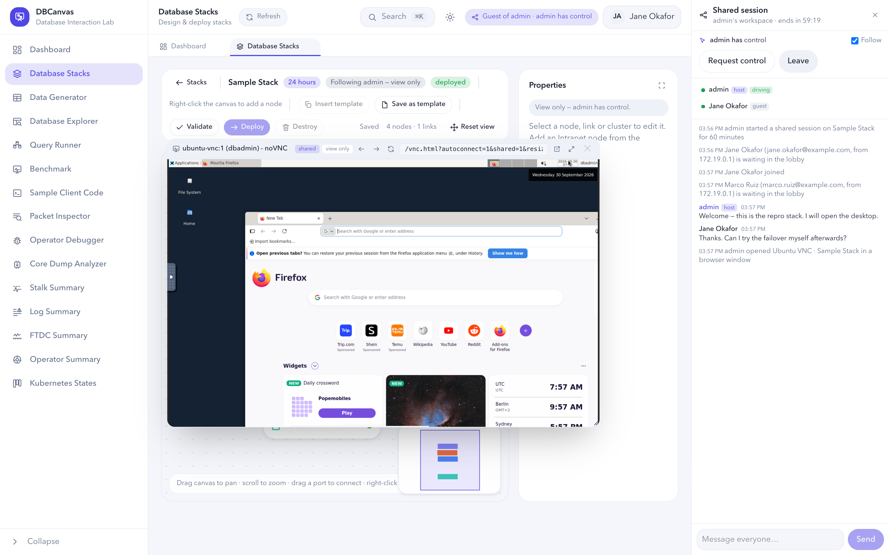
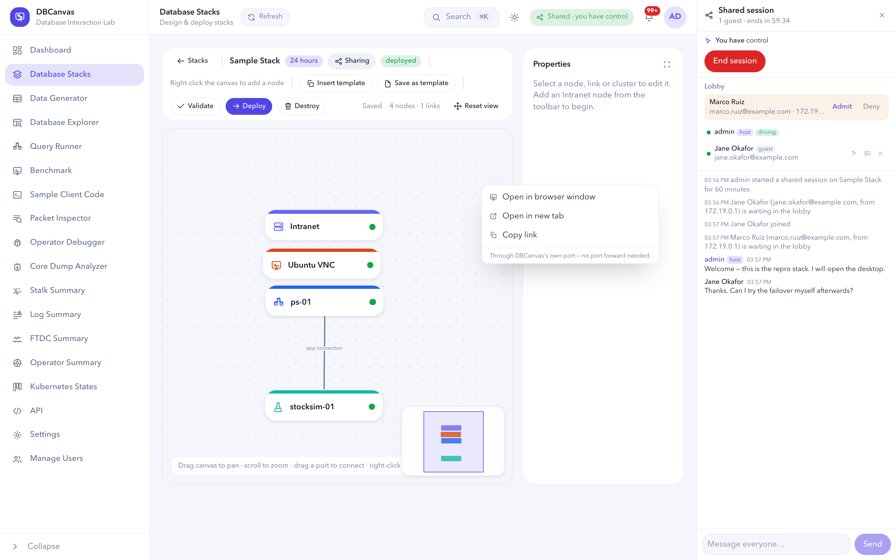

# Shared Sessions

A **shared session** lets colleagues watch you work in DBCanvas, live, from their own
browsers — and take the wheel when you hand it to them. You share a link; whoever opens
it gives a name and an email and waits in a lobby until you let them in. From then on
they follow you across the whole application — every page, not only one stack — see the
terminals and node web UIs you open, and chat with you. With **Mirror everything** on they
see your screen itself: the menus you open, the windows you drag, the dialogs, what you
type. Give one of them control and they can do anything you can in your workspace,
while everyone else watches them.

A link lasts at most **two hours**. Nobody has to install anything or forward a port:
everything, including a VNC desktop, travels through DBCanvas's own address.

> [!IMPORTANT]
> A guest you give control to can do everything you can in your workspace — deploy,
> destroy, open a root shell. Admit only people you would hand your keyboard to.

## Turning it on

Shared sessions are **off** until an administrator turns them on in **Settings → Shared
sessions**. The same row sets the longest a link may last (5 to 120 minutes) and how long
the record of an ended session is kept (see [What is kept](#what-is-kept)). Turning the
switch off ends every live session at once.

Guests reach DBCanvas at the address in the link, so it has to be one they can reach:

| Where the guests are | Set in `.env` |
| --- | --- |
| On the same network | `APP_HOST=0.0.0.0` so DBCanvas listens beyond this machine, and `PUBLIC_URL=http://<this machine's address>:8080` so links carry that address |
| Behind an SSH tunnel (`ssh -L 8080:127.0.0.1:8080 you@server`) | Nothing: the link says `localhost:8080`, which is the tunnel on their machine |
| Through a port forward or a proxy | `PUBLIC_URL` set to the forwarded address; websockets must pass through |

Everything a guest uses — the pages, the live channel, terminals, VNC — goes through
that one port. See [Configuration](CONFIGURATION.md) for both variables.

## Starting a session

Click **Share** in the top bar, on any page — or in a stack's canvas toolbar, which also
files the session's transcript on that stack. Either way the session is your whole
workspace. Pick how long the link lasts, whether to **Mirror everything** (below) and
whether to **Hide secrets** (below), then **Start and get the link**. The
session panel opens beside the workspace with the link and a **Copy link** button — the
link is shown this once. **New link** (or, after a reload, **Issue a new invitation
link**) replaces it with a fresh one: the old link stops opening the join screen, while
guests already through it stay in the session.

Started from a stack, the dialog also lists the earlier sessions on it, each with its
transcript.

## Joining

The link opens a join screen. The guest types a name and an email — both required,
neither verified: they are labels for you to recognise people by, not an identity.

They wait in the **lobby**. You get a notification and an entry at the top of the
session panel with their name, email and the address they came from, and **Admit** or
**Deny**. Nobody sees anything of your workspace before you admit them.

**Leaving is final for that link.** A guest who clicks **Leave** (in the session
panel or the lobby) confirms it and lands on DBCanvas's sign-in page, which says they
left. A guest who is removed or denied sees a screen telling them so. Either way, the
link they came through will not let them ask again from that browser. To invite them
back, click **New link** and send it: they
join through it as a new entry in the lobby, for you to admit. Because the new link
also retires the old one, a guest who clears their cookies cannot come back on the link
they left with either.

A guest's tab stays on the `/join/…` address for the whole session; reloading it puts
them back where they were. A colleague who also has an account on this DBCanvas keeps
their own sign-in in their other tabs — only the guest tab is a guest.

## Following

An admitted guest sees DBCanvas as you do and **follows** you: the page you are on, the
stack you have open, the canvas's position and zoom, the node you selected, and your
pointer on the canvas. Untick **Follow** in the panel to look around on your own; tick
it to catch up.

Following moves everyone to the same place, but each browser still draws its own copy of
the page. Whatever is not part of that place — a context menu, a window being dragged, a
dialog, a hover, text being typed — stays on the driver's screen. **Mirror everything**
covers that.

### Mirror everything

With it on, everyone who follows sees **exactly the driver's screen**, live, scaled to fit
beside their own session panel: the right-click menu they opened, the window they are
dragging, the dialog they filled in, their pointer and their clicks. A strip across the top
says whose screen it is. It is a picture of the screen, so it cannot be clicked; **Stop
mirroring** (or unticking **Follow**) goes back to your own view, already on the driver's
page, and ticking **Follow** brings the mirror back. When control moves, the mirror moves
to the new driver's screen — the host watching a guest drive sees the guest's.

It is on by default for a new session, and the host switches it in the session panel at
any time. How it works: the driver's browser records its own page (with
[rrweb](https://github.com/rrweb-io/rrweb) — the page's structure, then every change to it,
and canvases such as a VNC desktop a few times a second) and DBCanvas relays that stream
to everyone else over the session's live channel. It keeps none of it, and a browser that
arrives late is sent a fresh snapshot.

What a guest must not see stays out of the stream at its source, in the driver's browser:
the pages that belong to your account (Settings, API tokens, Manage Users), your account
and notification menus and your session panel are sent as empty boxes, password fields are
always masked, and with **Hide secrets** on every masked credential stays masked — and its
value is blanked wherever else it is drawn, a connection string or a terminal line
included.

The top bar always says who has control. On the desktop, a page you open opens on every
follower's desktop too, and comes to the front there as it does on yours. A guest's Start
menu and desktop leave out the pages that belong to your account — Settings, API tokens, Manage Users — and they never see your
notifications.

## Control

One person drives at a time. At first that is you.

- A guest clicks **Request control**; the request appears in the panel with **Grant**
  and **Deny**. You can also give control from the guest's row.
- While a guest drives, everyone — you included — follows them, and your canvas shows
  **Following … — view only**.
- **Take control back** returns it to you at any moment; the guest can **Hand control
  back**. A driver who disconnects keeps control for 30 seconds — a reload, a flaky
  connection — and then loses it.

Whoever does not have control **watches**. A watcher can read everything and change
nothing, and this is enforced by the server, not by greyed-out buttons:

| | Watching | Driving |
| --- | --- | --- |
| Pages, stacks, node panels, results | read | read and change |
| The canvas | view only — edits, deletes, moves and Properties are refused | edit, deploy, destroy |
| Terminals | watch | type |
| Browser windows | look; a VNC desktop live but untouchable | use |
| Open in VNC Browser | — | put a page on the stack's desktop |
| Close a shared terminal or window | no | yes |

These are never reachable by a guest, driving or not: your account and password, your
API tokens, your notifications, other users, administration and instance settings, and
the session itself (admitting, removing, giving control, ending). An administrator's
guests are not administrators: they see your stacks, not everyone's.

## Terminals

A terminal opened during a session — by the driver, or by you — is **shared**: one shell
on the node, shown to everyone, with what came before it for anyone who arrives late.
Only whoever has control can type into it; when control moves, the keyboard moves with
it. Only the driver can close a shared terminal; anyone else can minimize it to the dock.

## Browser windows

Every node web UI — a VNC desktop, PMM, webmail, a simulator's dashboard, HAProxy stats,
SeaweedFS, OpenEverest — is published on a port of its own, which a guest (or anyone
reaching DBCanvas through one tunnel) cannot reach. For a guest, a plain click on a link to
one opens the page in a window inside DBCanvas, served through DBCanvas's own port.
**Right-clicking** the link — or the node on the canvas — offers **Open in VNC Browser**
(below) and, for anyone but a guest, **Open in new tab**.

The window has back, forward, reload, an address you can edit, **Open in a browser tab**
(still through DBCanvas), and the controls every window has — minimize to the taskbar,
maximize, snap to an edge, close ([Windows and the taskbar](STACKS.md#windows-and-the-taskbar)).
It works outside a session too.

In a session, a window the driver or you opens is **shared**: it opens on every screen,
follows the driver as they move around in it, and only the driver can close it. A VNC
desktop connects by itself, with its password filled in for anyone allowed to read it,
and in *shared* mode so a second viewer never disconnects the first. A watcher sees it
live and cannot touch it: their connection passes through a filter on the server that
drops keyboard, pointer, clipboard and resize messages.

Pages in a browser window run on DBCanvas's own address. That is what lets them keep
their own logins, and it is fine for the lab services DBCanvas deploys; it is not a
sandbox for arbitrary websites.

### Open in VNC Browser — one copy everyone sees

A browser window shares only the page's **address**. Every viewer loads their own copy,
with their own logins. So a guest watching Roundcube or PMM in one sees a login page,
and can't log in, because a watcher can't send forms. Even logged in, anything that
doesn't change the address (a message in the preview pane, a scroll, a dashboard's data)
wouldn't follow you. DBCanvas deliberately does not hand guests your logins for those
apps instead: every guest would act as you inside them, and their copies would still
drift apart.

When everyone should see exactly what the driver sees, right-click the link (or the node) and choose
**Open in VNC Browser**. The page opens as a tab in Firefox on the stack's **Ubuntu VNC**
desktop, and that desktop opens as a shared window. There is one copy of the page and one
login, which stays inside the desktop: guests only see its pixels, and only the driver's
keyboard and mouse reach it. Firefox reaches the node by its name on the stack network
(`http://pmm-01:8080/…`), exactly as it would from inside the lab.

- The stack needs an **Ubuntu VNC** node; without one the option explains that.
- A watching guest doesn't get the option. A driving guest does, and it is recorded
  like any other change they make.
- Firefox there opens pages as tabs, skips its first-run dialog, and never saves
  passwords. A login stays in the browser only as a session, so a guest given control
  later can't read your saved logins.
- Whoever drives controls the whole desktop, terminal included. Give control
  accordingly.

## Hide secrets

With **Hide secrets** ticked, every password is masked in what guests are sent — node
secrets, design fields, a VNC desktop's password — and a guest who saves the design while
driving cannot overwrite a real password with the mask they were shown. It keeps
passwords off guests' screens — in a mirrored screen too, where each credential the page
masks is blanked wherever it appears — but it does not stop a guest who drives from reading
a configuration file in a terminal, and a password the page shows only in plain text (one
DBCanvas never handled as a secret) reaches a mirror as it is.

## Chat

Everyone admitted shares one chat, in the panel. Messages are plain text — whatever a
guest types, `<script>` included, is shown and never run. **Enter** sends and
**Shift+Enter** starts a new line. The smiley button opens an emoji picker, and typed
emoticons become emoji when sent (`:)` 🙂, `:D` 😄, `:+1:` 👍, `:tada:` 🎉, `<3` ❤️),
except inside `` `code` `` or a word or URL.

DBCanvas plays a short chime for a message from someone else, a guest arriving in the
lobby or asking for control (host), control handed to you, the expiry warnings and the
end. The bell in the chat header turns the sounds off for that browser. With the panel
hidden, its button counts the unread messages. System events arrive in the
same stream: joins, the lobby, control changes, every change a guest makes while driving
("Jane — Stop a node — POST …"), terminals and windows opened, and warnings ten and two
minutes before the link expires. You can **mute** a guest, who keeps watching, or
**remove** them.

## Ending

A session ends when its time is up, when you click **End session**, or when an
administrator turns shared sessions off. Every guest is disconnected at once and their
browser says so; control returns to you and shared terminals close. The panel then
offers the transcript.

## What is kept

What a session leaves behind is stored in DBCanvas's database:

| Kept | Details |
| --- | --- |
| The session | stack, host, start, expiry, how it ended, whether secrets were hidden |
| Guests | name, email, address, and when they joined, were admitted and left |
| Transcript | every chat message and system event |
| Guest actions | every change a guest made while driving, with its result |

It is kept for **90 days** after the session ends (**Settings → Shared sessions** changes
that; 0 keeps it until the stack is deleted), and deleting the stack deletes it. The link
and each guest's credential are stored only as hashes. Download a transcript as text or
JSON from the panel after a session, or from the Share dialog's list of earlier ones.

Not kept: what was typed or shown in a terminal, what happened inside a VNC desktop or a
web page, and anything live — who was online, the pointer, the windows that were open.

## From the API

Every part of it is an endpoint — starting a session, the lobby, control, the live
channel, transcripts, and `POST /api/browse` for the browser window. See [Shared
sessions in the API reference](API_REFERENCE.md#shared-sessions).
