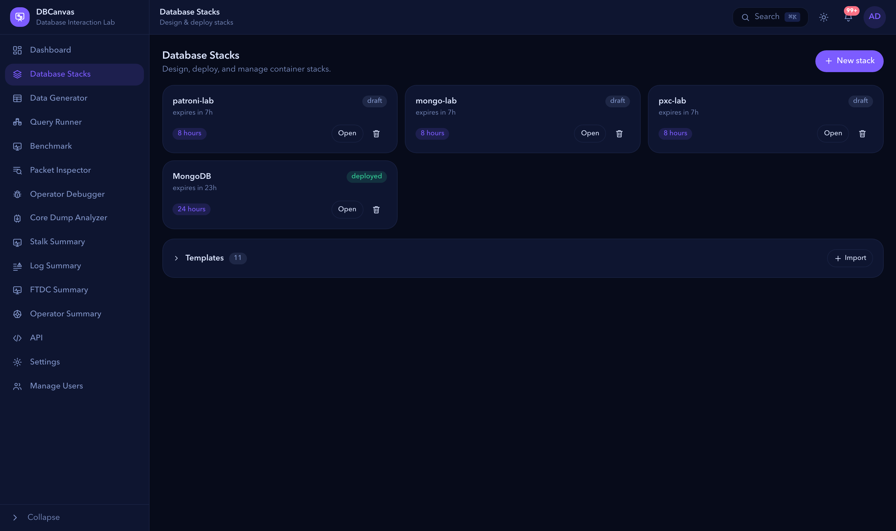
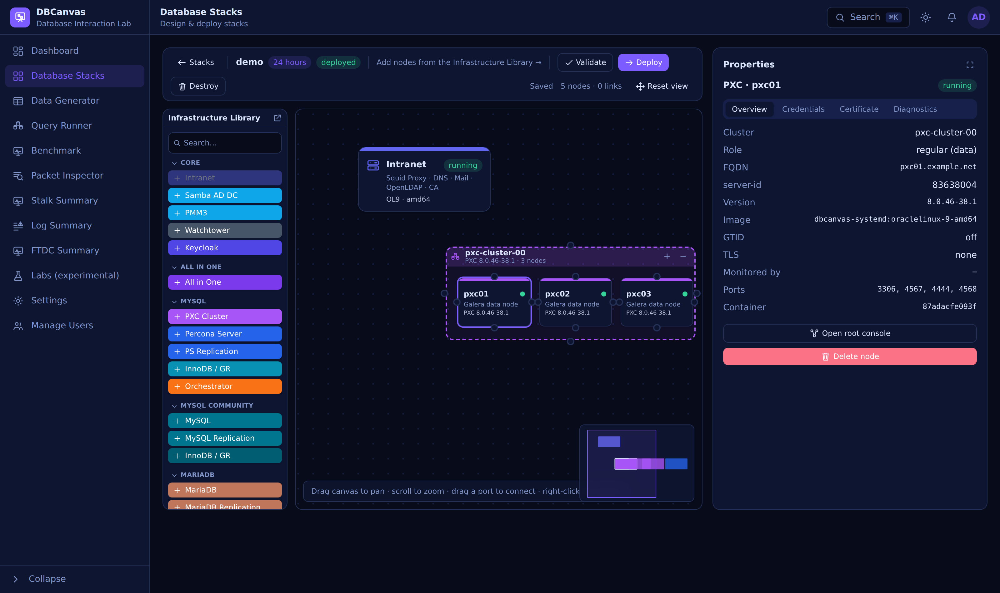
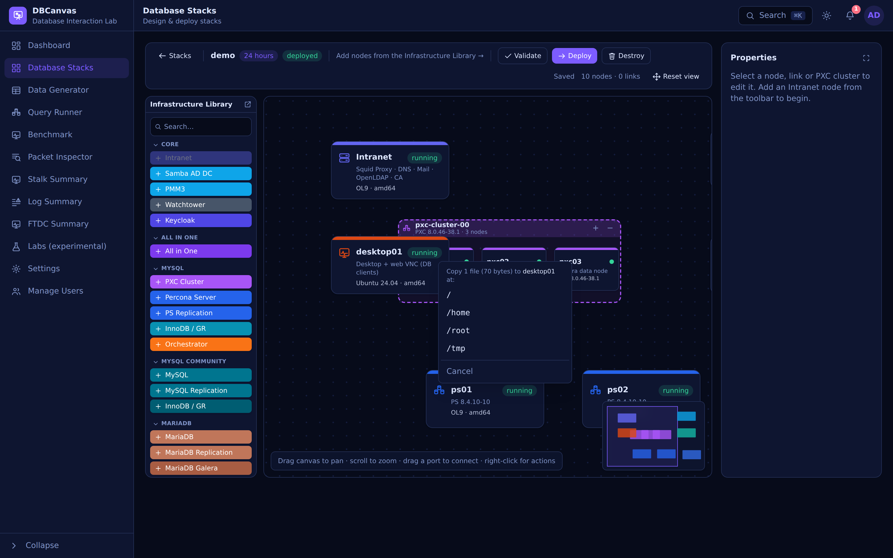

# Stacks
Design a topology on a canvas and turn it into real running nodes — containers, or VMs in
hybrid mode. Add nodes and cluster **frames**, connect them, give the stack a **TTL**, and
deploy. Every node type gets its own management panel: a web terminal, its credentials and
certificate, users, and on-demand backups.



## What you can put on the canvas


- **PostgreSQL** — standalone, **Patroni** HA clusters, **repmgr** clusters, and **Spock**
  multi-master (active-active) clusters (pgBackRest / Barman cloud backups; pgvector &
  TimescaleDB supported).
- **MySQL / PXC** — **Percona XtraDB Cluster**, Percona Server, MySQL replication, and
  **InnoDB / Group Replication** clusters.
- **MySQL Community** — Oracle's community builds (8.0 / 8.4) from repo.mysql.com:
  standalone, replication, and **InnoDB Cluster / Group Replication** (MySQL Shell +
  MySQL Router).
- **MariaDB** — from mariadb.org (10.6 / 10.11 / 11.4 / 11.8): standalone, replication
  and **Galera** clusters. MariaDB's GTIDs are `domain-server-seq`, so replication is
  wired with `MASTER_USE_GTID = slave_pos` and the cluster's `gtid_domain_id` is derived
  from its name; Galera state transfers use `mariabackup`.
- **MongoDB** — Percona Server for MongoDB: standalone, replica set, and sharded
  (PBM backups; optional Keycloak OIDC auth).
- **Valkey** — standalone and cluster (LDAP integration, PMM monitoring).
- **Kubernetes** — a **K3D cluster** frame (1–3 k3s nodes, created by k3d on the stack network,
  with MetalLB for LoadBalancer services) that can install any of the four Percona operators —
  **MySQL (PXC)**, **MySQL (Percona Server)**, **MongoDB (PSMDB)** or **PostgreSQL** — into a
  namespace of your choosing.
- **Infrastructure** — an **Intranet** node (OpenLDAP, bind DNS, an internal CA, a Squid
  proxy, and Roundcube/Dovecot webmail), a **Samba AD DC** (Active Directory, LDAP,
  Kerberos), **PMM** monitoring, **ProxySQL**, **HAProxy**, **SeaweedFS** (S3 for backups, up to 10
  buckets, browsable from its panel), **Keycloak** (OIDC), **OpenBao** (secrets manager), an
  **Ubuntu VNC** desktop, a **Linux Client** jump box (a bare OS host with nothing installed, on
  any base image the matrix builds — Oracle Linux 8/9/10, Ubuntu 22.04/24.04 or Debian 12/13:
  join the stack's DNS/CA trust, then use its terminal to install and exercise whatever client
  tools a task needs — or tick *use this client for core-dump analysis* and it becomes one, see
  below), and **Watchtower**.
- **App Simulators** — link **Traffic Sim** to a Valkey node/cluster, **Hotel Sim** to a PS
  MongoDB standalone/replica-set/sharded node, **Airline Sim** to a standalone Percona Server
  node, a MySQL replication or PXC cluster, or a ProxySQL/HAProxy node fronting one, **Car
  Rental Sim** to a standalone PostgreSQL node, a Patroni/repmgr/Spock cluster, or an HAProxy
  node fronting one, or **Unoptimized MySQL Challenge (MarketChaos)** to a standalone Percona
  Server node, a direct PXC member, a MySQL replication or PXC cluster, or an HAProxy node
  fronting one, and it drives real, continuous background traffic against it (reads/writes
  for Traffic Sim; a 100-hotel reservation workload exercising CRUD, transactions and change
  streams for Hotel Sim; a 200-route reservation workload against a 2000-aircraft fleet,
  exercising real MySQL transactions and Galera certification-conflict retries under contention,
  for Airline Sim; a 180-location rental workload against a 2000-vehicle fleet, exercising a
  date-range-guarded multi-row UPDATE for booking and a `FOR UPDATE SKIP LOCKED` claim for
  vehicle check-out, for Car Rental Sim; a 200-security fictional stock exchange — 10 workload
  agents, a traffic level × mix control, and an 18-challenge catalog of deliberately-injected
  indexing/query/locking/PXC problems the learner diagnoses and fixes, graded on outcome
  (baseline vs. validated measurements, a hard correctness gate, a 100-point score) rather than
  a checked SQL answer, for MarketChaos), with a live dashboard reachable from the stack's
  Ubuntu VNC desktop.
- **Stock Market Sim** — the one app simulator you *operate* rather than just watch, and the one
  that does not have to be linked to anything on the canvas. Background agents move prices, place
  orders and settle trades continuously, while you create, edit and delete securities, portfolios
  and orders from its own web interface; it generates a printable **report** (print to PDF) and
  per-table **CSV exports**, shows the tables it created in the target database, and can drop them
  again when you're done. The same application runs on **MySQL, PostgreSQL, MongoDB or Valkey** —
  link it to a standalone Percona Server, PostgreSQL, PS MongoDB or Valkey node with a drawn
  association line, *or* switch the node to a **manual connection** and give it a host, port,
  user, password and database — reaching a database that is not part of the stack at all:
  elsewhere on the Docker host (`host.docker.internal`), on your network, or a managed cloud
  instance, with a **Test connection** button that checks it before you deploy. One node drives
  exactly one database, so four nodes side by side give you four independent applications with
  four dashboards, one per engine. It connects to **any database in the stack**: a standalone
  Percona Server, MariaDB, MySQL, PostgreSQL, PS MongoDB or Valkey node; any cluster frame (PXC,
  MySQL/MariaDB/MySQL CE replication, Galera, InnoDB Cluster and Group Replication, Patroni,
  repmgr, Spock, PSMDB replica sets and sharded clusters, Valkey cluster); a **Kubernetes frame
  running any of the six database operators** (PXC, Percona Server for MySQL, PSMDB, Percona
  PostgreSQL, CloudNativePG, Crunchy PGO), whose engine follows the operator the frame runs; or a
  **ProxySQL/HAProxy** node fronting one — always resolving to the cluster's write endpoint, be
  that the primary, the leader, the router or the mongos. A database inside Kubernetes has to be
  reachable from the stack network first: set the tier in front of it — the proxy, the mongos
  routers, the pgBouncer pool, or the database pods themselves — to **LoadBalancer** or
  **NodePort** on the frame, since a ClusterIP address exists only inside the cluster, and the
  designer says so before you deploy if none of them is. The two PostgreSQL operators are reached
  through their **pgBouncer** pool when it has an address, as their own application user, and
  directly on the primary as `postgres` when it does not. A MongoDB **replica set** is the one target whose
  address does not follow a failover — the set advertises in-cluster names, so the sim is pointed
  straight at the member holding the primary role and an election means redeploying the node; a
  sharded cluster has mongos in front of it and does not have this problem. An **All in One** node draws no association lines, so its instance is chosen from a
  picker on this node instead of with a line. Set the load level to **High** and it also grows the dataset:
  bulk price history is written until the app owns a configurable **dataset size** (5 GiB by
  default), so there is something real on the volume to measure a disk, a storage class or a
  backup against — the simulation carries on at its normal rate once the target is met. A
  configurable **working set** (half the dataset by default) is then kept under continuous random
  read, which is what makes cache size measurable: a dataset that is only ever written to is
  served out of a few hundred kilobytes of hot rows, so a 128 MiB buffer pool reports a ~100% hit
  rate and reading its size back tells you nothing. With a working set larger than the cache it
  misses properly — the same 2 GiB dataset that showed 99.98% and 0.01 MiB/s off disk shows 92.8%
  and 469 MiB/s, and raising the pool past the working set takes throughput up 6.6×. **Database
  threads** (4 by default) sets how many workers write that history and read it back, and sizes
  the connection pool with it. Settled orders are swept after a retention window (15 minutes by
  default) so the order book stays bounded — without it the dashboard's own two-second order
  count grows linearly more expensive for the life of the deployment, and cumulative figures
  stay correct across the sweep because what was removed is tallied durably.
  Six **deliberate problems** can also be switched on, each reproducing a condition that is
  hard to cause on purpose and easy to hit by accident: an **idle transaction** held open with
  a read snapshot (up to 24h) so purge cannot advance and the InnoDB history list — or
  PostgreSQL's xmin horizon and the bloat behind it — grows for as long as it sits there;
  **extra tables** (up to 5000, read in rotation) so `table_open_cache` stops holding the
  working set and every query pays to reopen one; **temporary-table queries** shaped to
  build a large intermediate result either in memory or forced to spill to disk;
  **lock contention**, where concurrent writers compete for a handful of rows — queueing on
  *light*, and on *heavy* taking the same two rows in opposite orders so the server has to
  detect and break real deadlocks; **scan queries** against the tick history with a predicate
  no index can serve, so the server reads every row to return a handful; and **write
  pressure** in either of its two distinct shapes — *commits*, many tiny transactions that
  each pay for their own log flush, or *redo*, bulk rewrites that fill the write-ahead log and
  eat checkpoint headroom. Measured on a lab server: history list 6,496 and climbing, 15,896
  `Table_open_cache_overflows` against 1,200 tables and a 400-entry cache, the same rollup
  taking 1,961 ms spilled versus 429 ms in memory, 364 deadlocks a minute on *heavy* against
  none on *light*, 11.0M rows read to return 122,949 (about 90 read per row returned), and one
  second of *commits* costing 142 log syncs for 176 KiB against *redo*'s 18 syncs for 2.2 MiB —
  the same knob, opposite costs. Nothing grows: the contended and committed writes go to rows
  this app owns, and the bulk rewrites overwrite a fixed 256 rows in place.
  Each knob is offered only on an engine that can actually do it. On MySQL, PostgreSQL and MongoDB it takes its own database or
  schema; on Valkey there is no size target and no working set, because its tick history is a
  length-capped stream that writing to does not enlarge and that holds no cold data to read.
  Unlike **Unoptimized MySQL Challenge** above — also a stock
  exchange, but a MySQL tuning puzzle with no CRUD and no report — this is a working application.
- **All in One** — one container running **many** database instances side by side, instead of
  one product per node. Add features to it from a menu (Percona Server, PS replication, InnoDB
  Cluster / Group Replication, PXC, PostgreSQL, repmgr, Patroni, Spock, PSMDB standalone /
  replica set / sharded, Valkey standalone / cluster, ProxySQL, HAProxy, Orchestrator) and each
  becomes an independent instance with its own datadir, config, systemd unit and **non-default
  port**. It draws no association lines: every relationship — PMM monitoring, an LDAP directory,
  OpenBao, Keycloak, a SeaweedFS backup target, the instance a proxy fronts — is a drop-down on
  the instance itself. See [All in One](ALL_IN_ONE.md).
- **Operations** — cross-cluster replication links, per-node web terminals, certificate
  management, on-demand backups, and TTL-based auto-teardown.
- **Constrained nodes** — every node can be limited on all four resources it competes for:
  **CPU** and **memory** (container limits), **disk** (`--device-read-bps`/`--device-write-bps`),
  and the **network** — added latency, jitter, packet loss and a bandwidth cap, applied with
  `tc`. The network one is what makes a synchronous cluster interesting. Measured on a live
  three-node Galera cluster: a degraded link (200 ms ±40 ms, 10% loss, 1 Mbit) backs the *writer*
  up — `wsrep_local_send_queue` rises and a bulk insert that took 22 ms unimpaired ran for
  minutes — and severing it (100% loss) evicts the member in **8 seconds**, the majority side
  holding `cluster_size 2 / Primary` while the isolated node drops to `1 / non-Primary` and stops
  accepting writes; clearing the impairment rejoins it in **11 seconds**. Worth knowing: a slow
  *link* stalls the sender, whereas receiver-side flow control needs a slow *node* — they are
  different experiments, and the second one is produced with the CPU/memory limits or plain
  configuration rather than with `tc`. Measured on the same rig, with two PXC members tuned
  (`innodb_flush_log_at_trx_commit=2`, `sync_binlog=0`, 2 GiB pool and redo) and one left at
  stock (`1`, `1`, 128 MiB): driving updates at a tuned member left the stock member's receive
  queue averaging **168 writesets against the tuned member's 1.1** on the identical stream,
  sending **500 flow-control pauses** while the tuned member sent none, and pausing the writer
  **44%** of the time. A bandwidth cap mostly just slows a state transfer down. Shaping is
  scoped to the node's own database and cluster ports (for PXC: 3306, 4444, 4567, 4568), so DNS,
  LDAP and health checks stay clean and the node degrades rather than looking broken — measured
  on a lab node, ping stayed at 0.09 ms while port 4567 went to 124 ms. It is applied *after* the
  cluster forms, because a lossy link fails state transfer, and it is a runtime change, so a
  redeploy re-applies it without recreating anything.

**Authentication.** Point a database at a directory and it is wired at deploy: **LDAP** against
the Intranet OpenLDAP or the Samba AD DC (Percona Server, PostgreSQL, PSMDB), **Kerberos/GSSAPI**
single sign-on against the Samba AD DC (PostgreSQL, PSMDB), and **Keycloak OIDC** (PMM, PostgreSQL
18 via `pg_oidc_validator`, PSMDB via `MONGODB-OIDC`, Percona Server 8.4 via `auth_openid_connect`).
The designer greys out combinations an engine cannot actually run — PostgreSQL cannot do LDAP and
OIDC at once (they compete for the same `pg_hba` line), and MongoDB cannot combine OIDC with
LDAP/Kerberos (each needs its own `mongod.conf` `setParameter` block) — and validation blocks the
deploy rather than letting one silently win. MySQL has no such conflict: it picks an auth plugin
per account, so LDAP and OIDC accounts live side by side on one server.

Turning on Keycloak SSO for a **Percona Server** node moves it to 8.4 (latest minor): Percona
added `auth_openid_connect` in **8.4.11-11**, and the 9.7 series does not carry it yet. The deploy
wires the whole demo, not just the plugin — a realm and a public `mysql` client on the Keycloak
node, sample users `jane` and `john` in an `accounting` group, MySQL accounts bound to those users'
`sub` claims, and an `oidc_demo` schema only the group's role can read. The node's **Keycloak SSO**
tab shows how to log in, and DBCanvas writes a small shell wrapper to `/usr/local/bin/oidc-login`
on the node (not an upstream tool) that does the whole round-trip in one command: ask Keycloak for
an ID token, hand the file to `mysql`. No MySQL password is ever sent, and the
group→role mapping means `SHOW GRANTS` gains `accounting` at connection time (activate it with
`SET ROLE`). The link must be encrypted — a Unix socket, or TCP with `--ssl-mode=REQUIRED`.

**Data-at-rest encryption (OpenBao).** Add an **OpenBao** node (a Vault-compatible secrets
manager, one per stack) and tick *Encrypt with OpenBao* on a Percona Server or PSMDB node. At
deploy the node is initialized and unsealed for you — its **5 unseal keys and root token** appear
in the node's properties, since OpenBao prints them exactly once — and the database is wired to it
as its keyring: `component_keyring_vault` on Percona Server 8.4, the `keyring_vault` **plugin** on
5.7/8.0 (the component does not exist before 8.4), and `security.vault` on PSMDB. Each database
gets its own KV mount and a token scoped to it, and verifies OpenBao with the Intranet CA every
node already trusts. OpenBao seals itself on every restart, so its panel shows the live seal state
and can replay the stored keys with one click.

**Kubernetes with the Percona operators.** Add a **K3D Cluster** frame and pick a Percona operator —
all four are supported: **PXC**, **MySQL (Percona Server)**, **MongoDB** and **PostgreSQL**. DBCanvas runs
k3d against the same Docker daemon it already uses, creating the k3s nodes **on the stack network**
— so pods resolve the Intranet DNS, reach PMM and SeaweedFS by name, and **MetalLB** hands out
LoadBalancer addresses from the stack subnet that every other container can reach. Several K3D
frames can share one stack: each cluster gets its own block of 8 addresses from the top of the
subnet, so two clusters on the same network never advertise the same address. You choose the
cluster size, its **Kubernetes version** (any k3s release `make versions` discovered; the newest by
default — k3d's own default trails the releases far enough to break some operators' CRDs), its
CPU/memory budget (a total, split across the nodes — DBCanvas warns if it is too small to schedule the
cluster, or too large for your host), the namespace, the shape of the cluster
(PXC: **HAProxy or ProxySQL** in front; Percona Server: **group replication or async** replication
under Orchestrator, behind HAProxy or **MySQL Router**; MongoDB: a **replica set or a sharded
cluster** with mongos routers; PostgreSQL: a Patroni HA cluster behind **pgBouncer**), and how each tier is exposed
(ClusterIP / NodePort / LoadBalancer — the database can stay in-cluster while the proxy, router or
pooler takes a LoadBalancer address). The operator's source is unpacked into
`/root` on the first node, and its `cr.yaml` is rewritten before it is applied — anti-affinity set to
`none` and every section's CPU/memory requests commented out, because the shipped file assumes a real
multi-node cluster and would otherwise never schedule.

Link a **SeaweedFS** node and the cluster backs up to it over S3; link a **PMM** node and DBCanvas
mints a **service token** on the PMM server (you choose how long it lives — 365 days by default) and
patches it into the cluster's secret, so the pmm-client sidecars register themselves and the whole
cluster shows up in PMM. The cluster's users come from your `.env`, like every other database
DBCanvas deploys, so the root password is the one you already know. (PostgreSQL is the one exception
worth knowing: pgBackRest speaks S3 only over TLS, so its backups need a SeaweedFS node with **TLS
on** — the designer warns you when it isn't, because without it the cluster silently keeps the
operator's own PVC backup repo and the bucket stays empty.)

**Step through the operator itself.** A frame running any of the **four Percona operators** can
be deployed with the operator running under **Delve**: tick *Run the operator under Delve*, and
DBCanvas rebuilds the operator from that release's own source with the optimiser off and runs it
under `dlv` in place of the released binary. Then open the
[**Operator Debugger**](OPERATOR_DEBUGGER.md) — breakpoints, call stack, variables and
expressions, plus a button that forces a reconcile so a breakpoint in `Reconcile` is actually
reached. No IDE, no clone of the operator, no Go toolchain, and no `kubectl port-forward` to keep
alive. (The two community PostgreSQL operators come from a Helm chart rather than a release
tarball, so there is no source to compile or to show, and the option is not offered for them.)

The pod keeps the released image (only its command changes), the probes and leader election are
turned off so you can sit on a breakpoint, and Delve starts with `--continue` so the cluster
still deploys whether or not you ever attach. It costs a few minutes of build time on the first
deploy.

**Read a core dump from somewhere else.** A **Linux Client** node can be deployed as a core-dump
analysis host: give it a host directory holding a `mysqld` core file and another holding the
crashed server's `mysqld` plus everything `ldd` listed for it, pick the Percona Server or PXC
version that crashed, and DBCanvas bind-mounts both read-only and installs the matching debug
symbols. Then open the [**Core Dump Analyzer**](CORE_DUMP_ANALYZER.md) — threads, the stack that
took the signal, and each frame's arguments and locals, with recursion collapsed and a verdict on
whether the symbols and libraries actually match the core. An 800 MB core is read where it lies,
not copied. The two directories are confined to `GDB_MOUNT_ROOT` (`.env`).

Ticking *Also publish the debugger to the host* additionally exposes Delve on
`127.0.0.1:40000` for an external editor; the server node's **Operator** tab then hands you the
matching `git clone`, a ready `launch.json` (with the `substitutePath` that makes source line
up), and the annotation that forces a reconcile. Leave it off when you debug from DBCanvas: the
port is fixed, so two debugged clusters would collide on it.

Stop the debug session whenever you like — DBCanvas clears the breakpoints and resumes the
operator when you close the page, resumes a stopped session nobody has touched for five minutes,
and a watchdog sidecar covers even the case where DBCanvas itself dies, within ten seconds. That
matters more than it sounds: a breakpoint that outlives its session fires on the next reconcile
with nobody attached, and the operator freezes with no probe failing and nothing in its log, so
the cluster quietly stops being reconciled; the next attach then shows the breakpoint as
*unverified*, which reads as a broken debugger rather than as leftovers in the way.


> *A one-node K3D cluster on k3s v1.36.3 running the **Percona Operator for MySQL (PXC)
> 1.20.0**, with a console open on the same node: `kubectl get pods -A` shows the three
> `k3d-00-pxc` members and three `k3d-00-haproxy` pods the operator built, alongside MetalLB
> and the operator itself. The panel is the cluster at a glance — the operator and its
> namespace, HAProxy in front, the database kept ClusterIP while the proxy takes a MetalLB
> address — and its tabs carry `kubectl`, a copyable kubeconfig and per-namespace Kubernetes
> users.*

**Kubeconfig and RBAC users, for testing access control.** The K3D server node's panel has a
**Kubeconfig** tab (a copyable admin kubeconfig, pointed at k3d's own load balancer so it works
from any other node in the stack — e.g. paste it into the **Linux Client** node's terminal) and a
**Users** tab: create a genuine Kubernetes `User` — a real X.509 client certificate, signed by the
cluster's own CA — bound to a built-in ClusterRole (`view`/`edit`/`admin` scoped to one namespace,
or `cluster-admin` cluster-wide), then copy that user's own kubeconfig and confirm exactly what it
can and can't do.

**S3 backups (SeaweedFS).** One SeaweedFS node can create **up to 10 buckets**, and every database
that backs up to it — standalone PostgreSQL, Patroni, repmgr, the MongoDB clusters, and all four K3D
operators — **picks which bucket it uses**, so a stack's backups don't have to share one. Once the
node is running, its panel **browses the buckets**: pick one, list what actually landed in it, and
click into the folders backups nest under (`pbm/<cluster>/…`, `pgbackrest/<cluster>/repo1/…`). It is
read-only — a way to confirm a backup exists without exec-ing into anything.

> *Browsing `pxc-backups` inside the backup the PXC operator just wrote — the xtrabackup files with
> their sizes and times. The breadcrumb walks back out; the selector switches buckets.*

**Deployed versions.** Once a node is running, its card shows the version it *actually* deployed
with — `PS 8.4.10-10`, `PSMDB 8.0.26-11`, `PMM 3.3.1` — not just the series that was requested
(`8.0`, or "latest"). The same value appears in the node's properties.

Every deployed node gets a **management panel** — runtime profile, endpoints, credentials,
certificates, backups, and one-click consoles:

**Web terminals.** Drop into a root (or service) shell on any node, right in the browser —
sessions survive navigation and can be docked or floated (**Settings** picks which they open as):



> *Every deployed node has a panel: what it actually is (version, image, ports, container),
> its generated credentials, its certificate, and a root console one click away.*


**Getting files onto a node.** Drag a file — or a whole folder — from your desktop onto a node
on the canvas. DBCanvas asks where to put it and copies it in; there is no scp, no bind mount
and no shell involved:



> *A dropped file offers the destinations worth having on that node (`/`, `/home`, `/root`,
> `/tmp`), and the drop names the node so a mis-aimed drag is obvious before it happens.*

**The file manager.** Right-click a running node and choose **File manager** for a full browser
over its filesystem: navigate, upload and download, create files and folders, rename, change
permissions and ownership, delete — and **edit a file in place**, which is usually what you
actually want when a config is one line wrong.


> *Every running node in the stack is in the picker at the top left, so you can move between
> them without closing the window. **Split** opens a second pane on another node and copies
> between the two — the fastest way to put the same file on every member of a cluster.*

**Monitoring with PMM.** Add a PMM node and point databases at it; DB nodes register
themselves, so Percona Monitoring & Management comes up already watching the stack:


> *PMM is one node: Grafana, VictoriaMetrics, ClickHouse, PostgreSQL, QAN and nginx in a single
> container. The panel names them, and gives a root console alongside a `pmm-admin` one.*


**Ubuntu VNC desktop.** An optional XFCE desktop jump-box (Firefox + Percona clients)
reachable over a browser-based VNC client — handy for GUI database tools inside the stack network.
Its MySQL client is **8.4**, with the OpenID Connect client plugin, so a Keycloak user can sign in
to a Percona Server node from the desktop the same way they would from the node itself:


> *The desktop is on the stack network, so `pxc01.example.net` resolves and the clients that
> ship in the image reach it without any setup.*


> *Inside `mongo-backups/pbm/psmrs-00`, the snapshot a MongoDB replica set in the same stack
> just wrote: `.pbm.init`, the timestamped snapshot directory and its `.pbm.json` metadata. The
> replica set's frame has **Enable PBM** ticked with this node picked as its target, which is
> all it takes. Each engine writes to its own prefix — PBM under `pbm/<cluster>`, pgBackRest
> under `pgbackrest/<cluster>`, xtrabackup and the Percona operators at the top level.*

**Diagnostics captures.** From a running node's panel, capture a diagnostic bundle and
download it: **pg_gather** (a single `GatherReport.html`) on PostgreSQL nodes, or
**pt-stalk** + `pt-summary` + `pt-mysql-summary` (a tarball) on MySQL/PXC nodes. Feed a
pt-stalk archive straight into **Stalk Summary** (below) to chart it.

## Deployment backends — Docker or Vagrant (hybrid)

Each user picks a **Deployment** backend in **Settings**; it applies to the *next* deploy of
each stack:

| Backend | What it provisions |
| --- | --- |
| **Docker** (default) | Every node is a Docker container on the local daemon. |
| **Vagrant (hybrid)** | OS/database nodes become real **VirtualBox VMs**; everything else stays a Docker container **in the same stack**. |

**Vagrant is hybrid-only by design — there is no all-VM mode.** Only the node types that are
really *a machine running a database* are worth the cost of a VM; the rest are upstream images
or depend on Docker itself:

| Runs as a **VirtualBox VM** | Stays a **Docker container** |
| --- | --- |
| Percona Server · PostgreSQL · PSMDB (standalone) | **Intranet** — its bind config forwards to Docker's embedded resolver (`127.0.0.11`), which only exists inside a container |
| PXC · MySQL replication · InnoDB/GR · PSMDB replica set & sharded · Patroni · repmgr · Spock · Valkey cluster · ProxySQL cluster | **K3D** — k3s-in-Docker by definition |
| Valkey · ProxySQL · HAProxy | Image-only infra: PMM, Keycloak, OpenBao, SeaweedFS, Samba AD, Ubuntu VNC, Watchtower |

Nothing is rejected: the deploy routes each node to the engine that supports it, and DBCanvas
joins the two networks on the host (iptables + routes) so a VM database still resolves the
Intranet's DNS, trusts its CA, gets scraped by PMM, and reaches SeaweedFS by name.

Each of these node types carries its own **CPUs** and **Memory (GiB)** in its properties, on
either backend: on Vagrant they size the VirtualBox VM (blank → the `DBCANVAS_VM_CPUS`/
`DBCANVAS_VM_MEMORY` defaults below), and on Docker they become the container's `--cpus` and
`--memory` limits (blank → unlimited, the daemon default).

Two things to know before you switch:

- **The backend is pinned per stack on its first deploy** and never changes for that stack's
  life — redeploys, management and teardown all stay on the engine the stack was built with.
  To try the other backend, create a **new stack**.
- **The app must run on the host for hybrid** (next section). If you select *Vagrant (hybrid)*
  while DBCanvas is running in its container — or on a host without `vagrant`/`VBoxManage` —
  the deploy silently falls back to Docker.

## Around the stacks

### Dashboard
Scope-aware overview: an **admin** sees everything, a regular user sees only their own
stacks. Counters (stacks, nodes, containers, by engine/type, users) plus **live OS stats**
(CPU, memory, and per-node network/disk rates as ranked bar charts). The live sampling is
**focus-gated** — it polls only while the dashboard tab is visible and focused, so there's
no background CPU/disk cost when you're not looking.


### Notifications
A live bell (Server-Sent Events) that surfaces what happens across your stacks: node
deployment failures, data-generation completed/failed, stacks destroyed or **expiring soon**
(TTL), backups completed, high resource usage, and (for admins) new accounts awaiting
approval.

### Settings
Per-user preferences, stored on the **account** rather than the browser, so they follow you to
another machine: whether a node console opens **docked** (a tab in the bottom terminal dock, the
default) or **undocked** (its own floating window), your **deployment backend**
([Docker or Vagrant hybrid](STACKS.md#deployment-backends)), and your **theme**
(light, dark, midnight, solarized, synthwave, forest).

### Manage Users (admin)
Registration is approval-gated: admins approve, reject, disable, re-approve, and delete
accounts.

**Locked out?** The image ships a password-reset tool, because the runtime is distroless —
no shell, no `sqlite3` — and the database lives on a volume only that container mounts:

```bash
docker exec -it dbcanvas-app-1 dbcanvas_reset_password
```

It prompts for a new password and a confirmation (echo off), names the admin it is about to
change, and signs out that account's existing sessions. With more than one admin, name one
with `-user`.

---

See also: [Configuration & commands](CONFIGURATION.md) · [Architecture](ARCHITECTURE.md)
