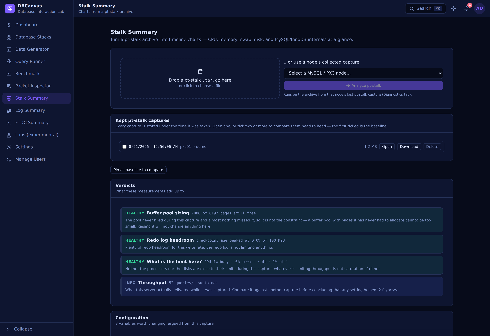

# Stalk Summary
Turn a **pt-stalk** archive — collected from a MySQL/PXC node's **Diagnostics** tab or uploaded
as a `.tar.gz` — into professional **timeline charts**: CPU / memory / swap, disk
(utilization, throughput, IOPS, latency, overall + per-device), network throughput and
connection states, and MySQL/InnoDB internals (buffer pool, history list length, checkpoint
age, replication lag, deadlocks, rows-scanned-without-index, and more). It's ~90% charts,
~10% text — with a consolidated, **sortable** processlist and per-session InnoDB transactions —
and stays resilient when files are missing from the archive.

---

See also: [Log Summary](LOG_SUMMARY.md) · [FTDC Summary](FTDC_SUMMARY.md)
